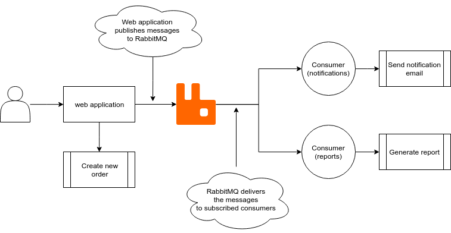
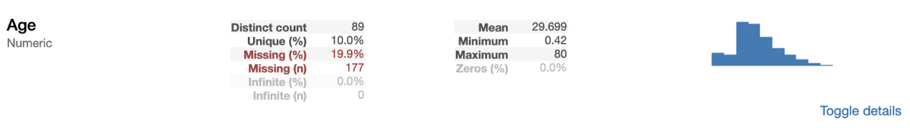
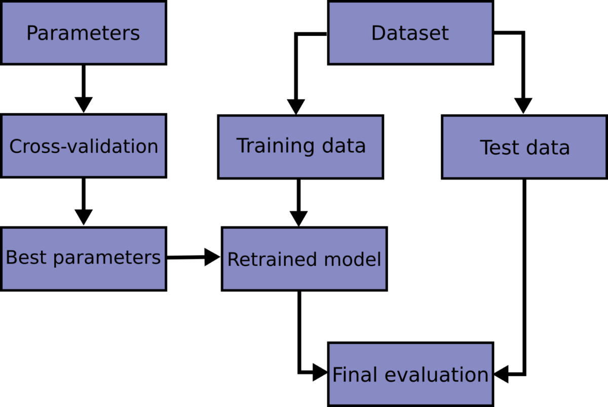
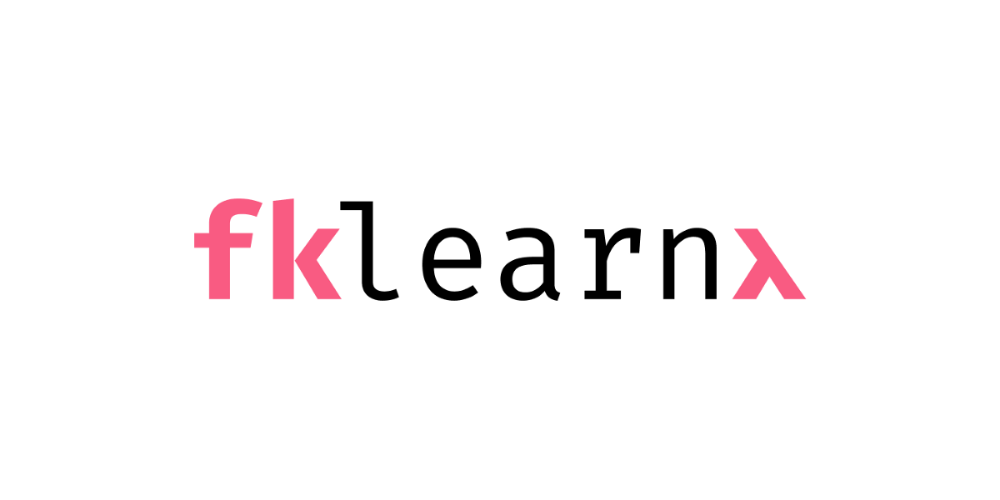
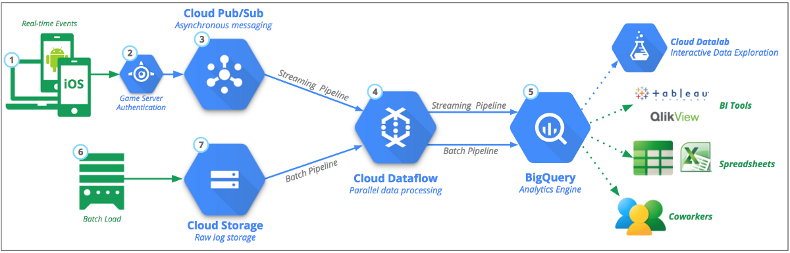

# 其他大数据科学和数据工程资源
+ 软件工程师面试学习指南
+ 学习数据科学：我们的25大数据科学课程
# 10.格式化Python但您喜欢用黑色

在我们涵盖七个PyPI库的系列文章中了解有关解决常见Python问题的更多信息。

由Moshe Zadka（社区主持人）。

“ Python是当今使用的最流行的编程语言之一，并且有充分的理由：它是开源的，它具有广泛的用途（例如Web编程，业务应用程序，游戏，科学编程等等）， 并且它有一个充满活力和敬业精神的社区来支持它。

这个社区的原因是我们在Python软件包索引（PyPI）中拥有如此众多，种类繁多的软件包，以扩展和改进Python并解决不可避免的小问题。”

阅读全文。
# 9.带有RabbitMQ的分布式系统


“在本文中，我们将讨论分布式系统的优势以及如何使用RabbitMQ迁移到分布式系统。 然后，我们将学习RabbitMQ的基础知识以及如何使用Python与之交互。”

阅读全文。
# 8. Python中数据可视化的新层次


如何使用单行Python制作美观，完全交互的图。

威尔·科森（Will Koehrsen）。

沉没的谬误是人类沦为猎物的许多有害认知偏见之一。 它是指我们倾向于继续将时间和资源用于失败的事业，因为我们已经花了很多时间去沉没。

阅读全文。
# 7.使用Pandas分析加速您的探索性数据分析


只需一行代码，即可直观了解数据的结构。

卢卡斯·弗赖（Lukas Frei）。

“当首次导入新数据集时，要做的第一件事就是了解数据。

这包括确定特定预测变量的范围，识别每个预测变量的数据类型以及计算每个预测变量的缺失值的数量或百分比之类的步骤。”

阅读全文。
# 6.如果您喜欢旅行，让Python帮助您刮擦最好的廉价航班！

法比奥·内维斯（FábioNeves）

简而言之，该项目的目标是构建一个网络刮板，该刮板将针对特定目的地运行并以灵活的日期（您选择的日期前后三天）对航班价格进行搜索。

它保存带有结果的Excel，并发送包含快速统计信息的电子邮件。 显然，目标是帮助我们找到最优惠的价格！”

阅读全文。
# 5. Python中机器学习的Numpy基本指南


ML的典型库。

由Siddharth Dikshit撰写。

“为什么这对您有用？

好吧，由于我们大多数人都倾向于忘记（对于那些已经实现了ML算法的人）各种库函数并最终使用纯粹的逻辑为预先存在的函数编写代码，这既浪费时间又浪费精力， 在这种情况下，重要的是要了解有效使用图书馆的细微差别。

因此，Numpy作为机器学习的基本库之一，需要有一篇自己的文章。”

阅读全文。
# 4.时间序列预测的交叉验证策略


“时间序列建模和预测非常棘手且充满挑战。 i.i.d（完全相同的独立性）假设不适用于时间序列数据。

隐含地依赖于先前的观察，同时，除了数据空间内在的非平稳性之外，还更可能发生从响应变量到滞后变量的数据泄漏。

非平稳性是指观察到的统计数据的闪烁变化，例如均值和方差。 考虑到固有的非线性，它变得更加棘手。”

阅读全文。
# 3. fklearn简介：Nubank的机器学习库（第1部分）


卢卡斯·埃斯特瓦姆（Lucas Estevam）。

“ Nubank刚刚开源了fklearn，这是我们的机器学习Python库！

在Nubank，我们严重依赖机器学习来制定可扩展的数据驱动型决策。 尽管还有许多其他ML库（例如，我们广泛使用Xgboost，LGBM和ScikitLearn），但我们感到需要更高级别的抽象，这将有助于我们更轻松地将这些库应用于所面临的问题。

Fklearn有效地将这些库包装成一种格式，使它们在生产中的使用更加有效。”

阅读全文。
# 2.通过构建一个学习区块链

学习区块链如何工作的最快方法是构建区块链。

丹尼尔·范·弗莱门（Daniel van Flymen）。

“在开始之前...

请记住，区块链是一个不变的顺序记录链，称为块。 它们可以包含事务，文件或您真正喜欢的任何数据。 但重要的是，它们使用散列链连接在一起。”

阅读全文。
# 1.让我们建立一个流数据管道

用于实时数据管道的Apache Beam和Dataflow。

丹尼尔·弗利（Daniel Foley）。

“今天的帖子基于我最近在工作中所做的一个项目。 我真的很高兴实现它并将其写为博客文章，因为它使我有机会进行一些数据工程，并且做一些对我的团队非常有价值的事情。

不久之前，我发现我们有相对大量的用户日志数据，这些数据与系统中存储的一种数据产品有关。”

阅读全文。
# 关于Python编程和机器学习的10篇惊人文章
## 流数据管道，fklearn，交叉验证等

```
(本文翻译自SeattleDataGuy的文章《10 Amazing Articles on Python Programming and Machine Learning》，参考：https://medium.com/better-programming/10-amazing-articles-on-python-programming-and-machine-learning-week-3-a425a9159bff)
```
