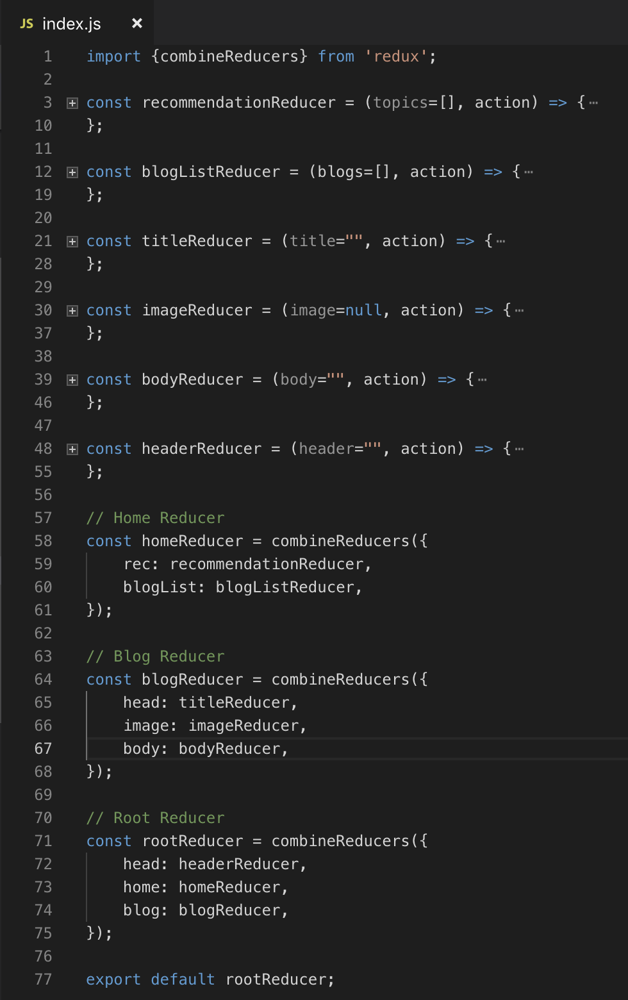

资源：
+ CSS特异性计算器：https：//specificity.keegan.st/
+ 清洁架构：https://blog.cleancoder.com/uncle-bob/2012/08/13/the-clean-architecture.html
+ 尖叫的体系结构：https://blog.cleancoder.com/uncle-bob/2011/09/30/Screaming-Architecture.html
+ pgbadger：https：//github.com/darold/pgbadger
+ Postgres查询说明工具：https://tatiyants.com/pev/#/plans/new
+ ‘软件缺陷：https://codesqueeze.com/the-7-software-ilities-you-need-to-know/
+ 危险：https://github.com/danger/peril
+ HoundCI：https：//github.com/houndci/hound
+ CircleCI：https：//circleci.com/
+ MVP蛋糕比喻：https：//www.intercom.com/blog/start-with-a-cupcake/
+ 反转思维模型：https://fs.blog/2013/10/inversion/

关于作者：
## Pranay Suresh —工程@螺栓| 前特斯拉| 硅谷创业人| 博客| 讲者 导师
### 经验丰富的工程师，在硅谷拥有十年的经验。 我已经在初创公司开发了产品和技术…
# 学到更多
## 在React中最大化代码重用
### 如何通过使用Bit从任何代码库共享ReactJS组件来加速开发
## 在您的React项目中逐渐使用TypeScript
### 如何安全地构建React TypeScript组件并将其引入到React JS项目中
## 11个推荐给前端开发人员的工具
### 我最喜欢的前端工具列表。
## 1. CSS特异性

错误：我的CSS不适用。 我要用！重要

课程：使用！important应该保留给特殊情况，因为它们会破坏整个CSS层次结构并强制使用特定样式。 相反，了解CSS特异性。

CSS特定性是浏览器用来确定哪种CSS样式更特定的一组规则。 可以将其视为基于点的系统，该系统确定哪种CSS样式获得优先权并最终应用于DOM元素。

如果您想知道为什么不使用CSS，那与CSS的特殊性有关。 在大型项目中，这是一个非常常见的问题，在此类项目中，预处理器（如SCSS）与复杂的CSS层次结构一起使用。 了解CSS的特殊性将有助于您仅在极少数情况下使用！important进行保留，例如，当您想覆盖CSS库或让iframe覆盖宿主网站样式时。


本质上，ID选择器>类选择器>类型选择器是优先顺序。 ！important和行内样式属性会覆盖所有CSS。 然后，对于应用于元素的每个CSS，您都可以轻松确定哪种样式将生效。 例如，如果您加载上面的HTML：


在此示例中，ID选择器优先于类型选择器。 如果冲突的CSS选择器具有相同的优先级，则将选择CSS文件中的最后一个。 最后，Chrome DevTools（为什么要使用其他浏览器：）将向您显示特异性顺序，如上图所示。 如果您无法使用CSS，请查看Chrome使用的特异性顺序，然后添加更具体的选择器（id，class，type）以使CSS更具体，并指示浏览器选择它。 如果您不愿意这样做，请检查以下特异性计算器：https://specificity.keegan.st/
## 2.从组件层次结构设计状态

错误：我需要添加这个新状态，我只是将其放入这个reducer中……嗯，不知道为什么为什么这个reducer具有其他所有状态……哦！

教训：管理不当的redux状态可能会引起开发人员的困惑并导致bug。 如果您使用react和redux来构建前端应用程序，则可以考虑使用这种可视化技术从UI组件层次结构构建状态和reducer层次结构。 从零到统一的组件状态层次结构，共有3个步骤：
+ 可视化线框中的UI
+ 可视化状态层次结构以反映UI
+ 建立化简器层次结构以反映状态层次结构

让我们看一个示例，我们正在构建一个博客网站，该网站有2页，一个页面用于博客列表，另一个页面用于单个博客：

步骤1：可视化线框中的UI


> Home Page and Individual Blog Page


步骤2：可视化状态层次结构以反映UI

相应的状态层次结构图如下所示：

> State hierarchy


注意公共标头状态如何被拉到根状态。 同样，任何共享状态都可以在层次结构中冒出，因此很明显子组件共享该状态。

步骤3：构建Reducer层次结构以反映状态层次结构

> Reducer hierarchy


这是一个简单但功能强大的示例，显示了如何构造状态和reducer层次结构以匹配UI。 此过程可以轻松扩展到复杂的应用程序和大型团队。 最后，您可以在此结构之上构建操作和表示层。
## 3.后端意大利面到千层面到馄饨

> Photo by Lindsay Lenard on Unsplash


错误：这个代码库是如何组织的？ 也许我可以在这里添加此文件，似乎所有其他存储库代码都在这里。

课程：我已经编写了所有三种意大利语版本的代码。 老实说，我认为馄饨内的迷你千层面是必经之路。 组织和培训所有开发人员以这种方式进行构建，可保持代码库的可维护性，可测试性和最重要的敏捷性。 您可以轻松更改特定馄饨又名功能的实施细节，而不会影响其他功能。

千层面是：
+ 分层架构
+ 干净的建筑
+ 外层的I / O内层的纯数据结构
+ 依赖项向内注入
+ 内层不依赖于外层
+ 优先考虑组成而不是继承

馄饨是：
+ 尖叫的建筑
+ 切片与分层
+ 文件夹和文件的空间位置
+ 可以是微服务

将它们放在一起，您将获得可扩展且可维护的代码库。 如果您能找到一种通过功能名称（单个馄饨）来构造文件夹的方法，并且在每个功能内实施干净的架构方法，那么它将持续很长时间。
## 4.生产中的Postgres

错误：为什么查询速度慢？ 我认为Postgres很慢。 我需要分片，或者我认为这是ORM，或者我需要其他数据库，但Postgres不能为我工作。

课程：如果在生产环境中运行Postgres，那么您将遇到查询缓慢，表锁，无限等待迁移，错误的问题。 如果您不是，那么对您有好处，您又是如何做到的？ 这并不意味着Postgres不再是正确的工具，而是意味着您需要拉开帷幕，看看下面发生了什么。

到目前为止，我发现解决几乎所有Postgres问题的最佳工具是pgbadger。 这是一个Perl命令行工具，它将Postgres（如果您在AWS上，则为RDS）日志作为输入并输出报告。 该报告仅与您在Postgres上启用的日志一样好。 因此，第一步，您可能要启用以下日志：
```
log_checkpoints = onlog_connections = onlog_disconnections = onlog_lock_waits = onlog_temp_files = 0log_autovacuum_min_duration = 0log_error_verbosity = defaultlog_min_duration_statement = 1s
```

另外，您可能还希望启用pg_stat_statements来实时分析查询，并启用auto_explain来自动解释日志中运行缓慢的查询。

运行报告：
```
pgbadger --prefix '%m %u@%d %p %r %a : ' /pglog/postgresql.log
```


该报告将汇总数据并提供有关Postgres最新动态的大量信息。 您将找到有关错误，最慢查询，最等待查询，获取的锁的类型，是否使用临时文件进行排序，检查点运行的频率，真空运行的频率以及其他类似信息的信息。 有了这些数据，您就可以识别和修复运行缓慢的查询，并通过优化来提高Postgres性能。

您可以持续运行此报告（CLI支持增量模式），从而始终关注新问题。

另外，如果您希望了解解释输出，可以使用此工具：https://tatiyants.com/pev/#/plans/new。 该工具将说明JSON和原始查询作为输入，并将在如下所示的可视树状图中说明说明输出。 ：


如您所见，节点将具有针对最大，最慢，最昂贵等的标签。 这将帮助您根据Postgres如何执行查询来优化查询。

最后，如果在Postgres中建立能力不可行，我建议雇用像Percona这样的DB咨询公司。
## 5.行动缓慢，测试事物

错误：LGTM可以发货！

课：

> From wikipedia: https://en.wikipedia.org/wiki/List_of_system_quality_attributes


在快速行动，打破常规的时代，这似乎不是最受欢迎的建议，但慢一点将带来好处。 有条理，速度慢，几乎没有生产错误的情况要比快速移动并发布错误代码更好。

优秀的工程师会考虑软件系统的所有缺陷。 他们不仅关心代码覆盖率，而且关心可能破坏相同代码路径的奇怪输入。 通过分层体系结构，他们可以实现模拟层并仅测试所考虑的层。 他们不仅实施单元测试，而且实施集成和功能测试，或者如果您的团队有QA工程师，则与他们一起测试这些案例。

可以慢一点。 最好是对的。
## 6.投资自动化

错误：我们将临时部署到临时和沙箱中。 生产也可以手工部署，但每天一次。

课程：拥有CI / CD系统管理部署意味着更可预测的结果。 软件按照促销策略在管道中移动，而临时部署则受特殊情况的影响。 这样可以确保所运送软件的稳定性和可靠性，这是工程团队的主要责任。

投资于：
+ 培训团队成员如何进行代码审查。 您的团队中可能有各种各样的技能，但并不是每个人都知道如何进行良好的代码审查。 投资于学习和教授代码审查的最佳实践。
+ 使用危险和猎犬等自动代码审查系统。 Peril可以根据预先配置的设置检查代码更改并标记警告和构建失败。 例如，如果数据库迁移文件缺少statement_timeout或包含不必要的DEFAULT NULL，则可以使请求失败。 您可以编写许多此类检查和特定于团队的规则，并且要冒险进行更改。 HoundCI可以做类似的事情，并且规则是完全可配置的。


+ 使用CircleCI之类的工具通过自动推广策略设置CI / CD管道。 随着时间的流逝，优化构建和部署管道。
## 7.掌握工具

错误：哦，我需要找到此实现的接口，让我搜索一下。 它曾经在此文件夹中。 恩，不再了。 让我们看看那里...。让我们问一个人。

课程：不知道如何操作工具会使您效率低下。 您能想象一个裁缝者使用缝纫机马虎吗？ 这不仅与代码的结果有关，还与软件构建的效率有关。

> Image from https://blog.jetbrains.com/go/2017/10/26/gogland-eap-17-type-hierarchy-call-hierarchy-parameter-hints-vendor-scope-and-more/


了解您的工具，了解捷径。 您的代码编辑器可能是第一个掌握的工具。 这是你的面包和黄油。 您应该知道如何设置选项卡排序，到位的源代码浏览，向前和向后的代码深度遍历，打开最后的编辑文件，导航到界面/实现，读取文件中的文件结构，显示调用图。 如果您使用不带GUI的基于文本的编辑器，也可以。 有很多有用的技巧可以让Vim等编辑器掌握。

请注意您手动执行的常见操作，并学习通过快捷方式进行操作。 一种简单的方法是在5个快捷方式上保留注释，掌握它们，直到它们成为肌肉记忆，然后继续进行下5个。

全栈工程师每天接触的其他常用工具应为终端，docker，tableplus / pgadmin /其他一些数据库客户端用户界面，chrome开发工具。
## 8. MVP

错误：我认为该功能将很有用。 我将使用分布式容错复制高可用性数据存储。 我还将建立一个基于插件的体系结构，使该软件具有超强的可扩展性。

课程：在构建某些东西之前，请确保它是正确的东西。 这就是MVP进来的地方。

理想的MVP应该至少接触所有层，而不仅仅是一层。 这是降低风险的一种做法。 最好最小化构建所有层，而不是完美构建单个层。 MVP并不意味着技术欠佳，编码错误或缺乏测试。 它不是一次性的代码。

如果MVP花费的时间太长（某种程度的时间），则可能是错误的，并且可能有一个更简单的解决方案。

在其他条件相同的情况下，简单的解释通常比复杂的解释更好-奥卡姆剃须刀

> Photo by Conor Brown on Unsplash


这种杯形蛋糕的比喻是解释MVP的另一种方式。 与其尝试构建一个大蛋糕或构建一个完美的基础层，不如构建一个蛋糕，获取反馈并进行迭代。 至少，您会知道人们是否喜欢这种新口味。
## 9.研究支持的开发

错误：我（工程师）认为这是我们应该制造的

经验教训：在开发之前，应先进行大量研究以佐证。 与其跟随您的直觉，不如执行用户研究。 通过面对面访问或通过视频采访用户，进行调查，查看日志来了解用户的需求。 这将帮助您更好地了解您的用户。 然后，您可以提出一个假设并进行实验。 形成假设时，请使用反演来反驳自己的主张。 投资A / B测试框架，让您进行实验。

时间是宝贵的。 明智地使用它。 最聪明的工程师会尝试优化一些不应该存在的东西。 尽早提出正确的问题非常重要。
## 10.科学调试

错误：有一个错误。 嗯，我想是因为代码更改了。 让我看看这个文件。 也许是内存问题。 它也可以是两者的组合。

课程：作为工程师，无论是作为事件的一部分还是在本地环境中，您都将调试软件问题。 如果不通过结构化推理来完成调试，那么调试将很痛苦且缓慢。

我们如何系统地找出程序失败的原因？ 在没有模糊的“直觉”，“敏锐思维”等概念的情况下，我们如何做到这一点？ 我们想要的是一种查找故障原因的方法-一种方法：
+ 不需要先验知识
+ 系统的
+ 我们可以确保找到根本原因并随意复制

将科学方法应用于调试问题是发展有关故障理论的公正方法。 科学调试的步骤如下：
+ 重现错误（通常是一些组合时间，数据，用户，操作系统，调试器）
+ 观察事实（彻底读取日志，错误跟踪等）
+ 在日志中明确陈述假设，而不是在脑海中做
+ 如果您发现程序的某个部分存在错误，请使用结构化方法缩小错误范围，例如二进制搜索
+ 测试假设：使用日志记录，断点，断言
+ 如果通过验证，请应用此修复程序并确保没有新的破损
+ 如果无效，请重做步骤3至6

对于简单的调试情况，这似乎是一个过大的选择，但是对于涉及许多团队的复杂分布式系统，系统的科学调试过程可提供消除歧义的必要结构。
# 奖金

如果您已经到达这里，则不妨继续阅读这3个奖励学习内容。 这些涵盖了软性/个人成长方面。
## 1.分享学习成果并服务他人

> Photo by Pop & Zebra on Unsplash


非凡的行为正在帮助他人成长。 当您知道需要以其他人可以理解的方式来解释某件事时，您会获得一定程度的思路清晰。

每天在闲暇中分享有思想的联系，进行袋装会议，演示，在积极的行为上称赞他人，挑战不清楚的决定，并在您希望与某人或某个决定不同的方向时提供建设性的反馈。 您可以使用“感谢ABC...。希望XYZ”语法在您要感恩的事情和希望的事情之间以3：1的平均比率给出反馈。

这样，您可以为自己建立个人品牌，从而获得职业资本。 研究表明，拥有强大个人品牌，在线业务并有帮助他人的成功记录的人会取得成功，更重要的是，他们会获得令人满意的职业。
## 2.塑造自己的世界

> Photo by Ben White on Unsplash


您无需按原样接受世界。 您可以坐在驾驶员座位上，塑造自己的世界。

这可能意味着在设计讨论和代码审查期间表达您的意见，或者修复该关键的易碎测试。 很多人会告诉您多说一些，并获得在公司内部发展的知名度，但他们从未解释如何做。 做到这一点的最佳方法是拥有强烈的见解和信心，将人们拉向您的方向。 不要害怕组建小型特警队来建立/改善事物。 不要为恐惧而屈服。 大声说出来，只要您不被别人尊重，就可以说出来。

负面情绪是改变的重要动力。 如果出现问题，您会问自己为什么，并找出如何领导变更。 如果您将每一天都视为成长的途径，那么生活就会成为一种锻炼。
## 3.认识人

> Photo by Perry Grone on Unsplash


如果您像我一样，并试图找出对您真正重要的事物，那么会遇到很多人，尤其是那些以不清楚的方式对您感兴趣的人。 这可能意味着要参加会议，参加在线社区，就黑客马拉松和项目进行合作或进行任何此类活动。 这种接触将帮助您弄清楚您想做什么。 这样一来，您就可以拒绝对您不重要的事情，并愿意接受对您重要的机会。

许多成功的人感到幸运，并说他们在正确的时间在正确的地方，知道他们想从什么开始。 这使他们能够自发地抓住机会并最大程度地减少后悔。 遇到聪明人时，默认为是。

通过这样做，我发现我更喜欢广度而不是深度，重视创造力和自由，喜欢多样性和非正式的关系。 我不适合进行结构化的重复性工作，日常工作，稳定性和安全性。 这使我可以选择相应的项目和人员，并给予一致的称赞。

如果您知道自己想要什么，世界将为您提供所需的信息。

全栈编程很有趣。 这是一个不断发展的景观，并且有很多学习可以继续学习。 不要过分重视自己或自己的错误。 分享它们并保持增长。

如果这些学习引起您的共鸣，请让我知道是哪个做的。 如果不是，那也可以，请告诉我。 您在整个职业生涯（短期或长期）中学到了哪些有趣的事情？ 请在下面的评论中分享它们。 如果您有灵感来撰写自己的十大知识，我鼓励您。
# 力学

这是一份很难编译的清单，但可以向您保证，我已经遍历了过去十年中每个待办事项清单软件（谷歌Keep，Mac Notes，Evernote，Gmail）和日记条目。 根据我认为它将经受住时间的考验并在未来几年保持不变，我将其总结为十大经验教训。 该列表从前端开始，然后是后端API和数据库，并以工程最佳实践/过程结尾。
# 得到教训：
+ CSS特异性
+ 组件层次结构的设计状态
+ 后端意大利面到烤宽面条到馄饨
+ 生产中的Postgres
+ 移动缓慢，测试事物
+ 投资自动化
+ 掌握您的工具
+ 最有价值球员
+ 研究开发
+ 科学调试
## 全栈工程技巧
# 要避免的10个FullStack工程错误
## 过去十年学习的十大经验教训…

> Photo by Tudor Baciu on Unsplash


选择优秀导师的方法是，始终寻找那些已经走上了与您即将走上的相同道路的人。 问他们做了什么，为什么以及如何做？

这是我年轻时得到的建议。 我很高兴与一些出色的导师一起工作，而我自然要偿还感激之情。 在这篇文章中，我将分享到目前为止我在职业生涯中学到的全栈工程课程。
# 格拉西亚斯

在此之前，非常感谢我所有的指导老师，经理和同事，这些老师，经理和同事负责向我教授这些课程，并且是我迄今为止职业生涯的一部分。 你知道你是谁，我很感谢我们在一起度过的时间。
# 为什么是我，为什么是现在？

我在科技行业和硅谷工作了10年。 在这段时间里，我在高成长的初创公司工作，摆脱了所有与此相关的高低潮。 我建立了nextgen电子邮件客户端，以将全球的电动汽车扩展到在线购物结帐，我学到了很多东西。 如果您想了解有关这些公司的更多信息，可以在底部找到我的简历。 当我回顾过去的经验教训，犯下的错误和错过的机会时，我忍不住认为其中有些是可以避免的，因此我想与您分享。
```
(本文翻译自Pranay Suresh的文章《10 FullStack Engineering Mistakes to Avoid》，参考：https://blog.bitsrc.io/10-fullstack-engineering-mistakes-to-avoid-d6bec039c81a)
```
