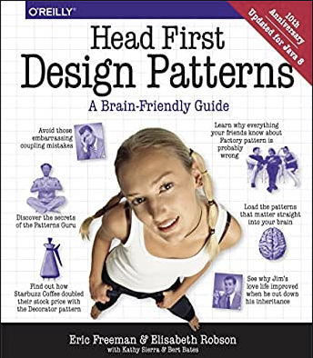

总结一下：这些是周围开发人员最喜欢的书。 如果我不得不挑选一本书推荐给您，那应该是安德鲁·亨特（Andrew Hunt）的“实用程序员”。 罗伯特·C·马丁（Robert C. Martin）的书在业界被接受，并为许多开发人员所喜爱，但是在阅读它们时，我会很批评，因为我与鲍伯叔叔的观点不多。
# 实用程序员


“实用程序员”是我读过的最重要的书之一。 它充满了技术和专业的实践建议，这些建议对我帮助了很多项目并成为一名更好的开发人员。

该书甚至在2020年都具有很高的关联性，尤其是在新的20周年纪念版中。 它探讨了从个人责任，职业发展到建筑技术等主题，探讨了成为现代开发人员的意义。

阅读本书后，您应该知道持续学习的意义以及它的重要性。 如何编写灵活，适应性强和动态的代码； 如何解决并发代码的问题； 如何防范安全漏洞； 如何进行无情和有效的测试； 以及更多。

如果有一本我必须挑推荐给您的书，那肯定是这本！
# 算法导论


Thomas H. Cormen，Charles E. Leiserson，Ronald L. Rivest和Clifford Stein撰写的“算法简介，第三版”无非是各种算法的基本指南。 它非常全面，可供各种读者，初学者和专业人士使用。 它用词清楚，涵盖了很多主题。 但这也很复杂并且不那么容易遵循。

它涵盖了诸如数据结构，快速算法，用于看似棘手的问题的多项式时间算法，图论，计算几何等主题。 尽管它包含一些伪代码示例，但在我看来，它仍然是一本非常理论的书。
# 清洁编码器


Bob叔叔的另一本书讲授了真正的软件工艺的技术，学科，工具和实践。 “干净的编码器：专业程序员的行为准则”包含有关估计，编码，重构和测试的实用建议。

阅读本书之后，您应该能够应对冲突，时间表紧迫和管理人员不合理； 处理不懈的压力并避免倦怠； 管理你的时间； 进入编码流程； 并营造开发人员和团队可以蓬勃发展的环境。

这本书在业界已经被广泛接受，但我认为其中并非所有内容都是纯金。 它包含许多轶事和假设性的对话，大多数时候可以得出这样的结论：开发人员最终对其行为负责。 到目前为止，在一份声明中，对于代码产生错误的开发人员的建议是为公司的财务损失提供经济补偿。

因此，我的建议是，如果您愿意，请认真，认真地阅读本书！
# 与旧版代码有效合作


在Michael Feathers撰写的“有效处理遗留代码”中，作者提供了处理未测试的大型遗留代码库的策略。 您可能会认为我们现在已经到了2020年，而遗留代码不再是问题，因为我们一直都只有干净，可维护的代码和微服务，但让我向您保证，这是一个误解。 对于许多公司而言，传统代码仍然是最具挑战性的问题之一。

阅读本书之后，您应该能够了解软件更改的一般机制，例如添加功能，修复错误，优化性能以及改进设计。 此外，您还将学习如何准备好遗留代码以进行测试以及如何确定代码需要更改的地方。

本书提供了用Java，C，C和C＃编写的示例，但还提供了有关如何处理非面向对象的遗留代码的提示。
# 企业应用程序架构的模式


“企业应用程序体系结构模式”是Martin Fowler撰写的另一本很棒的书，涉及企业应用程序开发的实践。 在有关如何开发企业应用程序的简短教程之后，Martin随后为您提供了40多种模式，作为在设计企业应用程序时常见问题的解决方案。 它还带有许多用Java或C＃编写的UML可视化和代码示例。

阅读本书之后，您应该能够将企业应用程序划分为多个层次，了解组织业务逻辑的主要方法，使用MVC模式组织Web应用程序，以及处理多个事务中数据的并发性。

但是，这本书的老化非常严重，因此未提及REST，云或JSON等现代概念。 仍然是一本不错的书，但在阅读时请务必注意！
# 头先设计模式


Eric Freeman，Bert Bates，Kathy Sierra和Elisabeth Robson撰写的“ Head First Design Patterns：A Brain-Friendly Guide”（Eric Freeman，Bert Bates，Kathy Sierra和Elisabeth Robson）教您设计模式和最佳实践，以供其他开发人员创建功能强大，可重用，优雅且灵活的软件。 它还具有出色的可视化效果，可以帮助您更轻松地学习新概念。

如果您想了解工厂，单例，依赖项注入等内容，那么这本书是一个不错的选择。 这些示例都是用Java编写的，因此知道该语言或另一种面向对象的语言也不会带来任何伤害。
# 重构


马丁·福勒（Martin Fowler）撰写的《重构：改进现有代码的设计》第二版解释了重构的真正含义，就像20年前的重构一样。 您可能会问自己并在本书中得到回答的问题是：
+ 为什么要重构代码？
+ 如何识别需要重构的代码？
+ 如何成功重构代码？

阅读本书之后，您应该了解可以快速应用于代码库的重构过程和一般原理。 您还应该能够在队友的代码中发现需要重构的“难闻的气味”。
# 清洁代码


罗伯特·C·马丁（鲍勃叔叔）撰写的“清洁代码：敏捷软件技巧手册”是周围最受欢迎的编程书籍之一。 它是为教软件工程师编写干净的编程代码的原理而编写的。 它附带了许多示例，向您展示了如何重构代码以使其更具可读性和可维护性，但请注意，它是非常以Java为中心的。 尽管某些模式和技术可以转移到通用编程或其他语言，但本书的主要读者是Java开发人员。

还要注意的一本书是2009年。由于可用的工具和IDE，某些内容（如代码格式）在今天不再那么重要。 但这毕竟是一本好书。
# 代码完成


史蒂夫·麦康奈尔（Steve McConnell）撰写的“代码完成：软件构建实用手册，第二版”是每位程序员一生中应该浏览的一本书。

这是对软件结构的全面分析，写得很好，并且在业界广为接受。 它涉及诸如设计，编码，调试和测试等主题。

总体而言，对于拥有一到三年专业编程经验的开发人员而言，本书可能会获得最高的投资回报率。 但我也建议初学者使用它，因为它有助于在构建软件时使您更有信心。

主要外卖？ 开发人员必须管理复杂性。 编写易于维护的代码，并为您和他人阅读。
# 破解编码面试


强烈建议“希望或需要进行代码采访”的任何人推荐“破解代码采访：189个编程问题和解决方案”。 经验丰富的软件工程师作家Gayle Laakmann McDowell既是采访员又是候选人。 她可以帮助您查找问题中隐藏的细节，将问题分解为小块，并更好地学习概念。

此外，盖尔为您提供189个真实的面试问题和解决方案，因此您可以为下一次编码面试做好充分的准备！
# 10本软件工程师必读书籍
## 作为工程师变得更好不仅是因为阅读代码，还在于编写代码

> Photo by Ria Puskas on Unsplash


除了现代世界上的所有出色产品（播客，视频，博客等）以外，阅读好书仍然是许多人不希望错过的事情。 我已经阅读了很多涵盖技术相关内容（例如软件工程）的好书，并且仍在学习新的模式和最佳实践。

要为软件工程找到好书并不是一件容易的事，因为生态系统变化如此之快，许多事情在短时间内过时了。 对于依赖于特定编程语言版本的书籍，尤其如此。

但是，这里有常绿植物，涉及元主题，设计模式或一般思维方式的书籍。

以下收藏包含一些最流行，最常阅读的书籍。 今天仍然有用的书籍，高级开发人员经常向初级开发人员推荐这些书籍。 我知道时间很宝贵，特别是对于软件工程师而言，但是如果您能够阅读其中的一些内容，那肯定会对您和您的职业有所帮助。 请注意，由于所有这些书都是同等可推荐的，因此该列表的顺序并不特殊。

注意：以下所有链接都不是会员链接。
```
(本文翻译自Simon Holdorf的文章《10 Must-Read Books for Software Engineers》，参考：https://medium.com/better-programming/10-must-read-books-for-software-engineers-edfac373821b)
```
