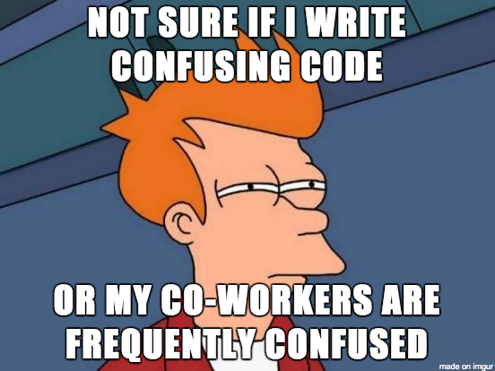

## 相关文章

感谢您的阅读！ 您觉得这些Python做法有用吗？ 在下面发表评论！ 您可以查看官方样式指南以了解更多Python约定。 如果您对提高Python技能感兴趣，则以下文章可能会有用：
## 我希望我早先知道的5个Python功能
### Python技巧超越了lambda，map和filter
## 适用于Python新手的Python 3.8中的6个新功能
### 为自己做准备，因为不再支持Python 2
## Python初学者应避免的4个常见错误
### 我通过艰辛的方式学习了它们，但是您不需要

最初发布于edenau.github.io。
# 3.命名约定

命名事物是计算机科学中最困难的事情之一。 您用尽了所有想法。 您不知道如何命名临时中介变量。 你不是一个人。

尽管进行了所有这些努力，Python中还是有一些命名约定来“缩小”您对变量的命名选择。 它们有助于使您的代码更加一致，可读性和可重用性。

因此，如果字母本身不带有含义，则不再使用单个小写字母（如a，x等）声明所有变量。 另外，您应该使用有意义，易于理解且易于识别的单词来命名它们，例如使用user_profile而不是uspr。

以下是有关事物命名的6条提示：
+ 出于明显的原因，请避免使用单个字母（例如O，I，l）来命名。
+ 变量和函数名称均应小写。
+ 变量或函数名称中的单词应用下划线_分隔。
+ 私有变量（例如在类内部）可能以单个下划线开头。
+ 类别名称中的单词应连接起来并大写，例如MarioKart。
+ 常量名称应使用大写字母，例如GOLDEN_RATIO。

此列表绝不是详尽无遗的。 命名变量可以说是编程中最难学习的内容之一。 我发现在GitHub上阅读其他人的代码并学习他们的命名方式会有所帮助。

> Photo by Bekky Bekks on Unsplash

# 2. F弦

undefined
```
name = 'World''Hello %s' % name        # Hello World'Hello {}'.format(name)  # Hello World
```

抛弃他们。 一旦您需要在更长的字符串中打印多个变量，该代码将很快变得混乱且难以理解。 这些格式化方法无论如何都不是直接直观的。

Python f-string是Python 3.6中引入的改变游戏规则的工具。 这是一种可读且优雅的字符串格式语法，该表达式将表达式嵌入到字符串中。 这是通过语法f'{expr}'完成的，其中表达式用f字符串内的大括号括起来，并在单引号之前以f开头。
```
name = 'World'print(f'Hello {name}')   # Hello World
```

您还可以将任何在语法上有效的表达式放在大括号内，并且效果很好，甚至可以在表达式中调用函数！
```
a = [1,2.2,3]print(f'Sum of squares of {a} is {sum_of_squares(a)}')# Sum of squares of [1, 2.2, 3] is 14.84
```

> Photo by Dan Gold on Unsplash

# 1. Docstring

Python文档字符串（也称为docstring）是模块，函数，类或方法的定义中的第一个语句，该定义由三重双引号“””引起，这是函数中docstring的最小示例。
```
def foo():    """This function does nothing."""    passprint(foo.__doc__) # This function does nothing.
```

函数的文档字符串应包含（单行）其用途的简短描述，后跟描述调用函数约定的段落。 样式多种多样，但这是我最喜欢的模板之一：
```python
def sum_of_squares(nums):
    """
    Compute the sum of squares of a list of numbers.

    Args:
        nums (`list` of `int` or `float`): A `list` of numbers.
    Returns:
        ans (`int` or `float`): Sum of squares of `nums`.
    Raises:
        AssertionError: If `nums` contain elements that are not floats nor ints.
    """
    try:
        ans = sum([x**2 for x in nums])
    except:
        raise AssertionError('Input should be a list of floats or ints.')
    return ans
    
    
```

> Photo by Annie Spratt on Unsplash

# 3个适合初学者的Python最佳实践
## 立即开始编写可重用代码

> Photo by Jeffrey F Lin on Unsplash


面对现实吧。 编码很难。 您只想完成它，就可以称之为一天。 但是，如果您很快地编写代码，而在一天结束前没有重构和注释几乎不可读的意大利面条代码，它将再次困扰您。 或其他人捡起你的烂摊子。

为了可读性和可重用性，负责任地重组和记录代码非常重要。 这里有3种Python最佳实践，您应该选择它们以成为更好的程序员。

> Meme by Codementor on Medium

```
(本文翻译自Eden Au的文章《3 Good Python Practices for Beginners》，参考：https://towardsdatascience.com/3-good-python-practices-for-beginners-3e747b28f3e5)
```
