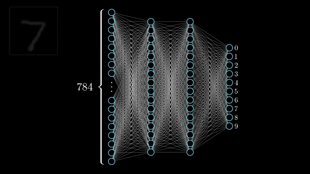
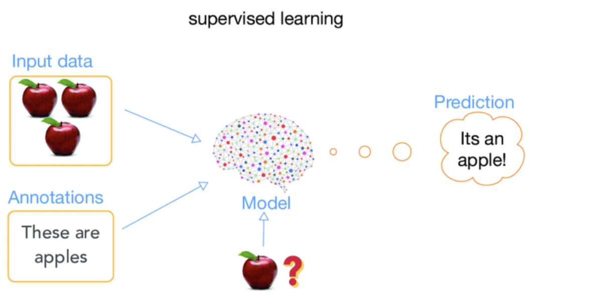
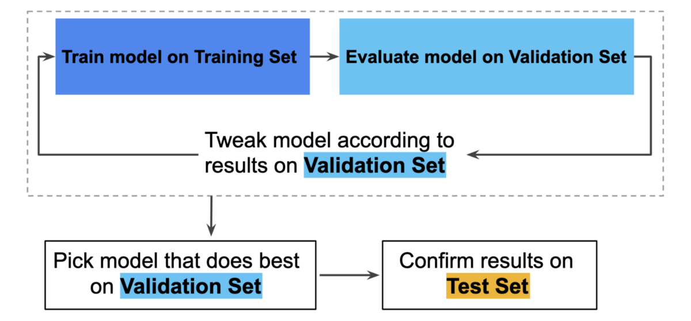
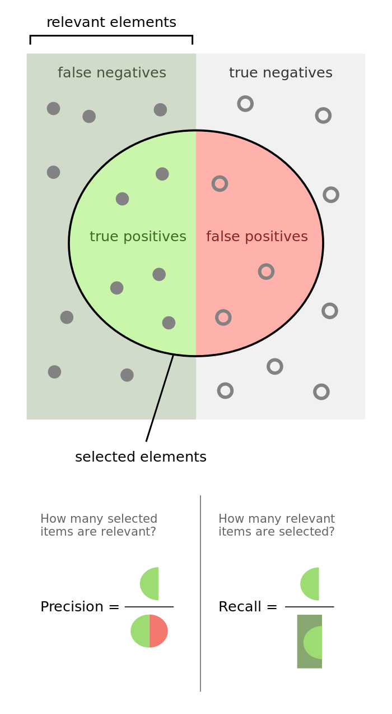
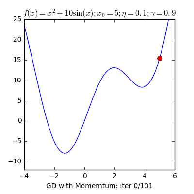

还有许多其他重要的术语。 我们发布文章探讨各种此类主题的含义及其应用。 AI毕业生是AI社区，它不仅是开源的，而且关注其道德和政治方面。 每个星期五，我们都会发布有关此类简化的AI概念的文章。 如果您喜欢这个或有任何反馈或后续问题，请在下面评论。

谢谢阅读！
# 2020年每个人都必须知道的7个AI术语
## 就像PC革命一样，人工智能也将成为每个职业的组成部分

> Photo by Luca Bravo on Unsplash


《福布斯》（Forbes）2018年的一份报告称，大公司中有54％的员工需要提高技能才能在2025年之前保持就业。 去年，美国机器学习工程师的平均工资为14.3万美元。

Google首席执行官Sunder Pichai在2016年的博客中写道：“过去的十年一直致力于建立一个以移动设备为先的世界，将我们的手机变成生活中的遥控器。 但是在接下来的十年中，我们将转移到AI至上的世界”


人们推测PC革命是很多的。 很多人反对它，但是它很快就改变了我们的工作方式。 现在，每个组织和每个行业都将计算机作为工作场所的有机组成部分。 人工智能革命将越来越快地受到打击。

人工智能革命将越来越快地受到打击。

要在以人工智能为第一的世界中取得成功，必须知道它所讲的语言。 这是机器学习世界中经常使用的10个术语。
# 1）深度学习

深度学习是由于深度神经网络而发生的。 神经网络由神经元层组成。 深度神经网络是具有数千层的神经网络。

每当我们谈论深度学习时，必须谈论神经网络。 神经网络的每一层都学习逐步复杂的功能。 较早的层学习简单的特征，例如线条和边线，下一层可能学习简单的形状，例如正方形，圆形，三角形等。下一层可能学习图案和纹理等

> 3Blue1Brown

# 2）监督学习

当数据成为您的机器的Yoda时，称为监督学习。 大量数据被馈送到计算机，并且机器被该数据训练。 每个数据点都有一个标签。 一旦经过培训以识别标签，机器就可以查看新数据点并立即预测其标签是什么。 属于此类别的最常见算法是线性回归，逻辑回归和决策树等。

> BAGANs Paper

# 3）培训，测试和验证集

> Stanford


在任何机器学习项目中，我们都将数据分为这三个部分。 机器学习的最重要诫命-永远不要触摸测试数据集。 对机器进行培训后，我们需要新的数据对其进行测试。 由于机器已经看到了数据，因此我们无法在训练数据的子集上对其进行测试。 另一方面，验证集用于调整算法的参数。

神经网络的训练是最消耗资源的过程之一。 对于那些想深入研究此过程（称为反向传播）的人，请访问此链接。

我们无法根据训练过的数据的子集测试机器，因为机器已经看到了

> Google Developers

# 4）CNN —卷积神经网络

这些是世界上人脸识别应用程序背后的英雄。 CNN以最简单的形式将图像解构为最基本的元素。 例如，一张脸将分解为眼睛，鼻子，耳朵等。数字8将分解为2个圆圈，数字7分解为2条线，一条水平线和一条垂直线带角度等。

> Source

# 5）推荐系统

这就是Amazon和Netflix知道您可能想要的方式。 这些系统吸收您的喜欢，不喜欢，偏好，过去的历史，购买等等的输入，以生成有关您将来想要的东西的见解。 将它们视为计算机读取您的思想的方式。

> Taken from a very nice recommendation systems article

# 6）精确度和召回率-PR号码

使用精确度和召回率数字的行为是一种数学方法，用于评估我们的模型对于当前问题的实用性。

有关PR编号的详细介绍，请阅读本文。
+ 高精度和高召回率-预测模型高度可靠。
+ 低召回率和高精度—这仅表示模型非常挑剔。 这样的模型不能用于对生命至关重要的问题，例如 癌症检测，恐怖分子识别，事故预防等
+ 高召回率和低精度—该模型最终会产生许多错误警报。 此类模型不应用于误报成本很高的情况下，例如： 飞行着陆系统。

> WIKI

# 7）梯度下降

梯度下降法是一种快速，迭代且近似的方法，旨在寻找函数的最小值。 它从起点沿最陡的下降方向迭代移动。 在AI中，这很有用，因为它有助于我们找到最接近的匹配项。

> Source

```
(本文翻译自Rishi Sidhu的文章《7 AI Terms Everyone Must Know in 2020》，参考：https://medium.com/x8-the-ai-community/7-ai-terms-everyone-must-know-in-2020-cfe3faf6bfd7)
```
