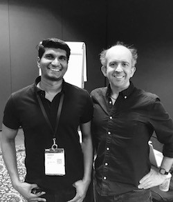
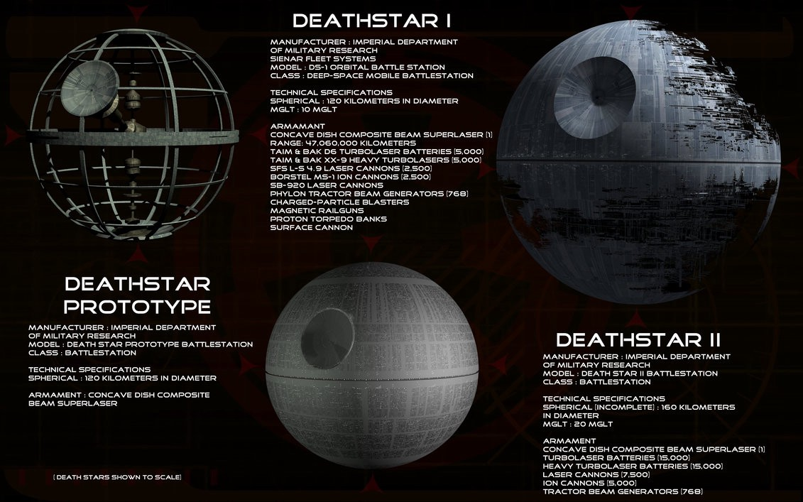
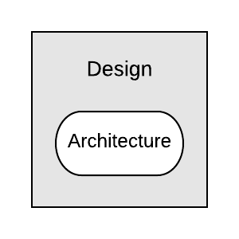
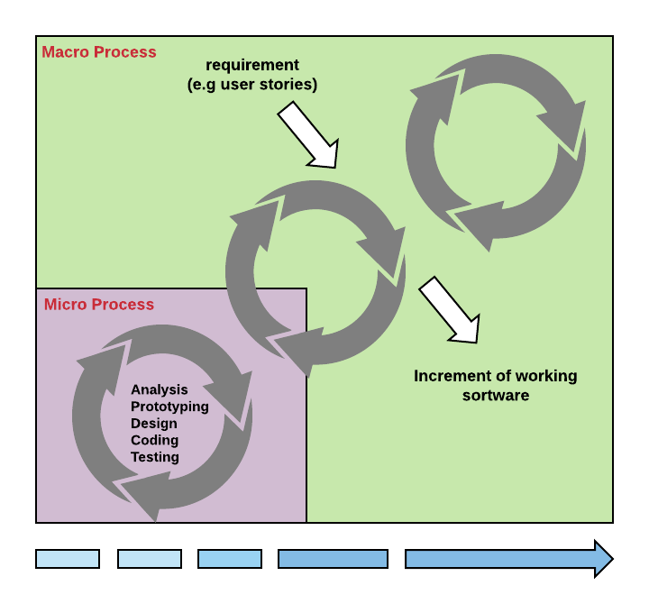
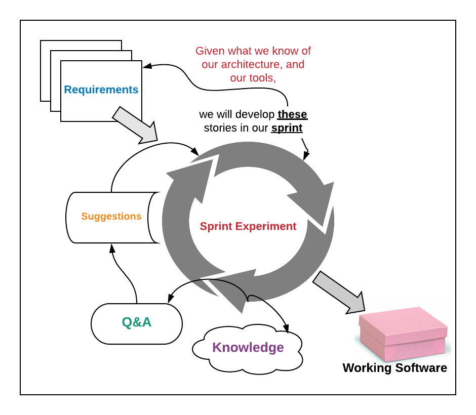
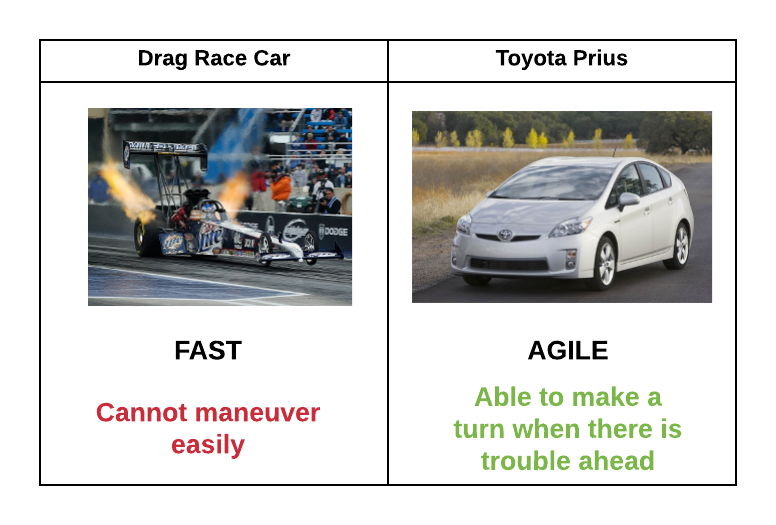
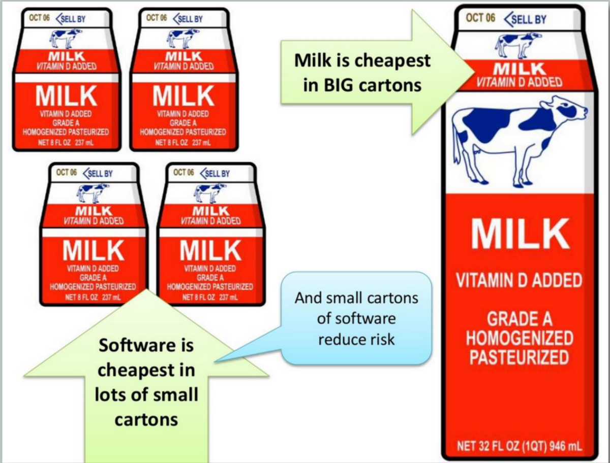
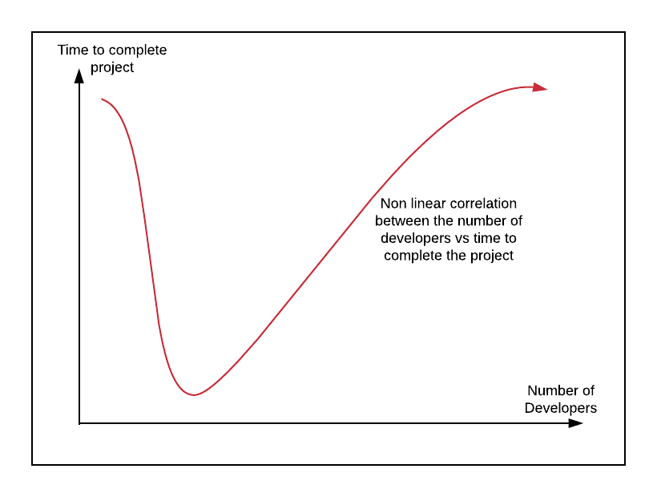
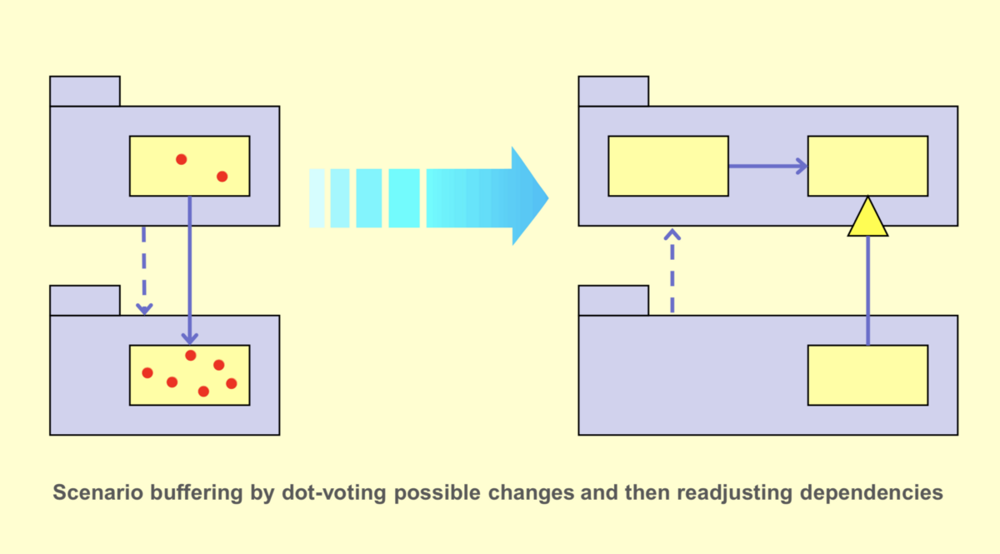

> Warren Veerasingam, Kevlin Henney — GOTO; Chicago 2018


我在2018年GOTO芝加哥会议上遇到了Kelvin Henney。 Kevlin Henney是软件开发的作者，演示者和顾问。 他为许多杂志和网站撰写了有关计算机编程和开发实践的主题的文章，包括Better Software，The Register，C / C ++ Users Journal，Application Development Advisor，JavaSpektrum，C ++ Report，Java Report，EXE和Overload。 他是IEEE软件顾问委员会的成员。 Henney还是模式书籍的合著者，也是每个程序员都应该知道的97件事的编辑。
# 您不了解敏捷架构的7件事


“多么愚蠢的设计！ 维德对那个将排气口放到死星上的家伙说：“你单方面负责破坏我们的终极武器和战斗站！” 我们可能为我们的软件设计了一个复杂且有缺陷的体系结构，并且在不被Darth Vader窒息的情况下生存了下来。 但是，我们如何构建更好的软件。

在深入探讨之前，让我们问自己：“软件体系结构是什么意思？”-非功能性要求？-框架？-高级决策和抽象？

我喜欢下面的低级描述：所有架构都是设计，但并非所有设计都是架构。 架构代表了决定系统的重要设计决策，其中重要的决定是通过变更成本来衡量的— Grady Booch

> All architecture is design but not all design is architecture


这里是一个高级的描述：体系结构是您希望您可以在项目的早期就做出正确决定的决定，但是您不一定比其他任何人都更正确地做出决定-拉尔夫·约翰逊（Ralph Johnson）
## 什么使好的软件体系结构？
## 1.改变不应该是昂贵的

随着项目的进行，引入更改应该不会太昂贵。 如果更改或添加新功能的成本很高，则发布软件将需要更长的时间。 在某些情况下，由于体系结构的限制，您可能无法添加新功能。
## 2.它应该有一个反馈回路。 这是一个循环。

架构是一种假设，需要通过实现和度量加以证明— Tom Gilb架构是一种思想的表达。 您的工作是检验这个想法。 证明它有效。 您可以构建的内容受构建方式的影响和限制，反之亦然。 预先了解所有内容是很昂贵的。 您需要经常返回并在进行项目时进行更改。 建筑思维基于知识，需要学习。 学习贯穿于整个软件开发项目。 开发增量应基于功能而不是组件结构。

## 3.使其敏捷，精益

敏捷思维强调团队合作和对变化的响应。 精益思想集中在消除浪费和改善流程上。 同样，预先做出所有重大决策不负责任，如果架构是假设，我们应该使用经验方法对其进行检验。 可持续敏捷性需要良好的架构； 快速的初始开发并没有-这些通常会造成混淆。

## 4.争取更快而不是更快

但是有什么区别呢？ 为了举例说明，假设您和您的朋友决定乘坐两辆单独的汽车进行公路旅行。 在您的朋友决定使用GPS导航器的同时，您决定对其进行“定位”。 你们俩都决定同时离开A点，并使用不同的路线在B点会合。

虽然您可能会开更快的车，但是如果您在驶向B点时迷路了，您的朋友可能会比您早到达。

## 5.在较小的团队中工作以生产优质的软件

今天，我们遭受了近乎普遍的巨人主义偶像崇拜。 因此，在适用的情况下，必须坚持小巧的优点。 —舒马赫（E.F Schumacher）。团队越大，灵活性就越难。 在项目上拥有更多的人并不意味着该项目将尽快完成。 没有线性相关。

更大的团队需要更多的沟通。 当有更多的通信点时，原始消息可能会丢失或在源和接收方之间变得不准确。

一旦到达亚马逊异地，管理人员就有合理的建议，即员工之间应加强沟通。 令他们惊讶的是，创始人兼首席执行官Jeff Bezos站起来宣布：“不，交流太糟糕了！”

这种立场解释了他著名的两人披萨团队规则，即团队人数不得超过两个披萨可容纳的人数。 进行更多的交流并不一定是解决交流问题的方法，而是如何进行交流。 —崔妮（Janet Choi）

> Allan Kelly — Beyond Projects


软件开发没有规模经济。开发具有规模不经济性-艾伦·凯利（Allan Kelly）

## 6.不要使用推测来增加架构的复杂性

使用推测和将来的需求来决定设计方案之间的选择。 使用过去的变化来预测未来的变化-查找变化热点和高缺陷密度。 根据变化率和（不确定性）结构系统。 变化通常是唯一不变的。

简化的能力意味着消除不必要的东西，以便必要的东西可以说话-Hans Hofmann

体系结构定义可以回答以下三个问题：▪系统的结构元素是什么？►它们如何相互关联？■指导前两个问题答案的基本原理和原理是什么？
## 7.总是想到3件可能出错的事情

当您只有一个主意时，没有什么比主意更危险了-E′mile-Auguste Chartier

我们应该始终了解所设计软件的上下文和丰富性。 基于此，我们应该至少提出3处可能出错的方法。 我们需要验证关于这些潜在故障或错误的假设。 当我们在开发软件方面取得进展时，我们会从可行和不可行的事情中获得更多的知识。 如果我们注意到体系结构中的缺陷，那么从一开始就应该感到舒适。

重新设计软件时的体系结构问题和注意事项：▪缺陷在哪里？ 它们以这种方式分布是否有原因？▪“硬位”在哪里？ 是什么使他们很难？▪“轻松的地方”在哪里？ 是什么使它们变得容易？▪不断变化的是什么？ 为什么？▪什么仍然存在？ 为什么？

如果您无法想到计划中可能出错的三件事，那么您的想法就有问题–杰里·温伯格（Jerry Weinberg）

> Kelvin Henney — Pattern-Oriented Software Architecture, On Patterns and Pattern Languages

## 结论

体系结构是关于知识的整理。 好的架构应该是灵活的。 您应该能够迭代您的体系结构，直到获得最低可行产品。 未来的任何变化都不会造成太大的损失。 把事情简单化。 随着项目的增长，在项目中添加更多开发人员不会自动加快项目的速度。 开始设计时不要花太多时间； 相反，只需构建它，看看会发生什么。 有了良好的体系结构，您就可以不断犯错误，并且仍可以不断进步。

可持续发展是在不损害子孙后代满足其自身需求的能力的前提下满足当前需求的发展—布伦特兰委员会的报告

有兴趣了解有关软件开发的更多信息吗？ 阅读我的另一篇文章：连续交付的7个失去的原理
```
(本文翻译自Warren Veerasingam的文章《7 things you don’t know about agile architecture》，参考：https://medium.com/@warrensbox/7-things-you-dont-know-about-agile-architecture-c1125e53e5d6)
```
