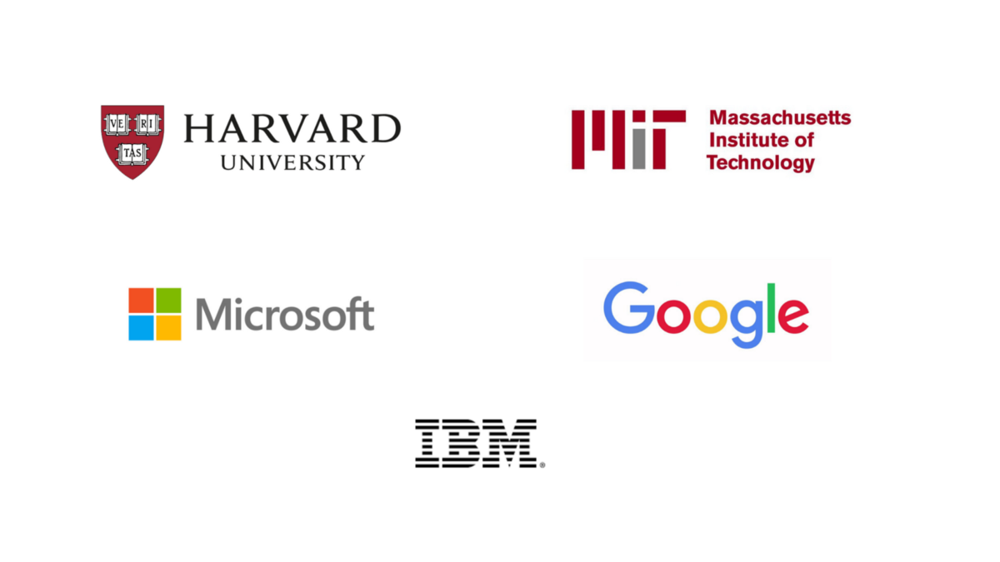

# 最后的想法

采取结构化的课程可以为您提供可能不知道的主题和想法路径的结构，从而帮助您摆脱自学之路，并使您脱离教程。

上面列出的课程的主要好处是，它们都是免费的。 这意味着，除非您希望证书用于展示目的，否则知识本身是免费的。 唯一的成本就是您投入的初始时间。

成为代码编写者是一种不断学习的行为。 无论您现在处于旅途中的哪个位置，学习都是所有优秀开发人员共同拥有的一项活动。
## 9.区块链

布法罗大学和纽约州立大学的课程。

如今谁在谈论区块链？ 到处都是。 但是区块链的问题在于，尽管有很多炒作，但很多人并不真正知道它是什么，它做什么或如何工作。

这是您提升技能的机会，并开始尝试被吹捧为下一个技术前沿的技术。 这是关于编程以及如何创建应用程序的另一种思考方式。

区块链是一场革命，这是您参与其中的机会。
## 8.网络安全的IT基础

IBM的课程。

本课程由IBM创建，面向希望对网络安全以及应用程序构建过程如何工作有更好了解的初学者。

该课程内容涉及安全协议，网络安全框架以及网络攻击的发生方式。

在某些事情发生之前，安全通常是人们心目中的最后一件事。 然后，宏伟的Hindsight船长踢了！ 在安全方面拥有良好的基础，可以帮助防止此类事件的发生。

您无需成为编码器即可启动此程序，甚至不必学习如何编码。 而是，此课程适合所有学生，而不论您当前的学科是什么。
## 7.云计算

伊利诺伊大学香槟分校的课程。

undefined

它还涉及大数据以及如何在云中进行处理。

本教程不适合初学者，更适合于那些已经在开发工作方面有经验并且可能在应用程序领域工作了几年的人。 这更多是技能和知识的提升。
## 6.使用Google Compute Engine进行架构设计

Google Cloud课程。

云计算是未来十年的风潮，本课程由Google创建，旨在帮助您了解和使用其技术。

您将了解基础架构，Google提供的核心服务，它们的工作方式以及有关云计算的概念和理论。

本课程适合那些已经具备一些编程技能并想要升级为真正的全栈开发人员的人。

仅仅因为他们可以在云中启动某些东西，它并不能立即使您成为真正的全栈开发人员。 云基础架构和体系结构是复杂的事物，与开发工作的所有其他部分一样复杂，并且此认证途径可以增强您的知识，并使您成为更好的全栈开发人员。
## 5.使用Python进行计算思维

麻省理工学院的课程。

这是另一门初学者课程，适用于希望入门并通过编程测试水域却又不知道从哪里开始的人们。

完成该程序所需的时间长度（估计为5个月，每周承诺14-16小时）表明该程序的内容更加丰富。

该计划概述说，您不需要具备与计算机科学相关的主题的专业经验就可以开始。 这意味着您将学习构成计算思维基础的重要概念。
## 4.计算机科学导论

Microsoft课程。

该认证包括三门课程，主要涉及Python。 该程序面向绝对的初学者，这意味着您不会对编程有所了解。

它是100％自定进度的，您无需支付任何访问费用就可以完成该程序。

如果您正在寻找入门基础课程，则本课程中的免费内容可以帮助您启动技术职业。 但是，需要注意的是，本课程是非常以Python为中心的-这不是一件坏事，但是如果您正在寻找通识课程，也许是因为您的思维更适合通才学习方法，那么哈佛 课程可能对您更好。
## 3.人工智能（AI）

Microsoft课程。

这门课程的完成成本更高。 但是，它包含11个不同的课程，重点是Python。 每个课程都有自己的认证证书，所有11门课程加起来都是Microsoft的专业证书。

它是自定进度的，预期的工作量大约是每周4–6小时-如果您想慢慢地消化内容，则是每晚一个小时。 由于它具有自定进度，因此如果您有更多时间可以投入到它，则可以更快地完成它。

该课程包括深度学习，伦理学，人工智能和机器学习。
## 2.计算机科学与移动应用

哈佛大学的课程。

这是哈佛大学通过EdX颁发的另一份专业证书。 本课程的第一部分与上文相同-下半部分将带您使用React Native进行移动应用程序专业培训。

如果您想专门从事前端开发，那么上面列出的课程比较合适。 但是，如果您希望在移动开发方面具有跨职能技能，那么此课程可能适合您。

无论最终选择什么，您仍然可以结合其他方法，因为内容最终将在现实生活中出现。
## 1.用于网络编程的计算机科学

哈佛大学的课程。

该证书包含一门课程，分为两部分。 这两部分都是免费的。 验证证书的价格大约相当于一个人一周的杂货价值，因此也不错。

第一部分介绍Web编程的介绍性组件，并涉及C，Python，SQL，JavaScript，CSS和HTML。 第二部分涉及更深入的主题，包括使用API，SQL，可伸缩性，测试和各种前端技术的Git。

总而言之，整个课程可以在大约20周内完成。 但是，由于它是自定进度的，因此可以更快地完成。
# 哈佛，麻省理工，IBM，Google和Microsoft提供的9项免费编程课程
## 获得食品杂货价格的认证！

> Logos compiled by Aphinya Dechalert


传统学位的费用可能很高，尤其是在您考虑转行或不想为学生提供大笔贷款时。 虽然社区学院和地方机构的成本往往要低得多，但您可能不确定这样的长期承诺或需要与家庭相关的后勤协调。 或者，也许您只是想在不花三年时间的情况下正式提升自己的技能。

这里有九门课程，您可以免费学习编码。 最好的部分是您还可以通过常春藤联盟机构或Google，AWS，Microsoft和IBM等行业领导者的认证。

对于此处列出的课程，学习内容和完成相关材料通常是免费的，但要获得认证可能会花费一些钱，具体取决于提供者和机构。
```
(本文翻译自Aphinya Dechalert的文章《9 Free Programming Courses by Harvard, MIT, IBM, Google, and Microsoft》，参考：https://medium.com/better-programming/9-courses-to-learn-for-free-d7951a959f82)
```
