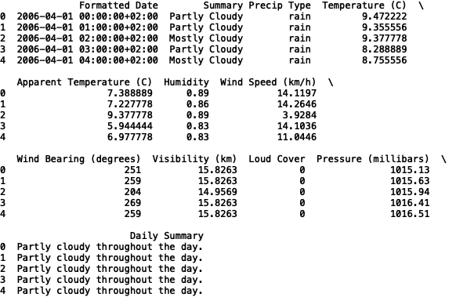
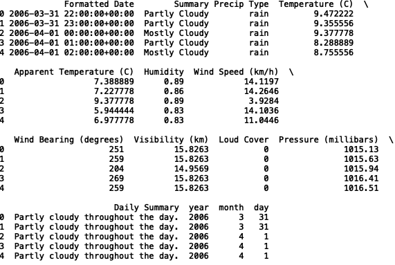
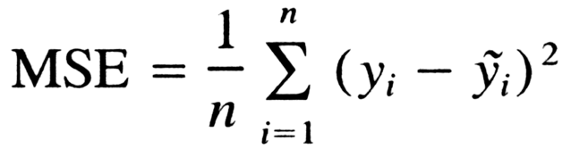
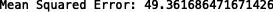
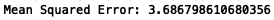
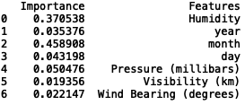
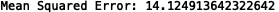
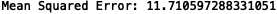

# Scikit学习简介（Sklearn）
## Sklearn简介

> Source


对于机器学习，Python和R是当今使用最广泛的编程语言。 Scikit-learn是一个python库，提供数据读取，数据准备，回归，分类，无监督聚类等方法。 在本文中，我们将介绍一些用于构建回归模型的基本方法。 该软件包的文档内容丰富，是每个数据科学家的宝贵资源。 您可以在此处找到文档。

让我们开始吧！

资料准备

对于我们的回归问题，我们将使用可在此处找到的天气数据。

首先，让我们导入数据并打印前五行：
```
import pandas as pd df = pd.read_csv("weatherHistory.csv")print(df.head())
```


接下来，让我们将date列转换为pandas date-time对象，并创建year，month和day列：
```
df['Formatted Date'] = pd.to_datetime(df['Formatted Date'],  utc=True,)df['year'] = df['Formatted Date'].dt.yeardf['month'] = df['Formatted Date'].dt.monthdf['day'] = df['Formatted Date'].dt.day
```

让我们再次打印前五行，以验证是否创建了新列：
```
print(df.head())
```


现在，让我们定义输入和目标变量。 我们将使用湿度，年，月，日，压力，能见度和风向来预测温度：
```
import numpy as npX = np.array(df[[ 'Humidity', 'year', 'month', 'day', 'Pressure (millibars)', 'Visibility (km)', 'Wind Bearing (degrees)']])y = np.array(df['Temperature (C)'])
```

然后，我们将拆分数据以进行培训和测试：
```
from sklearn.model_selection import train_test_splitX_train, X_test, y_train, y_test = train_test_split(X, y, test_size = 0.2, random_state = 42)
```

现在，我们所有必需的变量都已定义。 让我们建立一些模型！

线性回归

让我们从线性回归开始。 线性回归将线性函数与系数拟合，以使目标和预测之间的平方余数最小。

我们按如下所示导入LinearRegression包：
```
from sklearn.linear_model import LinearRegression
```

我们将用来评估模型性能的误差度量是均方误差（MSE）。 MSE由以下公式定义：


此处，y是实际值，y-tilde是预测值。

让我们定义一个线性回归对象，拟合我们的模型，并评估性能：
```
reg = LinearRegression()reg.fit(X_train, y_train)y_pred = reg.predict(X_test)from sklearn import metricsprint('Mean Squared Error:', metrics.mean_squared_error(y_test, y_pred))
```


表现不佳。 这仅表示输入与目标之间的关系不是线性的。 另外，探索性数据分析（EDA）可以进一步告知智能功能选择和工程设计，从而可以提高性能。

随机森林

现在，让我们看一下随机森林。 随机森林是一种基于树的方法，将多个单独的决策树整合在一起。

我们按如下所示导入RandomForestRegressor包：
```
from sklearn.ensemble import RandomForestRegressor
```

让我们定义一个随机森林回归对象，拟合模型并评估性能：
```
reg_rf = RandomForestRegressor()reg_rf.fit(X_train, y_train)y_pred = reg_rf.predict(X_test)from sklearn import metricsprint('Mean Squared Error:', metrics.mean_squared_error(y_test, y_pred))
```


我们可以看到，随机森林的性能要比线性回归好得多。

我们还可以打印功能重要性。 这使我们可以查看哪些变量对温度预测最重要：
```
feature_df = pd.DataFrame({'Importance':reg_rf.feature_importances_, 'Features': [ 'Humidity', 'year', 'month', 'day', 'Pressure (millibars)', 'Visibility (km)', 'Wind Bearing (degrees)'] })print(feature_df)
```


我们可以看到，月份具有最高的重要性，这是有道理的。

我想指出，通过不传递任何参数（例如max_depth和n_estimators），我选择了默认的随机森林值（n_estimators = 10和max_depth = 10）。 通过优化随机森林中的参数，我们可以进一步提高性能。 可以使用网格搜索技术手动或以自动方式完成此操作。 我将把参数优化的问题留给另一篇文章。

支持向量机

我将讨论的下一个方法称为支持向量回归。 这是支持向量机（SVM）的扩展。 SVM在高维特征空间中构造了一组超平面，可用于回归和分类问题。

我们按以下方式导入SVR软件包：
```
from sklearn.svm import SVR
```

由于SVR的训练速度很慢，因此我只会选择前100条记录进行训练和测试。 随意训练和测试完整的数据集，以更合适地比较模型之间的性能。
```
df = df.head(100)
```

让我们定义一个支持向量回归对象，拟合我们的模型，并评估性能：
```
reg_svr = SVR()reg_svr.fit(X_train, y_train)y_pred = reg_svr.predict(X_test)from sklearn import metricsprint('Mean Squared Error:', metrics.mean_squared_error(y_test, y_pred))
```


我们看到，支持向量回归的性能比线性回归好，但比随机森林差。 同样，这种比较并不完全合适，因为我们没有使用完整的数据集进行训练。

类似于随机森林示例，可以优化支持向量机参数，以使误差最小化。

K-近邻

我将讨论的最终方法是k近邻回归。 K个最近邻居使用欧几里得距离计算，其中预测是k个最近邻居的平均值。

我们按以下方式导入KNeighborsRegressor包：
```
from sklearn.neighbors import KNeighborsRegressor
```

让我们定义一个k最近邻回归对象，拟合我们的模型，并评估效果：
```
reg_knn = KNeighborsRegressor()reg_knn.fit(X_train, y_train)y_pred = reg_knn.predict(X_test)from sklearn import metricsprint('Mean Squared Error:', metrics.mean_squared_error(y_test, y_pred))
```


我们看到，在完整数据集上训练时，k最近邻居算法优于线性回归。

结论

我将在这里停止，但是可以随意选择模型功能，以查看是否可以改善其中一些模型的性能。

回顾一下，我概述了python机器学习库的简要介绍。 我介绍了如何定义模型对象，使模型适合数据以及如何使用线性回归，随机森林，支持向量机和K近邻模型预测输出。 此外，通过探索这些不同类型的模型，我们能够在机器学习库的框架下进行窥视。 注意我们从库中使用的四个模块：
+ linear_models
+ 合奏
+ 支持向量机
+ 邻居

虽然我们只研究了回归方法，但是每个模块都有其他分类方法。 在另一篇文章中，我将概述python机器学习库中最常见的一些分类方法。

我希望这篇文章能提供更多信息。 这篇文章中的代码可在GitHub上找到。 感谢您的阅读和愉快的机器学习！
```
(本文翻译自Sadrach Pierre, Ph.D.的文章《A Brief Tour of Scikit-learn (Sklearn)》，参考：https://towardsdatascience.com/a-brief-tour-of-scikit-learn-sklearn-6e829a9db2fd)
```
