# 数据科学家对冠状病毒爆发的看法
## John Hopkins University对冠状病毒数据集的EDA。

> Photo by CDC on Unsplash


该病毒最早在中国武汉市被报道，现已传播到全球十几个国家，引发了前所未有的健康和经济危机。

世界卫生组织（WHO）宣布武汉冠状病毒的爆发是“国际关注的突发公共卫生事件”。

在本文中，我们将简要介绍当前的危机，然后更深入地了解Kaggle的“新型Corona病毒2019数据集”。 我还为想要重新创建步骤并添加自己的见解的任何人创建了GitHub存储库。
# 什么是冠状病毒？

根据WHO的说法，冠状病毒（CoV）是一大类病毒，其致病范围从普通感冒到更严重的疾病，例如中东呼吸综合症（MERS-CoV）和严重急性呼吸系统综合症（SARS-CoV）。

新型冠状病毒（nCoV）是一种以前在人类中尚未发现的新菌株。 被确定为近期爆发原因的病毒被称为2019-nCoV或武汉冠状病毒。
# 截至今天的危机

根据《纽约时报》的最新报道，“已确诊的感染人数上升到37,198人，并且”中国的死亡人数已经上升到811人，超过了SARS流行造成的死亡人数。”

中国共有16个城市，总人口超过5000万人，目前处于封锁状态。 全球各地的航空公司都取消了往返中国的航班。 一些国家正在通过特殊航班撤离其公民，并进一步对其进行严格检疫。

更糟的是，中国的股市暴跌，世界各地的市场都在感受到这种影响。 一些分析家预测，疫情对全球经济构成威胁，并有可能引发深远的地缘政治后果。
# 数据集简介

由约翰·霍普金斯大学（John Hopkins University）收集了在Kaggle上发布的“ Novel Corona Virus 2019 Dataset”。 该小组已从世界卫生组织，地方疾病预防控制中心和媒体等各种来源收集了数据。 他们还创建了一个实时仪表板来监视病毒的传播。

免责声明：请注意，数据集尚未更新，因此下面记录的观察结果可能无法真实反映当前情况。
# 导入库并加载数据
```
import numpy as npimport pandas as pdimport matplotlib.pyplot as pltimport seaborn as sns#reading data from the csv filedata= pd.read_csv("/kaggle/input/novel-corona-virus-2019-dataset/2019_nCoV_data.csv")
```
# 了解数据集

首先让我们对数据集有一个基本的了解，并在必要时执行数据清理操作。
```
#checking the number of rows and columnsdata.shape
```

输出：（770，8）。 数据集中有770个观测值和8列。
```
#checking the top 5 rowsdata.head()
```
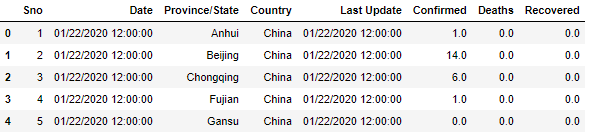

列的名称不言自明。 第一列“ Sno”看起来像行号，不会为分析添加任何值。 第五列“最新更新”显示的值与“日期”列相同，但少数情况下数字会在以后更新。 让我们在继续操作之前删除这两列。
```
#dropping the 1st and 5th columndata.drop("Sno", axis=1, inplace=True)data.drop("Last Update", axis=1, inplace=True)#getting a summary of the columnsdata.info()
```
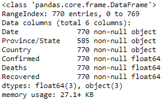

除“省/州”外，所有列均没有空值。 进一步的分析表明，英国，法国和印度等国家/地区缺少省名。 在这种情况下，我们无法假设或填充任何主列表中的缺失值。 让我们继续到数字列。
```
data.describe()
```
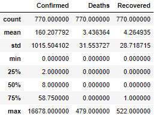

describe（）方法返回数据框中数字列的常规状态。

从输出中直接得出的结论是，该数据已被累计报告，即在任何特定日期报告的病例数都包括先前报告的病例。 死亡的“最大值”值为479，与几天前的媒体报道（该数据发布时）一致。
```
#checking for duplicate rowsduplicate_rows=data.duplicated(['Country','Province/State','Date'])data[duplicate_rows]
```


plicated（）方法返回一个布尔序列，然后将其用作原始数据帧上的掩码。 输出显示没有两个记录具有相同的国家，州和日期。 因此，我们可以得出结论，数据集中的所有观测值都是唯一的。
```
#listing all the countries where the virus has spread tocountry_list=list(data['Country'].unique())print(country_list)print(len(country_list))
```
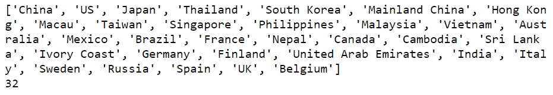

数据显示，该病毒已传播到亚洲，欧洲和美洲的32个国家。 为了进行分析，我们可以合并“中国”和“中国内地”的数据。
```
#merging China and Mainland Chinadata.loc[data['Country']=='Mainland China','Country']='China'
```

在继续之前，让我们检查“日期”列中的日期。
```
print(list(data['Date'].unique()))print(len(list(data['Date'].unique())))
```
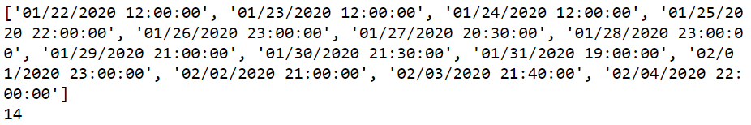

数据似乎每天都在不同的时间进行更新。 我们可以从时间戳中提取日期，并将其用于进一步分析。 这将有助于我们保持日期一致。
```
#converting 'Date' column to datetime objectdata['Date'] = pd.to_datetime(data['Date'])#extracting dates from timestampsdata['Date_date']=data['Date'].apply(lambda x:x.date())
```

让我们大致了解一下这次爆发对每个国家/地区的影响。
```
#getting the total number of confirmed cases for each countrydf_country=data.groupby(['Country']).max().reset_index(drop=None)print(df_country[['Country','Confirmed','Deaths','Recovered']])
```
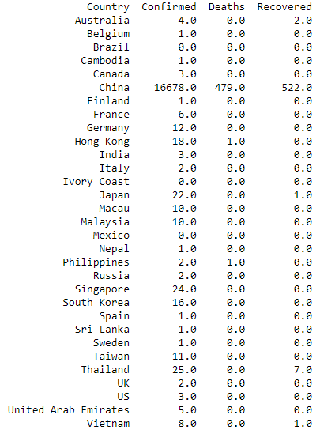

由于数据是累积数据，因此我们需要将max（）函数与groupby（）结合使用，以获取每个国家/地区报告的最大病例数。 如果使用sum（），我们将进行重复计数。

数据证实，迄今为止，中国报告的病例数最多，几乎所有481人死亡。 较为积极的一点是，中国也有522次回收，其次是泰国，有7次。
```
#preparing data for a time-series analysisdf_by_date=data.groupby(['Date_date']).sum().reset_index(drop=None)df_by_date['daily_cases']=df_by_date.Confirmed.diff()df_by_date['daily_deaths']=df_by_date.Deaths.diff()df_by_date['daily_recoveries']=df_by_date.Recovered.diff()print(df_by_date)
```
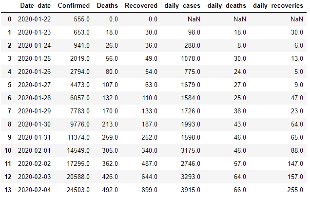

我们已经完成了数据准备步骤，因此让我们继续可视化数据以查找任何新兴趋势和模式。
# 绘制数据

为了实现数据可视化，我们将使用两个强大的python库-Matplotlib和Seaborn。 Matplotlib是大多数数据科学家使用的默认2D可视化库。 基于matplotlib构建的Seaborn，有助于构建外观更好，更复杂的可视化效果（如热图）。

让我们根据数据的不同方面创建五种可视化效果。
+ 经过一段时间的确诊病例数
```
#plotting a bar chart of confirmed cases over timesns.axes_style("whitegrid")sns.barplot(x="Date_date", y="Confirmed", data=data.groupby(['Date_date']).sum().reset_index(drop=None))plt.xticks(rotation=60)plt.ylabel('Number of confirmed cases',fontsize=15)plt.xlabel('Dates',fontsize=15)
```
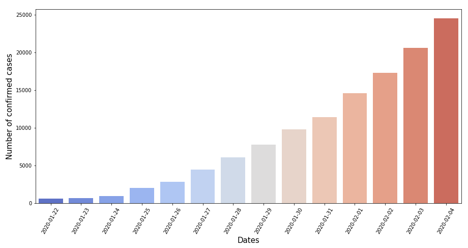

2.死亡率与恢复率
```
#plotting two line plots for deaths and recoveries respectivelyplt.plot('date_updated', 'Deaths', data=data.groupby(['date_updated']).sum().reset_index(drop=None), color='red')plt.plot('date_updated', 'Recovered', data=data.groupby(['date_updated']).sum().reset_index(drop=None), color='green')plt.xticks(rotation=60)plt.ylabel('Number of cases',fontsize=15)plt.xlabel('Dates',fontsize=15)plt.legend()plt.show()
```
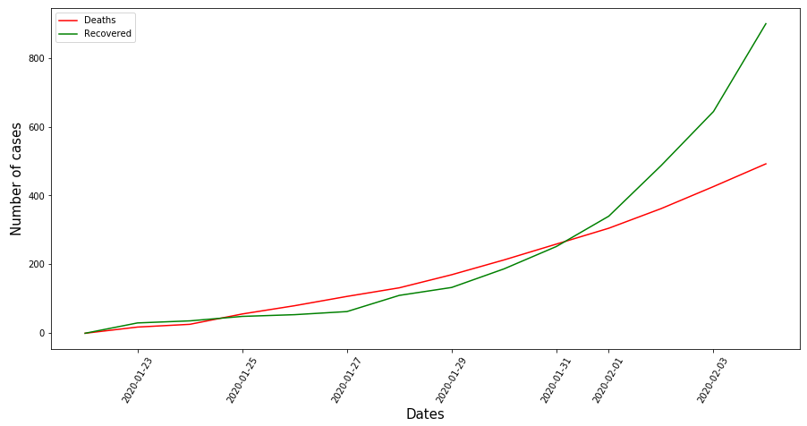

3.除中国外，十个受影响最大的国家
```
#We know that China is the most affected country by a large margin, #so lets create a bar plot to compare countries other than China#increasing the figure sizeplt.rcParams['figure.figsize']=(15,7)sns.barplot(x="Country",y="Confirmed",data=df_country[df_country.Country!='China'].nlargest(10,'Confirmed'),palette=sns.cubehelix_palette(15, reverse=True))plt.ylabel('Number of cases',fontsize=15)plt.xlabel('Countries',fontsize=15)plt.xticks(fontsize=13)plt.yticks(fontsize=13)
```


4.随着时间的死亡率
```
#The mortality rate, at any point in time, can be roughly calculated #by dividing the number of deaths by the number of confirmed casesdf_by_date['mrate']=df_by_date.apply(lambda x: x['Deaths']*100/(x['Confirmed']), axis=1)plt.plot('Date_date','mrate',data=df_by_date, color='red')plt.show()
```
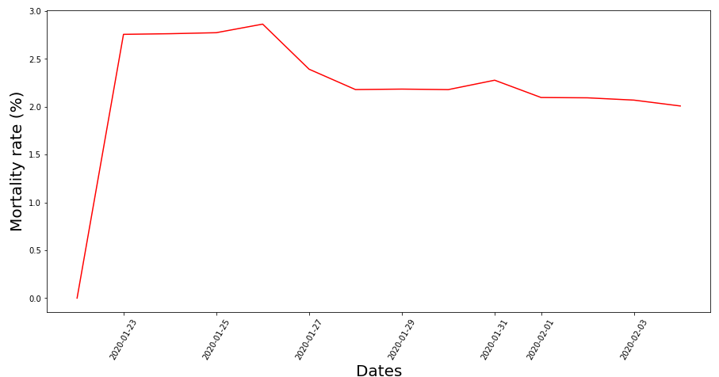

5.仔细研究中国十个受影响最大的省
```
#creating a separate dataframe for provincesdf_province=data[data['Country']=='China'].groupby(['Province/State']).max().reset_index(drop=None)#selecting 10 most affected provincesdf_province=df_province.nlargest(10,'Confirmed')df_province=df_province[['Province/State','Deaths','Recovered']]#for multi-bar plots in seaborn, we need to melt the dataframe so #that the the deaths and recovered values are in the same columndf_province= df_province.melt(id_vars=['Province/State'])sns.barplot(x='Province/State', y='value', hue='variable', data=df_province)plt.xlabel('Provinces',fontsize=15)plt.ylabel('Number of cases',fontsize=15)
```
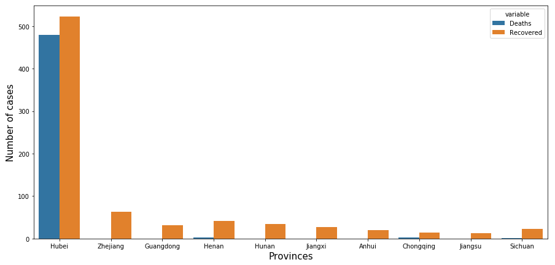
# 观察结果
+ 在第一周内，死亡率高于康复率。 自1月31日以来，复苏速度飞涨，并呈现出积极的趋势。 2月4日，有255人被发现，而66人死亡。 随着越来越多的人了解症状并迅速寻求药物治疗，康复率将继续提高。
+ 在地理上靠近中国的国家，例如泰国，日本和新加坡，报告的病例比其他亚洲和欧洲国家多。 德国是个例外，在欧洲有最多的案件。
+ 中国湖北省是暴发的中心。 报告的病例比其他所有省的总数要多得多。 在有些省没有死亡病例，所有受影响的患者都已康复。
# 结论

分析显示武汉冠状病毒正在以惊人的速度传播。 目前，至少有811人在当前的流行中死亡，超过了7年前SARS爆发时报告的774人死亡。 我祈祷并希望尽快遏制该病毒。
```
(本文翻译自Kamran Ahmad的文章《A Data Scientist’s Perspective on the Coronavirus Outbreak》，参考：https://towardsdatascience.com/a-data-scientists-perspective-on-the-wuhan-coronavirus-4d1110446478)
```
