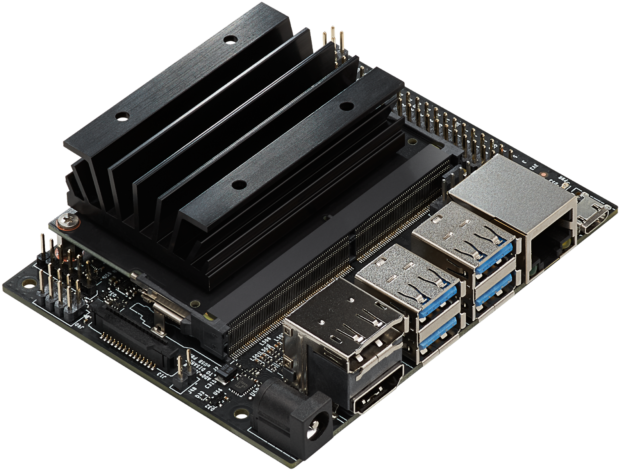
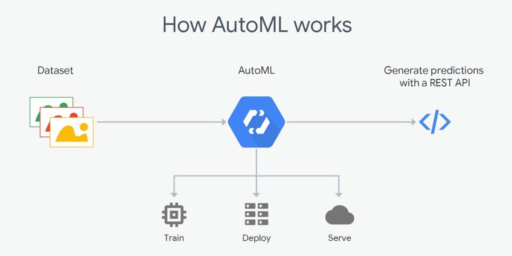
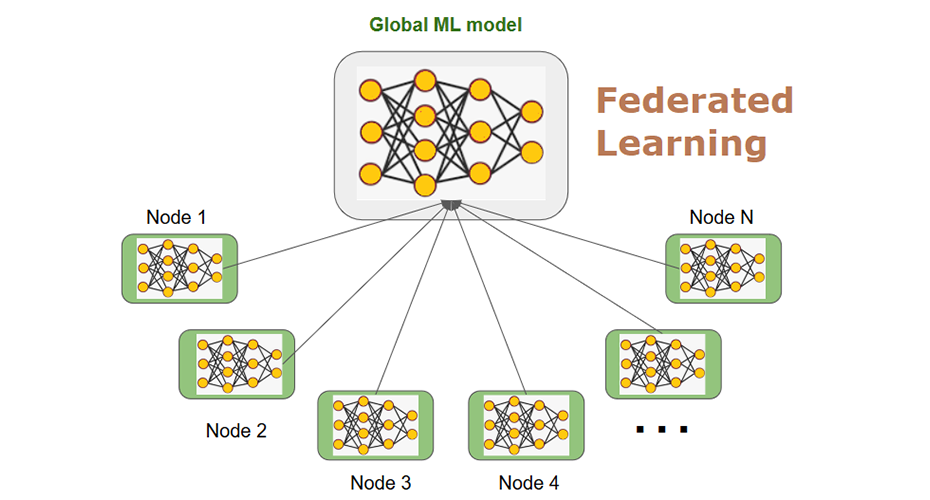
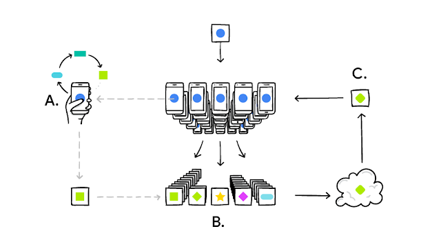
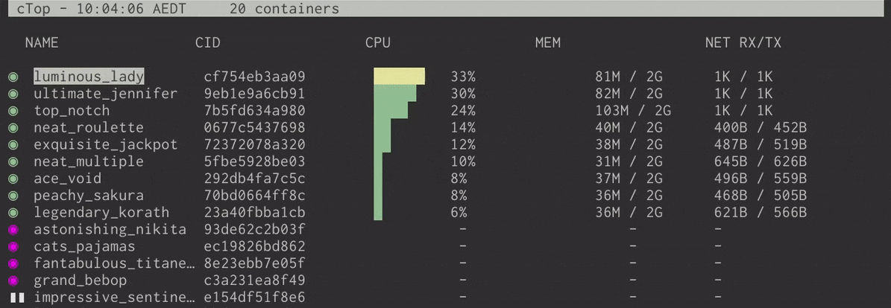
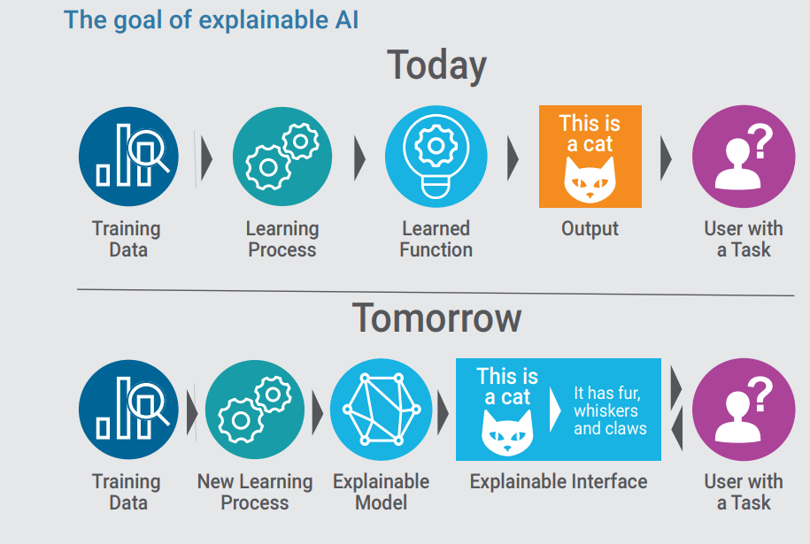

## 结论：

暴露了这一趋势的简短清单后，几乎没有什么想法和考虑因素了：
+ 人工智能正在被嵌入：专门为特定任务设计的小型硬件组件。
+ AI正在（越来越）可转让：多平台支持，标准化和可再现性。
+ FrançoisChollet方法论对AI进行基准测试可能会成为下一次机器智能的Turing测试，其论文的第3章详细说明了该框架。
# 2020年AI趋势摘要
## 在2020年临近之际，除夕夜始终是对过去的一年以及明年的期望进行一些思考的好时机。

> Foto by fauxels on pexels.com


在这篇文章中，我想深入探讨AI的技术和非技术方面以及趋势，讨论相对新的趋势，例如AutoML到AI的更加明确和道德的方面，而这些方面正逐渐与越来越多的公司和最终用户接触 。
# 2019年的简短概述：

在2019年，英特尔，高通或NVIDIA等大型芯片制造商发布了专门设计用于仅执行基于AI的应用程序的芯片，主要用于计算机视觉领域，自然语言处理和语音识别。

> The Jetson Nano Dev Kit, developed by NVIDIA.


Google发布了TensorFlow 2.0，扩展了对Node.js上TensorFlow的支持，并与iOS集成，最后，正式将其高级API更改为Keras，使其成为移动和PWA优先。

此外，BERT模型演变为DistilBERT或FastBert，计算机视觉算法的级别可以非常精确地执行大多数消费者的任务。

DeepMind或OpenAI之类的大型公司进一步突破了强化学习的领域，该领域正在见证其首次在现实世界中的应用。

最后但并非最不重要的一点是，Keras的创建者FrançoisChollet发表了一篇论文，提出了一种基准化AI模型的新方法。
# 但是，到2020年会发生什么？

## 自动化机器学习（AutoML）：

具有执行ETL任务，数据预处理，转换AutoML的能力，很可能在2020年变得更加流行。

AutoML技术可以照顾整个机器学习过程，诸如auto-sklearn之类的程序包可以自动进行模型选择，超参数优化和评分，而其他云提供商已经提供了服务的“自动驾驶”替代方案：Amazon Forecast自动确定哪种算法 Google最适合数据，Google也提供类似的服务Cloud AutoML。

> Basically everything is becoming a REST API.


尽管乍看之下，这似乎主要集中在那些不太了解AI的用户身上，但这类服务也为更高级的用户提供了很好的机会：AutoML模型可以用作基准，评估是否花费时间的基准 使用不同的技术开发不同的模型实际上很有意义。
## AI之死：

您能说出一家如今以自己的广告做广告的公司的标题：“现在使用计算机！”，“也可以在互联网上使用！”，“我们使用传真！”？

> Do you remember this?


可能不会。 我仍然记得今年年初关于一些广告牌广告智能手机及其AI驱动的摄像头。 好吧，这将结束。 如今，多种消费类应用，车辆，家用电器已经具有使用某种AI的嵌入式功能。 这是我们（消费者）习惯的。 流行语“ AI”将逐渐淡出，并为消费者提供AI功能。

您知道Google表格已如何使用AI吗？
## 联合机器学习：

早在2017年，Google引入了分布式学习的概念，该方法使用分散的数据对模型进行部分或全部训练。


考虑考虑在您的计算机上训练基准模型，然后将模型交付给最终用户，最终用户可以访问数据（在他的手机，笔记本电脑，平板电脑上），这些数据用于微调和个性化模型。

让我们考虑一个涉及处理一些高度敏感数据的模型：提供该模型的公司可以访问为它们专门准备的一些经过清理的数据。

一旦基线模型满足某些要求，就可以将模型交付给客户端，客户端最终将对其进行培训，而无需与外部参与者共享任何用户数据。

如前所述，TensorFlow 2.0支持其他平台，例如iOS，Node.js等，原因之一可能是使其成为可能，从而为公司提供了一个用于构建，运输，培训和优化的多平台工具。 此外，诸如Docker和Kubernetes之类的平台提供了扩展和协调相对复杂环境的部署的可能性，从而使联合机器学习成为可能。

> Another example of federated learning: your phone personalizes the model locally. Many users’ updates are aggregated (B) to form a consensus change C to the shared model.

## 云寡头的终结：

云计算在2019年变得越来越流行，许多人转向“我们将永远不会与他们共享我们的数据”转为“好吧，也许我们可以尝试一下”。

> Is this some sort of cooling system controlled by a tablet?


云提供商的规模，数量，客户和产品的增加，使市场开始从寡头垄断转向完全竞争的市场，这意味着云提供商正在逐渐失去做价者的能力。 已有可能在不同的云提供商之间分配资源，而2020年将是多云市场跟踪器之类的产品之年，云提供商不仅将根据其定价计划来评判，而且还将通过他们希望我们使用其定价的方式来进行评判。 服务：此提供商是否有兴趣让我使用更多或更少的资源？ 他们会影响我将所有内容存储在云中还是拥有不同的数据分配解决方案？

## 可解释，负责，可解释和符合道德的AI：

在2019年，我们对XAI或Explainable AI进行了艰苦的尝试，这是一系列鼓励算法的可解释性和可再现性的实践。 这种趋势与机器学习和深度学习在许多不同领域和不同公司的应用方式不同。

模型不再是（也不应该是）黑匣子，其结果的每个决定都必须可以解释。


这种趋势导致需要一个新的人物，该人物能够理解可解释性和（人类）可解释性的边界，并能够回答以下问题：“这符合我们的使命和价值观吗？”。

此外，应用机器学习技术来解决可能排除或区分某些用户的任务的公司必须专注于他们对模型决策的法律和道德责任。
```
(本文翻译自Roberto Sannazzaro的文章《A Distilled List of AI Trends For 2020》，参考：https://towardsdatascience.com/a-distilled-list-of-ai-trends-for-2020-e2fc83a9b092)
```
