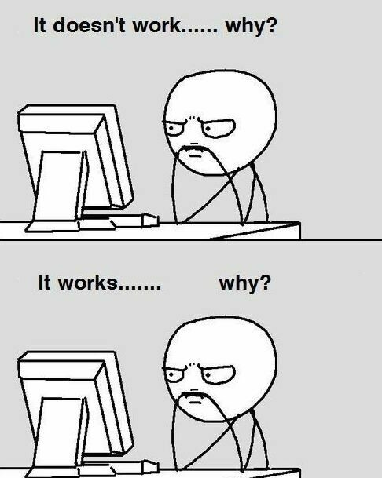
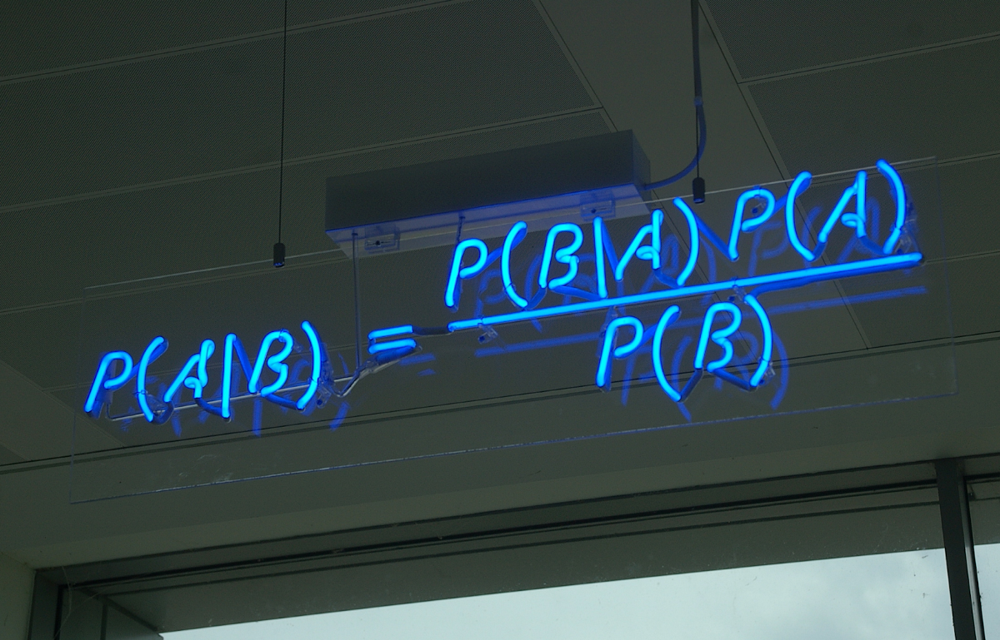
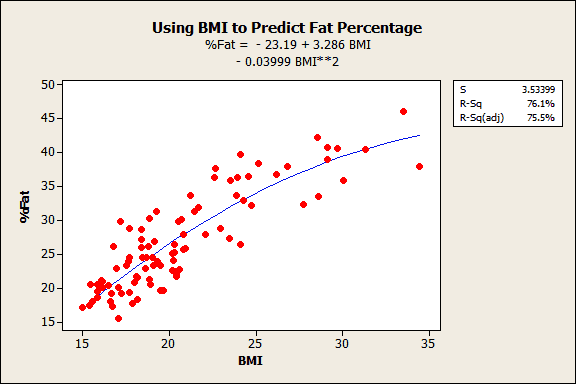
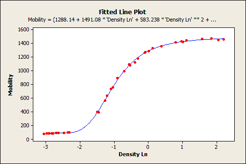

# 数据科学概率统计的温和介绍
## 轻松而深入地了解统计领域。

> Photo Creds: https://unsplash.com/


没有扎实的概率和统计知识，数据科学是不可能的。 但是由于无聊和复杂的统计术语，我们常常对此失去兴趣。 是的，概率和统计数据很无聊，但是今天我想改变您对此的态度，并展示一些更方便的方法来学习所有重要概念。

本文详细介绍了在进入数据科学之前需要采取的所有必要的静态步骤。 我们走吧！
# 步骤＃1数据科学的统计-它们之间有什么关系？

首先，有必要澄清这个问题-为什么我们实际上需要学习统计数据和概率？ 如果您知道目的，那么您将有更多的欲望和动力去学习一切，这是合乎逻辑的。 因此，数据科学是关于探究问题和制定决策的，对吗？

统计是将数字与这些问题联系在一起的艺术，以便“答案”不断发展！ 建立与主要定性问题的定量联系是统计的核心。

数据科学家是一个比程序员了解更多统计信息，比统计学家了解更多编程知识的人。

数据科学恰好位于计算机编程，统计数据和执行分析的领域之中。 让我们看看如何。

> Data Science Explained


因此，统计信息是用于获取信息以便在面对不确定性时做出决策的原则和参数的集合。 实际上，这是揭开隐藏在数据集中的秘密的“艺术”

作为数据科学家，我们正在根据可用数据解决问题或帮助某人做出决定。 那么，作为数据科学家，我们该怎么做呢？
+ 我们定义问题陈述（通过提出正确的问题）
+ 然后，我们收集正确的数据来执行分析
+ 我们尝试探索数据，看看它能告诉我们什么
+ 我们采用各种技术从数据中得出推论或预测问题陈述的答案。
+ 最后，我们确认我们的推论/预测是相当准确的（当然是通过科学方法！）

让我们看一些您可能需要作为数据科学家实施的实际分析或应用程序的示例：

实验性设计：您的公司正在推出新的产品线，但通过线下零售商店进行销售。 您需要设计一个A / B测试，以控制不同地区之间的差异。 您还需要估计要试行多少家商店以获得具有统计意义的结果。

回归建模：您的公司需要更好地预测其商店中各个产品线的需求。 库存不足和库存过多都是昂贵的。 您考虑构建一系列正则化回归模型。

数据转换：您正在测试多个机器学习模型候选者。 其中一些假设输入数据的特定概率分布，您需要能够识别它们并适当地转换输入数据，或者知道何时可以放松基础假设。

数据科学家每天都会做出数百个决定。 它们的范围从小到像团队的R＆D策略那样一直到大模型一样。

> https://twitter.com/wizzardrace/status/511245506131939329?lang=en


概率和统计用于许多机器学习算法，数据分析和足够的a / b测试。 我们为什么需要使用它？ 它有助于评估您可以在多大程度上依赖可用数据，如何使用数据中的异常值，这可能会破坏信息的可靠性，等等。

我希望我很好地描述了统计学对数据科学的重要性，因此您现在就可以继续进行学习过程的其他步骤了！
# 步骤2：什么是“贝叶斯数据科学方法”？

> Photo Creds: https://unsplash.com/


关于统计的哲学争论之一是在贝叶斯主义者和常客之间。 在学习数据科学的统计信息时，贝叶斯方面更为重要。

简而言之，常客只使用概率来建模采样过程。 这意味着他们只分配概率来描述他们已经收集的数据。

贝叶斯主义是一种统计方法，而不是数据科学。 统计数据通常与“如何做出决定”，（模型的）估计/预测或“验证想法的正确方法是什么”有关，目前还没有其他一些想法。 数据科学更加关注聚合数据（如何从数据中计算内容），元分析以及最近如何可视化数据。

但是，两者之间存在很强的联系，贝叶斯主义者经常使用荟萃分析来获得一些关于其先验的提示。 需要明确指出的是，对于那些看到了些许歧义的人，我并不一定要建议荟萃分析意味着数据的重用。 关于该主题，我最喜欢的书是Gelman等人的“贝叶斯数据分析”。 它有一些很棒的荟萃分析实例。

在贝叶斯思想中，收集数据之前的不确定性水平称为先验概率。 在收集数据之后，它会更新为后验概率。 这是许多机器学习模型的中心概念，因此掌握这一点很重要。

同样，一旦实现它们，所有这些概念将变得有意义。

深入探讨该主题的出色参考：
+ Think Stats是一本很棒的书（提供免费的PDF版本），介绍了所有关键概念。 书的前提？ 如果您知道如何编程，则可以使用该技能自学统计。 我们发现这种方法非常有效，即使对于具有正规数学背景的人也是如此。
+ 统计学习简介（R集中）：usc.edu上的页面
+ Think Bayes是Think Stats的后续书籍（带有免费PDF版本）。 一切都与贝叶斯思维有关，并且使用与编程相同的方法来教自己统计。 这种方法既有趣又直观，您将可以很好地学习每个概念的基本机制。
# 步骤＃3：中心极限定理

据说它是统计学和数学最重要的定理。 在评估问题和世界形势时，它可能非常强大！ 中心极限定理指出-无论您要分析的总体如何，采样分布都将看起来像正态分布。

您将执行的每个统计分析的第一步是确定您要处理的数据集是总体还是样本。 您可能还记得，总体是研究中所有感兴趣的项目的集合，而样本是该总体中数据点的子集。 让我们来回顾一下！

人口与样本

人口：这是我们正在观察的许多事物，包括人类，事件，动物等。它具有一些参数，例如平均值，中位数，众数，标准差等。

样本：它是总体中的随机子集。 通常，在总体足够大而难以分析整个集合时使用样本。 在一个示例中，您没有参数，也没有统计信息。

抽样分布：如我们所见，您采取了一个抽样来估算整个总体的参数。 但是，不仅总是通过抽样来获取人口真实参数的正确估计值。

如果不从一个样本中抽取样本，那么从人口中抽取多个样本怎么办？ 对于每个样本，我们将计算平均值。 因此，最后，我们将获得多个均值估算值，然后将它们绘制在图表上。

中心极限定理-直觉

让我们通过看一个例子来学习。 想象一下，我们想了解葡萄牙人口中每个男性的身高分布情况。

首先，我们从人口中抽取几个样本（不同人的身高），并针对每个样本组计算各自的均值。 例如，我们可以具有高度为176 cm，其他高度为182cm，其他高度为172cm的组，依此类推。 然后，我们绘制该样本均值分布。 下图描述了带有x标记的几个样本的分布，每个样本均指平均值。
# 步骤4：概率

概率是大多数统计信息所需的基础和语言。

了解数据科学所需的方法和模型（参数化和非参数化）（例如回归模型和贝叶斯层次模型），A / B测试和实验设计中的随机化，如果数据是来自总体的随机样本则进行采样， 因果推理的基本假设和理由，以及量化结论的不确定性，都需要具备良好的概率基础。

概率要求知道某些结论的推论。 通过衡量其在日常问题中的重要性，它是特定结果的发生。 没有概率，您就无法轻松解决数据科学问题。

概率是预测分析的决定因素。

基本上有两个假设。

零假设：指定人群之间没有显着差异

替代假设：存在显着差异

我们如何确定接受哪个假设？

如果p <= 0.05，我们拒绝零假设

如果p> 0.05，我们接受零假设

那么，接受或拒绝假设是什么意思呢？

如果我们接受零假设，则表示值或特征或自变量不会帮助我们预测因变量或目标变量。

如果我们拒绝零假设，则意味着特定功能将帮助我们预测因变量或目标变量（也称为标签）。

那么，我们如何计算p值呢？

我们通过分析特征（独立变量（Xs））和目标（独立变量（y））之间形成的线性关系的汇总来获得p值。

线性回归将尝试使用以下公式通过直线在这些变量之间形成关系：

y = m * X B

靠近回归线或回归线上的点最为显着，它们的p <= 0.05，因此我们将其视为预测y所需的特征。

距离回归线较远的点是不重要的点，p> 0.05，因此不需要使用这些值来预测目标变量y。

学习概率的有用材料：
+ 机器学习统计：统计学习和数据挖掘，推理和预测的简介。 第二版。
+ 通过直觉和讲故事的概率：统计110：概率，在哪里可以找到关于概率的快速参考指南或备忘单？
# 步骤＃5：回归-线性和非线性回归

如果您想学习数据科学的统计信息，那么，在学习了核心概念和贝叶斯思想之后，没有比使用统计机器学习模型更好的方法了。 统计和机器学习领域紧密相连，“统计”机器学习是现代机器学习的主要方法。

线性回归方程

线性回归模型遵循非常特殊的形式。 在统计数据中，当模型中的所有术语均为以下项之一时，回归模型是线性的：

常数

参数乘以自变量（IV）

然后，通过仅将项加在一起来构建方程式。 这些规则将表格限制为一种类型：

因变量=常数参数* IV…参数* IV

Y = \ beta _ {0} \ beta _ {1} X_ {1} \ beta _ {2} X_ {2} \ cdots \ beta _ {k} X_ {k}

统计学家说，这种回归方程的参数是线性的。 但是，可以使用这种类型的模型对曲率进行建模。 尽管函数的参数必须是线性的，但您可以通过指数增加自变量以拟合曲线。 例如，如果平方自变量，则模型可以遵循U形曲线。

Y = \ beta _ {0} \ beta _ {1} X_ {1} \ beta _ {2} X_ {1}²

尽管自变量是平方的，但是模型的参数仍然是线性的。 线性模型还可以包含对数项和逆项，以遵循不同类型的曲线，但参数仍保持线性。

下面的回归示例对体重指数（BMI）和体脂百分比之间的关系进行建模。 在另一篇博客文章中，我使用此模型来演示如何使用回归分析进行预测。 它是一个线性模型，使用二次（平方）项对弯曲关系进行建模。

> https://www.datasciencecentral.com/profiles/blogs/standard-error-of-the-regression-vs-r-squared


非线性回归方程

我展示了线性回归模型如何具有一种基本配置。 现在，我们将重点讨论非线性中的“非”！ 如果回归方程不遵循线性模型的规则，则它必须是非线性模型。 就这么简单！ 非线性模型实际上是非线性的。

更高的灵活性为众多可能的形式打开了大门。 因此，非线性回归可以拟合各种曲线。 但是，由于候选人太多，您可能需要进行一些研究，以确定哪种功能形式最适合您的数据。

下面，我提供一些示例，这些示例说明了非线性回归模型的多样性。 请记住，每个函数都可以适合各种形状，并且有许多非线性函数。 另外，请注意非线性回归方程如何不仅仅由加法和乘法组成！ 在表中，θ是参数，Xs是自变量。


非线性方程是如此之长，以至于它不适合图表：

迁移率=（1288.14 1491.08 *密度Ln 583.238 *密度Ln²75.4167 *密度Ln³）/（1 0.966295 *密度Ln 0.397973 *密度Ln²0.0497273 *密度Ln³）

线性和非线性回归实际上是根据每个分析接受的模型的功能形式来命名的。 希望线性方程和非线性方程之间的区别更加清晰，并希望您了解线性回归对曲线进行建模的可能性！ 它还说明了为什么即使无法为非线性回归计算R平方，您也会看到某些曲线模型显示R平方的原因。
# 最后一句话：学习统计学并成为数据科学英雄！

如果您有兴趣专门学习统计资料以成为一名数据科学家，建议您尽可能多地寻找编码应用程序。 具体来说，我建议您阅读以下三本书，它们都可以在线免费获得，并且包含Python或R中的应用程序。

…………………………

如果您对此信息有任何意见或建议，请在下面的评论中留下回复，或者随时在我的Instagram和Medium博客上与我们联系。 也欢迎访问我的Linkedin。
```
(本文翻译自Oleksii Kharkovyna的文章《A Gentle Intro to Probability and Statistics for Data Science》，参考：https://towardsdatascience.com/a-gentle-intro-to-probability-and-statistics-for-data-science-95d3980e19da)
```
