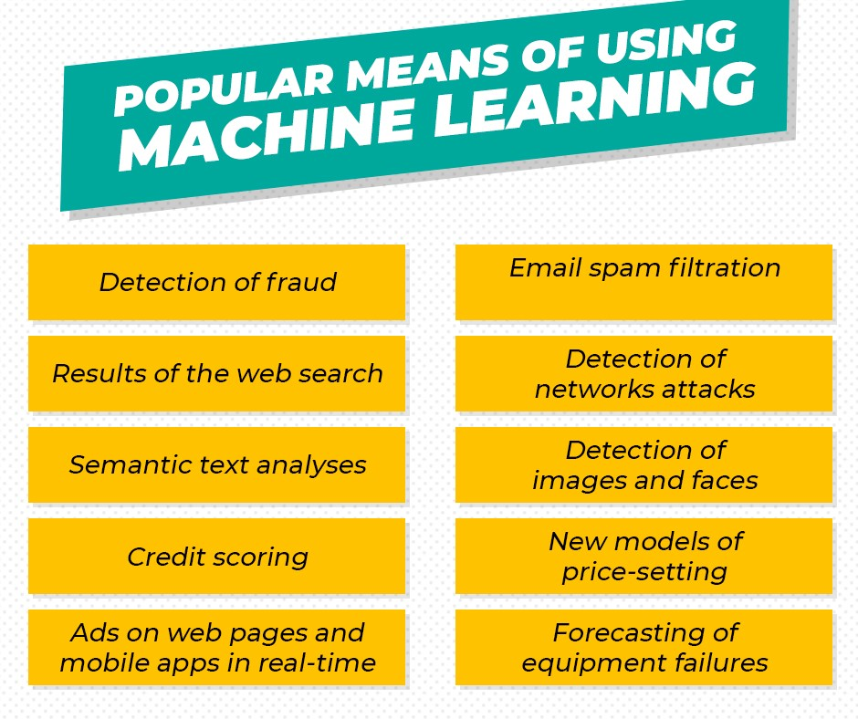

# 人工智能和机器学习。 有什么区别？

人工智能（AI）已经成为我们现代社会的重要组成部分。 据《福布斯》（Forbes）报道，两年前，即2017年，已有51％的现代企业实施了AI，该行业本身的估值为160亿美元。 据预测，这一指标将呈指数增长，到2025年将达到1900亿美元。

通常，术语“人工智能”和“机器学习”是非系统性的，并且被认为是可互换的，但实际上，它们之间存在差异。


人工智能已经成为一种通用术语，可以表示几件事，包括机器学习。 这使许多人将AI与独立思考联系在一起这一事实引起了一些困惑。 然而，从机器学习的定义来看，这是一个人可以执行的动作，并且需要一定程度的智慧。 也许这些动作不需要高水平的情报，但是它们属于AI的定义。

今天我们要谈谈这两个术语之间的区别！
# 一点理论
## 什么是人工智能？


人工智能（AI）-各种技术和科学解决方案及方法，可帮助创建类似于人类智能的程序。 人工智能包括许多工具，算法和系统，其中也包括数据科学和机器学习的所有组件。

如今，几乎所有使用数据的应用程序都使用了许多人工智能系统，例如管理软件，推荐算法，媒体分析甚至语音助手。 实际上，即使是简单的跟踪应用程序现在也可以使用AI。 如实践所示，如果有一个相当复杂的过程来完成必须定期执行而无需人工干预的任务，则很有可能包含AI。 通常，人工智能系统可以分为三类：
+ 有限的人工智能（窄人工智能）
+ 通用人工智能（AGI）
+ 超级智能人工智能。

人工智能功能在所有领域都得到了广泛的需求，特别是对于可以用于提供法律援助，专利检索，风险交流和医学研究的问答系统。 AI的其他用途如下：
+ 卫生保健
+ 零售
+ 运动
+ 行业

## 什么是机器学习？

机器学习是使用算法来分析数据，得出结论以及就某事进行决策或预测。 无需使用一组特殊的命令来手动创建程序来执行特定任务，而是使用大量数据来训练机器，并且

使它能够学习如何执行此任务的算法。 也就是说，机器可以找到复杂和多参数问题（人脑无法解决）的模式，从而找到更准确的答案。 结果，正确的预测。


因此，机器将使用大量数据和算法来“学习”机器，而不是使用用于执行特定任务的特定指令集进行手动编码的例行程序，从而学习如何完成任务。

机器学习直接源于AI实践，这些年来的算法方法包括学习决策树，归纳逻辑编程，聚类，增益训练和贝叶斯网络。

机器学习仅存在一个子集-深度学习，在其中创建算法并与机器学习类似地操作，但是这些算法有很多层次，每个层次对所传递的数据提供不同的解释。 这样的算法网络称为人工神经网络。 简单来说，它类似于人脑中存在的神经连接。

# AI和ML

在这里，我们准备了一个比较表，以显示这两个重要定义的鲜明特征：

# 总结一下

尽管人工智能和机器学习可以在许多常见应用中互换使用，但必须注意的是，机器学习具有一个非常鲜明的特征：适应性。 这意味着ML一直在学习。 与先前创建的AI不同，该系统可能会犯许多初始错误，但它旨在从中学习，从中构建错误，并最终使用所有这些错误来解决为其创建的任务。

有什么问题吗？ 期待回答！

我的LinkedIn：https://www.linkedin.com/in/dcherkasov/
```
(本文翻译自Denys Cherkasov的文章《Artificial Intelligence and Machine Learning. What is the difference?》，参考：https://medium.com/datadriveninvestor/artificial-intelligence-and-machine-learning-what-is-the-difference-cb571884f24e)
```
