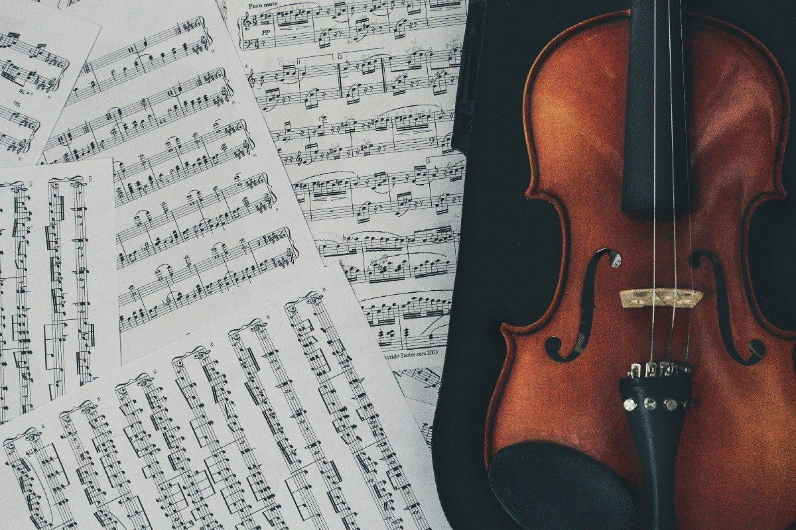
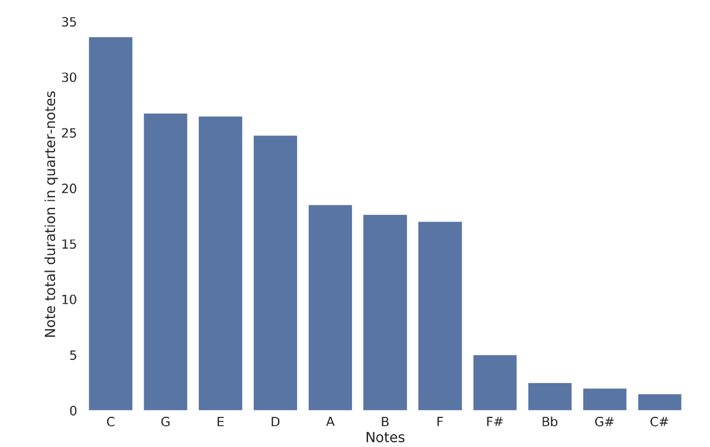
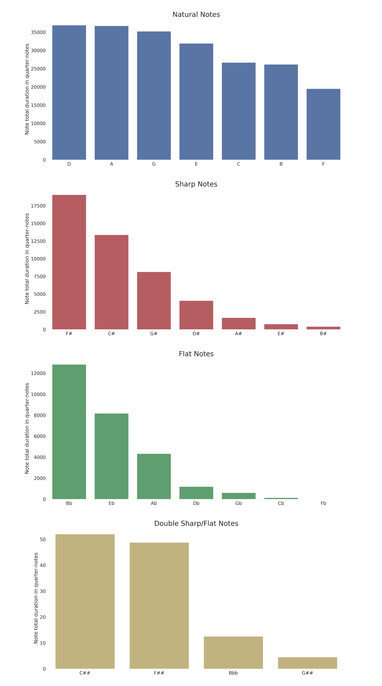
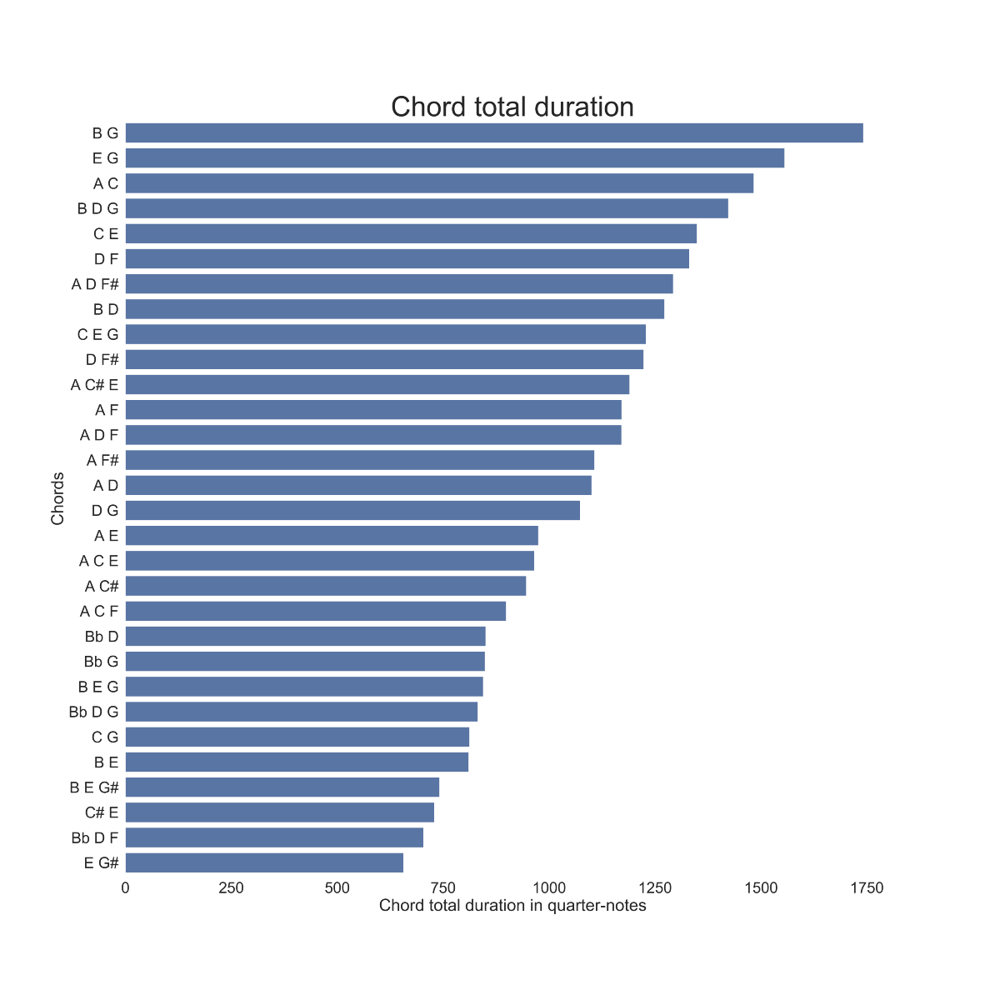
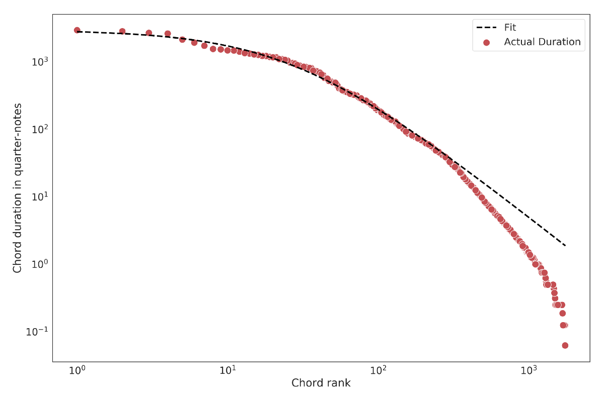
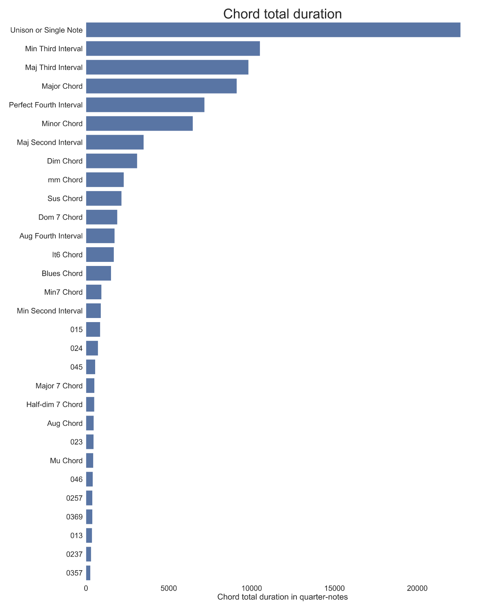
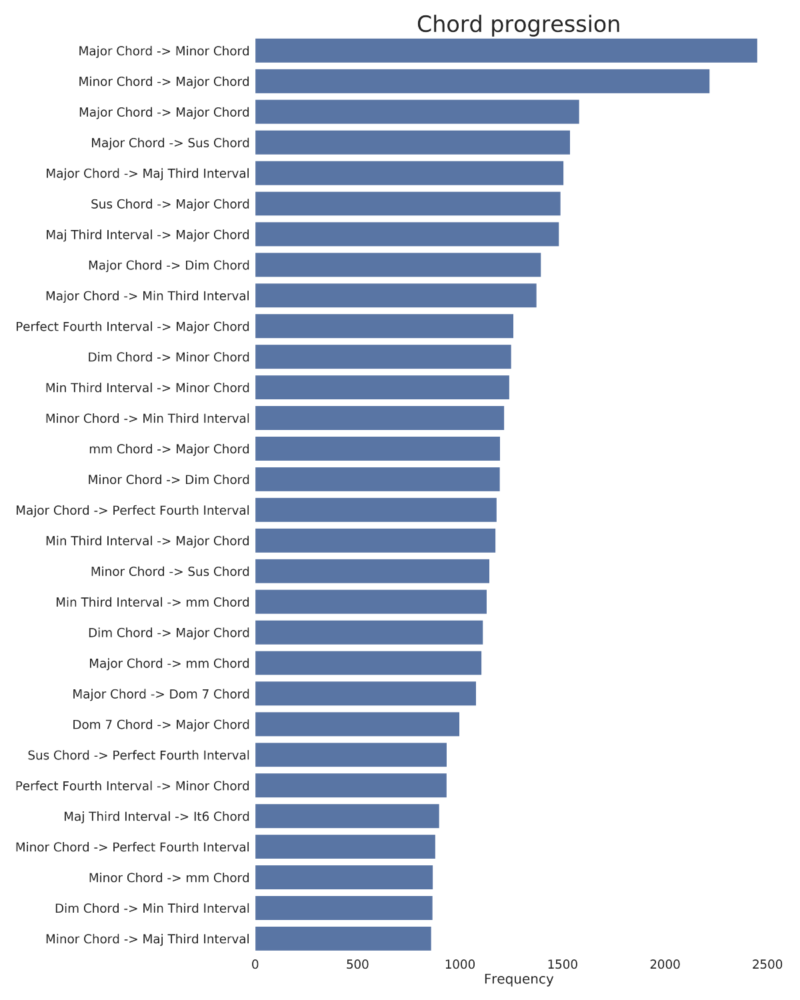
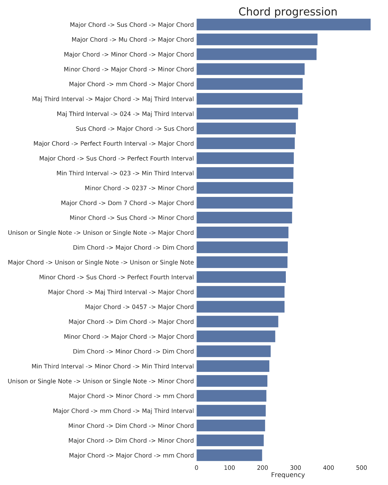

> Photo by Stefany Andrade on Unsplash

# 巴赫最喜欢的笔记

我一直很喜欢古典音乐。 小时候，我花了大约10年的时间学习音乐理论和拉小提琴。 当然，我最大的热情是科学和数据。 我一直试图找到结合两者的方法，以使用数据科学分析古典音乐。 我不想分析古典作品的声音，我想将分析的重点放在音乐理论上。 我想研究音乐作曲家如何创作音乐，而不是如何演奏。 本质上，我在寻找一种将乐谱转换为结构化数据的方法。

我选择巴赫音乐的原因有很多。 首先，巴赫被认为是音乐天才，也是古典音乐的最伟大的作曲家之一，因此他的音乐总是很有趣。 其次，巴赫创作了1000多首音乐作品，因此需要分析大量数据。 第三，巴赫的音乐是严格按照音调系统和对位规则编写的，这使音乐更加结构化，从和弦分析的角度更易于分析。 最后，我真的很喜欢巴赫的音乐，所以还有一些个人喜好。

在本文中，我不会讨论此分析背后的代码的技术细节，但如果有兴趣，读者可以在此处找到完整的代码。
# 数据

如上所述，我的第一个问题是获取可以让我分析音乐理论的数据。 诸如.wav，.aiff之类的音频文件或诸如.wma，.mp3之类的压缩音频文件不适合此类分析。 从整个管弦乐队的原始音频到特定的音符，和弦，音乐键等，要困难得多，我不知道如何在合理的时间内完成。

但是有一种格式可以用于我的分析。 .midi格式，用于控制电子或数字乐器。 使用.midi，可直接指定音符（音高）的播放，音符的持续时间以及正在播放音符的乐器（通道）。 此外，我有一种简单的方法可以将.midi文件转换为.csv文件（即结构化数据），此时，我可以像其他任何结构化数据一样以熟悉的方式对其进行分析。

我发现了Mutopia项目，该项目在公共领域中收集了大量古典音乐作品。 我在网站上刮了J.S. 巴赫 该网站上有417份巴赫作品，但有些文件有多个文件，因此文件总数为529个。我使用在这里找到的代码将所有.midi文件转换为.csv文件。 在拥有.csv文件之后，就可以开始分析了。 分析是用Python完成的，我的代码可以在这里找到。
# 计数音乐笔记

我想回答的关于音乐作品的第一个问题是使用哪些音符来创作音乐。 最常用的笔记是？ 最少使用哪个音符？ 音符的分布或多或少是均匀的，还是某些音符比其他音符使用更多？

计算一个音符的发生，换句话说，出现一个新音符的事件可以给我们这样的分布。 另一方面，某些音符可能会持续一个完整的小节，而另一些音符在快速通过时只会显示为十六分音符。 我认为，音符的持续时间应作为分配中的权重，以便较长的音符比持续时间较短的音符更有价值。

在.midi文件中，乐器在特定时间内播放一个或多个音符。 便笺开始播放的时间和便笺停止播放的时间被记录下来。 这给了我们音符的持续时间，以时钟滴答为单位。 可以使用文件中还包含的转换因子（四分音符中的多少滴答声）将其转换为常规音符持续时间。 因此，我们可以提取传统音乐符号中音符的持续时间，即四分音符，八分音符等。

将音符在音乐作品中演奏的所有时间的持续时间相加，将得出该音符的总持续时间。 我们可以为每个音符执行此操作，因此最后，我们可以比较所有音符的总持续时间，以查看演奏得最多的音符。

举例来说，我们来看巴赫C大调的发明1（BWV 772）。 乐谱可以在这里找到。 我们可以看到该乐曲是用C大调编写的，没有尖锐或平坦，因此自然音符的持续时间都更长。 另外，按键的补品C是最常用的音符，如预期的那样，第五（G）和第三（E）分别位于第二和第三位。 即使乐曲只有22小节长，也可以对G大调，A小调，F大调进行调音，这是B调，F尖和C尖的来源。


这可以扩展到我们数据集中所有巴赫的作品。 将每段音符的值相加，得到所有音符持续时间的总和。 结果如下图所示。 音符D是巴赫（Bach）最常用的音符，其使用率比第二高的A稍高，其次是自然音符。


在图形中，我们分别绘制自然音符，平坦和锐利度。 这样做是为了证明惊人的发现。 自然音符当然显示出一定的可变性，演奏最多的音符（D）的持续时间几乎是演奏最少的音符（F）的两倍。 但是，该分布类似于均匀分布。 另一方面，尖音的持续时间变化很大，演奏最多的音符（F尖音）的持续时间比演奏最少的音符（B尖音）高46.5倍。 公寓也一样。

但是，更有趣的是，从第一笔到最后笔尖的顺序与关键签名符号中的笔尖顺序完全匹配：F♯，C♯，G♯，D♯，A♯，E♯，B♯。 单位顺序以相同的方式与关键签名符号中的单位顺序完全匹配：B♭，E♭，A♭，D♭，G♭，C♭，F♭。 最后，双尖和扁平音符的持续时间比自然音符的持续时间短数百倍。

从头到尾的锋利顺序与关键签名符号中的锋利顺序完全匹配
# 和弦计数

到目前为止，我们一直在数单个注释。 但是在音乐中，几个音符可以同时发声，形成和弦。 如果各种乐器或声音同时演奏不同的音符，或者同一乐器同时演奏多个音符，则会发生这种情况。

在这里，我们将定义一个和弦为一起演奏的任意数量的音符。 因此，三个音符一起演奏，例如。 C，E，G是和弦，但只有两个音符一起演奏（E，G），甚至一个音符本身（E）也被视为和弦。 同样，我们会将不同八度音阶的音符视为同一音符，并且仅在和弦中计数一次。 例如，如果C4，E4，C5和E5一起发音，我们将其视为（C，E）和弦。 此外，和弦内音符的顺序无关紧要。 例如，和弦C4，E4，G4将被视为与E3，G3，C4相同。 更正式地说，我们对和弦的定义是音乐理论中对和弦的定义。

我们希望将用于音符的相同方法应用于和弦。 但是，如何测量和弦的持续时间呢？ 为此，我们将乐段拆分为最小的节奏值，即64分音符。 对于每个第六十四音符间隔，我们收集在该间隔演奏的所有音符并形成和弦。 我们对每个和弦的第64个音符间隔的所有实例求和，从而得出了每个和弦在64个音符中的总持续时间。 最后，我们将持续时间转换为四分音符。

可以用数千种方法将音符组合在一起以形成和弦，但大多数方法在实际使用中非常不协调。 另外，许多乐曲只为一种乐器演奏，例如小提琴，大提琴或琵琶，因此它们的总谱通常仅为单音符，而没有和弦出现。 这会使数据偏向单个音符。 因此，这里我们仅显示带有2个或更多音符的和弦。 尽管如此，巴赫作品中仍然使用了成千上万种音符组合，即使其中一些仅使用了一次或仅用了很少的时间。 在下图中，我们显示了巴赫作品中30个最常用的和弦。


我们注意到间隔（B，G）居首位，其次是间隔（E，G）和（A，C）。 第一个完整的和弦，即具有补音，第三和第五音符的和声三和音，是（B，D，G）或G大调，出现在第四位。 紧随其后的谐波三和弦是D大调，C大调，A大调，D小调和A小调。
## 和弦排名

如前所述，我们在巴赫的作品中发现了成千上万个音符组合，但是其中大多数很少使用，而其他则一直使用。 这类似于自然语言中单词的使用。 Zipf的定律描述了这种对数据进行排名的行为。 具体来说，Zipf–Mandelbrot定律是Zipf定律的扩展，描述了排名数据的分布。 我们以Zipf–Mandelbrot定律的形式拟合函数，并获得了相对良好的拟合。 我们应该强调的是，与最后一张图不同，此图包括单音符和弦。


胡安·伊格纳西奥·佩罗蒂（Juan Ignacio Perotti）和奥兰多·维托·比洛尼（Orlando Vito Billoni）发表了一篇论文，他们在描述Zipf定律应用于音乐作品中的音符和和弦时的类似发现。
## 和弦类型

另一个有趣的发现是，第一位置的所有和弦均为大和弦或小和弦。 我们想进一步探讨这个想法，并确定巴赫所使用的所有和弦类型。 为此，我们需要将和弦从音符的常规和弦转换为音高类集。 音高等级组是一组数字，表示和弦与第一音高之间的相对差，给定数字0。该差以半音为单位。 例如，一个大三和弦对应于集合（0,4,7），因为第一和第二个音符相隔4个半音（一个大三度），而第一和第三个音符相隔7个半音（一个完美 第五）。

这样，由于所有主要和弦都对应于同一组，因此我们可以将和弦的类型分组在一起。 同样，所有次和弦都对应于组（0,3,7）。 其他常见的集合也具有传统名称，例如，集合（0,2,7）称为悬吊和弦，而集合（0,1,4,7）称为减大七和弦。

一组音符通常对应于多个音高类集。 例如，根据音符的顺序，组（C，E，G）可以对应于组（0,4,7），也可以对应于组（0,3,8）。 我们总是采用集合中最紧凑的形式（即，第一个音高和最后一个音高之间的距离最小的形式）作为音高类集。 此外，可能会有多个最紧凑的集合。 在这种情况下，我们选择按空头顺序排列的第一个集合。 例如，在集合（0,1,5）和（0,4,5）之间，我们选择第一个。

我们在下图中显示结果。 只要有可能，我们都会用传统的和弦名称代替数字集。


马上，我们注意到所有第一位置对应于众所周知的音程和和弦。 在这里，我们使用现代术语识别了主要的第七和弦，悬浮和弦以及其他类型。 当然，在巴洛克音乐中，作曲家没有这样考虑。 除大，小，减和增和弦外，其余情况是一种声音在将其他声音加入辅音和弦之前演奏带有“非和弦”音符的旋律。

此外，我们注意到单音符和两音符间隔比全和弦更常见。 同样，这是因为几首作品是针对独奏乐器的，因此它们包含了更多的单音符。 另一个有趣的发现是，大和弦的使用量几乎是小和弦的1.5倍。
# 和弦进行

我们现在正在移到和弦的进程。 从音乐理论的角度来看，一个音乐作品可以看作是一系列的和弦，一个接一个。 这称为和弦进行，是音乐理论中的主要主题。 我们需要澄清的是，巴洛克时代的作曲家没有想到和弦的发展，这是一种现代的解释。 尽管如此，从现代音乐理论的角度来看巴赫作品中的和弦进行过程还是很有趣的。

这次，和弦的持续时间并不重要。 我们只关心接下来的和弦。 如我们之前所见，我们将和弦转换为音高类集。 对于每首乐曲，我们创建一个列表，按和弦顺序排列，从演奏的第一个和弦到最后一个和弦。 然后，我们将和弦按两个或多个和弦的顺序分组。 此过程等效于一段文本的n-gram，其中和弦可被视为文本的单词，而乐曲可被视为文档。 实际上，在代码中，我们使用了与自然语言处理完全相同的方法。

此时，我们将搜索范围限制在至少带有一个三重音符的和弦进行中。 这样做是因为，正如我们之前所注意到的，数据偏向于单音符和双音符和弦，但是为了更好地理解音乐作品的和谐性，我们需要研究完整的和弦。 如果我们不使用此限制，则所有首位都是单音和两音进度。 在下图中，我们显示了前30个两弦序列（二元图）。


我们注意到，巴赫通常从大和弦移至小和弦，然后又回到大和弦，或从一个大和弦移至另一和弦。 我们还注意到悬挂和弦的使用。 对位常用的技术是将音符从上一个和弦移到下一个和弦，最后将其分解为第三和弦。 我们可以将所有不谐和弦（至少按照巴洛克标准）进行归纳，例如悬挂和弦，第七和弦等。我们可以看到，这些和弦始终可以分解为辅音和弦（例如大和弦或小和弦）。

接下来，我们绘制三弦序列（三元组）。 这次，我们注意到进度变得更加具体。 我们不太可能找到三个和弦的特定顺序。 例如，进度（主要->次要->主要）不同于（次要->主要->次要）。 即使很明显，在这两个进程中，我们都只是从大和弦移至小和弦，然后我们仍可以对进程的顺序进行若干排列，所有这些导致不同的进程。 如果我们将其扩展到更长的序列（n克），则进程将变得更加具体且频率更低。 因此，我们在这里停止分析。 也许稍后，我们可以尝试对排列进行分组，以获得长序列更有趣的结果。

# 结论

在本文中，我试图分析J.S. 巴赫使用数据科学方法。 这些发现与巴赫创作音乐的音乐时期的历史知识相结合，从音乐理论的角度来看与众所周知的事实相吻合。

首先，巴赫（Bach）使用的音符的频率几乎完美地契合了良好的调音和常用音调。巴赫在展示调音的可能性方面发挥了重要作用，后来这种调音在所有西方音乐中使用的标准均等气质系统中得到了发展。此外，巴赫使用的和弦（主要是大和小和弦以及这些和弦的相关音程）与巴洛克音乐形式一致。更复杂的和弦，例如第七和弦，被认为是不和谐的，在巴洛克时代被避免。在巴赫的作品中，当一种声音在大和弦或小和弦上演奏旋律时，这种不和谐的和弦通常会发生。段落的音符和主和弦可能会给出更不和谐的和弦，但是在巴赫时代，这甚至都不会被视为和弦。最后，和弦进行分析与通常的和弦进行一致。我们观察到，最常见的音阶是从大和弦向后移，甚至偶尔会通过附加一些音符来维持大和弦。我们还注意到，大多数不和谐的和弦会立即分解为大和弦。

只要有足够的数据，这种分析就可以扩展到古典时期任何其他作曲家的作品，甚至可以扩展到同一时期几位作曲家的作品集。 也可以探索其他想法，例如将作品分组以显示有趣的图案，或使用这种分析来确定音乐作品的作曲家。

可以在此处找到此分析的完整代码。
```
(本文翻译自Dimitris Manolidis的文章《Bach’s favorite note》，参考：https://towardsdatascience.com/bachs-favorite-note-b0542ba4f8f5)
```
