# 结论

这些是Jupyter笔记本电脑的一些功能，我发现它们很有用，值得分享。 其中一些对您来说很明显，而另一些则是新的。 因此，继续进行试验。 希望他们能够为您节省一些时间，并为您提供更好的UI体验。 也可以随时在评论中建议其他有用的功能。
# 6.嵌入URL，PDF和Youtube视频

显示在那里！

当您使用IPython的显示模块将URL，pdf和视频轻松地嵌入Jupyter笔记本时，为什么只使用链接。
## 网址
```
#Note that http urls will not be displayed. Only https are allowed inside the Iframefrom IPython.display import IFrameIFrame('https://en.wikipedia.org/wiki/HTTPS', width=800, height=450)
```
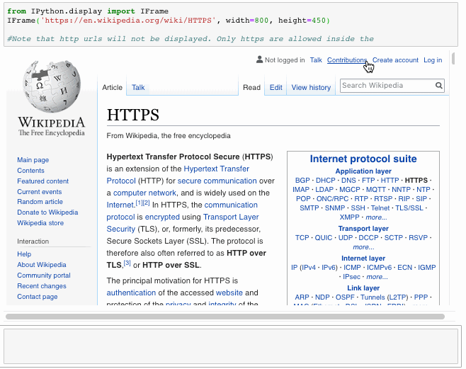
## PDF文件
```
from IPython.display import IFrameIFrame('https://arxiv.org/pdf/1406.2661.pdf', width=800, height=450)
```
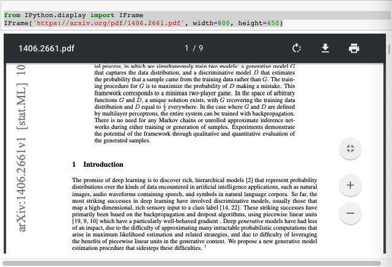
## YouTube视频
```
from IPython.display import YouTubeVideoYouTubeVideo('mJeNghZXtMo', width=800, height=300)
```

# 6.幻灯片放映

交流时代码很棒。

笔记本是教授和编写可解释代码的有效工具。 但是，当我们要展示我们的作品时，我们会显示整个笔记本（带有所有代码），或者我们会使用Powerpoint。 不再。 Jupyter笔记本可以轻松转换为幻灯片，我们可以轻松地选择从笔记本中显示或隐藏内容。

有两种方法可以将笔记本转换为幻灯片：
## 1. Jupyter Notebook的内置幻灯片选项

打开一个新笔记本，然后导航到“视图”→“单元格工具栏”→“幻灯片放映”。 浅灰色的条形出现在每个单元格的顶部，您可以自定义幻灯片。
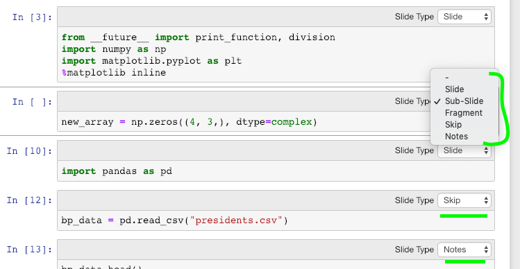

现在转到笔记本所在的目录并输入以下代码：
```
jupyter nbconvert *.ipynb --to slides --post serve# insert your notebook name instead of *.ipynb
```

幻灯片显示在端口8000处。此外，目录中还将生成一个.html文件，您也可以从该目录访问幻灯片。
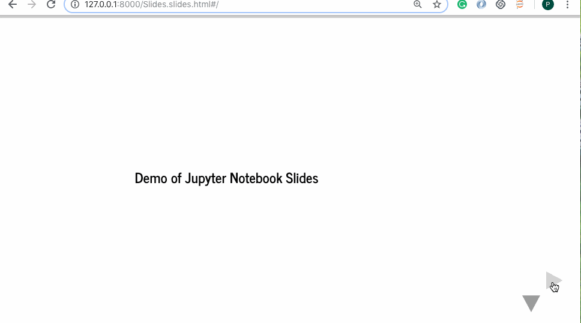

在主题背景下，这看起来会更加优雅。 让我们将主题“ onedork”应用于笔记本，然后将其转换为幻灯片。
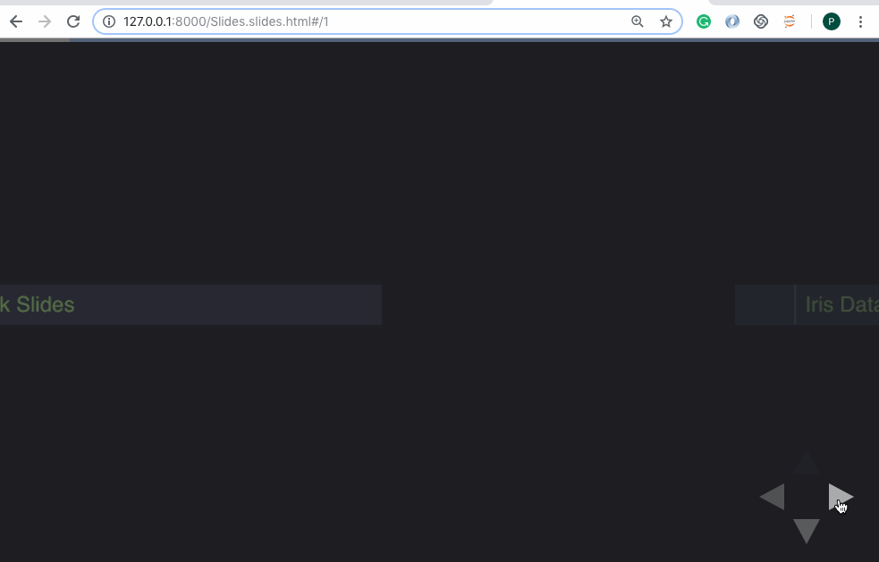

这些幻灯片有一个缺点，即您可以看到代码但不能对其进行编辑。 RISE插件提供了解决方案。
## 2.使用RISE插件

RISE是Reveal.js（Jupyter / IPython幻灯片扩展）的首字母缩写。 它利用了Reveal.js来运行幻灯片。 这非常有用，因为它还提供了无需退出幻灯片即可运行代码的功能。

安装

1-使用conda（推荐）：
```
conda install -c damianavila82 rise
```

2-使用点子（不建议使用）：
```
pip install RISE
```

然后再执行两个步骤，在适当的位置安装JS和CSS：
```
jupyter-nbextension install rise --py --sys-prefix#enable the nbextension:jupyter-nbextension enable rise --py --sys-prefix
```

现在让我们使用RISE进行交互式幻灯片演示。 我们将重新打开我们之前创建的Jupyter Notebook。 现在，我们注意到一个新的扩展名为“ Enter / Exit RISE Slideshow”。
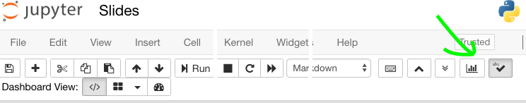

单击它，就可以了。 欢迎来到互动幻灯片的世界。
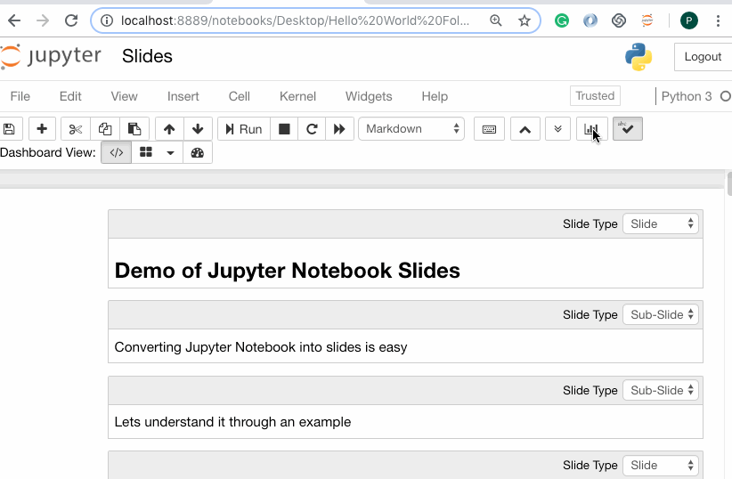

有关更多信息，请参考文档。
# 5. Qgrid

使数据框架直观

Qgrid还是Jupyter笔记本小部件，但主要侧重于数据帧。 它使用SlickGrid在Jupyter笔记本中渲染熊猫DataFrame。 这使您可以使用直观的滚动，排序和过滤控件来浏览DataFrame，以及通过双击单元格来编辑DataFrame。 Github存储库包含更多详细信息和示例。
# 安装

用pip安装：
```
pip install qgridjupyter nbextension enable --py --sys-prefix qgrid# only required if you have not enabled the ipywidgets nbextension yetjupyter nbextension enable --py --sys-prefix widgetsnbextension
```

使用conda安装：
```
# only required if you have not added conda-forge to your channels yetconda config --add channels conda-forgeconda install qgrid
```
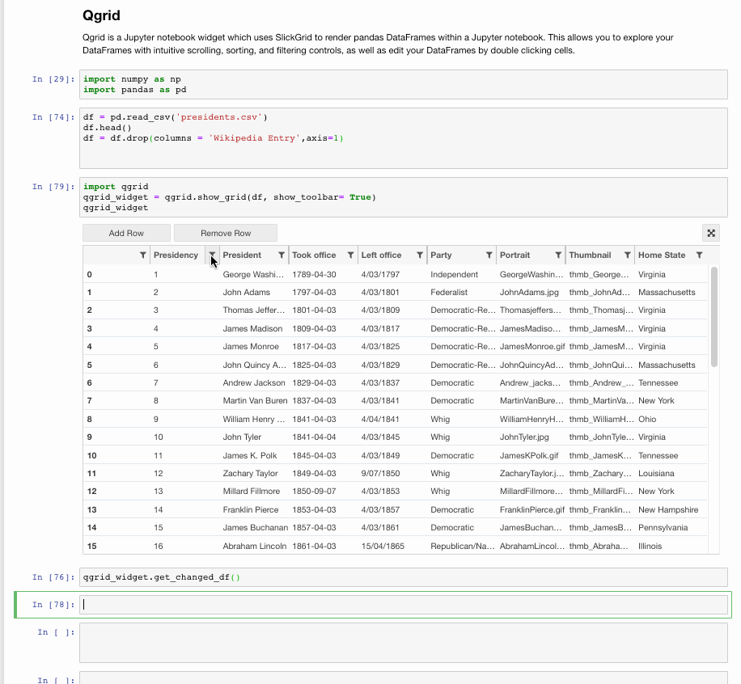
# 4. Jupyter小部件

使笔记本互动

小部件是事件性的python对象，在浏览器中具有表示形式，通常作为控件（如滑块，文本框等）使用。小部件可用于构建笔记本的交互式GUI。
## 安装
```
# pippip install ipywidgetsjupyter nbextension enable --py widgetsnbextension# Condaconda install -c conda-forge ipywidgets#Installing ipywidgets with conda automatically enables the extension
```

让我们看一些小部件。 有关完整的详细信息，您可以访问其Github存储库。

相互作用

交互功能（ipywidgets.interact）自动创建用于交互浏览代码和数据的用户界面（UI）控件。 这是开始使用IPython小部件的最简单方法。
```
# Start with some imports!from ipywidgets import interactimport ipywidgets as widgets
```
## 1.基本小部件
```
def f(x):    return x# Generate a slider interact(f, x=10,);
```
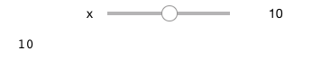
```
# Booleans generate check-boxesinteract(f, x=True);
```
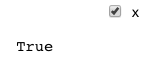
```
# Strings generate text areasinteract(f, x='Hi there!');
```

## 2.高级小部件

这是一些有用的高级小部件的列表。
## 播放小工具

“播放”小部件可用于通过以一定速度迭代整数序列来执行动画。 下面滑块的值链接到播放器。
```
play = widgets.Play(    # interval=10,    value=50,    min=0,    max=100,    step=1,    description="Press play",    disabled=False)slider = widgets.IntSlider()widgets.jslink((play, 'value'), (slider, 'value'))widgets.HBox([play, slider])
```

## 日期选择器

日期选择器小部件可在Chrome和IE Edge中使用，但当前在Firefox或Safari中不可用，因为它们不支持HTML日期输入字段。
```
widgets.DatePicker(    description='Pick a Date',    disabled=False)
```
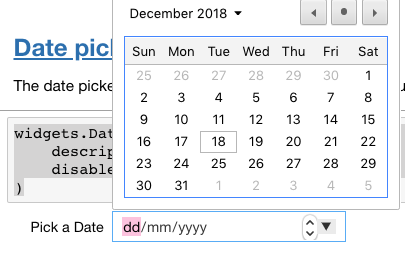
## 颜色选择器
```
widgets.ColorPicker(    concise=False,    description='Pick a color',    value='blue',    disabled=False)
```
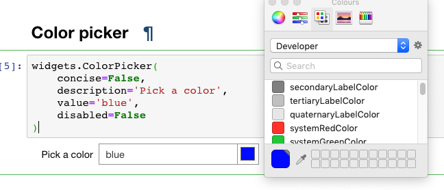
## 标签
```
tab_contents = ['P0', 'P1', 'P2', 'P3', 'P4']children = [widgets.Text(description=name) for name in tab_contents]tab = widgets.Tab()tab.children = childrenfor i in range(len(children)):    tab.set_title(i, str(i))tab
```
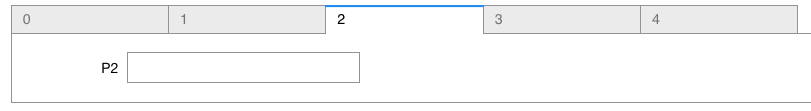
# 3.笔记本扩展

扩展可能性

笔记本扩展可以让您超越使用Jupyter笔记本的常规方式。 笔记本扩展名（或nbextensions）是JavaScript模块，您可以在笔记本前端的大多数视图中加载这些模块。 这些扩展修改了用户体验和界面。
## 安装

使用conda安装：
```
conda install -c conda-forge jupyter_nbextensions_configurator
```

或使用点子：
```
pip install jupyter_contrib_nbextensions && jupyter contrib nbextension install#incase you get permission errors on MacOS,pip install jupyter_contrib_nbextensions && jupyter contrib nbextension install --user
```

立即启动Jupyter笔记本，您应该能够看到带有很多选项的NBextensions选项卡。 单击您想要的，然后看到魔术发生了。
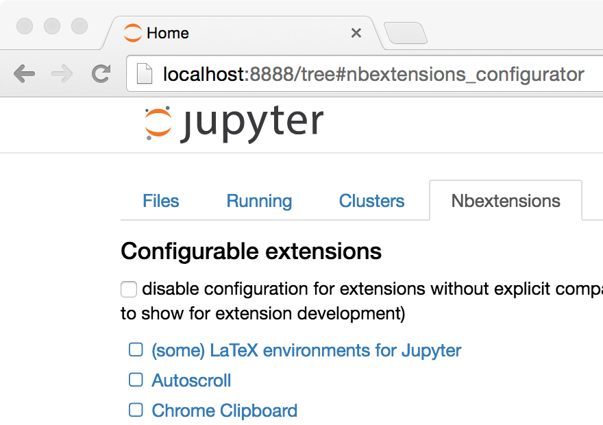

如果您找不到该标签，则可以在menuEdit下找到第二个小的nbextension。
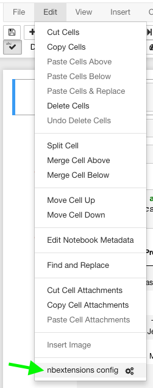

让我们讨论一些有用的扩展。
## 1.腹地

Hinterland为代码单元中的每个按键启用代码自动完成菜单，而不仅仅是使用选项卡调用它。 这使得Jupyter笔记本的自动完成功能像其他流行的IDE（例如PyCharm）一样。
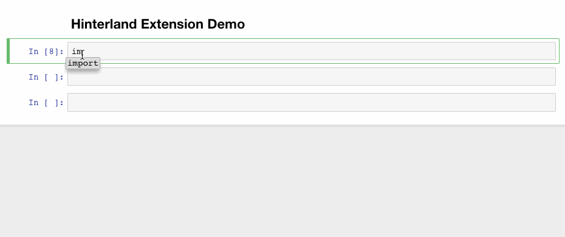
## 2.片段

此扩展程序在笔记本工具栏上添加了一个下拉菜单，该菜单可轻松将代码片段单元格插入当前笔记本。
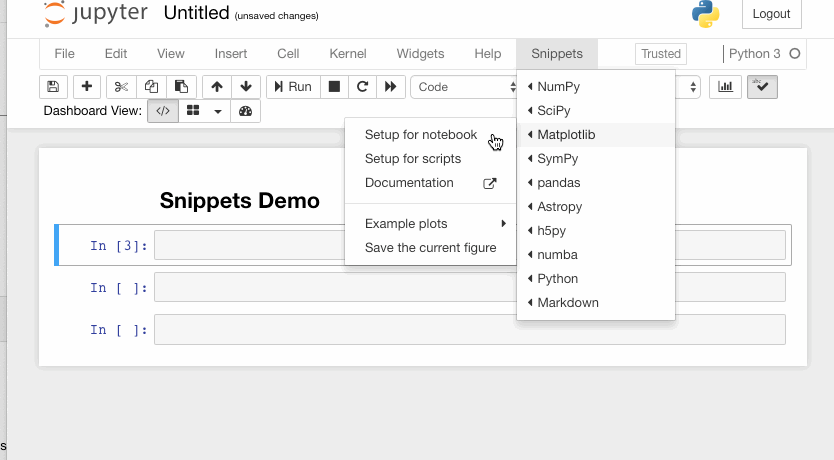
## 3.分裂细胞笔记本

此扩展程序拆分笔记本的单元格，然后彼此相邻放置。
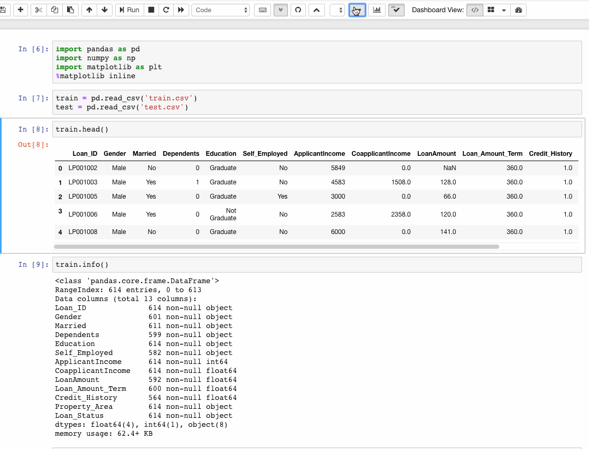
## undefined

通过此扩展程序，可以收集所有正在运行的标头，并将其显示在浮动窗口中，作为侧边栏或带有导航菜单。 该扩展名也可拖动，调整大小，可折叠和停靠。
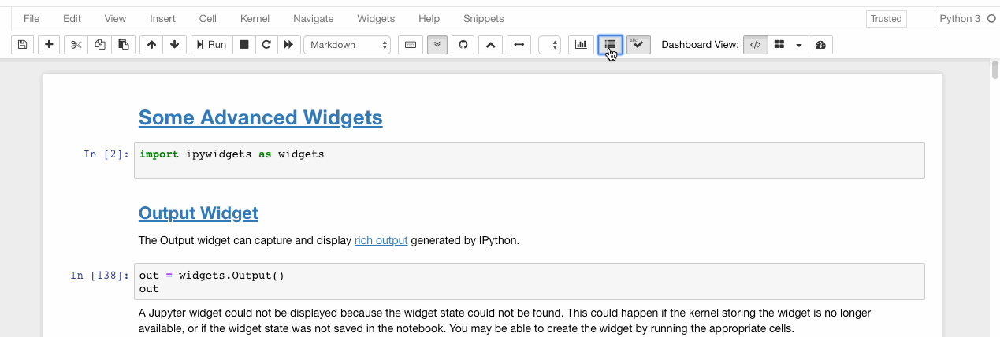
## 5.可折叠的标题

可折叠的标题允许笔记本计算机具有可折叠的部分，各标题之间分开。 因此，如果您的笔记本中有很多脏代码，则可以将其折叠起来以避免重复滚动。
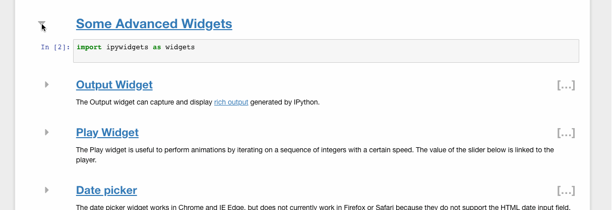
## 6. Autopep8

Autopep8只需单击一下，即可帮助重新格式化/修饰代码单元的内容。 如果您厌倦了一次又一次地按空格键来格式化代码的格式，则autopep8是您的救星。
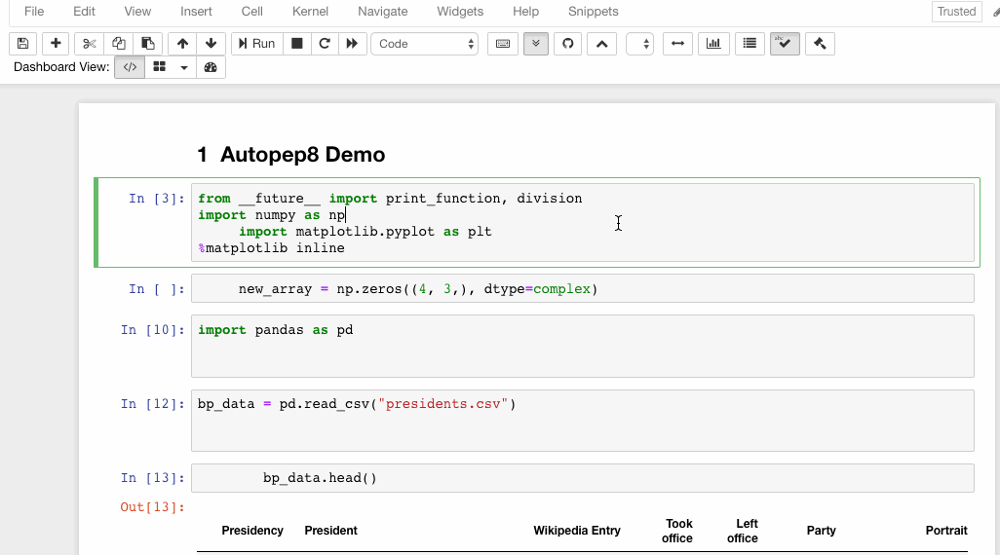
# 2. Jupyter主题

主题化您的Jupyter笔记本！

如果您是一个盯着Jupyter笔记本的白色背景而感到无聊的人，那么主题就是给您的。 主题还增强了代码的呈现方式。 您可以在此处找到有关Jupyter主题的更多信息。 让我们开始工作。

安装
```
pip install jupyterthemes
```

可用主题列表
```
jt -l
```

目前，可用的主题是chesterish，3级，gruvboxd，gruvboxl monokai，oceans16，onedork，solarized，solarizedl。
```
# selecting a particular themejt -t <name of the theme># reverting to original Themejt -r
```
+ 每次更改主题时，都必须重新加载jupyter笔记本，才能看到效果。
+ 也可以在Jupyter Notebook中运行相同的命令，方法是在命令前放置“！”。
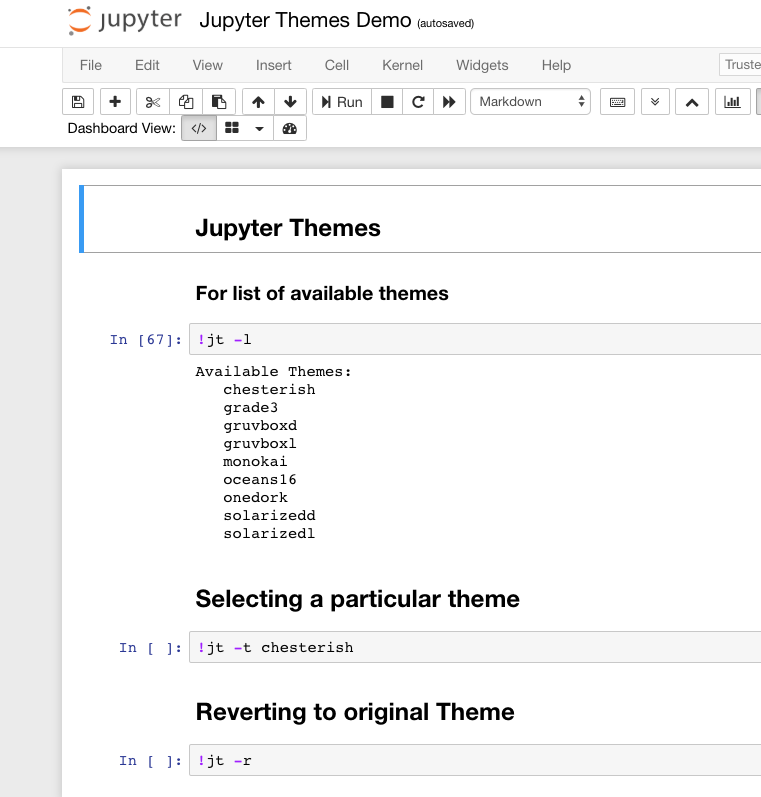
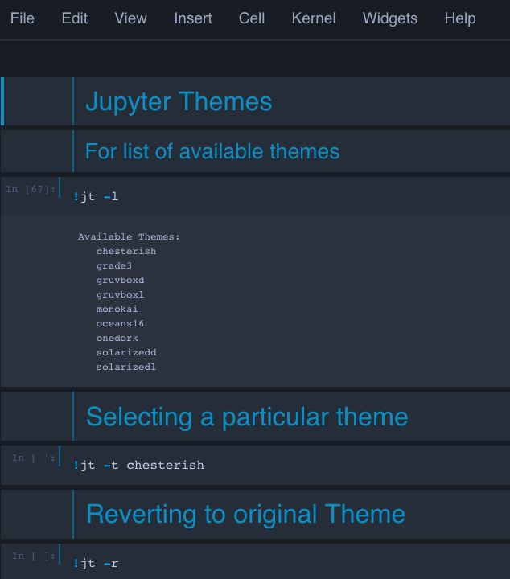
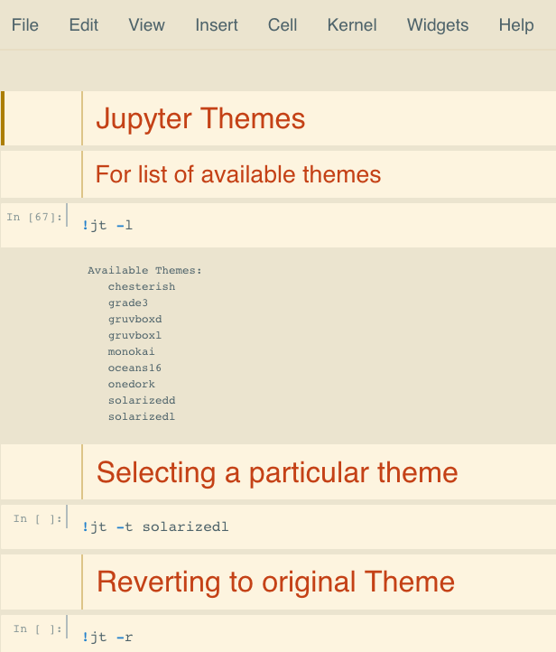
> Left: original | Middle: Chesterish Theme | Right: solarizedl theme

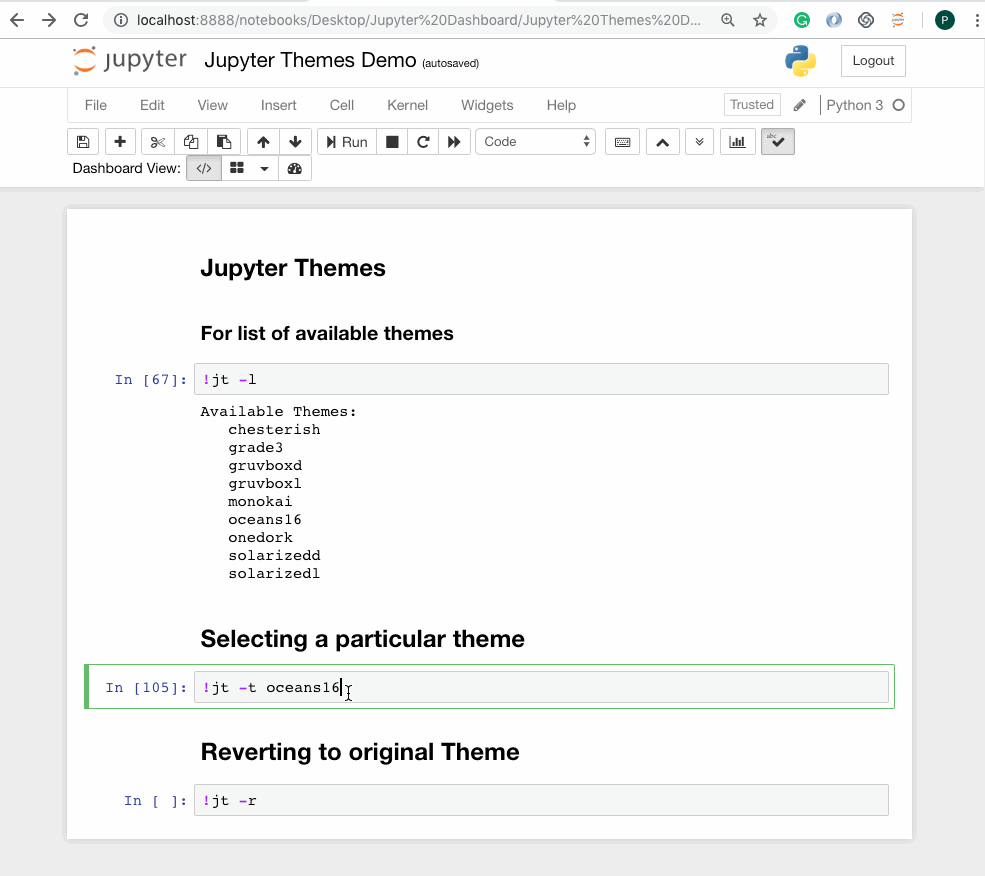
# 1.执行Shell命令

笔记本是新外壳

外壳程序是与计算机进行文本交互的一种方式。 最受欢迎的Unix shell是Bash（Bourne Again SHell）。 Bash是Unix的大多数现代实现以及大多数为Windows提供类Unix工具的软件包中的默认Shell。

现在，当我们使用任何Python解释器时，我们需要定期在shell和IDLE之间切换，以防需要使用命令行工具。 但是，Jupyter Notebook通过在命令之前放置一个额外的！，使我们可以轻松地从笔记本中执行Shell命令。 在命令行中可以使用的任何命令都可以在IPython中使用，只要在命令前面加上！就可以了。 字符。
```
In [1]: !lsexample.jpeg list tmpIn [2]: !pwd/home/Parul/Desktop/Hello World Folder'In [3]: !echo "Hello World"Hello World
```

我们甚至可以按如下方式将值传递到外壳和从外壳传递：
```
In [4]: files= !lsIn [5]: print(files)['example.jpeg', 'list', 'tmp']In [6]: directory = !pwdIn [7]: print(directory)['/Users/Parul/Desktop/Hello World Folder']In [8]: type(directory)IPython.utils.text.SList
```

注意，返回结果的数据类型不是列表。
# 目录
+ 执行Shell命令
+ Jupyter主题
+ 笔记本扩展
+ Jupyter小部件
+ Qgrid
+ 幻灯片放映
+ 嵌入URL，PDF和Youtube视频
# 充分利用Jupyter笔记本电脑的数据科学优势
## 这些提示和技巧可提高Jupyter Notebook的生产力。

> Photo by Aaron Burden on Unsplash


重新想象Jupyter笔记本可以是什么以及可以用它做什么。

Netflix旨在向其1.3亿观众提供个性化内容。 Netflix的数据科学家和工程师与数据进行交互的一种重要方式是通过Jupyter笔记本。 笔记本利用协作，可扩展，可扩展和可再现的数据科学的使用。 对于我们许多人来说，Jupyter Notebooks是进行快速原型设计和探索性分析时的事实平台。 但是，这不只是眼球。 Jupyter的许多功能有时会隐藏在后台，并且没有得到充分的探索。 让我们尝试探索Jupyter Notebook的功能，这些功能可以在与他们合作时提高我们的生产力。
```
(本文翻译自Parul Pandey的文章《Bringing the best out of Jupyter Notebooks for Data Science》，参考：https://towardsdatascience.com/bringing-the-best-out-of-jupyter-notebooks-for-data-science-f0871519ca29)
```
