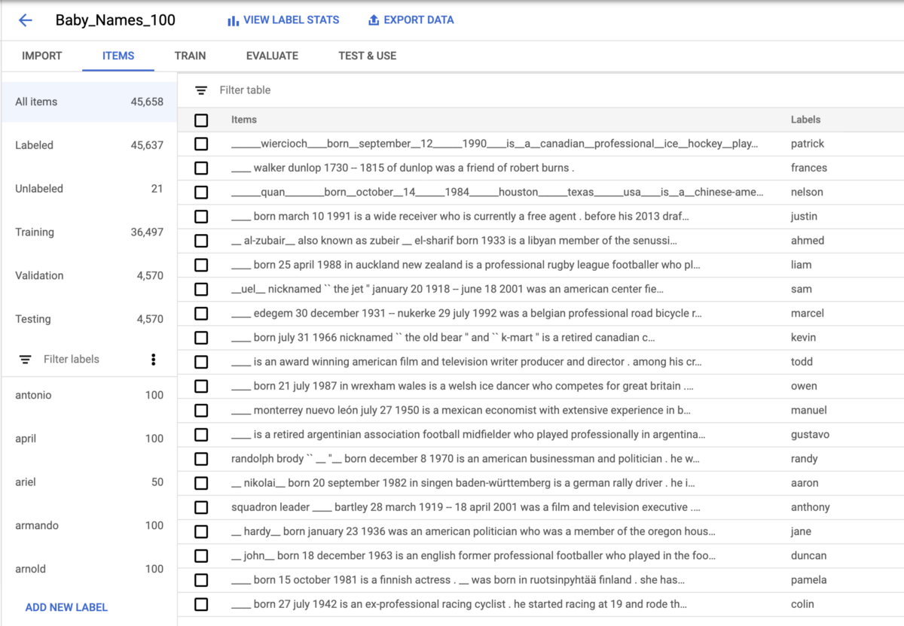
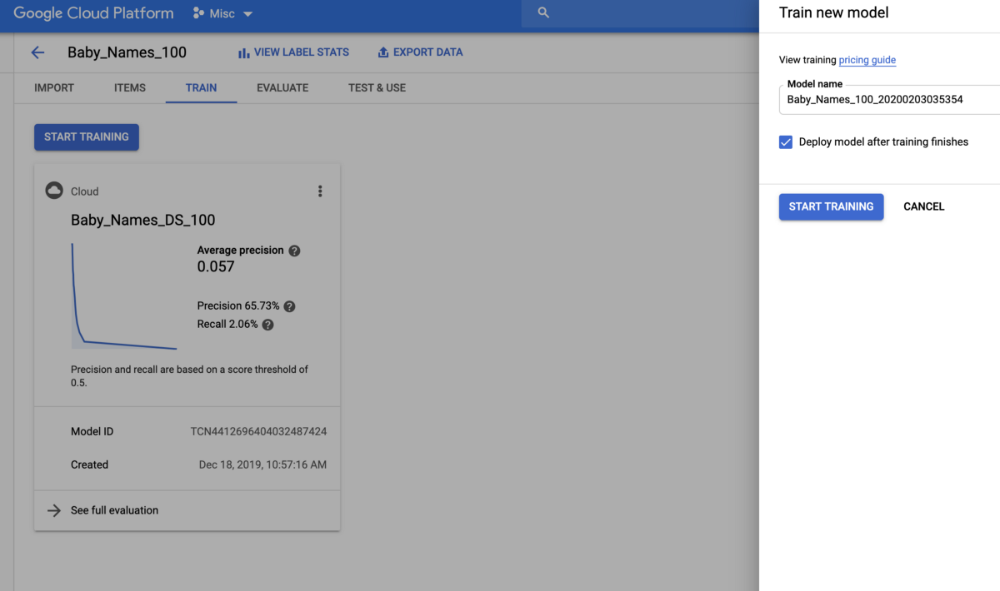
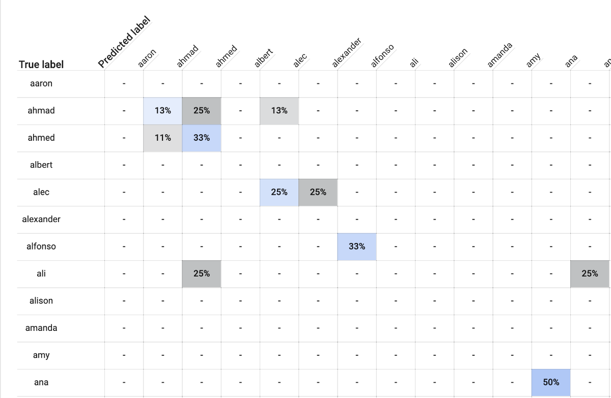

+ 可能没有，这和星座一样科学。 但是，仍然值得考虑！

# 构建一个由深度学习驱动的（婴儿）名称生成器
## 维基百科的传记和深度神经网络可以告诉我们什么名称？

小时候，我总是讨厌被称为戴尔。 这主要是因为我对Dales外观的最初印象是由Hill of the Hill的Dale Gribble和NASCAR司机Dale Earnhardt Jr.塑造的。

> Dale Gribble image credit , Dale Earnhardt Jr image credit


这些戴尔都不符合我的理想自我形象。 相反，我想被称为美少女战士。

我不喜欢我的名字是“雌雄同体”-每一位女戴尔出生14头男性戴尔。 当我问我的父母时，他们的理由是：

答：雌雄同体的女性可能会更成功。

B.他们的时髦朋友刚刚给女儿起名叫戴尔，那真是太可爱了！

值得赞扬的是，作为成年人，我确实感到自己从简历，Github，电子邮件签名乃至Medium上装扮成一个男人（或不完全否认），从中受益。

但是撇开性别歧视，如果名义决定论确实存在某些东西-人们倾向于从事与自己名字相称的工作或生活方式的想法呢？¹如果您的名字确实对您的生活产生了影响，那么它必须承担的责任是什么？ 为整个人类选择一个名字。 我不想将这种责任留给品味，机会或趋势。 当然不是，我将转向深度学习（du！）。

undefined

我的孩子将在新泽西州出生。 她将成长为Google的软件开发人员，喜欢骑自行车和喝咖啡。

给定一个生物，模型将返回一组名称，并按概率排序：
```
Name: linda Score: 0.04895663261413574Name: kathleen Score: 0.0423438735306263Name: suzanne Score: 0.03537878766655922Name: catherine Score: 0.030525485053658485...
```

因此，从理论上讲，我本应该是琳达，但在这一点上，我真的很喜欢戴尔。

如果您想亲自尝试该模型，请在此处查看。 现在，您绝对不应该在这些预测中投入太多精力，因为 他们有偏见，并且b。 它们像星座一样科学。 但是，尽管如此-由AI命名第一个婴儿会不会很酷？
# 数据集

尽管我想创建一个名称生成器，但我最终构建的实际上是一个名称预测器。 我想我会找到很多人（传记）的描述，屏蔽他们的名字，并建立一个模型来预测那些（屏蔽）的名字。

幸运的是，我在David Grangier的Github仓库wikipedia-biography-dataset中找到了这种数据集。 数据集包含来自Wikipedia的728,321份传记的第一段以及各种元数据。

当然，在谁获得维基百科传记方面会有选择偏见（根据《莉莉》，维基百科上只有15％的个人简介是女性，我认为非白人也可以这么说）。 另外，在Wikipedia上有传记的人的名字倾向于更老，因为在过去500年中出生的名人比过去30年中出生的人多。

为了解决这个问题，并且因为我希望我的名字生成器产生今天流行的名字，所以我下载了人口普查中最受欢迎的婴儿名字，并缩减了我的Wikipedia数据集，以仅包括具有人口普查受欢迎名字的人。 我还只考虑了至少有50个传记的名字。 这给我留下了764个名字，多数为男性。

undefined
# 训练模型

有了数据样本后，我决定训练一个模型，根据Wikipedia传记的第一段文字，该模型可以预测bio即将涉及的人的姓名。

undefined

undefined

undefined

___ Alvin ___是福克斯动画系列中的虚构人物。

这是模型的输入数据，其对应的输出标签为“ Dale”。

准备好数据集后，我便着手建立深度学习语言模型。 我可以通过很多不同的方式来完成此操作（这是Tensorflow中的一个示例），但是我选择使用AutoML Natural Language，这是一种无代码的方式来构建用于分析文本的深度神经网络。

我将数据集上传到AutoML，然后将其自动拆分为36,497个训练示例，4,570个验证示例，4,570个测试示例：

> Even though I attempted to remove first and last names, a couple of middle names names slipped in!


要训练模型，我导航到“训练”选项卡并单击“开始训练”。大约四个小时后，训练完成。

## 评估名称生成器

那么名称生成器模型的性能如何？

如果您以前建立过模型，则知道评估质量的常用指标通常是精度和召回率（如果您不熟悉这些术语或需要复习，请查看我的同事Zack Akil构建的一个不错的交互式演示。 向他们解释！）。 在这种情况下，我的模型的精度为65.7％，召回率为2％。

但就我们的名称生成器模型而言，这些指标并不能真正说明问题。 因为数据非常嘈杂，所以根据一个人的生活故事，对一个人的名字没有“正确答案”。 名称在很大程度上是任意的，这意味着没有模型可以做出真正出色的预测。

我的目标不是建立一个可以100％准确预测人名的模型。 我只是想建立一个模型，以了解一些有关名称及其工作方式的知识。

深入研究模型学习内容的一种方法是查看一个称为混淆矩阵的表，该表指示模型所犯的错误类型。 这是调试或进行快速完整性检查的有用方法。

在“评估”选项卡中，AutoML提供了一个混淆矩阵。 这是它的一个小角（由于我在数据集中有太多名字，所以将其删除）：


在此表中，行标题是True标签，列标题是Predicted标签。 这些行表示一个人的名字应该是什么，而各列则表示模型预测该人的名字是什么。

因此，例如，看看标有“ ahmad”的行。您会看到标有“ 13％”的浅蓝色框。 这意味着，在我们的数据集中，所有名为艾哈迈德的人的履历中，有13％被模型标记为“艾哈迈德”。 同时，在右边的盒子上方，被称为“艾哈迈德”的人口中25％的个人资料被（错误地）标记为“艾哈迈德”。另外，名为艾哈迈德的人们中有13％的人被错误地标记为“亚历克”。

尽管这些标签在技术上不正确，但它们告诉我，该模型可能已经学到了一些有关命名的信息，因为“ ahmed”与“ ahmad”非常接近。 该模型有25％的时间将Alecs标记为“ alexander”，但据我所读，“ alec”和“ alexander”是非常接近的名字。
## 运行健全性检查

接下来，我决定看看我的模型是否理解有关命名的基本统计规则。 例如，如果我将某人形容为“她”，那么模型会预测一个女性名字，而不是一个“他”男性名字吗？

对于“她喜欢吃饭”一词，预计最多的名字是“弗朗西斯”，“多萝西”和“妮娜”，其后是其他几个女性名字。 似乎是一个好兆头。

对于“他喜欢吃饭”一词，姓氏分别是“吉尔伯特”，“尤金”和“埃尔默”。因此，该模特似乎理解了性别概念。

接下来，我以为我要测试它是否能够理解地理如何成为名字。 这是我测试过的一些句子以及模型的预测：

“他出生在新泽西州” —吉尔伯特

“她出生在新泽西州”-Frances

“他出生在墨西哥。”-Armando

“她出生在墨西哥”-艾琳

“他出生在法国。”-吉尔伯特

“她出生于法国。” —伊迪丝

“他出生于日本”-吉尔伯特

“她出生于日本”-Frances

该模型具有了解当地流行名称的能力，对此我印象很深。 该模型似乎在理解哪些名称在亚洲国家流行时特别糟糕，并且在这些情况下倾向于仅返回相同的少量名称（即Gilbert，Frances）。 这说明我的训练数据集中没有足够的全局多样性。
## 模型偏差

最后，我以为我会测试最后一件事。 如果您完全了解过模型公平性，那么您可能会听说偶然创建偏见，种族主义，性别歧视，暴躁等现象的模型很容易，尤其是如果您的训练数据集不能反映您正在建立的人群时 该模型。 我之前提到在Wikipedia上获得传记的人是歪斜的，所以我已经期望在我的数据集中男人比女人多。

我还期望该模型反映出其接受过培训的数据，会发现性别偏见-计算机程序员是男性，护士是女性。 让我们看看我是否正确：

“他们将成为计算机程序员。”-约瑟夫

“他们将成为一名护士。”-Frances

“他们将成为一名医生。”-阿尔伯特

“他们将成为一名宇航员。”-雷蒙德

“他们将成为小说家。”-罗伯特

“他们将成为父母。”-何塞

“他们将成为榜样。”-贝蒂

好吧，似乎该模型在职业上确实学习了传统的性别角色，这（至少对我而言）使“父母”被冠以男性名字（“ Jose”）而不是女性的名字感到惊讶（至少对我而言）。

因此，很明显，该模型已经学到了一些有关人的命名方式的知识，但并不完全是我希望的那样。 猜猜我要为我的后代选择一个名字了……Dale Jr.？
```
(本文翻译自Dale Markowitz的文章《Building a Deep-Learning-Powered (Baby) Name Generator》，参考：https://towardsdatascience.com/building-a-deep-learning-powered-baby-name-generator-5d91a14ddc3b)
```
