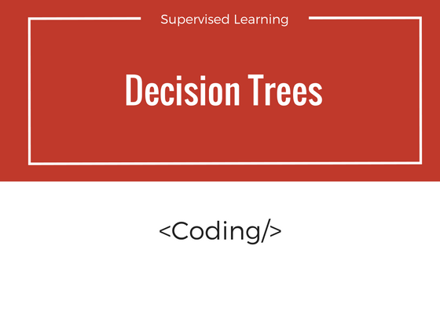
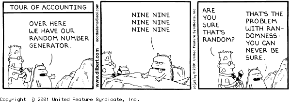

如果您喜欢这篇文章，请与您的兴趣小组，朋友和同事分享。 在下面写下您的想法，意见和反馈。 我希望收到您的来信。 请按照machine-learning-101进行定期更新。 别忘了点击心脏（❤）图标。 您可以通过savanpatel3@gmail.com给我写信。 和平。

# 进入决策树分类器的世界

决策树分类器的代码与之前的两个分类器Naive Bayes和SVM相似。 我们导入树库。 接下来，我们提取特征和标签。 我们将它们训练成模型。 然后预测。 稍后，我们将检查准确性。
```
from sklearn import treefrom sklearn.metrics import accuracy_scoreTRAIN_DIR = "../train-mails"TEST_DIR = "../test-mails"dictionary = make_Dictionary(TRAIN_DIR)print "reading and processing emails from file."features_matrix, labels = extract_features(TRAIN_DIR)test_feature_matrix, test_labels = extract_features(TEST_DIR)model = tree.DecisionTreeClassifier()print "Training model."#train modelmodel.fit(features_matrix, labels)predicted_labels = model.predict(test_feature_matrix)print "FINISHED classifying. accuracy score : "print accuracy_score(test_labels, predicted_labels)
```

undefined
# 现在，让我们探索一些调整参数，并尝试使训练更快。
## 最小样品分裂

理想情况下，决策树停止根据功能拆分工作集，要么是用尽了功能，要么是工作集落入同一类。 我们可以通过以最小分割标准容忍某些错误来加快速度。 使用此参数，如果工作集中的项目数减少到指定值以下，则决策树分类程序将停止拆分。

下图是最小样本分割为10的图。

sklearn库中的默认值为2。

尝试将此参数设置为40
```
model = tree.DecisionTreeClassifier(min_samples_split=40)
```

undefined
## 分割标准：标准

从理论上讲，我们了解到良好的拆分决策之一是采取能够提供最佳信息增益的决策。 sklearn的标准可以是gini或熵（用于获取信息）。 衡量分割质量的功能。 支持的标准是对基尼杂质的“基尼”和对信息增益的“熵”。

尝试这两个并检查什么是准确性。
```
model = tree.DecisionTreeClassifier(criterion="entropy")
```

和
```
model = tree.DecisionTreeClassifier(criterion="gini")
```

您可以在此处找到详细的参数：http://scikit-learn.org/stable/modules/generated/sklearn.tree.DecisionTreeClassifier.html#sklearn.tree.DecisionTreeClassifier
# 最后的想法

决策树是分类策略，而不是分类算法。 它采用自上而下的方法，并使用分而治之的方法来做出决策。 通过这种方法，我们可以有多个叶子类。
## 接下来是什么

在下一部分中，我们将讨论k最近邻算法，并使用sklearn库再次实现小代码。 我们将探索调整参数，这是k近邻选择的三种不同方法。
# 第三章：决策树分类器—编码


在第二部分中，我们尝试探索sklearn库的决策树分类器。 我们将调整理论部分讨论的参数，并检验结果的准确性。

通过阅读您将对实现有足够的了解，但我强烈建议您在打开教程的同时打开编辑器和代码。 我将为您提供更好的见识和长期的学习。
## 0.我们要做什么。

别忘了打❤

编码练习是以前的Naive Bayes分类程序的扩展，该程序将电子邮件分为垃圾邮件和非垃圾邮件。 不用担心，如果您还没有完成过朴素贝叶斯课程（第1章）（尽管我建议您先完成）。 相同的代码段也将在此处以抽象方式进行讨论。

> Nature of randomness!

## 1.下载

我已经为数据集和示例代码创建了一个git存储库。 您可以从此处下载（使用第3章文件夹）。 万一它失败了，您可以使用/参考我的版本（第3章文件夹中的classifier.py）来了解其工作原理。
## 2.关于清洁的一点

如果您已经完成Naive Bayes的编码部分，则可以跳过这一部分。（这是针对直接跳到此处的读者的）。

在应用sklearn分类器之前，我们必须清除数据。 清理包括删除停用词，从文本中提取最常用的词等。在相关的代码示例中，我们执行以下步骤：

要详细了解，请再次参考此处的第1章编码部分。
+ 从培训集中的电子邮件文档构建单词词典。
+ 考虑最常见的3000个单词。
+ 对于训练集中的每个文档，为字典中的这些单词和相应的标签创建一个频率矩阵。 [垃圾邮件的文件名以“ spmsg”开头。
```
The code snippet below does this:def make_Dictionary(root_dir):   all_words = []   emails = [os.path.join(root_dir,f) for f in os.listdir(root_dir)]   for mail in emails:        with open(mail) as m:            for line in m:                words = line.split()                all_words += words   dictionary = Counter(all_words)# if you have python version 3.x use commented version.   # list_to_remove = list(dictionary)   list_to_remove = dictionary.keys()for item in list_to_remove:       # remove if numerical.        if item.isalpha() == False:            del dictionary[item]        elif len(item) == 1:            del dictionary[item]    # consider only most 3000 common words in dictionary.dictionary = dictionary.most_common(3000)return dictionarydef extract_features(mail_dir):  files = [os.path.join(mail_dir,fi) for fi in os.listdir(mail_dir)]  features_matrix = np.zeros((len(files),3000))  train_labels = np.zeros(len(files))  count = 0;  docID = 0;  for fil in files:    with open(fil) as fi:      for i,line in enumerate(fi):        if i == 2:          words = line.split()          for word in words:            wordID = 0            for i,d in enumerate(dictionary):              if d[0] == word:                wordID = i                features_matrix[docID,wordID] = words.count(word)      train_labels[docID] = 0;      filepathTokens = fil.split('/')      lastToken = filepathTokens[len(filepathTokens) - 1]      if lastToken.startswith("spmsg"):          train_labels[docID] = 1;          count = count + 1      docID = docID + 1  return features_matrix, train_labels
```
```
(本文翻译自Savan Patel的文章《Chapter 3 : Decision Tree Classifier — Coding》，参考：https://medium.com/machine-learning-101/chapter-3-decision-tree-classifier-coding-ae7df4284e99)
```
