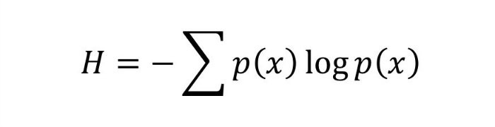

我希望本节对理解决策树分类器背后的工作有所帮助。 如果您有任何意见，建议或建议，请在下方写下来。 如果您喜欢此帖子，请与您的朋友分享，并订阅Machine Learning 101，单击heart（❤）图标。 在Facebook，Twitter，LinkedIn上关注我。 和平！

# 最后的想法

基于最大信息增益进行有效划分是决策树分类器的关键。 但是，在现实世界中，将数以百万计的数据划分为纯类实际上是不可行的（可能需要更长的训练时间），因此当满足某些参数（例如杂质百分比）时，我们会停在树节点上的点。 我们将在编码练习中看到这一点。

在下一部分中，我们将使用sklearn库在Python中编写决策树分类器。 我们将调整一些参数以通过容忍一些杂质来获得更高的精度。

在以下各节中，我们定义一些与决策树相关的术语，然后使用示例示例执行这些计算。
# 1.杂质

在上面的划分中，我们清楚地划分了班级。 但是，如果我们有以下情况怎么办？

不纯是指我们有将一类划分为另一类的痕迹。 这可能是由于以下原因引起的
+ 我们没有可用的功能来划分类。
+ 我们可以忍受一定百分比的杂质（我们停止进一步的除法），以提高性能。 （在准确性和性能之间总是要取舍）。

例如，在第二种情况下，当我们剩下的元素数量少于x时，我们可以停止除法。 这也称为基尼杂质。

> Division based on some features.

# 2.熵

熵是元素的随机度，换句话说，它是杂质的量度。 在数学上，可以借助以下几项的概率来计算：

> p(x) is probability of item x.


它是概率x项x的概率对数的负和。
```
For example, if we have items as number of dice face occurrence in a throw event as 1123,the entropy is   p(1) = 0.5   p(2) = 0.25   p(3) = 0.25entropy = - (0.5 * log(0.5)) - (0.25 * log(0.25)) -(0.25 * log(0.25)        = 0.45
```
# 3.信息获取

假设我们有多个功能来划分当前工作集。 我们应该选择什么功能进行划分？ 也许可以减少我们的杂质。

假设我们按如下所示将类划分为多个分支，则任何节点上的信息增益定义为
```
Information Gain (n) =  Entropy(x) — ([weighted average] * entropy(children for feature))
```

这需要一点解释！

假设我们最初有以下课程可以使用

112234445

假设我们根据属性对其进行划分：可被2整除

```
Entropy at root level : 0.66Entropy of left child : 0.45 , weighted value = (4/9) * 0.45 = 0.2Entropy of right child: 0.29 , weighted value = (5/9) * 0.29 = 0.16Information Gain = 0.66 - [0.2 + 0.16] = 0.3
```

如果我们将决策作为质数而不是除以2，请检查我们获得了哪些信息增益？在这种情况下，哪种方法更好？

每一阶段的决策树都选择提供最佳信息增益的决策树。 当信息增益为0时，表示该功能完全不划分工作集。

如果您喜欢此操作，请点击heart（❤）图标并进行宣传。
# 让我们解决一个例子

既然您已经了解了决策树的基本知识，就可以解决示例并了解其工作原理。

假设我们有以下各种条件下打高尔夫球的数据。


现在，如果天气条件为：

前景：阴雨，温度：凉爽，湿度：高，大风：假
## 我们应该打高尔夫球吗？
```
We have outcomes at beginning as NNYYYNYN (Y = Yes and N = No) taken in given order. Entropy at this root node is 0.3Now try to divide on various predictors outlook, temperature, humidity and Windy.Calculate the information gain in each case. Which one has highest information gain?For example, if we divide based on Outlook, we have divisions as Rainy      : NNN      (entropy = 0) Sunny      : YYN      (entropy = 0.041) Overcast   : YY       (entropy = 0)So information gain = 0.3 - [0 + (3/8)*0.041 + 0]                    = 0.28Try out for other cases.The information gain is max when divided based on Outlook.Now the impurity for Rainy and Overcast is 0. We stop for them here.Next we need to separate Sunny,If we divide by Windy, we get max information gain.Sunny YYN  Windy? Yes : N         No  : YYSo decision tree look like something as shown in image below.No the prediction data is Outlook : Rainy, Temperature: Cool, Humidity: High, Windy: FalseFlowing down from tree according to result, we first check Rainy?So answer is No, we don't play golf.
```

# 第三章：决策树分类器-理论

> H = Entropy


欢迎来到监督学习的第三种基本分类算法。 决策树。 像前面的章节（第1章：朴素贝叶斯和第2章：SVM分类器）一样，本章也分为两部分：理论和编码练习。

在这一部分中，我们将讨论理论和决策树背后的工作。 我们将看到该算法的一些数学方面，即熵和信息增益。 在第二部分中，我们修改了sklearn库中用于决策树分类器的垃圾邮件分类代码。 我们将比较朴素贝叶斯和SVM的准确性。

> Dark side of rejection and hiring! :D

# 0.动机

假设我们有两个用黑色圆圈和蓝色方块表示的类的图。 可以画一条单独的分隔线吗？ 也许没有。

> Can you draw single division line for these classes?


我们将需要多个行来划分类。 与下图类似：

> We need two lines one for threshold of x and threshold for y.


我们需要两条线，一条根据x的阈值分开，另一条根据y的阈值分开。

您现在已经猜到了决策树将要做什么。

决策树分类器通过识别线将工作区域（图）重复地划分为子部分。 （重复，因为如下图所示，可能存在两个相同类别的遥远区域除以另一个）。


那么它何时终止？
+ 要么将其划分为纯类（仅包含单个类的成员）
+ 满足分类器属性的某些条件。

我们很快将看到这两点。
```
(本文翻译自Savan Patel的文章《Chapter 3 : Decision Tree Classifier — Theory》，参考：https://medium.com/machine-learning-101/chapter-3-decision-trees-theory-e7398adac567)
```
