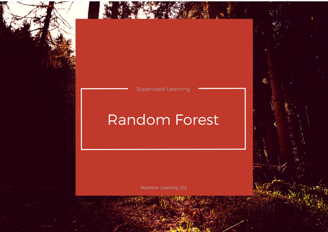

undefined

您可以通过savanpatel3@gmail.com给我写信。 和平。

# 最后的想法

随机森林分类器集成算法趋于给出更准确的结果。 这是因为它是原则性的，

组合时的弱估计量构成强估计量。

undefined

别忘了点击心脏（❤）图标。
# Python中的Random Forest和Sklearn（编码示例）。


让我们在之前的将电子邮件分类为垃圾邮件或火腿的代码中尝试使用RandomForestClassifier。
## 0.下载

我已经为数据集和示例代码创建了一个git存储库。 您可以从此处下载（使用第5章文件夹）。 本章讨论了相同的数据集。 我建议您跟随讨论并自己进行编码。 万一它失败了，您可以使用/参考我的版本来了解工作。
## 1.关于清洁和提取功能的一点点

如果您已经完成Naive Bayes的编码部分，则可以跳过这一部分。（这是针对直接跳到此处的读者的）。

在应用sklearn分类器之前，我们必须清除数据。 清理包括删除停用词，从文本中提取最常用的词等。在相关的代码示例中，我们执行以下步骤：

要详细了解，请再次参考此处的第1章编码部分。
+ 从培训集中的电子邮件文档构建单词词典。
+ 考虑最常见的3000个单词。
+ 对于训练集中的每个文档，为字典中的这些单词和相应的标签创建一个频率矩阵。 [垃圾邮件的文件名以“ spmsg”开头。
```
The code snippet below does this:def make_Dictionary(root_dir):   all_words = []   emails = [os.path.join(root_dir,f) for f in os.listdir(root_dir)]   for mail in emails:        with open(mail) as m:            for line in m:                words = line.split()                all_words += words   dictionary = Counter(all_words)# if you have python version 3.x use commented version.   # list_to_remove = list(dictionary)   list_to_remove = dictionary.keys()for item in list_to_remove:       # remove if numerical.        if item.isalpha() == False:            del dictionary[item]        elif len(item) == 1:            del dictionary[item]    # consider only most 3000 common words in dictionary.dictionary = dictionary.most_common(3000)return dictionarydef extract_features(mail_dir):  files = [os.path.join(mail_dir,fi) for fi in os.listdir(mail_dir)]  features_matrix = np.zeros((len(files),3000))  train_labels = np.zeros(len(files))  count = 0;  docID = 0;  for fil in files:    with open(fil) as fi:      for i,line in enumerate(fi):        if i == 2:          words = line.split()          for word in words:            wordID = 0            for i,d in enumerate(dictionary):              if d[0] == word:                wordID = i                features_matrix[docID,wordID] = words.count(word)      train_labels[docID] = 0;      filepathTokens = fil.split('/')      lastToken = filepathTokens[len(filepathTokens) - 1]      if lastToken.startswith("spmsg"):          train_labels[docID] = 1;          count = count + 1      docID = docID + 1  return features_matrix, train_labels
```
## 2.使用随机森林分类器

使用随机森林分类器的代码与以前的分类器相似。
+ 导入库
+ 建立模型
+ 培养
+ 预测
```
from sklearn.ensemble import RandomForestClassifierTRAIN_DIR = "../train-mails"TEST_DIR = "../test-mails"dictionary = make_Dictionary(TRAIN_DIR)print "reading and processing emails from file."features_matrix, labels = extract_features(TRAIN_DIR)test_feature_matrix, test_labels = extract_features(TEST_DIR)model = RandomForestClassifier()print "Training model."#train modelmodel.fit(features_matrix, labels)predicted_labels = model.predict(test_feature_matrix)print "FINISHED classifying. accuracy score : "print accuracy_score(test_labels, predicted_labels)
```

undefined
## 3.参数

让我们了解并使用一些调整参数。

n_estimators：森林中的树木数量。 默认值是10。

准则：“ gini”或“熵”与决策树分类器相同。

min_samples_split：需要分割的节点上工作集大小的最小数目。 默认值为2。

您可以在此处查看可调参数的完整列表

通过单独或组合更改值来使用这些参数，并检查是否可以提高精度。

我尝试了以下组合，并获得了如下图所示的精度。

## 投票的替代实施

可替代地，随机森林可以应用权重概念来考虑来自任何决策树的结果的影响。 错误率高的树的权重值低，反之亦然。 这将增加错误率低的树的决策影响。
# 基本参数

随机森林分类器的基本参数可以是要生成的树总数以及与决策树相关的参数，例如最小分割，分割标准等。

python中的Sklearn具有大量的调整参数，您可以在此处进行探索。

这之所以行之有效，是因为单个决策树可能易于产生噪声，但是许多决策树的集合会降低噪声的影响，从而提供更准确的结果。

创建的不同决策树中的子集可能重叠

在本文中，我们将看到“随机森林分类器”背后的数学。 然后，我们将编写一个小示例，将电子邮件分类为垃圾邮件或火腿。 与以前的分类器相比，我们将检查准确性。

如果您尚未阅读《决策树分类器》，我建议您在此进行一次遍历，因为它们是随机森林分类器的基础概念。
# 随机森林分类器

随机森林分类器从随机选择的训练集子集中创建一组决策树。 然后，它汇总来自不同决策树的投票，以决定测试对象的最终类别。
## 用Layman的说法，

假设训练集为：[X1，X2，X3，X4]，相应标签为[L1，L2，L3，L4]，随机森林可以创建三个决策树，例如，输入子集，
+ [X1，X2，X3]
+ [X1，X2，X4]
+ [X2，X3，X4]

因此，最后，它基于做出的每个决策树的大多数投票进行预测。
# 第5章：随机森林分类器


随机森林分类器是集成算法。 在接下来的一两个帖子中，我们将探讨这种算法。 组合算法是将多个以上相同或不同类型的算法组合在一起以进行对象分类的算法。 例如，在朴素贝叶斯，SVM和决策树上运行预测，然后投票表决最终考虑测试对象的类。

> Machine Learning is a reason why data is important asset for company.

```
(本文翻译自Savan Patel的文章《Chapter 5: Random Forest Classifier》，参考：https://medium.com/machine-learning-101/chapter-5-random-forest-classifier-56dc7425c3e1)
```
