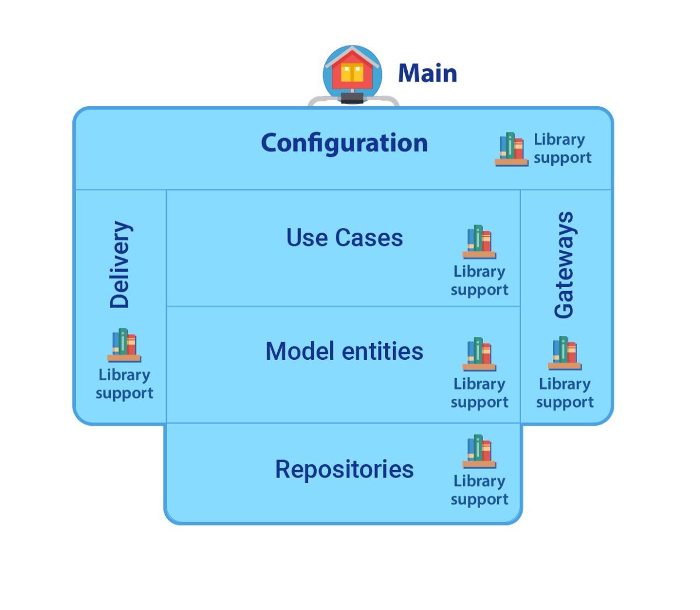
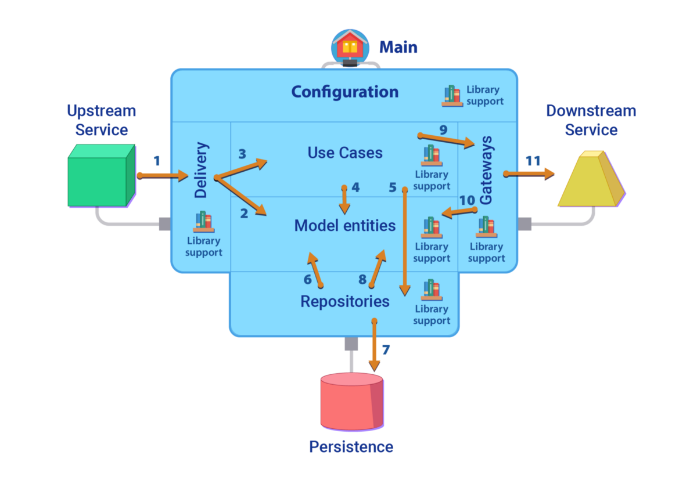
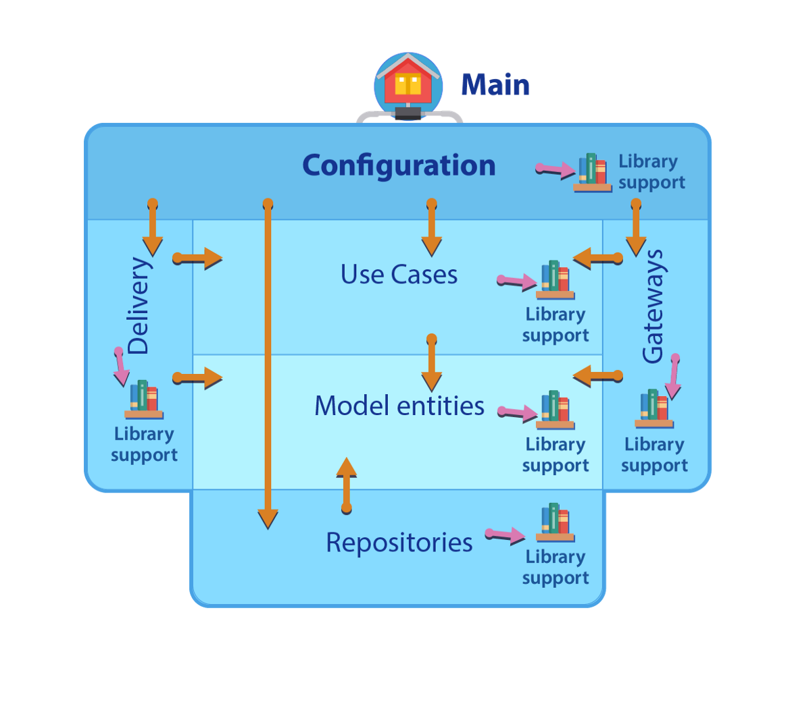

谢谢：
+ 梅赛德斯·卡罗西奥（Mercedes Carrocio），用于英语风格和错字更正
+ MatíasLeiva进行了更正。
+ 马蒂亚斯（Matías）“教授”祖科蒂（Zuccotti）拥有艺术魔术。
+ 马丁·冈萨雷斯（Martin Gonzalez）提出了宝贵意见。
# 实践中的清洁微服务架构
## 创建应用程序很容易，但是创建出色的，可立即投入生产的应用程序则完全不同。


是的，很多（嗡嗡声？）单词。

创建应用程序很容易，只需坐下来编写代码即可。 您有一个应用程序。 如果您陷入困境，只需访问Internet进行搜索，然后将找到大量的示例，框架和模板，这些将对您的应用程序有所帮助。但是，创建一个出色的，可立即投入生产的应用程序则完全不同。

创建一个应用程序很容易，但是创建一个优秀的，可立即投入生产的应用程序则完全不同。

首先，我们要确保：
+ 该应用程序是正确的（它只是执行了其应做的事情，并且没有执行其“不做”的意思）
+ 该应用程序性能出色（它仅使用分配的时间，并且消耗的资源不超过分配给它的资源）
+ 该应用程序将持续运行（是的，我们不仅需要该应用程序在第一天（也许是第二天）运行，而且还要在他一生中的每一天都运行）。

最后一点非常关键，因此我们还需要牢记：
+ 应该很容易改变
+ 应该容易改进
+ 应该容易扩展

创建应用程序很容易，而且（一开始）非常快。 创建出色的，可立即投入生产的应用程序需要仔细的考虑，计划和工程。 是的，您也可以采用“让它随着时间增长”的理念； 大自然有数以百万计的例子，这可以很好地解决问题。 事实是，这需要数百万年的自然，并且您可能不愿意等待那么长时间。

该出版物显示了一种基于工程的方法来帮助您开发出色的应用程序，以及一些有关如何充分利用它的相关故事。
# 组件

正如Fred Brooks在其出色的文章“ No Silver Bullet”中所描述的那样，应用程序的开发存在与域的“本质”相关的问题，以及源于我们的决策（“事故”）的问题。

实质将在“模型实体和用例”组件中进行描述。 这些通常被收集为“核心”。 这是领域知识和我们要实现的“功能”。

事故由其余部分组成：交付，网关，存储库，外部库，配置和主要。 所有这些仅仅是因为计算机编程并不完美，我们需要大量支持才能使Essence在真实环境中工作。 这些组件被称为“基础结构”。
## 模型实体

> Components


实体封装了企业范围的业务规则。

实体可以是带有方法的对象，也可以是一组数据结构和函数。 只要实体可以被企业中的许多不同应用程序使用，都没有关系。 它们代表裸域。
## 用例

用例包含特定于应用程序的业务规则。

它封装并实现了系统的所有用例。 这些用例协调了实体之间的数据流，并指示这些实体使用其企业范围的业务规则来实现用例的目标。
## 交货

在交付中，我们找到了接口适配器，该接口适配器接收来自微服务外部的请求并传递（即名称的来源）对它们的响应。

通常将其实现为REST HTTP Server，或使用某些Message Broker（如任何JMS服务器，Kafka等）中的Message。
## 网关

网关是接口适配器，使该微服务可以向另一个微服务（或旧系统或外部系统）请求服务。

通常将它们实现为REST HTTP客户端，Message Broker客户端或任何其他API客户端。
## 储存库

这些是系统的接口适配器，用于存储和检索（序列化的）应用程序对象（通常是实体）。

存储库和网关之间的区别在于，网关通常与其他系统通信，但是（在微服务体系结构中）数据存储区（持久性后端）仅旨在供该服务使用，它们属于此边界的逻辑边界 上下文（请参阅域驱动设计）。
## 组态

配置是系统的一部分，它将不同的组件组成一个正在运行的系统。

它包含所有组件的工厂，并执行依赖项注入，以组装应用程序的方式链接不同的组件。

它还具有从组装过程中使用的应用程序参数，环境变量或外部配置文件收集配置数据的逻辑，以使该集合“参数化”。
## 主要

主要只是应用程序的入口点。

其唯一目的是调用配置并启动应用程序运行。 在某个时候，故事应该开始了。
# 工艺流程

为了提供所需的行为，这些组件在它们之间相互作用。 在典型的反应系统中，动作流通常遵循以下模式：

> Request Process Flow

+ 外部系统执行请求（HTTP请求，JMS消息可用等）
+ 交付根据请求数据创建各种模型实体
+ 交付调用用例操作（命令，交互器等）
+ 用例在模型实体上运行
+ 用例要求在存储库上进行读/写操作
+ 存储库从用例请求中消耗了一些模型实体
+ 存储库与外部持久性交互（DB命令，文件系统命令）
+ 存储库从持久数据创建模型实体
+ 用例请求网关的协作
+ 网关使用用例请求提供的模型实体
+ 网关与外部服务（其他应用程序，将消息放入队列，在打印机上打印等）进行交互。
# 依存关系

遵循以前的体系结构建议的思想，所有依赖关系都从技术细节到更具概念性的实体。 仅由于依赖于支持库（例如运行时库以及其他有用和通用的库）（JSON转换，日期时间管理，数学，集合等），此规则才被打破。

> Module dependencies


在图中，较暗的部分与更详细，更特定于技术的过程（事故）相关，而较浅的部分与概念性（本质）相关。

详细地：
+ 一切都取决于业务模型实体，这应该是最稳定的要素，也是最重要的要素。
+ 交付，存储库和网关（Clean Architecture和其他模型中的基础结构层）取决于用例（应用程序业务规则）和模型实体（1）。 最后两个是业务的核心。

所有组件都可以依赖于支持库：
+ 模型实体需要一个具有列表，集合等的收集框架。此外，它们可能需要Datetime支持，一些数学等。
+ 用例需要支持集合处理，特定的业务逻辑，并发管理（是的，不能总是透明地设置）以及其他支持
+ 交付需要HTTP Server支持，JSON或其他转换，JWT验证等。
+ 网关需要HTTP客户端，队列服务器客户端等。
+ 存储库需要数据库客户端

（1）许多人认为模型实体不应从基础结构中可见。 我并不相信，在处理微服务时，增加分离值得增加复杂性。 如果语言支持，某种形式的“不可变接口”可以提供帮助。
# Kotlin示例实施

为了使用这种体系结构样式实现应用程序，我们使用了以下详细信息。

该应用程序是在Kotlin中开发的（因为没有多少人支持我在Scala中进行此操作），并且将Vert.X框架用于HTTP客户端和服务器，并将ReactiveX（RxJava2）用于并发。 JSON被用作序列化机制。

在其他情况下，我们将KTOR库用于HTTP客户端和服务器以及对并发的本机支持。
# 模型实体

模型实体是普通Kotlin数据类（我不知道是否有人创造了PKDC这个词，但POJO具有更多的样式和营销外观）。 我们竭尽全力使这些实体不可变（为什么？）：
```
data class QuestionWithImage(val id: String, val question: String, val image: URL, val answer: String) {   fun sanitizeAnswer(sanitizer: SpanishTextSanitizer):      QuestionWithImage = copy(answer = sanitizer.sanitize(answer))}
```
# 用例

用例通过一系列操作来实现（您可以将它们称为Interactor，也可以根据需要将其称为）。

有时，如果您需要从多个操作中提取通用代码，则可以创建一个Service类来保存此通用行为，但不要总是尝试放置一个Action AND Service，因为分层架构“需要”它。

动作示例：
```
class GetQuestionImage(   private val questionRepository: QuestionRepository,   private val geoIPService: GeoIPService,   private val usersRepository: UsersRepository) {   private val sanitizer = SpanishTextSanitizer()   operator fun invoke(      ip: String, userId: Long, context: RequestContext   ): Single<QuestionWithImage> =       geoIPService           .findCountry(ip)           .zipWith(usersRepository.findBy(userId, context),               BiFunction<String, User, Pair<String, Language>> {                 country, user -> country to user.language            })           .flatMap { (country, language) ->              questionRepository                .findOneWithImage(userId, country, language)           }           .map{ it.sanitizeAnswer(sanitizer) }}
```

在这种情况下，每个动作都使用Kotlin的“操作者有趣的调用”功能实现为“功能”。 同样在此应用程序中，并发性由一个Reactive库（ReactiveX）管理，并且这些操作提供了一个结果，该结果包装在一个Observable中（在这种情况下为Single Observable）。

该动作协调模型实体，网关（如GeoIPService）和存储库的行为。
# 交货

交付由一堆处理程序组成。 每个处理程序处理一个特定的请求，将请求有效负载转换为DTO或模型实体，然后调用适当的Action。 最后，它将Action响应转换为响应有效负载，并将其发送回调用方。
```
class UserConfigurationHandler(   private val getUserConfiguration: GetUserConfiguration,   private val jsonCodec: ObjectMapper) : BaseHandler(jsonCodec) {  override fun register(router: Router) {    router.put(PATH).handler(protect{ context ->       handle(context)    })        router.get(PATH).handler(protect{ context ->       handleGet(context)    })  }  private fun handleGet(context: RoutingContext) {    val platform = context.getParamString("platform")    val country = context.getParamString("country")    try {      val vo = GetUserConfigurationVO(platform, country)      handleRequest(context, vo)    } catch (e: RuntimeException) {      onError(context, e)    }  }  private fun handle(context: RoutingContext) {    try {      val vo = jsonCodec        .readValue<GetUserConfigurationVO>(context.bodyAsString)      handleRequest(context, vo)    } catch (e: RuntimeException) {      onError(context, e)    }  }  private fun handleRequest(context: RoutingContext,     vo: GetUserConfigurationVO) {    val userId = context.pathParam("userID").toInt()    val ip = context.getIP()           getUserConfiguration(ip, userId, vo.platform, vo.country)      .subscribe(         { onSuccess(context, it) },          { onError(context, it) }      )   }}
```

处理程序除了进行转换（序列化，反序列化）和调用操作外，没有其他逻辑。 所有业务逻辑都应在行动之后。
# 网关
```
class QuestionRepositoryRestClient(   private val restClientTemplate: RestClientTemplate,   config: RestClientConfig) : QuestionRepository {   private val appId: String = config.appId  override fun findOneWithImage(userId: Long, country: String,    language: Language): Single<QuestionWithImage> =      restClientTemplate        .post("/games/$appId/users/$userId/questions/search",           QuestionsResponse::class,           QuestionsRequest.forImage(country, language.toString())           )        .map(this::toQuestionWithImage)  override fun confirmQuestionsAnswered(userId: Long,     questionIds: Iterable<String>): Single<Unit> =      restClientTemplate        .post("/games/$appId/users/$userId/answers",              AnswersRequestResponse::class,              AnswersRequestResponse(questionIds.toList())        )        .map{ Unit }}
```

在此，网关利用提供的RestClient连接到外部服务。

网关不再具有业务逻辑，而是转换和映射。
# 储存库

在这种情况下，存储库足够小，可以保存在内存中，并且不需要保留。 如果应用程序出现故障，数据将丢失并再次重新生成。
```
class InMemorySuggestedOpponentsRepository  : SuggestedOpponentRepository {  class LanguageEntry(val set: MutableSet<Long>,      val queue: ConcurrentLinkedQueue<Long>)  private val emptyEntry = LanguageEntry(     mutableSetOf(), ConcurrentLinkedQueue()  )  private var suggestedUsersByLanguage     : ConcurrentHashMap<Language, LanguageEntry> =       ConcurrentHashMap()  override fun save(userId: Long, language: Language): Single<Long>{    suggestedUsersByLanguage.compute(language) { _, ids ->      val entry = ids ?: LanguageEntry(        mutableSetOf(), ConcurrentLinkedQueue()      )      if (entry.set.add(userId)) entry.queue.add(userId)      entry    }    return Single.just(userId)  }  override fun find(userId: Long, language: Language)    : Single<Optional<Long>> {    val entry = suggestedUsersByLanguage       .getOrDefault(language, emptyEntry)    val opponentId = entry.queue.poll()    opponentId.let { entry.set.remove(opponentId) }    if (userId != opponentId) {      return Single.just(Optional.ofNullable(opponentId))    }    val otherId = find(userId, language)    save(userId, language)    return otherId  }}
```

存储库实现不是线程安全的，因为它打算驻留在提供所需的隔离和序列化的Vert.X垂直版本中。
# 组态

许多人问：“为什么不使用Spring（框架）？”。 一年以来，“依赖注入”是“ Spring框架”的同义词。 Spring是一个了不起的框架，它有助于改善和生产解决大量问题的高质量应用程序。

但是，如果您再也没有这些问题了怎么办？ 您是否还需要一个（复杂的）框架？

这是如何在没有库和没有Spring的情况下进行依赖注入的示例（哦，天哪，这可能吗？）
```
object Repositories {  private val webClient by lazy {     WebClient         .create(vertx, WebClientOptions().setFollowRedirects(true))  }  val jsonMapper: ObjectMapper by lazy {       ObjectMapper()           .registerModule(JavaTimeModule())           .registerModule(KotlinModule())  }  val questionRepository by lazy {       QuestionRepositoryRestClient(         restClientTemplate, config.platform       )  }  val suggestedOpponentRepository     : SuggestedOpponentRepository by lazy {       VerticleBasedSuggestedOpponentRepository(vertx.eventBus())  }  val suggestedOpponentsVerticle by lazy {       InMemorySuggestedOpponentsVerticle(suggestedOpponentCache)  }  val inMemorySuggestedOpponentsRepository by lazy {       InMemorySuggestedOpponentsRepository()  }  private val suggestedOpponentCache by lazy {       SuggestedOpponentCache(           FillCacheIfNotFullEnough(             inMemorySuggestedOpponentsRepository,             config.suggestedOpponentConfiguration           ),          config            .suggestedOpponentConfiguration.minutesToNextSuggestion       )  }  private val restClientTemplate by lazy {       RestClientTemplate( webClient, jsonMapper, config.platform)   }}
```

哦，哇，很多没有框架的依赖注入！

是的，这种模式有一些缺点，例如，它不能优雅地处理循环。 但是没有周期很酷，不是吗？

我们将Kotlin支持用于延迟初始化，这使我们不必按拓扑顺序对工厂（是的，这些行是内联工厂）进行排序。
# 主要

最后，主类结束时是一个非常无聊的类：
```
object Application {  @JvmStatic  fun main(args: Array<String>) {    vertx.deployVerticle(      ServerVerticle(DeliveryProvider.routes, Environment.PORT)    )    vertx.deployVerticle(suggestedOpponentsVerticle)  }}
```
# 结论

创建出色的应用程序具有挑战性，但是良好的结构和对某些原则的正确遵循可以对其开发产生很大的帮助。 所示的体系结构使我们可以创建易于理解，易于更改和易于修复的应用程序。 正确的关注点分离为我们提供了坚实的基础，也使我们无需复杂的框架或库即可做到这一点。

感谢您的阅读，希望本文对您有所帮助。

在下面的文章中，您将能够看到如何确保遵循此体系结构：通过测试检查体系结构。

作者：卡洛斯·福（Carlos Fau）
```
(本文翻译自Carlos Fau的文章《Clean Microservice Architecture in Practice》，参考：https://engineering.etermax.com/clean-microservice-architecture-in-practice-63051aeb016b)
```
