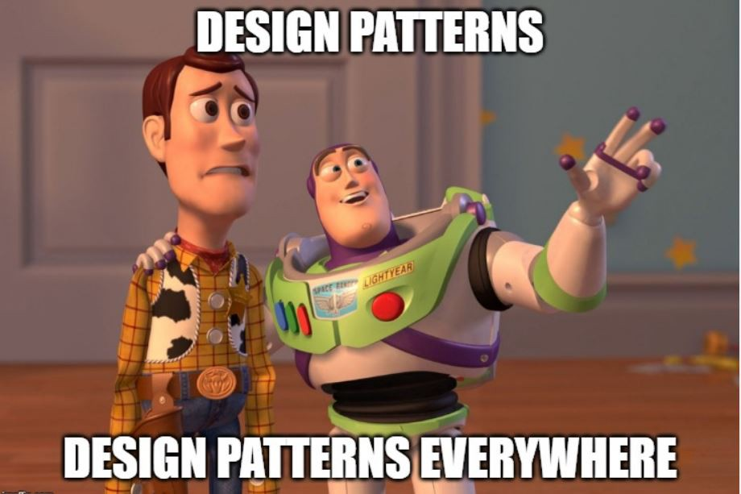

尽管我们只是勉强了解一下，但我希望该列表对您有所帮助。

您发现自己不断采用哪些设计模式？ —很想听听他们的更多信息。

请随时在下面的评论中发表您的建议，我将尽力尝试更新此列表以包括这些建议。
# 6.边车

问题陈述

外围任务（如监视，日志记录等）对于大多数应用程序至关重要，并且通常集成在其中。 但是，这些任务与应用程序同时运行，这可能会导致效率低下，并导致关注点分离不正确。 另外，这些监视和日志记录组件中造成的中断可能严重影响整个应用程序功能。

解决方案：并排放置为Sidecar
+ 将任务集与应用程序并置在一起，但将它们作为Sidecar放置在其进程或容器中
+ 边车通常是小型/可插拔组件，可以用不同的语言编写
+ 应用程序和Sidecar都作为一个单元部署，因此延迟很短
+ Sidecar可用于修改应用程序容器的工作方式，而无需对代码进行任何更改
+ 边车固定在应用程序上，其生命周期取决于应用程序
+ 如果Sidecar容器逻辑变得复杂或与主应用程序紧密结合，则最好将其与主应用程序的代码集成在一起

让我们用一个例子来简化
+ 边车的一个常见示例是附着在摩托车上的字面边车-作为一个整体工作
+ 边车通过增加载客量来提高摩托车的可用性
+ 边车可以由另一家公司生产，而不必从摩托车制造商那里购买-提供模块化和灵活的选择
+ 它没有自己的发动机，而是依靠实际摩托车的发动机。 如果摩托车停下来，边车停下来

# 5.断路器

问题陈述

在某些情况下，故障可能是由意料之外的情况引起的，需要较长的时间进行修复。 重试或等待请求超时可能不是最佳选择，因为它可能会导致进一步的级联问题，例如资源争用和/或线程阻塞。

解决方案—快速失败

防止应用程序重试可能失败的操作
+ 断路器充当代理，监视最近的操作故障
+ 代理会维护失败计数，如果超过设置的阈值，它将处于“打开”状态
+ 在“打开”状态下，请求立即失败，并由应用程序适当处理
+ 但是，仍然允许有限的请求通过，以检查操作是否仍然失败或已经成功（已修复）
+ 如果操作继续返回失败，则打开状态继续
+ 如果操作成功，则认为问题已解决，并且断路器切换到“闭合”状态
+ 这种模式下的错误和失败处理需要仔细考虑，以创建可接受的最终用户体验

让我们用一个例子来简化
+ 此模式的灵感来自家庭或办公室电线中的实际断路器
+ 电路断路器是在电流过载情况下防止损坏电路的保护措施
+ 它连接到您的电路板并在检测到电流故障时中断电流流动
+ 发生故障时，断路器开关自动断开，并阻止电流流过电路（开路）
+ 如果没有断路器，则在电涌的情况下，保险丝会烧断
+ 使用断路器，您所要做的就是拔掉某些引起电涌的设备，然后将断路器开关拨回到“ on”位置（闭合）

# 4.重试

问题陈述

分布式环境由于网络速度慢，超时等原因而容易出现暂时性错误。但是这些问题通常会自行纠正，如果重新触发操作，则很可能会成功。 在这种情况下，应用程序需要处理这些瞬态故障，而又不影响最终用户的体验。

解决方案—重试
+ 有3种方法来处理瞬态故障

停止并报告异常：如果故障不是暂时性的，或者在重复发生时无法成功，则应用程序可能会发出警报并记录异常

立即重试：如果很少发生故障，则应用程序可以立即重试失败的请求，并且请求可能成功

延迟重试：如果故障是由连接问题或可能需要短时间的问题引起的，则应用程序可以在经过合理的时间后重试失败的请求
+ 可以配置时间延迟和重试次数以适合应用程序需求
+ 如果即使经过所需的重试次数后请求仍然失败，则应用程序可能将其报告为错误并发出警报

让我们用一个例子来简化
+ 这是你亲爱的朋友的生日！ 您想成为第一个希望他们的人，以便您在时钟敲响时准确地叫出它们12
+ 电话很忙……您发现有人殴打了您。 你挂了（有点失望）
+ 但是您也知道电话不会忙得太久。 所以您重拨，这次您可以通过并祝愿他们。 ＃欢呼

# 3.活动来源

问题陈述

与数据进行交互时，大多数应用程序都存储数据的当前状态。 数据元素的更新通常会被最新的覆盖。 如果要获取所有更新的历史记录，则需要构建该应用程序以维护历史记录表。 每次发出更新请求时，当前数据将在覆盖之前移至历史表。 这增加了拥有可靠的历史备份并确保应用程序扩展计划还包括扩展历史存储的开销。

解决方案—事件存储
+ 将应用程序更改定义为一系列事件，并按照应用顺序将它们记录在事件存储中（审计跟踪）
+ 这些事件是不可变的，并且仅作为追加存储，但可以发布给可以根据需要处理它们的使用者
+ 此模型不仅存储应用程序状态的历史记录，而且允许重播这些事件以获得应用程序的当前状态-以下之一

-完整的重建-时间点重建-反向事件
+ 这里的技巧是以一种不了解实际交易和重播之间的区别的方式处理外部系统

让我们用一个例子来简化
+ 活动采购的工作方式与簿记非常相似：簿记员将记录当日组织的付款，收据，购买等财务交易，并将其记录在供应商或总账中
+ 这些分类帐中现在提供所有财务事件，入金和出金（..审计跟踪）
+ 会计师可以使用此信息为任何自定义时间段创建报告
+ 在进行交易（重播）时，会计师有可能多次重新创建相同的报告，但在指定的时间段内仍可获得相同的结果

# 2.命令和查询责任隔离（CQRS）

问题陈述

传统上，人们通过CRUD数据存储与信息系统进行交互。 读取和写入数据模型通常是相同的。 随着应用程序复杂性的增加，将创建信息的多种表示形式，所有表示形式都引用一种通用数据（概念）模型。 这可能导致数据/资源争用，性能下降以及某些情况下的安全性问题。

解决方案：分离读写模型
+ 这可以通过为读取和写入操作创建单独的架构或不同的数据库来完成。 来自单个数据存储的所有读取，以及所有写入/更新的数据到单独的数据存储
+ 创建单独的数据库提供了额外的隔离，有助于提高可伸缩性和性能
+ Write数据库可以是关系数据库，而Read数据库可以不是基于SQL文档的数据库
+ 这种方法不仅提供了关注点分离，而且还允许每个数据存储根据其工作量独立扩展
+ 此模型中的重要考虑因素是保持读写存储之间的同步。 这通常是通过发布来自Write商店的事件并由Read商店使用来实现的

让我们用一个例子来简化
+ 想象您仍在同一家餐厅等待订单…等待外卖时，肚子饿了。
+ 您注意到延迟是由于只有一台服务器负责所有食客和外卖订单
+ 当我们非常忙碌的服务器Roger正在从一个食客那里接受订单时，其他食客都在等待下订单
+ 然后，某些人（例如您）正在等待外卖订单的状态，而其他人已经下达订单，现在正在等待送达
+ 令人遗憾的是，罗杰（Roger）已成为此操作的瓶颈，并且餐厅的整体性能下降了
+ 值得庆幸的是，查理（Charlie）从休假中回来，开始接受外卖和用餐订单，而罗杰（Roger）继续为餐桌和外卖食客提供食物

# 1.异步请求和答复

问题陈述

当我们谈论云应用程序时，经常会想到微服务。 这是一种架构样式，其中组合了多个微服务（即远程API或第三方服务）以执行专用功能，以向客户端应用程序提供特定功能。

在这种设置中，在所有后端工作完成之前同步处理客户端请求可能并不总是可行的。 在长时间运行的流程中尤其如此。 此外，当对客户端的响应需要几毫秒时，延迟也成为考虑因素。

解决方案：异步处理（HTTP轮询或事件通知）
+ 客户端发出API请求
+ 现在，应用程序将工作卸载到另一个后端服务或消息队列。
+ 客户端可以根据客户端应用程序的定期使用HTTP GET（HTTP轮询）轮询资源/进程状态
+ 状态API返回“进行中”，表明后端进程仍在运行
+ 流程完成后，状态将返回所需的输出或对资源的另一个引用
+ 该过程完成后，应用程序还可以推送事件通知，而无需客户端重复轮询

让我们用一个例子来简化
+ 想象一下，您太累了无法晚餐，并决定在您最喜欢的餐厅通过电话下达外卖订单（API请求）
+ 餐厅为您提供订单号（确认和参考标识符）
+ 您到达餐厅领取订单时，提供给他们订单号，餐厅工作人员会通知您您的订单仍未完成
+ 如果您特别饿，可以每5-10分钟回到接待处查询一次订单（HTTP轮询）
+ 或者，餐厅可以为您提供一个寻呼机，一旦您的订单完成，它就会发出嗡嗡声（事件通知）

# 云设计模式—简单解释

“只有模式，模式之上的模式，影响其他模式的模式。 模式隐藏的模式。 模式中的模式……”

-查克·帕拉纽克（Chuck Palahniuk）

描述模式的最简单方法可能是可预测地重复自身的规律性。 模式的美在于它们的普遍存在-从最小的微生物中细胞器的排列方式到星系中星星排列的方式，模式无处不在。 您根本无法逃脱这些支配我们物质世界大多数（如果不是全部）定律的模式。

毫不奇怪，软件设计领域中也存在设计模式。 软件设计模式是针对常见问题的可重用解决方案（模板）。 世界在1970年代开始注意到软件中的设计模式，就像他们现在所建立的技术一样，模式也一直在发展。


构建高效且可扩展的软件非常类似于构建砖墙-砖墙层会格外小心，以确保保持其墙壁的图案和对称性。 这使基础足够坚固，可以支撑堆叠在其上的所有物体的重量。 它可以建造更高，更坚固，更“可缩放”的墙（对双关语）。 与底层一样，软件工程师也需要注意指导底层软件的设计模式，以创建高效且可扩展的解决方案。

随着云计算的日益普及，各地工程师的关注点现已转移到利用控制这些流程的模式。

这是我发现对我反复有用的云设计模式的汇总。 我承认此列表是基于我自己的经验而产生的，但是随着我了解更多，我将尝试将其添加到列表中。 希望这可以帮助您更好地理解设计模式。
```
(本文翻译自Rahat Shaikh的文章《Cloud Design Patterns— Explained Simply》，参考：https://medium.com/@rahatshaikh/cloud-design-patterns-explained-simply-113c788b33ff)
```
