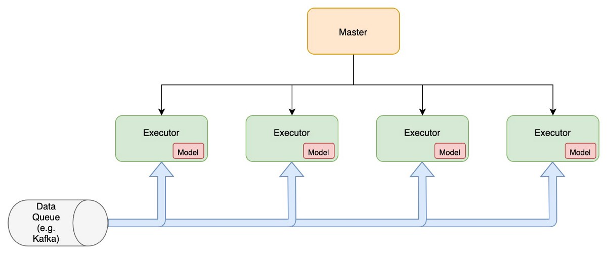
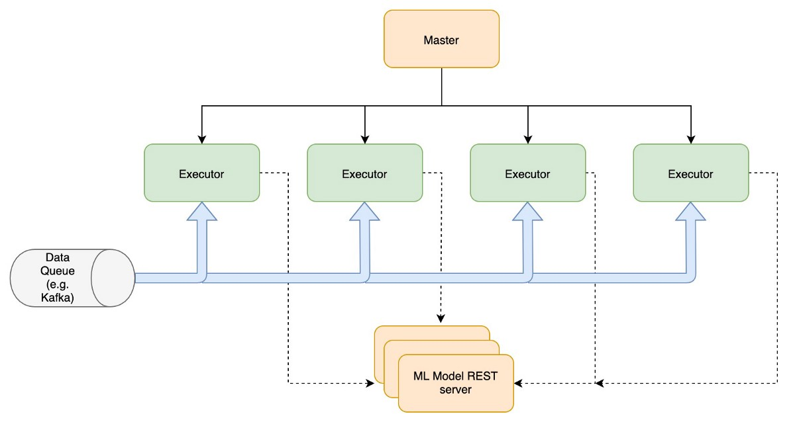
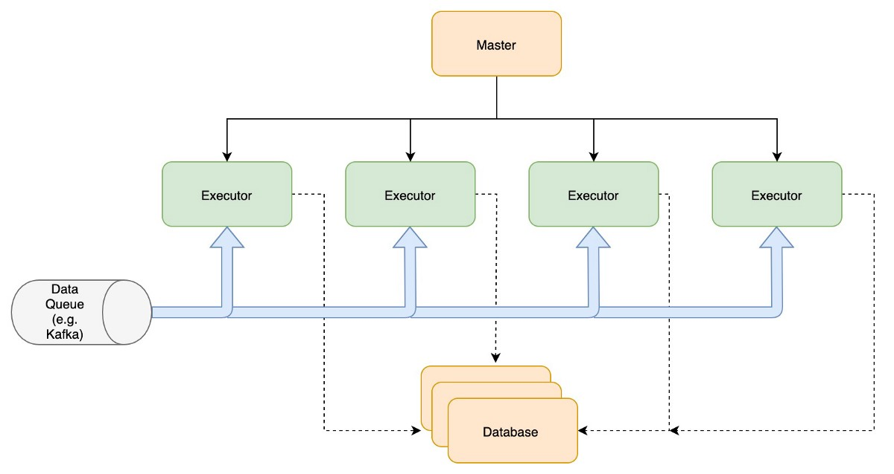

# 在分布式实时数据流应用程序中部署ML模型
## 探索在Apache Flink / Spark或其他实时数据流应用程序中部署ML模型的各种策略。

> Photo by Franck V. on Unsplash


在过去的十年中，机器学习已经从零变为一。 ML的兴起可以看作是技术行业中最具决定性的时刻之一。 如今，ML模型在几乎所有服务中无处不在。

迄今为止，仍然存在的挑战之一是使用实时数据进行模型的训练和推理。 让我们看一下您可以在数据流生产作业中使用的各种策略进行预测。
# 与管道一起建模

实时数据预测的自然方法是在处理数据的管道中运行ML模型。

> Deploying model in pipeline executors


这种方法有两个主要的并发症-
+ 管道代码和模型代码的集成。
+ 优化集成管道以有效利用基础资源。
## 积分

大多数实时数据管道都是使用Java或Python编写的。 Apache Spark和Apache Flink均提供Python API。 这样可以轻松集成使用Scikit-Learn或Tensorflow编写的模型。

您还可以使用Spark MLlib或Flink ML创建模型。 这些模型易于集成，您不必担心扩展和容错。

但是，如果您已有一个用Java或Scala编写的数据管道，该怎么办？ 在这种情况下，使用Tensorflow Java API或第三方库（例如MLeap或JPMML）导出Scikit学习模型并在代码中使用它们会更有意义。 JPMML支持许多模型，但是MLeap更快。
## 优化

Python和Java / Scala之间的选择代表了多功能性和性能之间的平衡。 最好是根据用例，预期数据量和预期延迟做出决定。 我希望大多数应用程序都使用Scala，因为期望的输入记录约为每秒数百万。

另一个优化是应分配给模型的并行执行程序的数量。 如果是轻量级模型（例如Logistic回归或小型随机森林），则您甚至可以运行该模型的单个实例，然后将数据重新分区以交给单个执行器（这在生产中绝对不是一个好主意）。 对于诸如大型随机森林或深层神经网络之类的沉重模型，找到合适数量的执行者通常是反复试验的练习。

您可能还需要优化ML模型，以使其适合内存。 有多种工具可用于此目的。
## TensorFlow Lite
### TensorFlow Lite是用于设备推断的开源深度学习框架。

这种方法的另一个复杂之处是将模型更新为较新的版本。 通常，此更新需要全新部署。 这也使A / B测试变得相当简单。
# 建模为REST服务

这是最流行的推理方法之一。 在docker容器中运行python代码，并提供REST接口以获取结果。 Tensorflow已经提供了现成的REST模型服务。

> Deploying ML Model as a service


对于Java，您可以使用MLeap或DeepLearning4J。 您还可以根据这种方法根据吞吐量动态增加/减少服务器数量。

如果您的模型调用是异步的，则这种方法将无法触发背压，以防万一出现数据突发（例如在重新启动期间）。 这可能导致模型服务器中的OOM故障。 必须采取额外的预防措施以防止出现这种情况。

延迟也很高，因为您需要网络调用来获取结果。 通过使用gRPC而不是REST可以稍微减少延迟。
## 这是超越HTTP 1.1的方法
### 实现您自己的http / 2服务。
# 数据库作为模型存储

如果您具有固定的模型体系结构，例如线性回归，随机森林或小型神经网络，则权重可以存储在分布式数据库中，例如Cassandra。 您可以在运行时使用权重创建模型，并对新模型进行预测。

> Storing models in database


该方法是第一和第二方法的混合。 它允许您在运行时更新模型，而无需进行新的部署，同时还证明了背压功能。 由于要限制模型的潜在选项数量，因此要牺牲多功能性。
## 那么您应该选择哪种方法呢？

好吧，如果您想做一个简单的POC或您的模型非常轻巧，请使用REST模型服务器。 易于集成，并且运行模型所需的代码更改很少，这使其成为一个有吸引力的选择。 A / B测试也可以快速完成。

如果您需要在数十毫秒内进行预测，则首选管道方法。

最后，仅当您有多个模型（例如，每个城市数据的ML模型）并且它们也是轻量型时，才应使用模型存储方法。
```
(本文翻译自Kartik Khare的文章《Deploying ML Models in Distributed Real-time Data Streaming Applications》，参考：https://towardsdatascience.com/deploying-ml-models-in-distributed-real-time-data-streaming-applications-217954a0b423)
```
