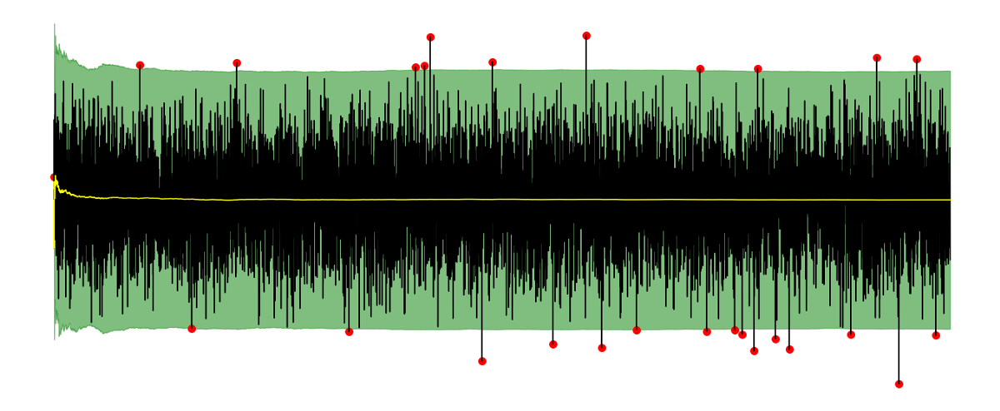
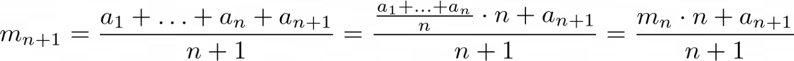
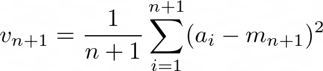
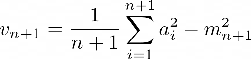
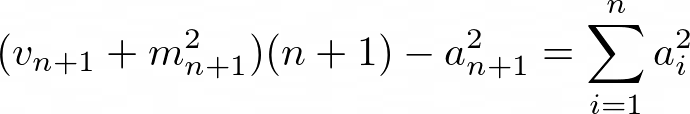
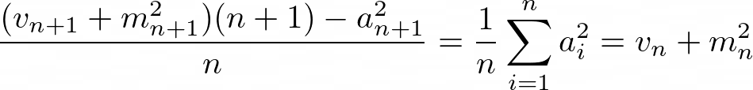
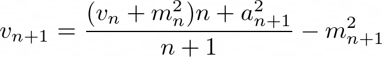
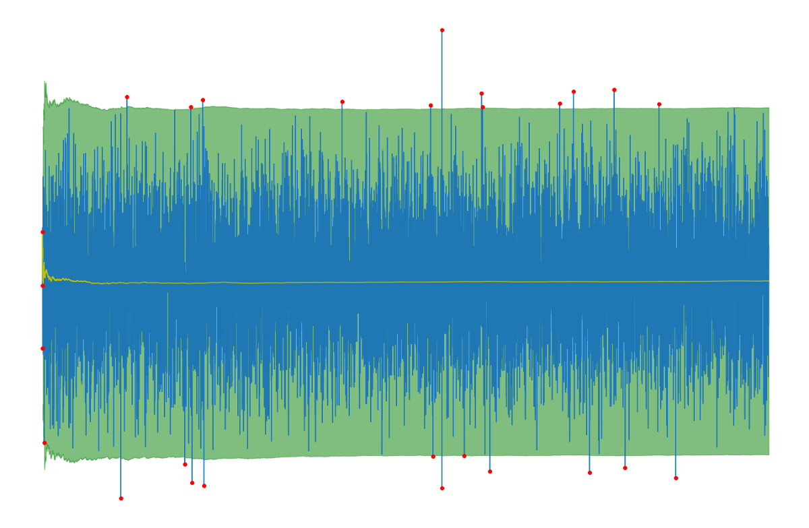
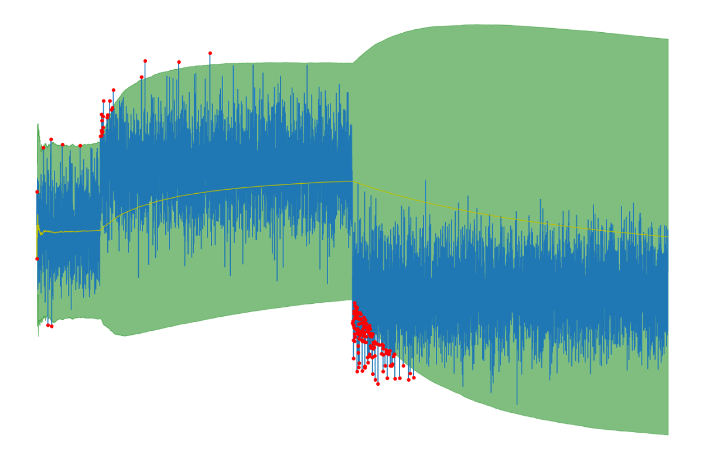

我希望我能教你一些有用的东西。

谢谢阅读！

如有任何疑问，请在LinkedIn上给我写信！

另外，请查看其他有关可掌握的机器学习主题的文章。

为了解决这个问题，我们只能使用最后k个样本来计算均值和标准差，因为这会破坏第一次测量的影响。 如果将k设置为无穷大，则可以从之前获得算法。

我们将k设置得越低，算法就越快地适应新数据。 但是，将k设置得太小可能会导致丢弃异常值，因为该算法认为新数据就是这样。 在设置k = 1的极端情况下，没有元素被视为离群值，因为仅考虑了最新元素。

根据用例，可能几百或几千个就可以了。
# 结论

在本文中，我们已经看到了如何为数据流建立一个非常简单的异常检测机制。 我们的算法不需要存储所有测量值，因此非常容易应用，也可以在极其受限制的硬件上使用，并且只需固定存储即可。 该算法甚至可以适应数据更改，因此无需手动更新。

唯一需要调整的是自适应率，我们在本文中没有介绍，但是很容易做到。
# 在数据流中轻松检测异常值
## 一种简单的方法，可通过Python实现在数据流中查找异常值


在上一篇文章中，我解释了流算法的概念，并给出了许多如何应用流算法的示例。 其中之一是在不保存数据流元素的情况下计算数据流的滚动平均值。 现在，我想扩展这个示例，并在异常值检测的背景下向您展示另一种流算法的用例。

当我们监视机器的功耗以检测任何异常行为时，可能会出现类似的问题。 如果我们发现异常值有所增加（异常观察），则可能表明这台机器的默认值，可能值得检查。
# 定义和示例

离群值可以通过多种方式定义。 在本文中，我们将使用以下定义：

如果数字数据流中的元素与到目前为止所见元素的平均值不在3个标准偏差之内，则该元素被视为离群值。

这需要一个小例子。 假设我们按顺序获得数据3、2、4、3、5、3、2、10、2、3、1。 让我们进一步假设，我们从零的均值和方差（以及因此的标准差）开始，即，如果不等于零，则始终将第一个元素视为离群值。

因此，将3视为离群值，因为3> 0 3 * 0。 现在，我们根据到目前为止看到的元素（仅是数字3）更新均值和方差。因此，新均值是3，方差是0。

然后我们看到2。我们有2> 3 3 * 0，所以2也被认为是离群值。 这是有道理的，因为到目前为止我们只看到了3，所以其他任何数字都不适合该模式。 平均值更新为（3 2）/2=2.5，方差更新为（（3-2.5）²（2-2.5）²）/2=0.25，这意味着标准偏差为0.5。

现在我们看到4。由于2.5–3 *0.5≤4≤2.53 * 0.5，因此该数字不是异常值（即正常值）。 平均值更新为（3 2 4）/ 3 = 3，方差更新为（（3–3）²（2–3）²（4–3）²）/ 3 = 2/3，因此标准偏差为 约0.81。

以下数字3、5、3、2被认为是正常的。 凭直觉，我们将下面的数字10视为离群值。 让我们看看该算法的作用。 此时的平均值约为3.1，标准偏差约为1。由于10> 3.1 3 * 1，因此我们希望将10视为离群值。

如果继续最后三个元素，您将看到它们都是正常的。

问题：要计算平均值和标准偏差，我们必须记住到目前为止看到的所有元素。 如果我们有一个每天输出成千上万个元素的系统，那么这不是一个选择。
# 救援的流式算法

解决此问题的一种方法是使用流算法，该算法在从数据流中每个被扫描元素之后更新其内部状态。 内部状态由到目前为止在任何点看到的所有元素的均值和方差组成，从看到任何元素之前的均值和方差为零开始。 确切地说，在看到数据流的第n个元素之后，令mₙ为平均值，vₙ为方差，并附加定义m₀=v₀= 0。
## 计算均值

在我有关流算法的文章中，我们看到了如何仅使用旧的均值，正在扫描的最新元素以及到目前为止看到的元素数量来更新均值。 这意味着我们只需要随时使用这种方法存储两个数字，而不是像幼稚的方法那样存储n。 让我再次显示它，将数据流的第i个传入元素表示为aᵢ：


这个公式不难开发，对吧？ 有了它，我们就有了我们期望的元素大小的基线。 现在，我们只需要可以用均值围绕的标准偏差即可将输入的示例分类为离群值和正常数据点。 我们通过计算方差来做到这一点，然后取其平方根即可达到标准偏差。
## 计算方差

在这种情况下，我们也可以轻松找到递归公式。 首先，看到n个元素后的方差为


让我们尝试再次根据n，vₙ和最新元素来写。 由于方差取决于均值，因此我们也要包含mₙ。 在开始之前，让我们重新安排这个公式，以使事情变得更容易：


现在，目标是使vₙ进入那里。 一种进行方式是从以下简单的重新排列开始，以隔离平方和直到索引n，它也以vₙ中的一项出现：


这相当于


反过来导致


现在，我们有了公式，让我们看看它在Python中是如何工作的！
# 用Python实现

我们可以通过以下方式实现上述解释：
```
class StreamingMeanAndVariance:    def __init__(self):        self.mean = 0        self.variance = 0        self.n_elements = 0    def update(self, element):        self.variance = ((self.variance + self.mean ** 2) * self.n_elements + element ** 2) / (self.n_elements + 1)        self.mean = ((self.mean * self.n_elements) + element) / (self.n_elements + 1)        self.variance = self.variance - self.mean ** 2        self.n_elements += 1
```

关于此的注释：update方法的第一行计算方差，但不减去当前均方根。 在第二行中，计算当前平均值。 在第三行中，然后将其从方差中减去，因为在第一行中仍然缺少此值。

要使用它，我们会
```
import numpy as npm = StreamingMeanAndVariance()n = 10000for i, s in enumerate(np.random.randn(n)):    if not - 3 <= (s - m.mean) / np.sqrt(m.variance) <= 3:        print(i, s)    m.update(s)
```

这将扫描数据流，该数据流在此示例中由10000个正态分布的数字组成（我们将其表示为N（0,1）），并在出现异常时打印异常值。

如果将法线的间隔和平均值（以黄色表示）作图，则会得到以下图片：

> In blue, you can see the measurements. The region in green contains the normal points, and measurements outside of it (indicated in red) are considered outliers. In yellow, you can see the expected values (mean).

# 讨论区

该算法可以达到我们的期望！ 但是，到目前为止，我们还没有看到它如何处理分配的变化，而是始终只有标准的正态分布数。

让我们测试执行以下操作时算法的行为：

结果看起来像这样：

> Everything adapts slowly to the new data.

## 善良

这看起来很有希望！ 一切都会自动适应新数据。 当数据的平均值从0变为2时，我们可以看到很多离群值，这是有道理的。 新平均值2越多，观测到的异常值就越少，因为2左右是新的常态。

当将平均值从2更改为-2时，我们可以看到更多的离群值，因为这种变化要严重得多。 到目前为止，一切都很好。
## 坏人

如果查看图的右半部分，可以看到对新数据的适应非常慢。 如您所见，平均值和标准偏差将在一段时间后再次达到正确的水平，因为黄线（均值）下降并且绿色区域再次变窄。 但是直到稳定为止，没有发现异常值。
```
(本文翻译自Dr. Robert Kübler的文章《Easy Outlier Detection in Data Streams》，参考：https://towardsdatascience.com/easy-outlier-detection-in-data-streams-3089bfefe528)
```
