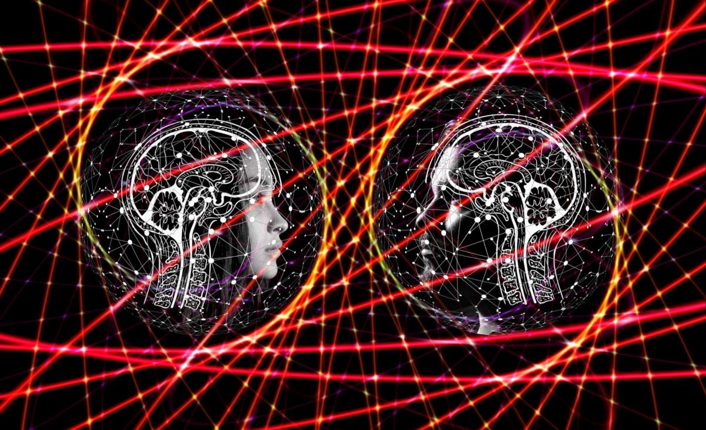

# 讨论了2020年AI技术的八项专家预测
## 人工智能如何在未来十个月内防止欺诈，推进供应链并提高预测能力

> Image Source: Pixabay


在2019年末，《福布斯》的Gil Press发表了一篇文章，探讨了来自各个行业的120位专业人员的与AI相关的预测。

我自由探索了八种我认为与TDS和中型读者最相关，最有趣和最有价值的意见。 我已链接到上述Gil的文章，请随时阅读当今AI世界中占卜者的所有其他出色预言。

但是首先，让我们从世界各地的CEO，VP，Marketers和Engineers的眼光来看AI的未来。
# 1.实时交通监控和下一代产品。

Hailo是深度学习处理器行业的领先公司，联合创始人兼首席执行官Orr Danon表示：

“随着AI本身真正融入芯片中，从源头上开启了一个全新的计算时代-我们才刚刚起步。 人工智能芯片已经在提高车辆更有效地处理视觉数据的能力，为未来的自动驾驶汽车铺平了道路。 对于智能城市，AI芯片将协助完成关键任务，例如实时交通监控，查找失踪人员和查找被盗车辆。 对于智能家居，芯片将通过在源头处理数据来确保更高的隐私性和可靠性。 对这些新技术的需求将为各种新应用和用例奠定基础，推动下一代产品的活动和产品需求的优化。 AI芯片的新时代意味着技术的新时代”。

这是一个令人兴奋的预测，并且来自一家公司，该公司“以数据中心级计算机的性能来赋予智能设备以最小的功耗，尺寸和成本进行实时操作”，我会说一个独特的愿景 。
# 2.内容推荐和上下文识别的进展

harmon.ie的联合创始人兼首席执行官Yaacov Cohen说：

“企业图和机器学习的新进展将使上下文识别和内容推荐成为可能，从而帮助信息工作者应对信息蔓延。 人工智能将通过增加和集中人类的努力，并根据用户的当前环境提供信息来减轻认知负担，从而帮助转变数字化工作场所。”

作为一家提供世界一流的智能助手和智能信息管理的公司，该公司致力于将其与Outlook，Office 365，Sharepoint，OneDrive等集成在一起，我想说这些人将更加努力以使我们在 接下来的12个月及以后。
# 3.供应链增强

Cleo产品开发高级副总裁Jorge Rodriguez说：

“由于历史上供应链行业在数字化方面的采用速度很慢，因此，对于AI / ML算法而言，收集的数据不足以提出可靠的建议。 随着我们开始看到2020年将出现更现代化的供应链，人工智能和机器学习算法将使30,000英尺高的供应链视图成为可能，并提供宝贵的见解以缓解以前繁琐的流程，例如产品重定向，新合作伙伴和供应商入职，订单取消 ，供过于求等等。”

对于制造，批发和物流行业而言，这是个好消息，Cleo都在帮助他们简化流程并提高效率。 Cleo借助其云技术实现了集成平台的现代化。
# 4.数字伴侣

直觉机器人市场部副总裁Dafna Presler说：

“我们将开始看到针对特定领域的数字伴侣，这将帮助我们完成任务并更好地利用技术，例如，积极主动的副驾驶员将帮助我们在汽车中使用技术，成为更安全的驾驶员并预测在此期间的需求 驱动器。”

对于任何想像中的朋友来说，在他们的童年时代都消失了的好消息。 似乎有一种辅助技术甚至可以作为全息化身出现，可以帮助我们学习，纠正错误并提高效率。 这不是AI技术的症结所在吗？ 帮助我们成为更好的自我版本？
# 5.预测技术将提高

PagerDuty工程高级副总裁Tim Armandpour预测：

“到2025年，“实时”还不够好。 业界将需要AI才能超越实时性而成为可预测的。 我们需要进一步走一步，才能真正预测出即将发生的事情，就像气象学家预测天气一样。 大量准确的数据可以提供上下文并突出显示新出现的模式，从而揭示概率。 借助AI的一点帮助，就可以进行预测。”

对于AI技术的未来使用，这是一种大胆而意识形态的观点，也是我的最爱。 作为营销专家，任何可以帮助预测未来并帮助我采取实时行动的东西都是真正的收获。
# 6.员工经验将得到改善

UJET的创始人兼首席执行官Anand Janefalkar说：

“到2020年，人工智能将大大改善员工体验（EX）。 自动，即时地从多个渠道收集数据，对其进行分析并提供可行的见解的能力将使支持代理能够更快，更轻松，更准确地解决客户的查询，并获得高度令人满意的问题解决方案。”

对于人力资源和面向客户的服务专业人员而言，这都是一个好消息。 对于喜欢我的消费者来说，这也很棒，他们讨厌被搁置二十分钟或更长时间。
# 7.更好的防欺诈技术

Credorax首席执行官Igal Rotem说：

“人工智能在支付领域的作用不只是增强数据科学和防止支付欺诈技术的手段。 随着金融法规的发展以满足全球支付领域的新需求，我们将看到AI在确保商户合规性和无缝客户体验方面发挥着不可或缺的作用。 在未来的几年中，人工智能将使企业能够简化运营，更好地为客户服务，进而在经济和文化上创造指数级的发展。”

希望这将有助于提高像您和我这样的人的安全性，同时也可以消除流行媒体中精简的关于加密货币和区块链技术的负面含义。
# 8.帮助人们相互了解，自我教育和增进关系

Jiminy联合创始人兼首席执行官Tal Guttman说：

“如今，许多AI解决方案都试图将用户数据转化为广告收入。 随着AI的飞速发展，我希望到2020年会有更多的用户提出以下问题：这些相同的AI解决方案每天如何为我工作，而不是为我工作。 单单这个问题就可以将AI推到我们今天认为不可或缺的地方，无论是为人父母，人际关系，教育等。从积极的角度来看，这意味着AI工具将允许更大的个性化和个人化感。 但是，创建这些AI应用程序的公司必须优先保护他们收集的个人数据”

Jiminy帮助父母管理孩子的在线活动，这在当今世界上是完美的。 互联网是信息的宝库，其中一些信息最好不要泄露，并由意图不纯的人发布。

您如何看待人工智能在未来十个月及以后的发展？

我很想听听您的意见和预测。
```
(本文翻译自Marcel Deer的文章《Eight Expert Predictions for AI Technology in 2020 Discussed》，参考：https://towardsdatascience.com/eight-expert-predictions-for-ai-technology-in-2020-discussed-306647a86969)
```
