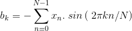
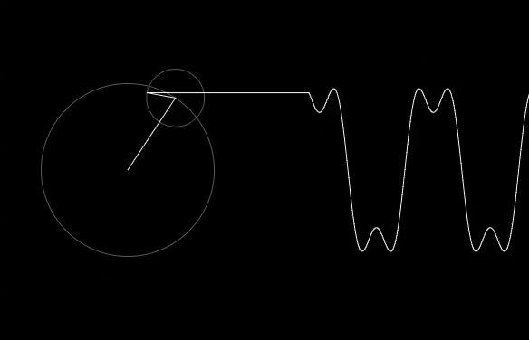

# 数据科学家的傅立叶变换
## 本文简要介绍了数学上的傅立叶变换及其在AI中的应用。

> Pic Credit: Shutterstock

# 介绍

傅里叶变换是有史以来最深刻的数学见解之一，但不幸的是，其含义深深地埋在了一些荒谬的方程式中。

傅立叶变换是一种将某些东西分解为一堆正弦波的方法。 像往常一样，这个名字来自一个很久以前住的人，叫做傅里叶。

用数学术语来说，傅立叶变换是一种将信号转换为其组成成分和频率的技术。

傅里叶变换不仅广泛用于信号（无线电，声音等）处理，而且还广泛用于图像分析（例如，傅里叶变换）。 边缘检测，图像过滤，图像重建和图像压缩。 一个例子：透射电子显微镜图像的傅立叶变换有助于检查样品的周期性。 周期性-表示模式。 数据的傅立叶变换可以扩展有关分析样品的可访问信息。

为了更好地理解它，请考虑信号x（t）：


如果我们对另一个信号执行相同操作，并选择相同的时间点，我们将测量其幅度。

考虑另一个信号y（t）：


当我们同时发射这两个信号或将它们加在一起时会发生什么？

当我们同时发射这两个信号时，我们得到一个新信号，它是这两个信号的振幅之和。 之所以如此，是因为这两个信号被加在一起。

将两个信号求和：z（t）= x（t）y（t）


如果只给出一个信号（x（t）和y（t）之和），我们能否恢复原始信号x（t）和y（t）？

是。 这就是傅里叶变换的作用。 它吸收信号并将其分解为组成它的频率。

在我们的示例中，傅立叶变换会将信号z（t）分解成其组成频率，如信号x（t）和y（t）。

傅里叶变换的作用是将我们从时域移到频域。

> Source


如果有人在想，如果我们想从频域回到时域怎么办？

我们可以使用傅立叶逆变换（IFT）来实现。
# 您需要知道的数学。

“时域中的任何连续信号都可以由无穷多个正弦波唯一唯一地表示。”

这是什么意思？

这意味着，如果我们有一个由某个函数x（t）生成的信号，那么我们可以提出另一个函数f（t）：


因此，无论信号有多强，我们都可以找到f（t）之类的函数，它是无穷多个正弦曲线之和，实际上可以完美地表示信号。

现在，现在出现的问题是，如何在上式中找到系数，因为这些值将决定输出的形状，从而决定信号的形状。


因此，为了获得这些系数，我们使用傅立叶变换，并且傅立叶变换的结果是一组系数。 因此，我们使用X（w）来表示傅立叶系数，它是频率的函数，是通过求解以下积分得到的：

傅立叶变换表示为不定积分：

X（w）：傅立叶变换x（t）：傅立叶逆变换


> Fourier Transform and Inverse Fourier transform


另外，当我们实际求解上述积分时，我们得到这些复数，其中a和b对应于我们要求的系数。

连续傅立叶变换将无限持续时间的时域信号转换成由无限数量的正弦波组成的连续频谱。 实际上，我们处理的是离散采样的信号，通常以固定间隔，有限的持续时间或周期性地进行。 为此，经典傅里叶变换算法可以表示为离散傅里叶变换（DFT），该函数将函数的等距样本的有限序列转换为离散时间的等距样本的等长序列 傅里叶变换：


因此，这本质上是离散傅立叶变换。 我们可以进行此计算，它将产生ib形式的复数，其中有两个傅里叶级数系数。

现在，我们知道了如何对信号进行采样以及如何应用离散傅立叶变换。 我们想做的最后一件事是，我们想摆脱复数i，因为在mllib或systemML中不支持复数，因为它使用称为Euler的公式来表示：


因此，如果将欧拉公式插入傅立叶变换方程并求解，它将产生实部和虚部。


如您所见，X由ib或a-ib格式的复数组成。 因此，如果您求解上述方程，您将获得傅立叶系数a和b。



现在，如果仅将a和b的值放在f（t）的方程式中，则可以根据信号的频率定义信号。

通常，我们使用快速傅里叶变换（FFT）算法，该算法将DFT递归地划分为较小的DFT，从而大大减少了所需的计算时间。 DFT的时间复杂度为2N²，而FFT的时间复杂度为2NlogN。
# 为什么表示信号时要使用余弦和正弦函数？

虽然Sine和Cosine函数最初是基于直角三角形定义的，但从当前情况来看，这并不是最好的方法。 您可能已经被教会认识到正弦函数是“斜边对立的”，但是现在该是一个稍微不同的观点了。

考虑单位圆：


在笛卡尔平面上。 假设通过原点的直线与𝑥轴在逆时针方向上形成角度θ，则直线与圆的交点为（cos⁡θ，sin⁡θ）。


想一想。 这种观点与较早的观点相关吗？ 这两个定义是相同的。

假设我们通过使θ线性增加来开始旋转直线。 您会得到如下信息：

> Credits


正弦和余弦函数在某些情况下可以说是最重要的周期函数：
+ SHM振荡器中位移，速度和加速度如何随时间变化的周期性函数是正弦函数。
+ 每个粒子都有波动的性质，反之亦然。 这是德布罗意的波粒对偶。 波始终是某种物理量的正弦函数（例如EM波的电场和声波的压力）。

声音本身就是压力扰动，它通过能够压缩和扩展的材料介质传播。 随声波变化的一点是压力，它随时间呈正弦变化。
# 傅立叶变换的收敛

如果一个点以恒定的速度绕圆运行，则其在地面上方的高度将跟踪正弦函数。 点移动的速度对应于频率，圆的半径对应于振幅。


再增加1个圆圈，


再添加2个圈子，


再添加9个圈子：


几乎是离散的波形。

由于傅立叶定理，我们可以生成具有适当频率和半径的圆的任何信号。 例如，这是一个近似的方波。

我使用了来自＃125编码挑战的Dan Shiffman的代码来制作动画。 您可以从他的GitHub获取javascript代码，也可以尝试一下。
# 人工智能中的傅立叶变换

傅里叶变换是线性函数，可引起非线性。 使用卷积。

2个信号乘积的傅立叶变换是2个信号的卷积。

令x（t）和y（t）是两个具有卷积X（t）* Y（t）的函数，则

F {x（t）.y（t）} = X（t）* Y（t）

请记住，时域中的卷积是频域中的乘法。 这就是傅立叶变换主要用于机器学习，尤其是深度学习算法的方式。

我将以卷积神经网络（CNN）为例；

undefined

代替卷积，输入和滤波器矩阵通过FFT转换到频域，以进行乘法。 然后，通过逆FFT（IFFT）将输出转换回时域。


FFT的另一用途是可用于降维或特征提取。

当数据集中的每个样本都是信号（时间序列或图像等）时，它可能包含数千个样本。 但是它们实际上可能只对应于傅立叶域中的几个点（特别是如果存在一定的周期性）。 这大大简化了问题。

有时使用傅立叶域可能会提供平移不变性。 也就是说，即使信号之间存在滞后，这种方差也不会影响它们在傅立叶域中的表示。
# 傅立叶变换的Python实现

可以使用numpy和scipy python库完成FFT的最简单实现。
```
%matplotlib inlineimport numpy as npimport matplotlib.pyplot as pltimport scipy.fftpack# Number of samplepointsN = 600# sample spacingT = 1.0 / 800.0x = np.linspace(0.0, N*T, N)y = np.sin(50.0 * 2.0*np.pi*x) + 0.5*np.sin(80.0 * 2.0*np.pi*x)yf = scipy.fftpack.fft(y)xf = np.linspace(0.0, 1.0/(2.0*T), N/2)fig, ax = plt.subplots()ax.plot(xf, 2.0/N * np.abs(yf[:N//2]))plt.show()
```

> FFT plot

# 结论

FFT用于数字记录，采样，加法合成和音高校正软件。

FFT的重要性源于以下事实：它使在频域中的工作与在时域或空间域中的工作在计算上同等可行。 FFT的一些重要应用包括：
+ 快速大整数和多项式乘法
+ Toeplitz，循环矩阵和其他结构化矩阵的高效矩阵向量乘法
+ 过滤算法
+ 离散余弦或正弦变换的快速算法（例如用于JPEG和MPEG / MP3编码和解码的快速离散余弦变换）。
+ 快速切比雪夫逼近。
+ 求解差分方程。
+ 同位素分布的计算。

好吧，这就是本文的全部内容，希望大家喜欢阅读，如果本文对您有所帮助，我将感到非常高兴。 随时在评论部分分享您的评论/想法/反馈。

谢谢阅读！！！
```
(本文翻译自Nagesh Singh Chauhan的文章《Fourier Transformation for a Data Scientist》，参考：https://towardsdatascience.com/fourier-transformation-for-a-data-scientist-1f3731115097)
```
