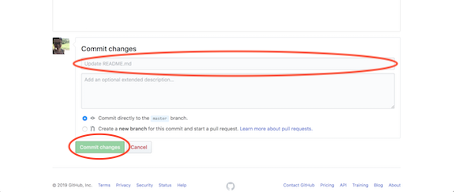

# Git和GitHub入门：完整的初学者指南
## 好奇和完全困惑的Git和GitHub基础（加上为您的第一个开源项目做出贡献的最简单方法！）

> Photo by James Bold on Unsplash


想要开始使用Git和GitHub？ 您需要与团队合作吗？ 您正在从事一个项目吗？ 您最近是否发现过，如果您希望有人认真对待技术，几乎需要使用GitHub？

…您真的只想为您的第一个开源项目做出贡献吗？

这个是给你的！

> Photo by Greyson Joralemon on Unsplash


入门非常简单。 如果您是快速阅读者（并且不需要花费很多时间进行注册和安装），那么现在大约十分钟即可在GitHub上启动并运行。

如果您通读本文，可以练习克隆现有存储库，创建分支，进行更改以及创建拉取请求。 在此过程中，您可能还会学习如何找到终端，使用终端命令以及编辑markdown（.md）文件！

如果您做了所有这些，那么恭喜您！

您将为您的第一个开源项目做出贡献-GitHub Welcome Wall！ （如果您想直接进入开放源代码贡献部分，请向下滚动，直到找到名为“让我们这样做！”的部分。）

本文将帮助您入门并掌握基础知识。 当然，如果您想像专业人士一样使用Git和GitHub，则需要学习很多东西。 您可以超越此介绍性信息！ 不过，我们将把下一级的内容再留一遍。

让我们开始吧！
## 什么是Git？ 什么是GitHub？

从开发人员到设计人员，Git基本上是现在每个人都选择的版本控制技术。 GitHub是一个社交代码托管平台，目前使用率最高。 在这里您可以玩耍和尝试。 在这里，您可以找到（并体验）最令人难以置信的开源信息，新兴技术，功能和设计。 这是一个学习的地方，也是一个参与的地方。 您可以将代码保存在这里以供工作或上学，还可以获取一些想进一步探索的可爱代码。 您甚至可以直接从您的资源库免费托管网站！ （如果您想知道如何做，请查看本文！）

> Photo by Jamie Haughton on Unsplash


有很多使用Git和GitHub的方法，但是GitHub入门并不需要太多。 您不需要是某种主编码器或任何其他工具。 您甚至可以直接在GitHub网站上做最重要的事情！

话虽这么说，这是一个好主意，找到您的终端并让它变得最舒适。 终端命令使事情变得如此之快！ 我一定会向您展示如何开始使用GitHub网站。 我还将向您展示一些终端命令，您可能希望使用这些命令来使自己的生活更美好。

每当您在本文中看到包含以下标记的命令：<>时，都想删除这些标记，并用自己的信息替换它们之间的内容。

假设您看到类似git add <filename>的内容。 这意味着，如果要向GitHub存储库添加名为“ hello_world.py”的文件，则可以输入git add hello_world.py。

我将在这里给您很多解释，但是这些都是您真正需要入门的终端命令：
```
git clonegit statusgit addgit commit -m “ “git push
```

而已！ 那些是大个子！ 如果您能解决这些问题，那就太好了。 您可以立即开始进行项目！

> Photo by Delaney Dawson on Unsplash


我们还将讨论
```
git initgit branchgit mergegit checkout
```

您可能正在与其他人一起工作，或者您可能想要进行更改并在真正提交之前对其进行测试。 上面的命令是您开始进行协作所需要的。

git帮助

如果您刚刚起步，它也非常有用！ 我们也会对此进行讨论。

（如果您使用的是Mac，则已经有一个终端！您可以通过点击屏幕右上角的放大镜图标并搜索“终端”一词来进行搜索。）
## 步骤1：注册并安装！

转到GitHub并注册一个帐户。 您可以就此停止，并且GitHub可以正常工作。 不过，如果尚未安装Git，则是个好主意。 没有它，您绝对可以上手，但是如果您想在本地计算机上工作，那么您需要安装Git。 您可以下载它或通过软件包管理器来安装它。

现在转到终端，向Git自我介绍！ 要为计算机上的每个存储库设置用户名，请输入
```
git config --global user.name "<your_name_here>"
```

用引号中的您自己的名字替换“ <您的名字在这里>”。 您可以使用任何名称或所需的名称。 如果您只想为一个存储库设置名称，则省略“全局”一词。

现在，您可以告诉Git您的电子邮件，并确保它与您注册GitHub时使用的电子邮件相同
```
git config --global user.email "<your_email@email.com>"
```

将电子邮件设为不公开很容易，您可以在本文中找到这些说明。 您只需要在GitHub帐户中选中两个复选框即可。

现在，您可以开始在计算机上使用Git了！

> Photo by Matty Adame on Unsplash


首先，您可以在GitHub网站上创建新的存储库，或执行git init从项目目录中创建新的存储库。

该存储库由三个“树”组成。第一个是工作目录，其中包含实际文件。 第二个是索引或暂存区。 然后是头，指向您上一次提交的内容。
## 我已经对终端满意（选项1）

从终端开始的方法如下：

如果您有项目目录，只需转到终端，然后在项目目录中运行以下命令
```
git init 
```

如果要使用项目目录中的所有文件来初始化项目，请运行
```
git init .
```

包括一切。

假设您有一个名为“ new_project”的项目文件夹。您可以转到终端窗口中的该文件夹，然后通过运行以下命令为其添加本地存储库
```
cd new_projectgit init
```

现在，您的项目目录中有一个名为.git的新隐藏目录。 这是Git存储所需内容的地方，以便它可以跟踪您的项目。 现在，您可以使用以下命令将文件一个接一个地添加到登台区域
```
git add <filename_one>
```

或跑步
```
git add .
```

将所有文件添加到暂存区。 您可以使用以下命令来提交这些更改
```
git commit -m "<add a commit message here>"
```

如果您对所做的更改感到满意，则可以运行
```
git push
```

推动您的更改。 您可以通过运行以下命令来检查是否有更改要随时推送
```
git status
```

如果进行了一些更改，则可以一次更新文件
```
git add <filename>
```

要么
```
git add --all
```

然后用您的提交消息提交它们并推动它们通过。

而已！ 现在，您可以初始化存储库，提交文件，提交更改，并将其推送到master分支。

如果您有此知识，只需向下滚动至“学习与他人合作”，即可进行分支和协作！

> Photo by Jonathan Daniels on Unsplash

## 我不知道你刚才说了什么（选项2）

我假设所有对选项2感兴趣的人都是新手，可能有一个充满文件的文件夹（或者您打算有一个文件）要放置在GitHub上，而您只是不知道 怎么做。

让我们做到这一点！

假设您要创建一个新的存储库。 （您可能会这样做的！这就是您的项目的生存地。如果您不打算创建新的存储库，则可能要克隆一个现有的存储库。我们将在接下来的内容中进行讨论，但这就是您如何抓取其他人的项目并 您的工作或所学课程所需的信息。）

您的存储库是组织项目的地方。 您可以保留文件夹，文件，图像，视频，电子表格，Jupyter笔记本，数据集以及项目所需的其他任何内容。 在使用Git之前，您必须为项目初始化一个存储库并进行设置，以便Git对其进行管理。 您可以直接在GitHub网站上执行此操作。

包含自述文件以及有关您的项目的信息是一个明智的主意。 单击复选框，可以在创建存储库的同时创建一个存储库。
+ 转到GitHub网站，单击右上角的，单击标志，然后单击“新建存储库”。
+ 命名存储库，并添加快速描述。
+ 确定您是希望将其作为公共存储库还是私有存储库
+ 如果要包括自述文件，请单击“使用自述文件初始化此存储库”。 （我绝对建议您这样做！这是人们在签出您的存储库时首先要考虑的事情。这也是放置理解或运行项目所需的信息的好地方。）

> New repository


> Creating your new repository


如果您愿意，您完全可以从这一点开始工作！ 您可以直接从GitHub网站上的存储库中上传文件，编辑文件等。 但是，您可能仅对此选项感到不满意。

有两种更改项目的方法。 您可以在计算机上的文件/笔记本中进行更改，也可以直接在GitHub上进行更改。

假设您想直接在GitHub上对自述文件进行一些更改。
+ 首先，转到您的存储库。
+ 单击文件名以调出该文件（例如，单击“ README.md”转到自述文件）。
+ 单击文件右上角的铅笔图标，然后进行一些更改。
+ 在描述您所做更改的框中写一条短消息（如果需要，还可以提供扩展描述）。
+ 点击“提交更改”按钮。

> Editing your file on GitHub


> Committing your changes


现在，已对新存储库中的README文件进行了更改！ （我很快想引起您的注意，您可以在上图中查看该小按钮，该按钮将使您可以为此提交创建一个新分支并启动拉取请求。稍后我们将进行讨论！）

很简单，对不对？

我更喜欢在本地计算机上处理文件，而不是尝试使GitHub网站上的所有功能正常工作，所以现在就进行设置。
## 吉米那个项目！

您可能想要克隆新的存储库，以便可以在本地计算机上对其进行操作，或者您可能已有要克隆的现有存储库。 （对于项目或课程，您可能需要这样做。）

为了将存储库克隆到您的计算机上，请访问GitHub网站上的存储库，然后单击显示“克隆或下载”的绿色大按钮。 没关系。但是我相信您，因此继续！）确保其显示“使用HTTPS克隆”。现在单击剪贴板图标将其复制并粘贴到剪贴板（或突出显示该链接并复制）。

> Clone or download a repository


现在，您将打开终端，并转到要放置该存储库的位置。 例如，您也许可以输入
```
cd Desktop 
```

进入桌面。 然后在此处克隆您的存储库，以使其易于查找。 要克隆存储库，请键入
```
git clone <that_thing_you_just_copied>
```

简单！ （不要忘记将<>标记之间的信息更改为刚复制的字母和数字字符串！此外，请确保删除<>。）

如果您以前没有在终端中四处走动，则可以使用cd命令缓慢走动，直到到达想要的位置。 例如，打开您的终端并键入ls以列出下一步可能去的选择。 您可能会看到列出了“台式机”，并且只需键入cd Desktop即可进入桌面。 然后，您可以运行上面的git clone命令，将存储库直接克隆到桌面上。

您可能会看到一些用户名，而不是诸如“ Desktop”之类的选项。在这种情况下，您需要先选择一个用户，然后再看到“ Desktop”，因此请用cd <user>替换用户（用用户名替换<user>） 然后再次输入ls以查看您的选择。 您现在很可能会看到“桌面”。 如果看到列出的桌面，则将输入cd Desktop。 现在继续进行git克隆！

如果您想在终端中后退一步，只需输入cd ..

现在，您有了一个新的GitHub存储库，可以在桌面上直接使用它进行克隆！ 该命令将存储库的完整副本直接复制到您的系统上，您可以在其中进行操作，进行更改，暂存更改，提交更改，然后将更改推回到GitHub。

如果您不想这样做，则无需将存储库放在桌面上。 您可以在任何地方克隆它。 打开终端后，您甚至可以运行git clone命令。 不过，我要说的是，如果您不太习惯在计算机上浏览，那么将项目放在桌面上就可以看到它并不是一个坏主意……

如果您只想自己玩一个项目，则可以在GitHub网站上创建它，而不用克隆它。 在屏幕的右上角附近查找“ fork”按钮，然后单击它。 这将在您的存储库中复制该存储库的副本，供您自己使用，而无需对原始存储库做任何事情。
## 现在是时候向您的项目中添加一些文件了！

> Photo by Nadim Merrikh on Unsplash


这就是我们要做的一切：
```
git statusgit addgit commit -m " "git push
```

完全不用担心！

我认为您可能有一些文件要放入新存储库中。 继续查找文件，然后将其拖放到您在桌面上创建的存储库的新文件夹中，就像通常需要将任何文件集移动到文件夹中一样。

现在，检查您的项目状态！

转到终端，进入存储库文件夹。 然后跑
```
git status
```

看看是否一切都是最新的。 （如果您只是将一些文件拖到项目文件夹中，肯定不是！）要将其中一个文件添加到存储库中，请运行
```
git add <fileneame>
```

否则，您可以添加所有内容
```
git add --all
```

甚至
```
git add .
```

这些是您建议的更改。 您可以使用全新文件以及已在其中但有一些更改的文件来执行相同的操作。 您实际上尚未添加任何内容。 您正在带来新文件和更改，以引起Git的注意。

要提交更改，您将通过运行以下内容启动该过程
```
git commit -m “<commit message>”
```

您是将更改提交给HEAD，而不是远程存储库。 （确保用自己的引号替换该消息。）进行更改后，使用“ commit”命令获取存储库的“快照”。 您将在带有“ -m”的“快照”中包含一条消息。

保存更改后，即称为提交。 进行提交时，您会收到一条消息，说明更改的内容和/或更改的原因。 这是让其他人知道您所做的更改以及更改原因的好方法。

现在，您的更改位于本地工作副本的开头。 要将更改发送到远程存储库，请运行
```
git push
```

将更改直接推送到存储库中。 如果您在本地计算机上工作，并且希望在线也可以看到提交，则可以使用git push命令将更改推送到git hub。

您可以通过运行git status命令随时查看所有内容是否都是最新的！

因此，现在您有了一个GitHub存储库，并且您知道如何添加文件和对其进行更改！

恭喜！！！
# 学习与他人合作

协作是GitHub上的游戏名称！

> Photo by Quinten de Graaf on Unsplash

## GitHub流程

假设您正在进行一个项目，并且在任何给定时间都可能会想到许多不同的想法和功能。 有些功能可能已准备就绪，但有些功能可能尚未准备就绪。 也许您正在与其他都在做自己的事情的人一起工作。 这是分支进来的地方！

分支是一个单独的空间，您可以在其中尝试新的想法。 如果您更改分支上的某些内容，则在您需要之前不会影响主分支。 这意味着您可以在该分支上做任何想做的事情，直到您决定是时候将其合并为止。

唯一可以永久更改的分支是master分支。 如果您不希望更改立即部署，请在单独的分支上进行更改，并在准备好后将其合并到master分支中。

如果您正在与他人合作，并且希望自己进行更改，或者您在独立工作且希望在不影响master分支的情况下进行更改，则需要一个单独的分支。 您可以随时创建一个新分支。

在您的终端中创建一个名为“ new_feature”的分支并使用
```
git checkout -b new_feature
```

创建分支后，即可在该分支上进行更改。 这样一来，您就可以轻松查看更改的内容以及更改的原因。 每次提交更改时，都会添加一条消息，可用来描述您所做的事情。

让我们来谈谈结帐！
```
git checkout
```

可让您检出您当前不在其中的存储库。 您可以使用以下命令检出master分支
```
git checkout master
```

或查看“ new_feature”分支
```
git checkout new_feature
```

完成分支后，您可以将所有更改合并回去，以便所有人都可以看到。
```
git merge new_feature
```

将采用您对“ new_feature”分支所做的所有更改，并将其添加到主服务器。

为了创建上游分支，以便您可以推送更改并将远程分支设置为上游，您将通过运行来推送功能
```
git push --set-upstream origin new_feature
```

做出某些更改并确定喜欢之后，您可以打开拉取请求。 如果您在团队中，则这时团队中的其他人可以开始检查您的更改并进行讨论。 您可以随时打开请求请求，无论是让人们查看您的最终更改，还是因为您遇到麻烦而寻求帮助。
## 嗯...什么？ 我可以在网站上这样做吗？

您可以！

一种方法是简单地检查我们在编辑自述文件时前面提到的那个按钮。 超级容易！

您也可以随时在网站上随时创建新分支，方法是转到存储库，单击屏幕左中侧附近的下拉菜单，其中显示“ Branch：master”，输入分支名称，然后选择 “创建分支”链接（或点击键盘上的Enter）。 现在您有两个看起来相同的分支！ 这是进行更改并对其进行测试，然后再使它们影响master分支的好地方。

> Creating a branch


如果您在另一个分支上工作，则所做的更改只会影响该分支。

如果您对更改感到满意，并且希望将更改合并到master分支，则可以打开一个请求请求。 这样，如果您在团队中，则可以提出您的更改并要求某人进行审核，或者请您贡献一些内容并将其合并到其分支机构中。

即使您尚未完成代码，也可以在提交后立即打开拉取请求。 如果您愿意，可以直接在网站上进行此操作。 如果您在分支机构上进行了某些更改并且想要合并它们，则可以
+ 点击屏幕顶部中心附近的拉取请求标签
+ 点击绿色的“新请求请求”按钮
+ 转到“示例比较”框，然后选择要与原始分支进行比较的分支。
+ 查看您的更改，以确保它们确实是您要提交的内容。
+ 然后单击绿色的大“创建请求请求”按钮。 给它起一个标题，并简要描述您的更改。 然后点击“创建请求请求！”

> New pull request


> Create pull request


现在，如果这是您的存储库，则可以通过单击绿色的“合并拉取请求”按钮来合并您的拉取请求，以将更改合并到主数据库中。 单击“确认合并”，然后在分支与紫色框中的“删除分支”按钮合并后删除分支。

如果您为某个项目做贡献，那么团队（或审阅者）中的人可能会有疑问或意见。 如果您需要更改某些东西，这是时候了！ 如果一切顺利，他们可以在合并之前直接从分支机构部署更改以进行最终测试。 您可以部署更改以在生产中进行验证。

如果您的更改已通过验证，则可以继续并将代码合并到master分支中。 拉取请求将保留您的更改记录，这意味着您可以随时查看它们以了解所做的更改和做出的决定。
## 更新和合并

如果您使用的是计算机，并且需要最新版本的存储库，则可以使用git pull命令从GitHub进行更改。 要将本地存储库更新为最新的提交，请运行
```
git pull 
```

在您的工作目录中。

要将另一个分支合并到活动分支中，请使用
```
git merge <branch_name>
```

Git会尝试自动合并更改，但这并不总是可能的。 可能会发生冲突。 如果是这样，则需要手动合并冲突。 更改它们后，您可以将它们标记为与git add <filename>合并。 您可以预览更改，然后再与之合并
```
git diff <source_branch> <target_branch>
```

您可以使用切换回主分支
```
git checkout master
```

完成后，您将进行更改，然后删除分支
```
git branch -d new_feature
```

除非您使用以下命令将该分支推送到远程存储库，否则其他任何人都无法使用此分支
```
git push origin <branch>
```
## 其他有用的命令

首先，这是我最喜欢的GitHub速查表。 查看所有最有用的Git命令！

如果运行，则可以查看存储库的提交历史记录
```
git log 
```

您可以看到一个人的提交
```
git log --author=<name> 
```

您可以看到已更改但尚未上演的内容
```
git diff
```

需要帮助记住您应该执行的命令吗？ 尝试
```
git help
```

查看21个最常见的命令。 您也可以输入类似
```
git help clone 
```

找出如何使用“克隆”之类的特定命令。
## 我们开工吧！

> Photo by Mervyn Chan on Unsplash


为什么不留下您的印记，欢迎所有来这里学习Git和GitHub的人？ 我们将创建一个简单的欢迎墙，其中包含所有想尝试Git和GitHub并为他们的第一个开源项目做出贡献的人的笔记。

您可以在欢迎墙上添加任何想要的东西，只要保持温暖和令人鼓舞即可。 添加注释，添加图像，随便什么。 以任何使您快乐的方式改善我们的小世界。 （如果您太过思索（我看到了❤️），则README文件中预写了一条消息，您可以复制和粘贴该消息。）
+ 通过GitHub网站或通过运行来克隆存储库
```
git clone https://github.com/bonn0062/github_welcome_wall.git
```
+ 创建一个新分支，并在“ welcome_wall.md”文件中添加一个欢迎和鼓励的想法。 您可以在网站上执行此操作，但我真的建议您尝试将存储库克隆到计算机，使用喜欢的文本编辑器打开文件，然后在其中添加消息。 很好的学习！
+ 创建一个拉取请求。
+ 写一个简短的说明来描述您的更改，然后单击绿色按钮创建您的拉取请求。

而已！ 如果这是一个不错的消息，想法，图像或想法，我将合并您的请求，您将成功地为一个开源项目做出贡献。

恭喜！！！ 你做到了！

与往常一样，如果您对这些信息做得很出色，我很乐意听到！ 在回复部分留言或随时通过Twitter @annebonnerdata与我们联系。

谢谢阅读！

如果您想接触更多有趣的文章，请来Content Simplicity加入我的行列！

```
(本文翻译自Anne Bonner的文章《Getting started with Git and GitHub: the complete beginner’s guide》，参考：https://towardsdatascience.com/getting-started-with-git-and-github-6fcd0f2d4ac6)
```
