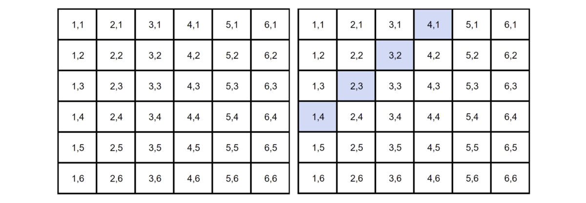

# Google的数据科学访谈脑筋急转弯
## 对Google的一些解决问题的简单，直观的解释

> Photo by Mitchell Luo on Unsplash


作为Google数据科学访谈的一部分，他们喜欢问一些被称为“解决问题”的问题，这些问题与脑筋急转弯非常相似。 在本文中，我们将介绍Google提出的六个问题，并在下面提供答案！
# 问题与解答
## 1.一个盒子有12张红牌和12张黑牌。 另一个盒子有24张红牌和24张黑牌。 您想从两个方框之一随机抽取两张牌，一次一张。 哪个盒子更有可能获得相同颜色的卡片，为什么？

undefined

假设您从各副牌中抽出的第一张牌是红色A。

这意味着在甲板上有12个红色和12个黑色，现在有11个红色和12个黑色。 因此，您另外抽出红色的几率等于11 /（11 + 12）或11/23。

在甲板上有24个红色和24个黑色，然后会有23个红色和24个黑色。 因此，您再绘制红色的几率等于23 /（23 + 24）或23/47。

因为23/47> 11/23，所以第二张卡片组拥有更多张牌时，获得相同两张牌的可能性更高。
## 2.您在赌场里，有两个骰子可以玩。 每次投下5杆，您将赢得10美元。如果您玩到赢得然后停止，您的预期支出是多少？

+ 假设您每次玩游戏的费用为5美元。
+ 有两个骰子的36种可能组合。
+ 在这36种组合中，有4种组合导致滚动5种（请参见蓝色）。 这意味着掷出5的几率是4/36或1/9。
+ 1/9的获胜机会意味着您将输掉8次，从理论上讲，您将赢得一次。
+ 因此，您的预期支出等于$ 10.00 * 1-$ 5.00 * 9 =-$ 35.00。

编辑：谢谢你们的评论并指出它应该是-$ 35！
## 3.如何判断给定的硬币是否有偏差？

这不是一个技巧性的问题。 答案只是执行假设检验：
+ 零假设是硬币没有偏斜，并且正面朝上的可能性应该等于50％（p = 0.5）。 另一种假设是硬币有偏，p = 0.5。
+ 翻转硬币500次。
+ 计算Z分数（如果样本小于30，则将计算t统计量）。
+ 与alpha比较（两尾测试，所以0.05 / 2 = 0.025）。
+ 如果p值> alpha，则不拒绝零值并且不对硬币进行偏置;如果p值<alpha，则不拒绝零值并且对硬币进行偏置。

在此处了解更多关于假设检验的信息。
## 4.使不公平的硬币变得公平

由于抛硬币是二进制结果，因此可以通过两次抛硬币来使不公平的硬币公平。 如果将其翻转两次，则可以押注两个结果：头跟着尾巴或尾巴跟着头。

P（头）* P（尾）= P（尾）* P（头）

这是有道理的，因为每次掷硬币都是独立的事件。 这意味着，如果您遇到正面→正面或反面→背面，则需要重新放置硬币。
## 5.您将要乘飞机去伦敦，想知道是否需要带把伞。 您打电话给三个随机朋友，然后问他们每个人是否在下雨。 您的朋友讲真话的可能性是2/3，而他们撒谎对您开玩笑的可能性是1/3。 如果他们三个都说正在下雨，那么伦敦实际上正在下雨的概率是多少？

您可以说这个问题与贝叶斯理论有关，因为最后一个陈述基本上遵循以下结构：“如果B成立，那么A成立的概率是多少？”因此，我们需要知道a在伦敦下雨的概率 给定的一天。 假设它是25％。

P（A）=下雨的概率= 25％P（B）=所有3个朋友说都在下雨的概率P（A | B）告诉他们正在下雨的概率在下雨P（B | A）概率 三个朋友都说正在下雨，因为正在下雨=（2/3）³= 8/27

步骤1：求解P（B）P（A | B）= P（B | A）* P（A）/ P（B），可以重写为P（B）= P（B | A）* P（ A）+ P（B |不是A）* P（不是A）P（B）=（2/3）³* 0.25 +（1/3）³* 0.75 = 0.25 * 8/27 + 0.75 * 1/27

步骤2：求解P（A | B）P（A | B）= 0.25 *（8/27）/（0.25 * 8/27 + 0.75 * 1/27）P（A | B）= 8 /（8 + 3）= 8/11

因此，如果三个朋友都说正在下雨，那么实际就在下雨的可能性是8/11。
## 6.您将获得40张带有四种不同颜色的卡-10张绿卡，10张红卡，10张蓝卡和10张黄卡。 每种颜色的卡从1到10编号。 随机选择两张牌。 找出被挑选的牌不是相同数目和相同颜色的可能性。

由于这些事件不是独立的，因此我们可以使用以下规则：P（A和B）= P（A）* P（B | A），它也等于P（不是A而不是B）= P（不是A） * P（不是B |不是A）

例如：

P（不是4而不是黄色）= P（不是4）* P（不是黄色|不是4）P（不是4而不是黄色）=（36/39）*（27/36）P（不是4而不是黄色） ）= 0.692

因此，选择的卡号不同且颜色相同的概率为69.2％。

就是这样！ 如果没有任何答案，请告诉我，我将尽力更彻底地解释它：)
## 资源资源
## Google数据科学家面试问题
### 38个Google数据科学家面试问题和36个面试评论。 免费面试者匿名发布的详细信息…
## Google数据科学面试问题将于2019年准备就绪| 埃杜雷卡
### 对于很多人来说，在像Google这样的全球知名公司中被录用是梦Dream以求的工作。 他们有一些……
```
(本文翻译自Terence Shin的文章《Google’s Data Science Interview Brain Teasers》，参考：https://towardsdatascience.com/googles-data-science-interview-brain-teasers-7f3c1dc4ea7f)
```
