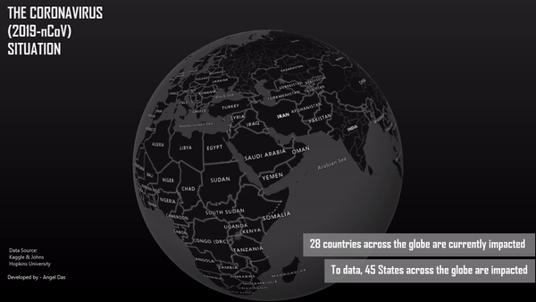
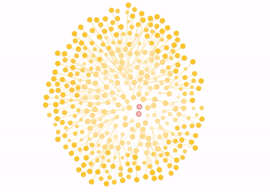
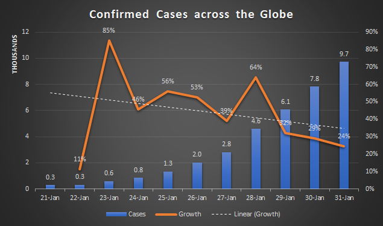
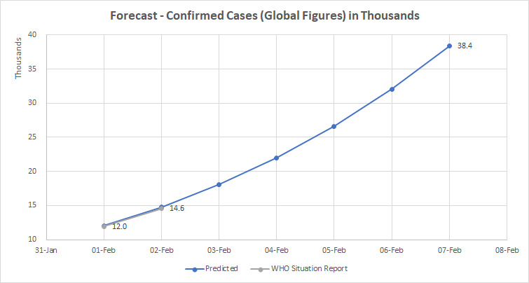
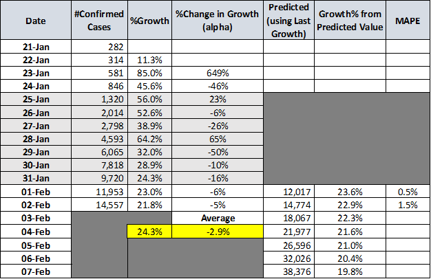

作者简介：高级分析专家和管理顾问，通过结合组织数据的业务，技术和数学，帮助公司找到各种问题的解决方案。 数据科学爱好者，在这里分享，学习和贡献； 您可以通过链接与我联系；
# 冠状病毒爆发有多严重？ -预测爆发数字
## 数据分析师的观点-您应该知道的4件事

“中国和其他地方的每个遭受苦难的人，愿上帝使受害者及其家属得到加强，并指导他们度过这个艰难的时期。 请遵循WHO网站上概述的建议，以确保安全和受到保护”
# 我们今天站在哪里？

undefined

> Countries impacted — As of Report till Jan 31, 2020 (Credit — Developed by the Author using Excel 3D Map)

# 病毒的传染性如何？

爆发的速度和难易程度决定了爆发的规模。 伦敦帝国学院发布的报告表明，患有冠状病毒的人可以影响1.5至3.5个健康人。 根据《纽约时报》的报道，如果5名新冠状病毒感染者可以感染2.6人，那么1个周期后5人可能生病，2个周期后18人，3个周期后52人，依此类推。

> How can a Coronavirus out-spread from 5 to 368 people in 5 Cycles (Credit: The New York Times)

# 中国的疫情有多严重？
## 数据与世界卫生组织辩论！

我致力于创建QlikSense基本仪表板，以监视当前情况并跟踪疫情。 您可以在下面找到更多有关它的信息。
## 新型冠状病毒（2019-nCoV）-世卫组织基于Web的新型交互式在线在线培训……
### 世卫组织的在线培训是目前对抗冠状病毒爆发的最佳武器； 涵盖检测方法...
## 时间序列预测与数据感知预测辩论！ —行业需求是什么？
### undefined
## 冠状病毒爆发有多严重？ -爆发-假设分析
### 数据分析师对当前情况的看法
## 为什么质量和意识检查在数据科学中如此重要？
### 世界卫生组织和Kaggle的2019-nCoV（冠状病毒）数据库如何用...讲述相同的故事...

undefined

> State/Provinces impacted in China (Credit — Developed by the Author using Excel 3D Map)

# 展望未来-到下周底，确认病例数将超过38,000！

鉴于我们没有足够的数据点，因此很难使用时间序列模型预测疫情。 让我们来看看随着时间的推移确诊病例的增长率。 调查时间相关变量时，需要考虑三个关键参数。
+ 趋势-变量的大小是否随时间线性增加？ 例如 确诊病例的增长是否随时间增加？
+ 级别-一段时间内变量的平均值是多少？ 例如 最近6天内的平均增长率是多少？
+ 季节性-在特定时间间隔内，我们是否看到类似的价值模式？ —在特定的日子，我们是否观察到类似的趋势，每个星期一的确诊病例/增长数字更高？

> Data Source: WHO Situation Report


假设与见解
+ 假设-由于确诊病例的初始数量很少，疫情将继续增长，我们只能看看增长率稳定之后的数字。 其他数字可能会出现偏差
+ 确诊病例的增长数字缺乏季节性。 因为数据点少，所以可行； 但是，由于确诊病例数量增加，增长率开始下降
+ 前一天的值，alpha和以前的增长率的组合可用于预测接下来7天的结果； α是随时间变化的增长率的平均值

预测

undefined

> Forecast


> Forecast. Data Source — WHO Situation Report

## ARIMA（自回归综合移动平均线）能否给出更好的结果？

时间序列是在定期的时间间隔内记录度量的序列。 根据频率，时间序列可以是每年，每月，每周甚至每天。 由于确诊病例的数量是随时间变化的可变技术，例如单指数或双指数平滑或ARIMA可以产生更好的预测。 但是，由于数据点较少，我没有尝试过。 任何时间序列模型都需要足够的数据点来理解当前值和先前值集之间的相互作用。 但是，我使用偏自相关（PACF）图来验证我的假设是否正确。


我将在下一篇文章中写更多有关此内容的信息，但是，如果您想了解更多信息，请访问此站点。 使用PACF，我得出以下结论：
+ 排除中间滞后的贡献后，可以将PACF想象为系列与其滞后之间的相关性。 由于PACF仅高于滞后1的显着值，因此它表明在今天和前一天的总确诊病例之间存在纯粹的相关性，而在其他任何情况下都不存在（因此我可以使用当前值来预测下一个）
```
(本文翻译自Angel Das的文章《How bad will the Coronavirus Outbreak get? — Predicting the outbreak figures》，参考：https://towardsdatascience.com/how-bad-will-the-coronavirus-outbreak-get-predicting-the-outbreak-figures-f0b8e8b61991)
```
