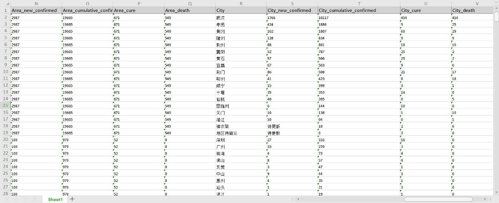
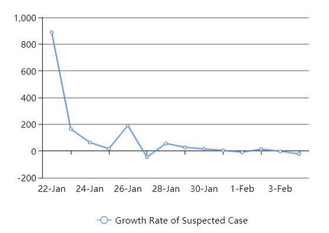
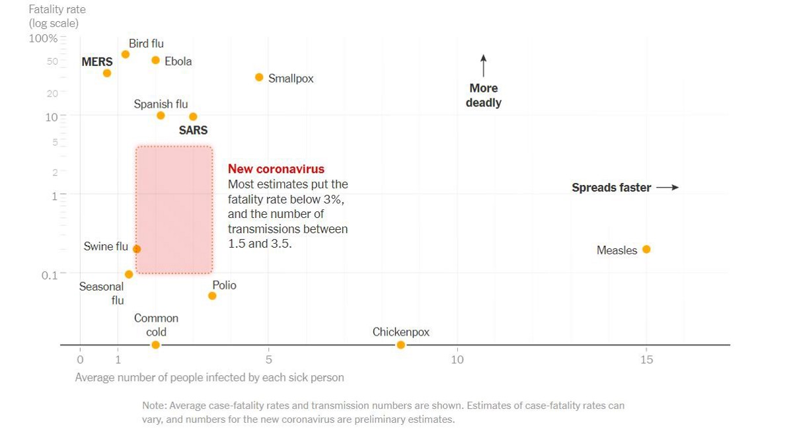
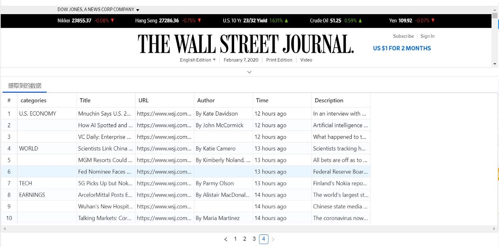
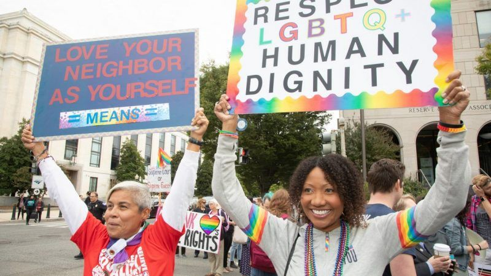
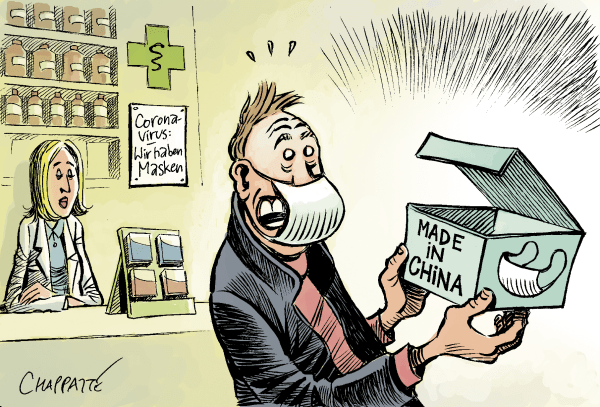

# 从主要来源收集数据

我使用Web抓取工具来节省构建抓取器的工作，以便从每个网站提取数据。 有很多选择，但是我发现Octoparse是最好的。 他们最近创建了一个抓取“食谱”，以从该中国卫生部的数据库中提取实时数据。 这非常容易，因为我什至不需要配置大多数抓取工具所需的任务，从而使每个人都可以访问数据。

> scraping results in Excel

## 数据分析

我收集了1月22日至2月4日的数据。 数据表明，受感染的病例数在增加，而没有任何放缓的迹象。 但是，可疑感染的数量在稳步下降，这表明随着已被确诊的病例，总体可疑感染池正在缩小。

> suspected infecctions


undefined

在这种情况下，我们得出两个可能导致如此高的差异的假设：

假设1：政府未充分报告实际感染病例。

undefined

> from New York Times


那么还有哪些其他因素会导致如此高的死亡率呢？

假设2：由于医疗资源短缺，人们无法治愈。

这种说法更有意义。 医疗用品，病床和人员的短缺将导致更多的人除了在家中自我隔离外别无选择。 自我用药不当会加重病情。 此外，冠状病毒对存在健康问题的老年人是致命的，更不用说及时缺乏适当的治疗了。

话虽这么说，但冠状病毒并不像在美国普通公众面前那样令人昏昏欲睡。由于美国拥有的医疗资源比世界上其他大多数国家都多，因此我们真的不应该对这种疾病感到恐惧 那是太平洋。 此外，美国政府已经禁止过去14天来中国旅行的外国人入境（公民和永久居民的直系亲属除外）。 另一方面，与新的冠状病毒相比，季节性流感导致的1900万例疾病和10,000例死亡更令人担忧。
# 新闻报道集：

自爆发以来，我还使用抓取工具从数十个媒体渠道收集了新闻报道。 万一您没有使用过抓取工具，该视频可能有助于创建高级抓取任务。

我通过搜索词“冠状病毒”从《华尔街日报》，《纽约时报》和《路透社》上抓了一些文章，以比较几种新闻媒体之间的差异。

> scraping Wall Street Journal


许多新闻文章都将重点放在爆发的严重程度上，并减轻了诸如可疑感染和恢复数量之类的其他指标。 这种不完整的叙述不仅对中国政府而且对疾病本身都产生了错误的印象。 结果，当我们看到其他人咳嗽，感冒甚至与不同种族的同事握手时，我们就会变得偏执。

我从《华尔街日报》上看到了沃尔特·米德（Walter Mead）撰写的题为“中国是亚洲的真正病夫”的新闻。尽管标题极度仇外，但他的文章中有很多地方显示了虚假信息。 他说：“我们不知道新的冠状病毒将有多危险。 有迹象表明，中国当局仍在努力掩盖问题的真实范围。”在本文发表之日，WTO已经发现R0约为2，病死率不到3％，接近 季节性流感。 此外，没有证据表明中国政府试图隐藏任何东西。 实际上，我从中国政府网站的开源数据库中获得的数据与WHO，CDC，ECDE，NHC和DXY的数据一致。 有一些因素可能会影响准确性，但是，错误计算应在允许的范围内，以免受到全球主流媒体的质疑。

米德还发布了一个名为“共产冠状病毒”的视频，该视频在视频中从公众宣告了真正的欢呼声（武汉，加油！），这是“整个湖北武汉处于封锁状态”的一个SOS信号。 “共产党”是一个政党用语。 米德用它作为形容词来描述一种占有欲的疾病。 而且，中国人民大喊“武汉，在那里！” 在视频中。 然而，这些叙述使人们似乎似乎因为封锁而急切地寻求帮助。

这让我想起1月31日发布的一条推文，当时一名亚裔女子说一名患者因冠状病毒而在开玩笑而开玩笑。 这不是在Twitter上传播的唯一笑话。 当成千上万的人开始感到恐惧时，冠状病毒的爆发成为一种娱乐性的内容，用于歧视某些人群。

就像1980年代爆发的HIV恐慌导致LGBTQ人群被定罪一样，传染病已被广大公众用来证明偏见。 不会让人生气吗？

> https://reason.com/2019/10/11/democratic-candidates-promise-lgbt-voters-theyll-punish-all-the-right-people/


我想引用《洛杉矶时报》专栏作家弗兰克·谢勇（Frank Shyong）的话说：“我们彼此了解的意愿是保护我们免受恐惧及其灾难性后果的原因。” 这个国家已经太多了。 了解事实而不散布仇外言论是我们的正义。
## 资源：

http://theconversation.com/how-contagious-is-the-wuhan-coronavirus-and-can-you-spread-it-before-symptoms-start-130686

https://www.latimes.com/california/story/2020-02-03/coronavirus-outbreak-narrative-xenophobia

https://www.nytimes.com/interactive/2020/world/asia/china-coronavirus-contain.html

https://en.wikipedia.org/wiki/Basic_reproduction_number
# 数据分析如何帮助揭示冠状病毒的真相

> https://www.chappatte.com/en/


这些天，我们都害怕新的空中传播性冠状病毒（2019-nCoV）。 即使是轻微的咳嗽或低烧，也可能是昏睡症状的基础。 但是，真正的真相是什么？

2月3日，有人发布了一条推文，声称在USC的洛伦佐（Lorenzo）住所周围证实了冠状病毒病例，该校是中国留学生人口众多的地方。 然后，另一条推文出现了，声称他朋友的室友兄弟女友也被感染了。 人们转推并感到恐慌。 后来，大学澄清这是一种混淆，没有怀疑或证实过冠状病毒病例。

当人们对真理一无所知时，这就是谣言迅速传播并最终成为“事实”的方式。 我认为有必要从官方和非官方来源收集数据，并保持公正。 更重要的是，公众需要使用透明的数据源对这次疫情有一个公正的认识。
## 本文的目的是从主要来源收集数据，并使数据可靠透明。 当我们收集更准确的信息时，它将帮助公众发现事实并束缚极端观点。
```
(本文翻译自Ashley Ng的文章《How Data Analysis Helps Unveil the Truth of Coronavirus》，参考：https://towardsdatascience.com/how-data-analysis-helps-unveil-the-truth-of-coronavirus-8430de107ba4)
```
