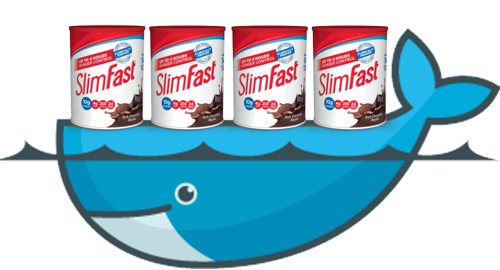
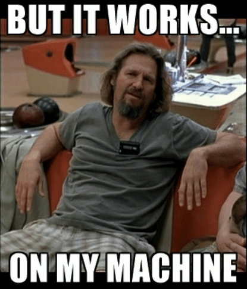

# 如何快速构建Slim Docker映像


您还记得那些日子，当您编写出色的软件但无法将其安装在其他人的计算机上或崩溃的情况下？ 虽然这从来都不是很好的体验，但我们总是可以说


如今，由于集装箱化，这已不再是借口。

简而言之，通过容器化，您可以将应用程序和所有必要的依赖项打包到映像中。 执行时，您将该图像作为容器运行。 这样一来，您就不必为弄乱他人的系统而运行您的软件。 如果容器在您的计算机上运行，则您的软件应随即运行。 这对于数据科学家在部署依赖于不同软件包和版本的模型时也很有用。 对我来说，数据科学家必须知道如何创建图像和容器。

众所周知，Docker是该领域的主要参与者，并且Docker映像无处不在。 这很棒，因为您可以轻松地并排启动例如不同版本的数据库。 将您的应用程序图像合并在一起也非常简单。 这是由于大量的基本图像和简单的定义语言所致。 但是，当您在不知道自己在做什么的情况下将图像混合在一起时，就会遇到两个问题。
+ 由于图像不必要地发胖，您浪费了磁盘空间。
+ 您等待太长时间的构建会浪费时间。

在本文中，我想向您展示如何缓解这两个问题。 幸运的是，这仅需要您了解Docker提供的一些技巧和技术。 为了使本教程有趣且有用，我向您展示了如何将Python App打包到Docker映像中。 您可以在我的Github存储库中找到下面引用的所有代码。

你准备好了吗？ 让我们继续。
# 教程

假设我们所有的代码都位于一个Python文件main.py中。 因为我们很酷，所以我们使用最新最好的Python版本，在撰写本文时为3.8。 我们的应用程序只是一个简单的Web服务器，它依赖于熊猫，fastapi和uvicorn。 我们将依赖项存储在requirements.txt文件中。 在本地，我们在虚拟环境中开发应用程序。 该环境位于与代码位于同一文件夹中的名为.venv的文件夹中（这很快变得很重要）。 现在，我们决定将所有内容打包到Docker映像中。 为此，我们要做的就是
+ 使用可用于Python 3.8的基本映像。
+ 复制代码和需求文件。
+ 在映像中安装需求和依赖项。
+ 公开运行我们的应用程序的命令

我们的Docker映像的第一个版本看起来像
```
FROM python:3.8.0-slimCOPY . /appRUN apt-get update \&& apt-get install gcc -y \&& apt-get cleanWORKDIR appRUN pip install --user -r requirements.txtENTRYPOINT uvicorn main:app --reload --host 0.0.0.0 --port 8080
```

除了我们的代码和要求之外，我们还需要安装GCC，因为FastApi在安装时需要这样做。 我们通过以下方式建立我们的形象
```
docker build -t my-app:v1 .
```

该映像的大小约为683 MB，需要大约一分钟的时间来构建（不下载基础映像）。 让我们看看如何减少这种情况。
## 基本图片

关于基本图像，我已经使用Python slim做出了明智的选择。 我为什么要选择那个呢？

例如，我可以使用完整的Ubuntu或CentOS映像，这将导致映像大小> 1GB。 但是，由于我只需要Python，因此无需安装所有组件。

在图像大小的低端，我们可以使用python：3.8.0-alpine。 但是，我的代码依赖于熊猫，这在高山上安装很麻烦。 高山也有关于稳定性和安全性的问题。 此外，slim仅比高山大80MB，这还是可以的。 有关如何选择最佳Python图像的更多信息，请向有兴趣的读者介绍该文章。
## 构建上下文

构建映像时，打印到控制台的第一行显示：将构建上下文发送到Docker守护程序。 在我的计算机上，这花费了大约5秒钟，并且发送了154 MB。 这是怎么回事 Docker将构建上下文中的所有文件和文件夹复制到守护程序。 在这里，构建上下文是存储Dockerfile的目录。由于我们只需要两个文本文件，所以154 MB听起来很多，不是吗？ 这样做的原因是Docker复制了所有内容，例如包含虚拟环境的.venv文件夹或.git文件夹。

要解决此问题，您只需在Dockerfile旁边添加一个名为.dockerignore的文件。 在此文件中，逐行列出了Docker不应该复制的内容。 就像git对.gitignore文件所做的一样。 举一个小例子，假设我们的文件夹中有几个Excel文件和PNG，我们不想复制它们。 .dockerignore文件看起来像
```
*.xlsx*.pngvenv.venv.git
```

在我们的示例中，添加此文件后，“将构建上下文发送到docker”仅花费几毫秒，并且仅发送了7.2 kb。 我将映像大小从683 Mb减小到了529 Mb，这大约是以前构建上下文的大小。 真好！ 添加.dockerignore文件有助于加快构建速度并减小图像大小。
## 层缓存

如前所述，在我的计算机上构建此映像大约需要60秒钟。 我估计大多数时候，大约有99.98％的时间用于安装需求和依赖项。 您可能会认为现在这里没有太多的改进空间。 但是有些时候您必须经常构建映像！ 为什么？ Docker可以利用层缓存。

Docker文件中的每一行都代表一个层。 通过添加/删除行中的内容，或更改其引用的文件或文件夹，可以更改图层。 发生这种情况时，将重建此层以及其下的所有层。 否则，Docker将使用该层的缓存版本。 要利用该漏洞，您应该对Dockerfile进行结构化，以便
+ 经常不变的层应该出现在Dockerfile的开头附近。 在这里安装编译器是一个很好的例子。
+ 经常变化的层应该出现在Dockerfile的结尾附近。 复制源代码是这里的完美示例。

凉。 理论足够，让我们回到我们的例子。

假设您没有更改要求，而只更新了代码。 开发软件时，这很常见。 现在，每次构建映像时，都会重新安装这些讨厌的依赖项。 建立映像始终需要相同的时间。 烦人！ 我们还没有使用缓存。

神奇的新Dockerfile来解决您的问题
```
FROM python:3.8.0-slimRUN apt-get update \&& apt-get install gcc -y \&& apt-get cleanCOPY requirements.txt /app/requirements.txtWORKDIR appRUN pip install --user -r requirements.txtCOPY . /appENTRYPOINT uvicorn main:app --reload --host 0.0.0.0 --port 1234
```

看起来并没有什么魔力和不同，对吧？ 我们要做的唯一一件事就是首先安装GCC，然后分别复制需求和复制源代码。

GCC和依赖项更改很少。 这就是为什么此层现在显示得很早的原因。 需求变更也比GCC缓慢但频繁。 这就是为什么该层位于GCC之后。 我们的源代码经常更改。 因此，将其复制会发生得较晚。 现在，当我们更改源代码并重建映像时，由于Docker使用缓存的层，因此不会重新安装依赖项。 现在，重建几乎不需要时间。 太好了，因为我们可以花更多的时间来测试和执行我们的应用程序！
## 多阶段构建

在示例图像中，我们必须安装GCC才能安装FastApi和uvicorn。 但是，对于运行该应用程序，我们不需要编译器。 现在想象您不仅需要GCC，还需要其他程序，例如Git，CMake，NPM或…。 您的生产形象越来越胖。

多阶段构建，助我们一臂之力！

使用多阶段构建，您可以在同一Dockerfile中定义各种映像。 每个图像执行不同的步骤。 您可以将从一个图像生成的文件和工件复制到另一个图像。 最常见的情况是，您有一个用于构建应用程序的映像，另一个是用于运行应用程序的映像。 您需要做的就是将构建工件和依赖项从构建映像复制到应用程序映像。

对于我们的示例，这看起来像
```
# Here is the build imageFROM python:3.8.0-slim as builderRUN apt-get update \&& apt-get install gcc -y \&& apt-get cleanCOPY requirements.txt /app/requirements.txtWORKDIR appRUN pip install --user -r requirements.txtCOPY . /app# Here is the production imageFROM python:3.8.0-slim as appCOPY --from=builder /root/.local /root/.localCOPY --from=builder /app/main.py /app/main.pyWORKDIR appENV PATH=/root/.local/bin:$PATHENTRYPOINT uvicorn main:app --reload --host 0.0.0.0 --port 1234
```

构建该文件时，最终的生产映像大小为353 MB。 这大约是我们第一个版本的大小的一半。 恭喜，还不错。 请记住，您的生产图像越小，效果越好！

附带说明，多阶段构建还可以提高安全性。 慧，为什么呢？ 假设您需要一个秘密（例如SSH密钥）来在构建时访问某些资源。 即使您在以后的层中删除了该机密，它仍在先前的层中存在。 这意味着有权访问您的图像的人可以获取该秘密。 在多阶段构建中，您仅复制必要的运行时工件。 因此，生产图片永远都看不到秘密，而您已经解决了该问题。

有关多阶段构建的更多详细信息，我请读者参考本文和本文。
# 包起来

在本文中，我向您展示了一些简单的技巧和窍门，说明如何创建更快构建的较小的Docker映像。 记得
+ 始终添加.dockerignore文件。
+ 考虑一下图层的顺序，并将其从缓慢变化的动作转变为快速变化的动作。
+ 尝试使用和利用多阶段构建。

我希望这将为您节省一些磁盘空间和时间。

感谢您关注这篇文章。 与往常一样，如有任何问题，意见或建议，请随时与我联系。
```
(本文翻译自Simon Hawe的文章《How to Build Slim Docker Images Fast》，参考：https://towardsdatascience.com/how-to-build-slim-docker-images-fast-ecc246d7f4a7)
```
