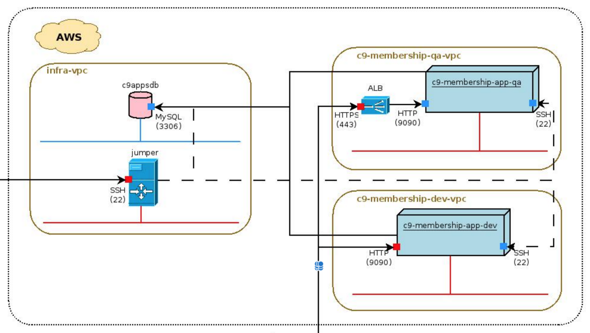

最初发布于Cloud Nine Apps。

如果您喜欢这篇文章，您会发现我的AWS Advanced For Developers课程很有帮助，该课程侧重于在AWS中设计和部署实际应用程序的许多此类最佳实践和技术。
# 如何设计云应用程序（SaaS）

# 如何设计云应用程序（SaaS）

软件即服务（SaaS）已成为许多软件供应商的主要模型。 与云供应商提供基础架构服务一样，它有助于类似地交付软件。 SaaS应用程序通常部署在公共云上，例如Amazon Cloud（AWS），Microsoft Azure，Google Cloud等。 但是，组织有时可能会选择使用其数据中心（也称为私有云）来托管SaaS应用程序并利用其在基础架构上的投资。 在设计SaaS应用程序时，不仅需要将应用程序比特部署到云中，还需要花费更多。 进行适当的设计考虑，不仅可以帮助您完成良好的设计，还可以帮助您降低成本并更有效地管理部署。 在这篇文章中，我将介绍一些多年来我发现有用的设计SaaS应用程序的关键注意事项和技巧。
## 为云设计应用程序与本地应用程序设计有何不同？

undefined
+ 更好的模块化：如果您拥有一个庞大的单片应用程序，那么明智的做法是查看它是否可以分解为可以单独部署的逻辑组件。 这不仅可以提高模块化，还可以帮助您减少应用程序的占用空间。 假设您有一个使用后台作业刷新数据的应用程序。 您可以将核心应用程序和后台作业分离为2个（或更多）可以分别部署的组件。 这将减少核心应用程序的占用空间。 因此，您可能会选择较小的资源大小。 另外，根据需要，您可以独立地缩放这两个。 因此，如果对后台作业的需求增加，则可以增加其容量，并增加应用程序层的容量。 由于每个资源的资源量都很小，因此，仅扩展所需的层/组件将导致整体成本低于整体资源的整体成本。 说得通？
+ 应用程序始终是最新的：对于许多本地应用程序来说，这是一个很大的转变。 在云中，客户通常希望应用程序始终处于最新版本。 现在，如果您将其视为一名架构师，则意味着您不仅可以更新应用程序位，而且可以在不涉及客户的情况下升级客户数据。 也就是说，这对他们是完全透明的。

这些只是一些差异。 但是，您明白了。
## SaaS的关键设计注意事项

undefined
+ 选择适当的云服务：当然，您正在部署到云。 但是，您想使用哪些服务？ 您是否只是要使用基础架构即服务（IaaS）？ 还是要利用某些平台即服务（PaaS）功能？ 答案可能并不总是直截了当的。 因此，这里有一些准则。
+ 您是否要将同一应用程序部署到多个云平台或内部部署？ 在这种情况下，可能没有（或最小化）特定于云供应商的服务并坚持使用更多的IaaS服务是有意义的。
+ 成本应该是选择服务时的重要考虑因素。 例如，某些由Cloud供应商管理的PaaS服务可以由您的团队自己管理，以降低成本。 尽管这对于每项服务可能都没有意义，但值得探讨。
+ 牢记您的团队专业知识。 使用某种云服务需要什么？ 而且，如果团队还维护基础架构，那么需要什么技能？
+ 针对故障的设计：设计容错和高可用性的应用程序是Cloud的基础。 假定您的应用程序会遇到问题，以及如何确保继续为用户提供服务。 这些可能是应用程序故障或基础架构故障。 云供应商提供了一些有用的功能来帮助您。
+ 使用负载平衡器：出于负载平衡的目的，您可以将应用程序节点放在负载平衡器的后面，并确保即使一个或多个节点出现故障，也可以通过其他节点为应用程序提供服务。
+ 地理分布的应用程序：多个Cloud供应商提供了将应用程序分布在多个地理区域的功能，这样，即使一个区域受到了影响（例如，由于自然灾害），也可以从其他区域提供应用程序。 例如，AWS支持跨多个可用区部署应用程序。
+ 模块化您的应用程序：如我们在上一节中讨论的，隔离可以分别部署和管理的组件可以帮助减少应用程序的占用空间，从而降低基础架构的成本。 您也可以考虑将其中一些组件作为微服务。 如果您的应用程序之外还有其他潜在使用者，则微服务方法可能特别有用。 现在，这并不意味着您会全力以赴，创建不必要的组件。 因此，一种方法是制作可以单独部署的组件（例如核心应用程序与后台作业）。
+ 安全性：安全性涉及很多方面-从保护基础结构到应用程序。 一些关键方面包括确保仅打开所需的端口，使用对资源的尽可能少的特权，进行适当的基于角色的访问控制，使用加密，等等。 安全性不应被视为一次性交易。 这是一个持续的过程，应该随着时间的推移而改进和发展。
+ 多租户：在云中运行的一个主要好处是能够使用同一应用程序实例为多个客户提供服务。 这给应用程序设计带来了一些明显的挑战，以确保每个客户的数据出于安全和监管目的而被隔离。 一些团队选择为每个客户使用不同的持久性存储实例，例如为每个客户使用单独的数据库。 而且，有些人选择使用行级标识符隔离数据。 无论采用哪种方法，重要的是确保体系结构满足可伸缩性和安全性需求。 例如，如果选择每个客户使用一个数据库，则可以在一个RDS实例上托管多个数据库。 而且，当容量用尽时，您可以建立另一个RDS实例。
+ 零/最小停机时间和无缝升级：信不信由你，许多客户期望SaaS应用程序的停机时间为零或非常小，并且由于这些停机时间通常由构建应用程序的同一公司管理，因此应进行无缝升​​级。面临的挑战是您的应用程序可能没有被设计为能够顺利处理升级，特别是如果它已被转换为SaaS应用程序而已。需要考虑两个关键方面：a）部署应用程序位和文件b）处理持久性存储升级。对于推出应用程序位策略，可以使用诸如Blue / Green部署之类的策略，其中，如果成功推出，则将新版本部署到新堆栈中，进行测试并启用。较旧的堆栈资源可以在以后退役并回收。实现无缝升级的一种方法是使基础数据模型n_1兼容。这意味着，如果要部署的发行版具有数据模型版本n，则该数据模型与先前的数据模型版本（n — 1）向后兼容，从而确保升级不会破坏它。您如何确保？这就要求在整个开发周期中遵守纪律，并遵循某些准则，例如不删除任何列，提供必要的升级脚本来处理任何数据迁移需求，等等。并且，如果升级未成功，则支持回滚升级。现在，您可以理解，这不仅在技术上具有挑战性，因为它涉及数据迁移和回滚，而且还可能导致部署速度大大降低。因此，您必须仔细评估适合您的应用程序需求的合理方案，并相应地实施解决方案。
## SaaS的DevOps注意事项

DevOps对SaaS至关重要，因此值得单独讨论。 以下是一些关键注意事项。
+ 持续交付：DevOps管道应该能够获取签入的代码，并从中生成一个构建，然后以自动化的方式经历各个阶段（QA，性能，最终通过/不通过检查，生产部署）。 这可能涉及到拥有多个管道（通常是每个阶段），并拥有一个超级管道来推动构建通过这些阶段中的每个阶段。 现在，开发这些管道可能还需要一些时间，但是开始为每个管道定义合同是一个好主意，这样用户管道就不必担心细节了。 最终，目标应该是使双手完全免于打扰或尽可能地接近手。
+ 对所有版本（包括DevOps更改）使用版本控制：对于应用程序代码，通常最好使用源代码控制的master分支。 但是，对于任何DevOps更改执行相同的操作同样重要。 例如，在推出基础架构更改时，还应将这些更改检入源代码管理中，进行测试，然后将其推向生产环境。
+ 敏捷的基础架构：要在SaaS上取得成功，您需要确保您的基础架构是敏捷的并且可以应对需求的变化。 随着需求上升，它可以扩展适当的层，当需求下降时，释放不需要的资源。 这需要一定程度的实验和测试才能达到适当的平衡。 例如，您可以使用AWS自动扩展功能自动扩展/缩减基础架构。
## SaaS的其他注意事项
+ 计划和优先级：与其他任何成功的项目一样，SaaS项目也需要计划和优先级。 尽管每个人都希望实现“将每一个检查都投入生产”之类的目标，但要了解什么才是最有意义的事情，并首先将重要的事情放在优先位置。 当然，有一个延伸目标没错。 但是，重要的是首先正确处理重要的事情。 例如，如果您没有良好的单元测试和自动化范围，并且您试图将每个代码更改推向生产环境，即使您完成了更改，其实用性也值得怀疑。 之所以会适得其反，是因为生产中的事情可能会开始崩溃得太快，然后研发团队将被消耗掉。
+ 货币化模型：SaaS也影响货币化模型。 在内部部署中，您可能会被罚款一定数量的许可证，而在SaaS中，您可能不得不重新考虑什么是最适合您的业务的模型。 您是否要使用基于订阅的模型，基于利用率的模型，混合模型或其他所有模型？

希望您对设计基于云或SaaS的应用程序有更好的了解。 看到涉及许多不同方面的应用程序投入生产，无疑是一种丰富的体验。 就像我经常说的那样，“云是一个旅程，而不是目的地”。 因此，请继续学习并不断发展。
# 其他读物
## AWS CloudFormation-架构师的最好朋友
### AWS CloudFormation-架构师的最好朋友
## 代码覆盖面不足
### 代码覆盖面不足
## 不仅仅是另一个AWS EC2教程
### 不仅仅是另一个AWS EC2教程

设计愉快！ —尼丁
```
(本文翻译自Nitin Patil的文章《How To Design Applications For Cloud (SaaS)》，参考：https://medium.com/swlh/how-to-design-applications-for-cloud-saas-88eab310ffad)
```
