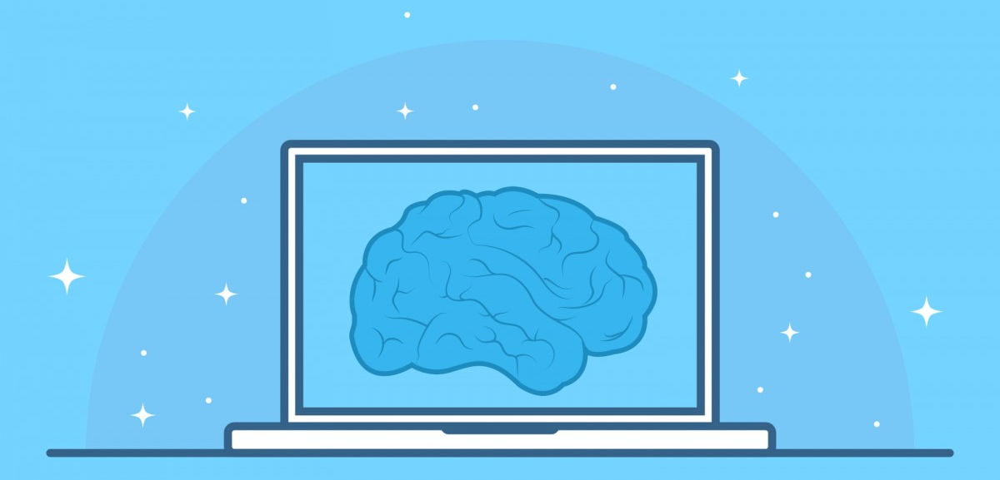
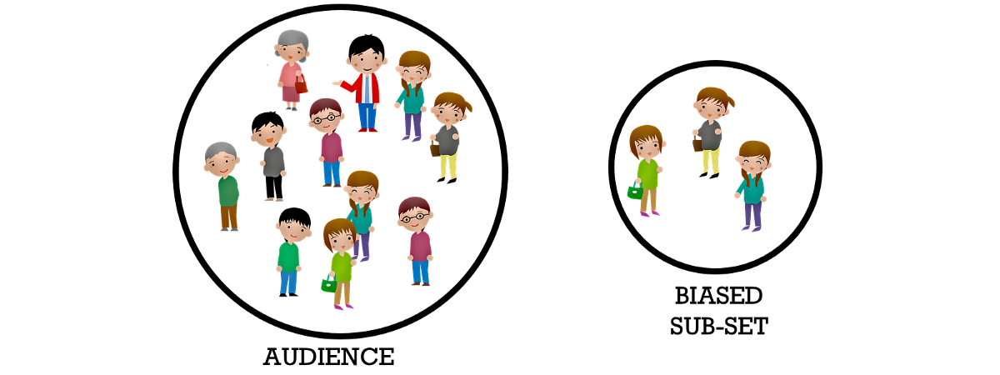
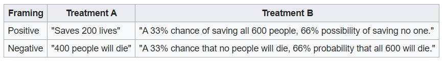
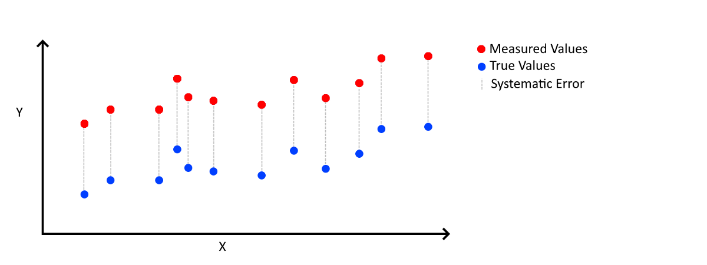
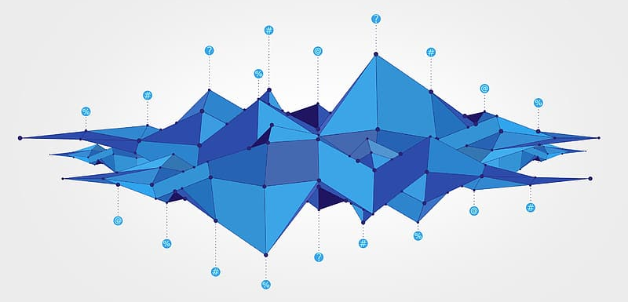
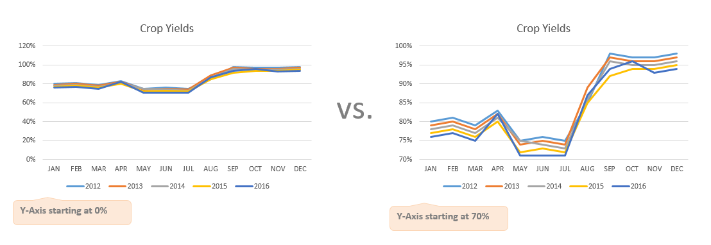
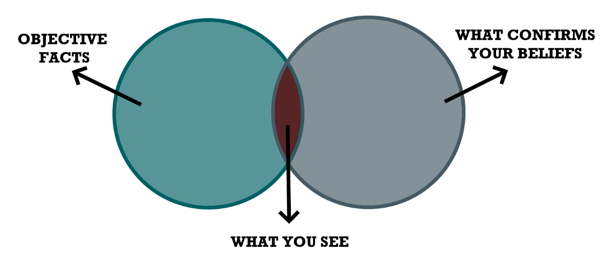
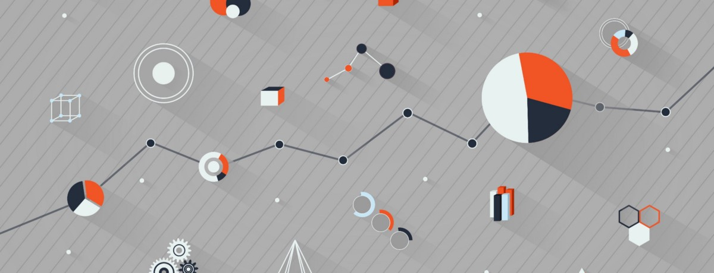
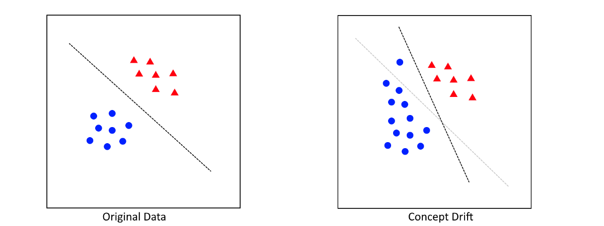

如果您像我一样对AI，数据科学或心理学充满热情，请随时在LinkedIn上添加我。
## 偏压
# 如何在AI中检测偏见
## 检测数据中的常见（认知）偏差


在过去的几年中，随着AI解决方案在我们的日常生活中越来越根深蒂固，人工智能（AI）的偏见已成为热门话题。 作为转向数据科学的心理学家，这个话题非常贴切。

为了避免使AI模型产生偏差，首先必须意识到存在各种各样的偏差。

为了检测偏见，必须意识到它的存在。

为此，本文将指导您解决在开发AI的不同阶段中可能遇到的许多常见和不常见的偏见。 这些阶段包括：
+ 数据采集
+ 数据预处理
+ 数据分析
+ 造型

希望，了解您可能遇到的偏见将有助于您开发偏见较少的AI解决方案。
# 1.什么是偏见？


偏见被认为是对一个想法或事物的偏爱或偏见。 偏见通常是在人类的背景下想到的，但它可以存在于许多不同的领域：
+ 统计信息-例如，统计信息的系统失真
+ 研究-例如，偏向于发表某些实验性重大成果
+ 社会科学-例如，对某些人群的偏见

在本文中，我们将结合几个领域，在这些领域中可能会出现（认知）偏差，以了解偏差如何进入人工智能。

在下文中，我将经历AI开发的常见阶段，并确定步骤以检测可能在哪里发现偏差。
# 2.数据收集


数据收集是您会发现偏见的第一个也是最常见的地方之一。 造成这种情况的最大原因是，数据通常是由人收集或创建的，从而允许错误，离群值和偏差易于渗入数据中。

数据收集过程中常见的偏见：
+ 选择偏差-选择数据时样本不能代表总体的数据选择

例如，在许多社会研究中，研究人员一直在使用学生作为参与者，以检验其假设。 学生显然不能代表一般人群，并且可能会偏向所发现的结果。

> Selection Bias

+ 框架效应-调查以特定倾向构建的问题。

如下图所示，如果这个问题的答案是肯定的，那么人们更有可能挽救200条生命，而挽救所有人的几率是33％。

> Treatment A was chosen by 72% of participants when it was presented with positive framing (“saves 200 lives”) dropping to 22% when the same choice was presented with negative framing (“400 people will die”).

+ 系统性偏差-这是一个一致且可重复的错误。

这通常是设备故障的结果。 由于此错误很难检测，因此更正此错误很重要。 必须对机械或过程有充分的了解。

> Systematic Error

+ 回应偏见—一系列偏见，参与者对问题的回答不正确或错误。

答复偏见经常出现在问卷中。 由于这些都是参与者填写的，因此人为偏见很容易在数据中找到。 例如，《社会可取性偏见》指出人们很可能否认其反应中的不良特征。 这可以通过强调良好行为或低估不良行为来实现。 类似地，“问题顺序偏向”指出人们可能会根据问题的顺序不同地回答问题。

重要的是要了解，您如何设计收集过程会严重影响将要收集的数据类型。 如果不小心，您的数据将严重偏向某些群体。 任何结果分析都可能有缺陷！
# 3.数据预处理


处理数据时，可以采取许多步骤来准备进行分析：
+ 离群值检测

您通常希望删除异常值，因为它们可能对某些分析产生不成比例的影响。 在所有人都在20到30岁之间的数据集中，一个110岁的人可能不太能代表数据。
+ 缺失值

您如何处理某些变量的缺失值会引入偏差。 如果要用均值填充所有缺失值，那么您有意将数据推向均值。 这可能会使您偏向表现更接近均值的某些群体。
+ 筛选资料

我已经多次看到这种情况，对数据进行了如此多的过滤，以致于它几乎不再代表目标人群。 这以某种方式将选择偏差引入数据。
# 4.数据分析


在开发AI解决方案时，最终产品可能是模型或算法。 但是，在数据分析中也很容易发现偏差。 通常，我们会在数据分析中看到以下偏见：
+ 误导图-扭曲的图，它歪曲了数据，因此可能从中得出不正确的结论。

例如，当报告分析结果时，数据科学家可以选择将其图的y轴从0开始。尽管这不会在数据本身中引入偏差，但由于差异似乎是 更明显（见下图）。

> The differences in crop yields seem to be low if the Y-axis is started at 0%. However, simply changing it to start at 70% results in a seemingly different perspective while the results are actually the same.


如果您想进一步了解误导图的影响，强烈建议您阅读“如何利用统计数据撒谎”一书！
+ 确认偏见—倾向于专注于确认先入之见的信息的倾向。

假设您认为癌症和喝酒之间有很强的关系。 在执行分析时，您仅通过不考虑任何混淆变量来搜索以确认该假设。

> The confirmation Bias


这似乎是一个极端的例子，您将永远做不到。 但是现实是，人类天生就有偏见，这很难撼动。 发生在我身上的次数比我想承认的要多！
# 5.造型


当谈论AI的偏见时，人们通常指的是某种程度上有利于特定人群的AI系统。 一个很好的例子就是亚马逊创建的招聘算法，该算法在决策中显示了性别偏见。 他们用于此算法的数据主要由担任技术职务的男性组成，这使其倾向于使用男性作为高潜力候选人。

这是垃圾填满现象的经典示例，其中您的AI解决方案仅与您使用的数据一样好。 这就是为什么在开始对数据进行建模之前检测数据中的偏差如此重要的原因。

让我们研究一下在创建预测模型时经常会看到的几种类型的偏差：
+ 偏差/方差折衷-偏差（模型的基本假设）和方差（如果使用不同的数据，则预测的变化）之间的折衷。

具有高方差的模型将过多地关注火车数据，并且不能很好地推广。 另一方面，高偏差假定数据始终以相同的方式运行，这很少是正确的。 当增加偏见时，通常会降低方差，反之亦然。 因此，我们经常寻求平衡偏见和差异。

> Demonstrating the effect of the trade-off between bias and variance.

+ 概念漂移–一种现象，目标变量的统计属性会随时间发生意外变化。

假设您创建了一个模型，可以预测在线商店中客户的行为。 该模型起初很棒，但一年后性能下降。 发生的事情是客户的行为在过去一年中发生了变化。 客户行为的概念已经改变，并对模型的质量产生负面影响。

解决方案可能只是简单地使用新数据重新训练您的模型，以便及时掌握新行为。 但是，可能需要一个全新的模型。

> The original data (left) versus concept drift (right) after time has passed and new data was added.

+ 班级不平衡-（目标）班级频率的极端不平衡。

假设您要对图片包含猫还是狗进行分类。 如果您有1000张狗的照片而只有10张猫的照片，则存在类不平衡。

阶级失衡的结果是该模型可能偏向多数阶级。 由于数据中的大多数图片都是狗，因此该模型只需要始终猜测“狗”即可达到99％的准确率。 实际上，该模型尚未了解到猫和狗的图片之间的差异。 可以通过选择正确的验证措施（例如，平衡准确度或F1得分而不是准确度）来补救。
# 6.接下来是什么？

在了解了AI解决方案中的所有这些潜在偏见之后，您可能会认为：

“但是我该如何消除解决方案中的偏见？”-您

我认为，要解决偏见，您需要了解其根源。 知道是成功的一半。 之后，由您自己确定消除或处理该特定偏差的方法。 例如，如果您发现问题是由于数据中的选择偏差引起的，那么最好添加其他数据。 如果类别不平衡使您的模型更偏向多数群体，那么您可以研究重采样策略（例如SMOTE）。

注意：有关常见认知偏差的交互式概述，请参见此惊人的可视化。
```
(本文翻译自Maarten Grootendorst的文章《How to Detect Bias in AI》，参考：https://towardsdatascience.com/how-to-detect-bias-in-ai-872d04ce4efd)
```
