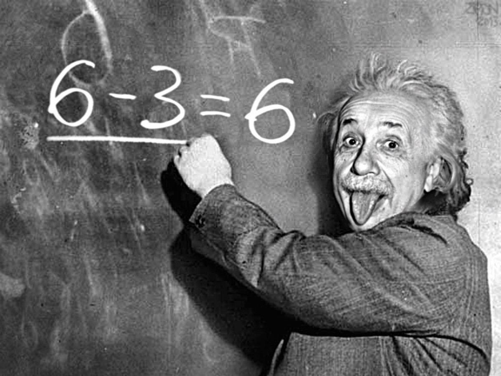
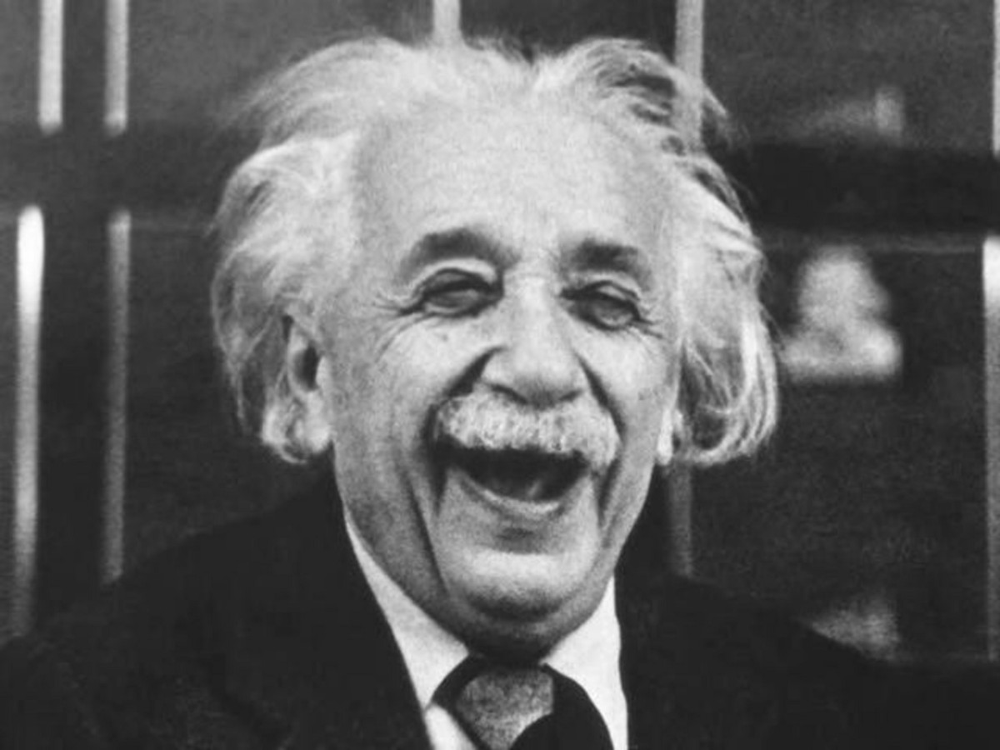
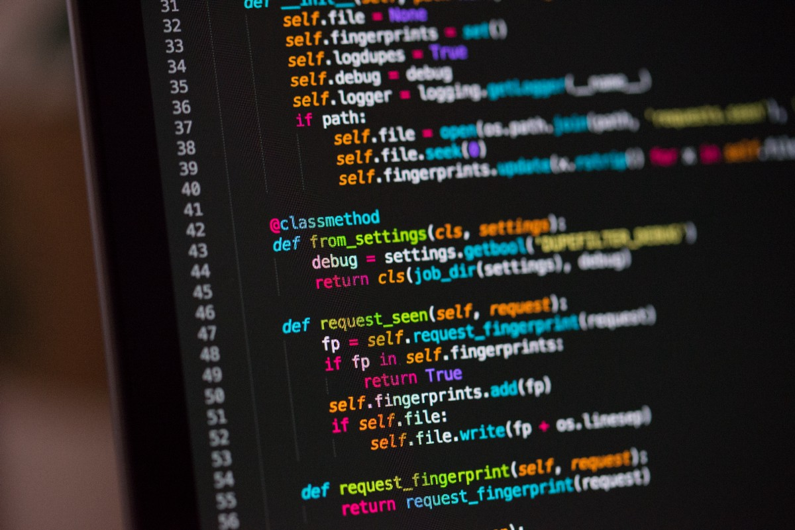
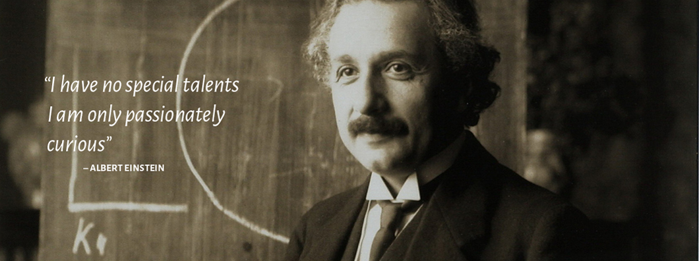

# 如何像爱因斯坦学到的物理一样学习编程

> Credit


爱因斯坦是一位天才，也是有史以来最伟大的科学家之一。 1905年，他发表了四篇科学文章，奠定了现代物理学的基础，改变了对空间，时间，质量和能量的看法。 在这四篇文章中出了名之后，他以对光电现象的解释获得了1921年的诺贝尔奖。

我们都可以从爱因斯坦的生活中学到东西，尤其是他的工作和学习方式。 即使我们可能不是爱因斯坦才华横溢的天才，但仍有一些模式可以跨多个研究领域进行模拟，尤其是在软件开发中。 成功留下了线索，揭示了我们如何向任何人学习。

像Michael Jordan或Arnold Schwarzenegger之类的人不是软件开发人员，但他们的刻意实践和态度代表了一些可复制的模式，这些模式可以由软件开发人员以及其他专业人士实施。

善于做事的人通常会因其不同寻常的习惯而与众不同，例如专注于正确的事情，并在没人注视的情况下执着地练习自己的手艺。 他们不仅使同龄人和同龄人之外的其他人工作过度，而且工作效率更高，并将学习视为一种生活方式。

正如世界上最著名的表演教练托尼·罗宾斯（Tony Robbins）所说：“我想，如果您渴望学习，渴望成长，渴望掌握东西。 如果您所付出的代价不会超过自己的能力或成就，那么您可以超越其他任何人。”
# 学习如何学习

> Photo by 🇸🇮 Janko Ferlič on Unsplash


据报道，爱因斯坦曾说过：“精神错乱一遍又一遍地做着同样的事情，并期望得到不同的结果。” 如果要获得不同的结果，则需要做与其他人不同的事情。 当您像其他人一样学习时，您将获得与他们相同的结果。 为了像爱因斯坦一样，您需要愿意深入学习某个学科并以不同的方式学习事物。

几十年前，一位物理专业的学生在考试中获得了其他方面的完美成绩，但是教授在一个问题上给他打了很低的分数，该问题问如何使用气压计来测量建筑物的高度。

学生写道：“去建筑物的顶部。 放下气压计并数秒，直到其砸碎在下面的人行道上。 然后使用重力加速度公式来确定建筑物的高度。”

预期的答案是使用气压作为参考气压计的高度测量工具。 当学生争辩说他以一种不太常规的方式提出了正确的解决方案时，教授与学生达成了交易：如果学生可以使用另一种方法正确回答相同的问题，教授将给他满分 问题。

学生立即想出了另一个答案。 他说，他将使用气压计敲打建筑物房东的门。 房东打开门时，他会问：“这栋房子有多高？”

教授要求学生提出另一种回答问题的方法，因此学生建议将一根长绳子绑到气压计上，并从建筑物顶部测量绳子的长度。 或将琴弦摆动成一个钟摆，并根据其产生的运动来推断其高度。

教授认识到所有这些从不同角度回答的问题都是正确的，并给予学生满分。

根据斯科特·杨（Scott Young）的《了解更多，学习更少》（Learn More，Study Less）一书，这个年轻的学生是尼尔斯·玻尔（Niels Bohr），他因发现原子内电子的性质而于1922年获得诺贝尔物理学奖。 但是他并没有通过简单地参加物理讲座来学习所有这些方法。

您必须真正热衷于深入学习，理解主题并为同一个问题提供这么多答案的东西。 而且，您还必须与大多数其他人学习不同的知识。

大多数学生学习考试是因为他们希望获得良好的成绩。 他们学到的知识不会比期末考试所涵盖的内容多，更不用说花更多的时间在期末考试之后学习与该科目相关的东西。

同样，许多软件开发人员倾向于使用Google解决问题，以便他们可以尽快修复错误。 他们最关心的问题似乎是在管理人员面前发挥作用。 他们不会花时间去更深入地了解解决方案，也不会花时间找出解决问题的最有效方法。 他们对任务在吉拉完成感到满意。

当然，在某些情况下，您会面临很大压力，随着截止日期的临近，您必须快速修复关键错误。 但是，您不应该让这少数情况转移您对持续学习的兴趣。

> Credit


既然我们知道学习对成功的关键，那么让我们看看如何通过更好地学习成为更好的软件开发人员。
# 1.学习计算机科学基础

根据沃尔特·艾萨克森（Walter Isaacson）撰写的爱因斯坦（Albert Einstein）传记，在爱因斯坦15岁之前，他已经掌握了微分和积分学，因为他认为数学是理解自然的一种方式。 后来，这些基本概念对他在物理学领域的工作很有用。

大多数人倾向于避免学习基础知识，因为他们可能不会在短期内看到自己的工作成果。 告诉其他人您已经准备好将其应用程序下载到Play商店中，而不是告诉他们您仍然专注于基础知识，这会让您更加满意。

与那些人有所不同。 了解计算机科学的基础知识-更具体地说，了解数据结构和算法-并学得很好。 您必须能够自己实现一些最常用的算法和数据结构，而无需使用教科书。

当您最终深入了解它们后，您将能够以直观的方式解决软件开发中的实际问题，这可以是一种更快，更有效的方法。

正如艾萨克森（Isaacson）所提到的，爱因斯坦相信“直觉不过是早期知识经验的结果。” 在软件开发中，先验知识经验需要扎实的基础知识。

正如Linux内核开发人员Linus Torvalds所说：

“事实上，我会声称，一个糟糕的程序员与一个好的程序员之间的区别在于，他是否认为自己的代码或数据结构更重要。 糟糕的程序员会担心代码。 好的程序员担心数据结构及其关系。”

诸如微软，谷歌或亚马逊之类的大型科技公司通过接受艰苦的技术面试（主要围绕基本概念）来挑战新的软件开发人员。

换句话说，无论您使用哪种类型的编程语言，您的代码都只是表达表面下的算法和数据结构的方式。
# 2.通过解决问题来学习，而不仅仅是被动地观看教程

> Photo by Chris Ried on Unsplash


爱因斯坦经常跳过大学课程。 艾萨克森（Isaacson）引用他的话说：“我经常表现出愚蠢的态度，并且在家中怀着神圣的热情研究了理论物理学的大师。” 他既不感兴趣，也不强迫参加他的演讲。 他发现了一些更引人入胜，更充实的东西–他用自己的时间专注于解决难题，并沉迷于自己的想法和方程式。

有很多书籍和教程可以教您编程。 但是，它们通常仅向您简要介绍新概念，而在使用这些概念解决实际问题时，需要进行更深入的了解和学习。

不要误以为您已经通过被动地看着别人快速开发Web应用程序而学到了一些东西。 当您还没有真正学到东西时，就不要假装自己懂了。 正如爱因斯坦所写：“任何阅读过多，用自己的大脑太少的人都会陷入懒惰的思维习惯。”

相反，您应该积极参与解决问题以学习新概念。 您可能会从LeetCode，Codility，HackerRank，CodeChef，CodeForces等在线法官那里找到可以检验您对基本原理的理解的技术问题。

您还可以通过修复错误或使用更高效的实现优化现有功能，为GitHub中的开源项目做出贡献。 从事其他人的项目可以帮助您从他们的实施和方法中学习，并挑战您提出新的解决方案。

当您发现现有解决方案的新方法时，这种工作就会使您的大脑活跃起来，从而帮助您长期学习和保留信息。

如果您已经拥有全职职位，或者即使您是独立承包商，则应根据当前的经验水平不断寻找具有挑战性的任务。 不要害怕要求您的项目经理将它们分配给您。 与其回避这些机会，而是要充满激情，并感到有报酬来学习做以前不知道的事情而感到荣幸。 正如爱因斯坦所说：“智力增长应该从出生开始，直到死亡才停止。”

而且，不要犹豫，开始一个副项目。 在构建自己的应用程序之前，无需等待五年。 您可以开始开发一个小型应用程序，并计划在了解更多信息时进一步扩展它。

在GitHub上发布您的源代码，并尝试通过电子邮件或编程社区与其他程序员联系，以寻求其他程序员的反馈。
# 3.通过编写测试来增进理解

爱因斯坦的雅各布叔叔向他的侄子提出挑战，要求他早年证明毕达哥拉斯的定理。 爱因斯坦回忆说：“经过大量的努力，我成功地基于三角形的相似性'证明了该定理。”

爱因斯坦通过做证明，为建立自己的理解付出了许多艰苦的工作。 结果，他不仅能够全面地学习事物，而且还足够自信地自己尝试其他事物。

证明定理类似于在编程中编写测试：您需要通过提出测试用例来证明网站的功能确实有效，然后期望执行特定功能或由源代码产生输出。 测试是学习新事物的另一种方法，因为与被动观看教程相比，测试花费更多的时间和精力。

一些新的开发人员不敢进入测试领域，但是它代表了理解软件的执行流程和功能的最有效方法之一。 对于那些刚接触项目并想了解其结构和工作原理的人而言，它尤其有用。

如果您想了解特定开源框架的工作原理，则可以通过编写测试来提高对它的了解。 这样，您不仅会更好地了解该框架，而且您的测试也可以为项目做出贡献。

如果您正在处理一个大型项目，但是您不清楚某些地方，则可以将执行流程分解为几个组件，并为每个组件编写测试。

编写测试不仅可以帮助您理解，还可以发现潜在的错误，从而为整个项目做出贡献。
# 4.集中精力

> Photo by Kevin Ku on Unsplash


我们生活在一个分心的时代。 从早上起床的那一刻起，我们便接通了电话。 检查文本。 阅读电子邮件。 平均而言，一个人每天要进行76个单独的电话会话。

显然，爱因斯坦没有手机，但是他有自己的分散注意力的方式，并且有一些应对方法，我们可以从中学习。 他的儿子报告说：“即使是最大声的婴儿哭声似乎也没有打扰父亲，”他补充说，“他可以继续进行完全不受噪音干扰的工作。”

他的专心致志和长时间工作而不受干扰的能力帮助他取得了历史性突破。 “我只用了两三个小时就可以完成一整天的工作。 在一天的剩余时间里，我会提出我自己的想法，”爱因斯坦在伯尔尼专利局从事知识分子的工作，管理自己的时间，这使他有时间专注于更具挑战性的业务。

软件开发人员可以向爱因斯坦学习，并练习阻止干扰。 假装无数次会议“只是检查” Facebook消息后，别假装您能够专注于相同的强度！

畅销书《工具泰坦》的作者蒂姆·费里斯（Tim Ferriss）写道：“单任务是超级大国”。 他补充说：“在数字经济中，分心是一种货币，如果您一次可以专注于一件事情三到五个小时，并且阻止所有分心，那么您将拥有巨大的立足之本，您将能够做得更深 工作并连接未连接的点。”

尝试与经理妥协，安排一天中的某些时间进行交流，并将其他部分投入到宝贵的，具有认知要求的工作中，例如学习新概念或新技术以及编写代码。

当我们能够远离那些干扰并运用良好的时间管理技能时，我们就会增加更深入地学习的机会，因此，我们的工作效率就会大大提高。
# 5.好奇心强，热爱学习

> Image source


软件开发是我们这个时代最抢手的职业之一。 不断有新的职位空缺，吸引年轻人和来自各行各业的已经就业的人。 他们知道作为软件开发人员，您可以获得很高的薪水，因此，他们怀着雄心勃勃的职业开始了自己的职业生涯。

即使您从事软件开发工作，但只有喜欢学习和编程，您才能变得很棒。 它是少数需要不断学习新知识的专业之一。

这不仅仅是您需要了解的现有概念。 您必须适应不断发展的新技术和编程语言。 您必须适应市场的变化，并了解当前认为有价值的任何新事物。

您将必须不断学习很多东西。 为了使您的大脑不断地参与学习，您必须保持好奇心并保持谦虚。

通常，程序员是在现有知识的基础上被雇用的，并开始认为他们不再需要学习新知识。 但是，如果您好奇并热爱学习，则只有作为软件开发人员才能脱颖而出，因为学习的需求永无止境。

1915年11月，爱因斯坦只写了两页他称之为“我一生中最美丽的作品”的两页，然后给他11岁的儿子汉斯·阿尔伯特（Hans Albert）发了一封信。 他称赞儿子所做的学习努力，他说：“这是学习最多的方式……当您在做一些有趣的事情而不会注意到时间流逝时。”

“好奇心存在的原因是自己的，”爱因斯坦解释说。 “当人们思考永恒，生命，奇妙的现实结构之谜时，人们会不由敬畏。”

对框架的工作原理和结构感到好奇。 当您全面学习一些东西时，您会清楚地了解其机制和功能。 不要仅仅接受Rails是快速开发Web应用程序的好框架，而是要了解Rails的工作原理。 此外，考虑到它是开源的，有可能为它做出贡献并加以改进。

还要小心，不要被金钱困扰。 当然，我们所有人都需要钱来支付账单并为我们自己和/或我们的家人购买食物，但是如果您想在软件开发方面表现出色，就需要为此培养一种对学习和开发的热情。 您需要热爱编程，并对自己有机会通过编写的代码行积极影响数百万人的生活感到感激。

爱因斯坦相信：“爱是比责任感更好的老师。” 作为软件开发人员，我们可以从中学到的知识不仅是为高薪工作的重要性，而且因为我们热爱学习和总体上的工作，并且具有内在的好奇心和动力，可以使我们在下班后或工作期间保持敬业精神。 周末我们老板不看的时候。
# 永远记住：编程是学习的终生

> Photo by Patrick Tomasso on Unsplash


除了学习方法外，爱因斯坦还是物理学界最有影响力的人物之一。 他的工作帮助了各个领域，从核能生产到GPS卫星与计算机的同步，再到许多日常消费品。

他的天才和成就可能超出了我们大多数人的承受范围，但是他的职业道德，谦虚，好奇心和坚韧精神值得任何人效仿。

如果您想获得成功，可以通过复制其他成功人士的行为来节省时间。 尽管爱因斯坦没有写过一行Java或Python，但他的一生揭示了一些鼓舞人心的模式，我们都可以从中学习并应用于软件开发领域。

爱因斯坦可以鼓励人们专注于学习基础知识，通过解决问题和编写针对不同项目的测试来学习，集中精力，最重要的是热爱学习。 如果我们想在事业中取得成功，就需要对学习充满热情，并将其视为生活中至关重要的一部分。
```
(本文翻译自Fatos Morina的文章《How to Learn Programming Like Einstein Learned Physics》，参考：https://towardsdatascience.com/how-to-learn-programming-like-einstein-learned-physics-d704db1a234b)
```
