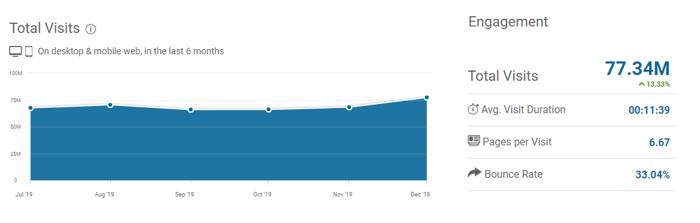

# 结论

我要告诉您的最后一件事与上述每个选项有关：

一致性为王。

无论您从什么开始，都必须坚持下去。 大多数事情不会在一夜之间发挥作用。 这是艰苦的工作，您必须花费时间和精力。 99％的人放弃得太早。 跻身成功的1％之列！
# 开始播客

> Photo by Jonathan Farber on Unsplash


许多人不喜欢它在镜头前，但仍然是该领域的专家，并希望与他人分享他们的知识。

播客无疑是一个很好的媒介。 尽管他们已经存在了一段时间，但在过去的四到五年中，它们已经大受欢迎，吸引了成千上万的人每天上下班或上床睡觉。

现在，大多数播客都可以自由收听，因此金钱更多是一种副作用。 许多播客的节目赞助商都是用服务或金钱付费的。 许多播客都在Patreon上，该平台上的人们可以按月向他们付款以支持他们的工作并解锁专有内容。

但是，为了成功播客，您应该能够很好地表达自己的观点，购买一些好的设备（麦克风），最重要的是，要有耐心不断录制情节。

人们必须先制作一两年的每周情节，然后才能真正看到听众的进步，这种情况并不少见。

因此，如果您在执行此操作之前真的对此充满热情，那就太好了。
# 记录和出售在线课程

> Photo by Avel Chuklanov on Unsplash


在我看来，能够在网上教人是过去十年来最好的事情之一，而且至少可以持续十年。

对学生和老师的好处都是巨大的。 学生可以从多种产品中进行选择，并按自己的时间表学习。 教师的内容可以触及1000或100,000的人。

如果您具有编程经验，最好是具有JavaScript或Python（或任何其他流行语言或框架）之类的语言的专业知识，甚至是利基渗透测试，并且您能够并且乐于教别人，那么创建在线课程可能就是您的事 。

有许多平台可用于发布您的课程。 例如，Udemy每月大约有7500万游客，任何人都可以加入。

> Udemy traffic overview


其他平台（例如Frontend Masters或Pluralsight）仅应邀参加，但如果您有声誉或良好的网络，为什么呢？

但是，录制课程时需要注意以下几点：
+ 购买优质装备：必备麦克风和网络摄像头！
+ 高质量的内容为王。 竞争在稳步增长，因此您需要说服人们您可以教给他们有价值的东西。
+ 练习大声而清晰地讲话。
+ 务必重做您的录音。
+ 创建其他材料，例如GitHub项目，演示文稿，编码示例…

即使一门课程被记录下来并且人们开始购买它似乎很吸引人，它也会为您创造被动收入，但这在一定程度上是正确的。 最好的老师会不断更新他们的课程，因为技术一直在变化！
# 开始写

> Photo by Kaitlyn Baker on Unsplash


我认为，写作仍然是吸引广泛受众的最佳方法之一。 您有很多机会开始写作并从中赚钱：
+ 您可以创建自己的博客并通过广告收入获利。
+ 您可以编写书籍或电子书，然后在线销售。
+ 您可以在Medium等平台上撰写文章，并参与其合作伙伴计划。
+ 您可以为已建立的网站（如CSS-Tricks）撰写来宾帖子，如果您的文章被接受，则将向您支付固定金额。

尝试并观察人们对您所写内容的反应并没有错。

但是，您应该考虑的事情是选择对自己有特殊兴趣的利基市场（保持积极性），保持一致的写作（需要时间来获得认可），并不断提高写作技巧以实现更高的 高质量的文章（人们会感谢您，那里有足够多的低质量文章……）。
# 参加编码比赛

> Photo by Sean Do on Unsplash


是的，这是真实的东西。 有专门的平台可以组织编程竞赛，以获得真正的奖金。

最大的公司之一是拥有超过一百万会员和众多比赛的Topcoder。 它们具有三个主要重点领域：设计，数据科学和开发。

您将从事由2000多家公司发起的实际项目或与对手的一场比赛。 保证乐趣，快速学习也是如此。

如果您喜欢挑战，这可能适合您。 但是，存在竞争，因此您不能指望稳定的收入流，因此请优先考虑这一点。
# 开始自由职业

> Photo by Brooke Cagle on Unsplash


自由职业可能是一件好事。 没有（真正的）老板，可供选择的项目很多，专家的日租金高，您想要的假期多……列表还在继续。

但是，找到客户和项目需要大量的纪律和精力。 对我来说，最大的好处是您可以在晚上或周末在您的永久性工作旁边开始自由职业。

像Upwork或Fiverr这样的平台似乎提供了很多机会，尤其是在场边做事，但要意识到那里的竞争。

此外，费率非常低，因此，如果您只是想第一次将脚趾伸入水中，或者仅对少量额外收入感到满意，我将不建议您这样做。

更好的策略是使用您的LinkedIn个人资料，联系招聘人员和网络中的过往客户，参加会议和聚会，并寻找与远程工作人员与公司相匹配的平台。
# 如何通过编程赚更多的钱
## 有很多机会可以将收入扩展到日常工作之外

> Photo by Alvaro Reyes on Unsplash


成为程序员是一件很棒的事。 不仅大多数时候工作都很有趣，而且周围有很多工作机会，而且大多数人的薪水都很高。

但是有时候，多花一些钱在旁是值得赞赏的。 是因为您仍在上大学，还是想开始为自己而不是别人工作，您有一个孩子并想花更多的时间陪伴他们，您仍然需要赚钱或在做 就是图个好玩儿。

这是一件好事：作为程序员，您拥有增加现金流量所需的一切。 您的大脑，您的笔记本电脑-这才是您真正需要的。 有兴趣吗 查看以下策略，并确定最适合您的策略。
```
(本文翻译自Simon Holdorf的文章《How to Make Extra Money as a Programmer》，参考：https://medium.com/better-programming/how-to-make-extra-money-as-a-programmer-144d76b76ffd)
```
