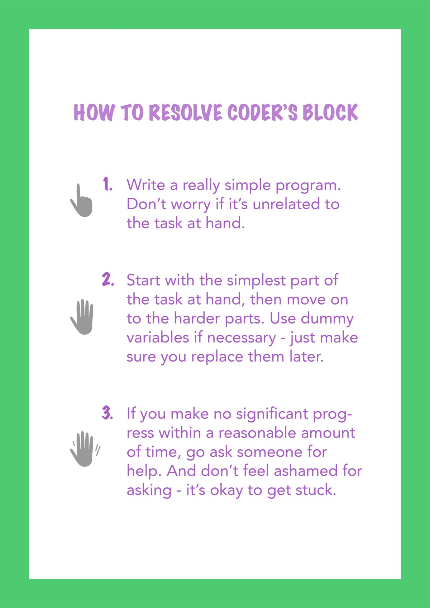

# 如何克服编码器的障碍
## 当您害怕控制台时

> Consoles can be downright intimidating. Photo by Patrick Amoy on Unsplash


您是否曾经感到完全受阻？ 您是否曾经盯着黑屏看了几个小时，无法记下任何东西？ 欢迎来到俱乐部。

当我进入教室时，您正在为计算机科学工作忙碌。 您的办公桌上满是脚本和条款表。 您的计算机屏幕是一个黑色的大空白，除了在左上角闪烁的白色小指针之外。 整个房间似乎在尖叫着您的绝望。

'一切都好吗？'

‘不，我计算机科学课上的这项作业让我发疯。 明天到期，我什至没有写过一行！’

‘您现在已经从事多久了？’

'三个小时。'

‘好吧，时间休息一下。 你想来一杯茶吗？'

> Coding is tough. A warm drink can help. Photo by Goran Ivos on Unsplash


'对，但是 - '

‘之后，您可以返回作业。’

你在楼下跟着我，我把水壶翻开。 倒茶后，我们回到您的房间。

‘只是-我什么都不懂。 我坐在那里，想着想着，但我做不到。’

'有什么问题？ 您了解您的期望吗？’

‘原则上是。 但是我不知道如何告诉计算机应该做什么。 我什至如何开始呢？’

‘您害怕控制台。’

‘嗯。 我猜就是这样。'

‘就像作家的障碍。 有时，当您书写时，您会坐在一张空白的纸上数小时，无法记一个字。 在某个时候，您会因为这张纸已经看了很久而感到害怕。

‘编码块也是如此。 您凝视控制台，无法做任何事情，直到控制台吓到您。’

“是的……听起来很熟悉。”

一段复杂的代码由许多简单的子例程组成

‘逐步进行吧。 我们将从编写“ Hello-World”程序开始。’

‘但这很容易，我们五个星期前就做到了！’

‘这正是我们再次执行此操作的原因。 这很简单，因此您不会受到阻碍。’

'好的，等一下…'

您打开一个新的文本文件。

‘在打印Hello-World消息之前，我是否必须包括一些包装？”

‘你确定。 Hello World消息是哪种对象？’

‘一串？ 啊，等等！ 我需要包括字符串包……好吧，知道了。’

“好吧，现在输入消息并执行。”

> Start with simple things. You can always nerd out later… Photo by Annie Spratt on Unsplash


‘Yippie，有效！’

'大！ 在作业中，您还必须在屏幕上打印一些内容。 首先写那部分怎么样？’

‘好吧，但是更复杂。’

‘我们将逐步进行。 您需要打印什么？’

‘某些变量的值。 但是我还没有计算出来。 那我怎么打印它们呢？’

‘您现在可以输入虚拟值。 只要确保您留下评论以标记假人即可。 这样一来，我们会记住以后将其替换为实际价值。’

‘好的，等等...我想我已经做到了。’

'让我们检查！ 请执行程序。

‘糟糕，输出结果并非我们预期的那样。 让我们修复错误。’

‘但是我看不到代码中有任何错误！’

‘你在那边打了个错字...’

‘该死！ 好的，现在可以正常工作了。’

‘太棒了！ 现在我们还需要做什么？’

“计算变量的值。”

‘好吧，那样做！’

半小时后，程序启动并运行。

永远不要忘记进行测试运行和调试

'哇谢谢你！ 你救了我的命。'

‘好吧，基本上，您自己编写了代码。 我只是给你一些指导。 您可以顺便删除Hello-World程序。’

‘哦，当然，我忘记了那部分。 但认真的说-我坐在那里待了几个小时。 然后您进来，几分钟后便解决了。 你真是个天才！’

‘好吧，花很多时间解决问题往往不是解决之道。

‘当我开始编码时，我常常很害羞，无法向别人求助，因为我认为自己看起来很愚蠢。 因此，我要坐在屏幕前几个小时，无法解决问题，对此越来越焦虑。

‘当我终于去寻求帮助时，问题通常是一个小错字或另一个小错误。’

‘如此一来，您就可以在被困时教您寻求帮助？’


‘是的，您应该始终寻求帮助。 而且不要等几个小时再问。 尝试在合理的时间内找出问题所在。 如果那段时间过去了，没有太多进展，那就问。’

‘就我而言，我已经解决了问题，但是我无法告诉计算机该怎么办。’

‘在那种情况下，做些愚蠢的事。 没有什么完全没有意义的，而是非常简单的事情-例如Hello-World程序。 您知道如何使计算机做事。 但是从一开始，某种程度的复杂性就可能令人生畏。

‘您可以使用此简单的代码来构建程序。 从最简单的部分开始，然后再转到较难的部分。’
## 在编码器区
### 编码很难。 有时候，您感觉自己根本没有进步。 尼尔·科斯拉（Neil Khosla）为那些在编码器方面苦苦挣扎的人说了一些令人振奋的话。

‘因此，下次我不知道如何开始时，我将做一些非常简单的事情-即使它似乎与当前的任务无关。 然后先完成我任务中最简单的部分。’

'究竟。 而且，如果您在编写任何代码之前已经考虑了好几个小时的问题，请休息一下！ 喝杯茶或咖啡，或散步。 毕竟，经过数小时的编码器封锁后，您不太可能会变得富有成效。’

‘哦，我想我需要把所有这些都贴在海报上。 非常感谢！'

'别客气！ 如果您在下一次作业时遇到问题，请告诉我。’
```
(本文翻译自Rhea Moutafis的文章《How to overcome Coder’s Block》，参考：https://towardsdatascience.com/how-to-overcome-coders-block-51ece9dafe00)
```
