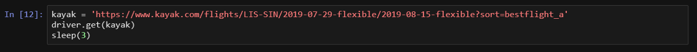

感谢您的阅读！ 如果您喜欢这篇文章，我邀请您检查我的其他故事。 我主要对数据科学，Python，区块链和数字货币，技术以及摄影等其他事物感兴趣！

如果您想取得联系，可以在这里与我联系或直接回复下面的文章。

好吧，每个Selenium项目都从一个webdriver开始。 我正在使用Chromedriver，但还有其他替代方法。 PhantomJS或Firefox也很流行。 下载后，将其放在文件夹中。 这些第一行将打开一个空白的Chrome标签。

请记住，我在这里没有新的突破。 有一些寻找便宜交易的更高级的方法，但是我希望我的帖子分享一些简单而实用的信息！
```python
from time import sleep, strftime
from random import randint
import pandas as pd
from selenium import webdriver
from selenium.webdriver.common.keys import Keys
import smtplib
from email.mime.multipart import MIMEMultipart

# Change this to your own chromedriver path!
chromedriver_path = 'C:/{YOUR PATH HERE}/chromedriver_win32/chromedriver.exe'

driver = webdriver.Chrome(executable_path=chromedriver_path) # This will open the Chrome window
sleep(2)
```

这些是我将用于整个项目的软件包。 在每次搜索之间，我将使用randint使漫游器随机睡眠数秒。 这通常是所有bot都必须具备的功能。 如果您运行了先前的代码，则应该打开一个Chrome窗口，机器人将在其中导航。

因此，让我们进行快速测试，然后在其他窗口上访问kayak.com。 选择您要往返的城市，以及日期。 选择日期时，请确保选择“ + -3天”。 我在编写代码时就考虑到了该结果页面，因此，如果只想搜索特定日期，则很有可能需要进行一些调整。 我会尝试在整个文本中指出所做的更改，但是如果您遇到问题，请在评论中给我留言。

点击搜索按钮，然后在地址栏中获取链接。 它看起来应该类似于我在下面使用的链接，其中我将变量kayak定义为url并从webdriver执行get方法。 您的搜索结果应出现。


每当我在几分钟内多次使用get命令两次或三次以上时，都会看到reCaptcha检查。 您实际上可以自己解决reCaptcha，并在下一个测试之前继续进行所需的测试。 从我的测试来看，对于所有时间的第一次搜索似乎都很好，因此，如果您想使用该代码，并让它们彼此间隔很长的时间自行运行，那实际上是一个难题的解决方法。 您真的不需要这些价格的10分钟更新，是吗？
## 每个XPath都有其水坑

到目前为止，我们已经打开一个窗口并获得了一个网站。 为了开始获取价格和其他信息，我们必须使用XPath或CSS选择器。 我选择了XPath，并没有必要将其与CSS混合使用，但是完全有可能这样做。 使用XPath浏览网页可能会造成混淆，即使您使用我在Instagram文章中描述的方法（我直接在检查器视图中使用“复制XPath”技巧），但我意识到，这实际上并不是到达XPath的最佳方法。 您想要的元素。 有时，该链接是如此具体，以至于很快就会过时。 《 Web Scraping with Python》这本书在解释XPath和CSS选择器导航的基础方面做得非常出色。


继续，让我们使用Python选择最便宜的结果。 上面代码中的红色文本是XPath选择器，如果您在任意位置右键单击网页并选择“检查”，则可以看到该文本。 再次单击鼠标右键，然后在您要查看代码的位置单击鼠标，然后再次检查。


为了说明我先前关于从检查器复制路径的缺点的观察，请考虑以下差异：
```
1 # This is what the copy method would return. Right click highlighted rows on the right side and select "copy > Copy XPath"//*[@id="wtKI-price_aTab"]/div[1]/div/div/div[1]/div/span/span2 # This is what I used to define the "Cheapest" buttoncheap_results = ‘//a[@data-code = “price”]’
```

显而易见，第二种选择非常简单。 它搜索元素a，其属性数据代码等于价格。 第一种选择寻找一个id等于wtKI-price_aTab的元素，然后跟随第一个div元素，另外四个div和两个span。 它将工作……这次。 我现在可以告诉您，下次加载页面时，id元素将更改。 字母wtKI每次页面加载时都会动态更改，因此，一旦页面重新加载，您的代码将无用。 花一点时间阅读有关XPath的知识，我保证它会有所回报。


不过，使用复制方法在不太“复杂”的网站上也可以使用，也可以！

根据我在上面显示的内容，如果我们想以列表中的多个字符串形式获取所有搜索结果，该怎么办？ 简单。 每个结果都在具有“ resultWrapper”类的对象内部。 可以像下面一样使用for循环来获取所有结果。 如果您了解这部分，则应该能够理解后面的大多数代码。 它基本上是指向您想要的内容（结果包装器），使用某种方式（XPath）在此处获取文本，然后将其放置在可读的对象中（首先使用flight_containers，然后使用flight_list）。


将显示前三行，我们可以清楚地看到我们需要的所有内容，但是我们有更好的替代方法来获取信息。 我们需要分别抓取每个元素。
## 清除起飞！

编写代码最简单的功能是加载更多结果，因此我们从此开始。 我想最大化我获得的航班数量，而又不会触发安全检查，因此每次显示页面时，我都会在“加载更多结果”按钮中单击一次。 唯一的新功能是try语句，我添加了它，因为有时按钮无法正确加载。 如果它也对您有帮助，只需在我将要显示的start_kayak函数中将其注释掉即可。
```python
# Load more results to maximize the scraping
def load_more():
    try:
        more_results = '//a[@class = "moreButton"]'
        driver.find_element_by_xpath(more_results).click()
        # Printing these notes during the program helps me quickly check what it is doing
        print('sleeping.....')
        sleep(randint(45,60))
    except:
        pass
```

现在，经过漫长的介绍（有时我可能会迷住了！），我们已经准备好定义将实际抓取页面的功能。

我已经在称为page_scrape的下一个函数中编译了大多数元素。 有时，返回的元素会列出内插第一和第二条腿信息的列表。 我使用了一种简单的方法来拆分它们，例如在第一个section_a_list和section_b_list变量中。 该函数还返回一个数据帧flight_df，因此我们可以将得到的结果分开，并在以后进行合并。
```python
def page_scrape():
    """This function takes care of the scraping part"""
    
    xp_sections = '//*[@class="section duration"]'
    sections = driver.find_elements_by_xpath(xp_sections)
    sections_list = [value.text for value in sections]
    section_a_list = sections_list[::2] # This is to separate the two flights
    section_b_list = sections_list[1::2] # This is to separate the two flights
    
    # if you run into a reCaptcha, you might want to do something about it
    # you will know there's a problem if the lists above are empty
    # this if statement lets you exit the bot or do something else
    # you can add a sleep here, to let you solve the captcha and continue scraping
    # i'm using a SystemExit because i want to test everything from the start
    if section_a_list == []:
        raise SystemExit
    
    # I'll use the letter A for the outbound flight and B for the inbound
    a_duration = []
    a_section_names = []
    for n in section_a_list:
        # Separate the time from the cities
        a_section_names.append(''.join(n.split()[2:5]))
        a_duration.append(''.join(n.split()[0:2]))
    b_duration = []
    b_section_names = []
    for n in section_b_list:
        # Separate the time from the cities
        b_section_names.append(''.join(n.split()[2:5]))
        b_duration.append(''.join(n.split()[0:2]))

    xp_dates = '//div[@class="section date"]'
    dates = driver.find_elements_by_xpath(xp_dates)
    dates_list = [value.text for value in dates]
    a_date_list = dates_list[::2]
    b_date_list = dates_list[1::2]
    # Separating the weekday from the day
    a_day = [value.split()[0] for value in a_date_list]
    a_weekday = [value.split()[1] for value in a_date_list]
    b_day = [value.split()[0] for value in b_date_list]
    b_weekday = [value.split()[1] for value in b_date_list]
    
    # getting the prices
    xp_prices = '//a[@class="booking-link"]/span[@class="price option-text"]'
    prices = driver.find_elements_by_xpath(xp_prices)
    prices_list = [price.text.replace('$','') for price in prices if price.text != '']
    prices_list = list(map(int, prices_list))

    # the stops are a big list with one leg on the even index and second leg on odd index
    xp_stops = '//div[@class="section stops"]/div[1]'
    stops = driver.find_elements_by_xpath(xp_stops)
    stops_list = [stop.text[0].replace('n','0') for stop in stops]
    a_stop_list = stops_list[::2]
    b_stop_list = stops_list[1::2]

    xp_stops_cities = '//div[@class="section stops"]/div[2]'
    stops_cities = driver.find_elements_by_xpath(xp_stops_cities)
    stops_cities_list = [stop.text for stop in stops_cities]
    a_stop_name_list = stops_cities_list[::2]
    b_stop_name_list = stops_cities_list[1::2]
    
    # this part gets me the airline company and the departure and arrival times, for both legs
    xp_schedule = '//div[@class="section times"]'
    schedules = driver.find_elements_by_xpath(xp_schedule)
    hours_list = []
    carrier_list = []
    for schedule in schedules:
        hours_list.append(schedule.text.split('\n')[0])
        carrier_list.append(schedule.text.split('\n')[1])
    # split the hours and carriers, between a and b legs
    a_hours = hours_list[::2]
    a_carrier = carrier_list[::2]
    b_hours = hours_list[1::2]
    b_carrier = carrier_list[1::2]

    
    cols = (['Out Day', 'Out Time', 'Out Weekday', 'Out Airline', 'Out Cities', 'Out Duration', 'Out Stops', 'Out Stop Cities',
            'Return Day', 'Return Time', 'Return Weekday', 'Return Airline', 'Return Cities', 'Return Duration', 'Return Stops', 'Return Stop Cities',
            'Price'])

    flights_df = pd.DataFrame({'Out Day': a_day,
                               'Out Weekday': a_weekday,
                               'Out Duration': a_duration,
                               'Out Cities': a_section_names,
                               'Return Day': b_day,
                               'Return Weekday': b_weekday,
                               'Return Duration': b_duration,
                               'Return Cities': b_section_names,
                               'Out Stops': a_stop_list,
                               'Out Stop Cities': a_stop_name_list,
                               'Return Stops': b_stop_list,
                               'Return Stop Cities': b_stop_name_list,
                               'Out Time': a_hours,
                               'Out Airline': a_carrier,
                               'Return Time': b_hours,
                               'Return Airline': b_carrier,                           
                               'Price': prices_list})[cols]
    
    flights_df['timestamp'] = strftime("%Y%m%d-%H%M") # so we can know when it was scraped
    return flights_df
```

我试图使名称清楚易懂。 请记住，带有a的变量与行程的第一段相关，而与b的变量与行程的第一段相关。 转到下一个功能。
## 等等，还有吗？

到目前为止，我们具有加载更多结果的功能，以及刮取这些结果的功能。 我可以在此处结束本文，您仍然可以手动使用它们，并在自己浏览的页面上使用抓取功能，但是我确实提到了有关向自己发送电子邮件的信息以及其他一些信息！ 这就是下一个函数start_kayak的全部内容！
```python
def start_kayak(city_from, city_to, date_start, date_end):
    """City codes - it's the IATA codes!
    Date format -  YYYY-MM-DD"""
    
    kayak = ('https://www.kayak.com/flights/' + city_from + '-' + city_to +
             '/' + date_start + '-flexible/' + date_end + '-flexible?sort=bestflight_a')
    driver.get(kayak)
    sleep(randint(8,10))
    
    # sometimes a popup shows up, so we can use a try statement to check it and close
    try:
        xp_popup_close = '//button[contains(@id,"dialog-close") and contains(@class,"Button-No-Standard-Style close ")]'
        driver.find_elements_by_xpath(xp_popup_close)[5].click()
    except Exception as e:
        pass
    sleep(randint(60,95))
    print('loading more.....')
    
#     load_more()
    
    print('starting first scrape.....')
    df_flights_best = page_scrape()
    df_flights_best['sort'] = 'best'
    sleep(randint(60,80))
    
    # Let's also get the lowest prices from the matrix on top
    matrix = driver.find_elements_by_xpath('//*[contains(@id,"FlexMatrixCell")]')
    matrix_prices = [price.text.replace('$','') for price in matrix]
    matrix_prices = list(map(int, matrix_prices))
    matrix_min = min(matrix_prices)
    matrix_avg = sum(matrix_prices)/len(matrix_prices)
    
    print('switching to cheapest results.....')
    cheap_results = '//a[@data-code = "price"]'
    driver.find_element_by_xpath(cheap_results).click()
    sleep(randint(60,90))
    print('loading more.....')
    
#     load_more()
    
    print('starting second scrape.....')
    df_flights_cheap = page_scrape()
    df_flights_cheap['sort'] = 'cheap'
    sleep(randint(60,80))
    
    print('switching to quickest results.....')
    quick_results = '//a[@data-code = "duration"]'
    driver.find_element_by_xpath(quick_results).click()  
    sleep(randint(60,90))
    print('loading more.....')
    
#     load_more()
    
    print('starting third scrape.....')
    df_flights_fast = page_scrape()
    df_flights_fast['sort'] = 'fast'
    sleep(randint(60,80))
    
    # saving a new dataframe as an excel file. the name is custom made to your cities and dates
    final_df = df_flights_cheap.append(df_flights_best).append(df_flights_fast)
    final_df.to_excel('search_backups//{}_flights_{}-{}_from_{}_to_{}.xlsx'.format(strftime("%Y%m%d-%H%M"),
                                                                                   city_from, city_to, 
                                                                                   date_start, date_end), index=False)
    print('saved df.....')
    
    # We can keep track of what they predict and how it actually turns out!
    xp_loading = '//div[contains(@id,"advice")]'
    loading = driver.find_element_by_xpath(xp_loading).text
    xp_prediction = '//span[@class="info-text"]'
    prediction = driver.find_element_by_xpath(xp_prediction).text
    print(loading+'\n'+prediction)
    
    # sometimes we get this string in the loading variable, which will conflict with the email we send later
    # just change it to "Not Sure" if it happens
    weird = '¯\\_(ツ)_/¯'
    if loading == weird:
        loading = 'Not sure'
    
    username = 'YOUREMAIL@hotmail.com'
    password = 'YOUR PASSWORD'

    server = smtplib.SMTP('smtp.outlook.com', 587)
    server.ehlo()
    server.starttls()
    server.login(username, password)
    msg = ('Subject: Flight Scraper\n\n\
Cheapest Flight: {}\nAverage Price: {}\n\nRecommendation: {}\n\nEnd of message'.format(matrix_min, matrix_avg, (loading+'\n'+prediction)))
    message = MIMEMultipart()
    message['From'] = 'YOUREMAIL@hotmail.com'
    message['to'] = 'YOUROTHEREMAIL@domain.com'
    server.sendmail('YOUREMAIL@hotmail.com', 'YOUROTHEREMAIL@domain.com', msg)
    print('sent email.....')
```

它要求您声明城市和日期。 从那里，它将打开皮划艇字符串中的地址，该地址将直接转到“最佳”结果页面的排序。 第一次刮擦之后，我自由地获得了价格最高的矩阵。 它将用于计算平均值和最小值，并与Kayak的预测一起发送到电子邮件中（在页面中，该值应该在左上方）。 这是可能导致单日搜索错误的原因之一，因为那里没有矩阵元素。

我使用Outlook帐户（hotmail.com）对此进行了测试。 尽管我没有使用Gmail帐户发送电子邮件来测试它，但是您可以搜索很多替代方法，而我前面提到的书也有其他方法可以做到这一点。 如果您已经有Hotmail帐户，则替换您的详细信息后，该帐户应该可以使用。

如果您想探索脚本的某些部分在做什么，请复制它并在功能之外使用它。 这是您完全了解它的唯一方法
## 使用我们刚刚创建的所有内容

完成所有这些之后，我们不妨提出一个简单的循环来开始使用我们刚刚创建的功能并使它们保持忙碌状态。 带有四个“精美”提示，提示您实际输入城市和日期（输入）。 由于进行测试时，我们不想每次都键入这些变量，因此在需要时用它们下面的显式方式替换它们。
```python
city_from = input('From which city? ')
city_to = input('Where to? ')
date_start = input('Search around which departure date? Please use YYYY-MM-DD format only ')
date_end = input('Return when? Please use YYYY-MM-DD format only ')

# city_from = 'LIS'
# city_to = 'SIN'
# date_start = '2019-08-21'
# date_end = '2019-09-07'

for n in range(0,5):
    start_kayak(city_from, city_to, date_start, date_end)
    print('iteration {} was complete @ {}'.format(n, strftime("%Y%m%d-%H%M")))
    
    # Wait 4 hours
    sleep(60*60*4)
    print('sleep finished.....')
```

如果您做到了这一点，那么恭喜！ 我可以想到很多改进，例如与Twilio集成以向您发送文本消息而不是电子邮件。 您还可以使用VPN或更模糊的方式来同时搜索来自多个服务器的搜索结果。 验证码问题可能会不时弹出，但是对于此类问题有一些解决方法。 我认为您在这里有一定的扎实基础，建议您尝试添加一些额外的功能。 也许您希望将Excel文件作为附件发送。 我一直欢迎建设性的反馈，请随时在下面发表评论。 我试图回应每一个人！

根据评论部分的普遍要求，以下是完整的Jupyter Notebook以及所有代码的链接！

这是我查看代码的视频的链接。 我很想知道你们是否真的在看它，欢迎大家提供反馈。 太久了吗 我是否应该制作较短的视频并更详细地检查代码？ 让我知道 ：）

> example of a test run with the script


如果您想了解有关Web Scraping的更多信息，我强烈建议您阅读《用Python进行Web Scraping》一书。 我真的很喜欢这些示例，并对代码的工作方式进行了清晰的解释。 而且，如果您更喜欢社交媒体抓取功能，那么还有一本专门针对该主题的绝妙书籍。 我将在下一篇使用Twitter API的文章中使用后者，但是这里还有很多东西甚至可以吸引LinkedIn。 （如果您决定购买和使用我的链接，我会收到一笔小小的费用，而您无需支付任何额外费用。我确实需要大量的咖啡才能撰写这些文章！在此先感谢您！）
## 简单的说

该项目的目标是构建一个网络刮板，该刮板将针对特定目的地运行并以灵活的日期（最先选择的日期之前和之后的3天）对航班价格进行搜索。 它将结果保存为excel，并发送包含快速统计信息的电子邮件。 显然，目标是帮助我们找到最优惠的价格！

如果您迷失了方向，请尝试看看我有关Instagram机器人的文章，因为它也使用Selenium。

实际应用取决于您。 我用它来搜索假期和最近去我家乡的短途旅行！

如果您对此很认真，则可以在服务器上运行脚本（一个简单的Raspberry Pi可以运行），并使其每天启动一次或两次。 结果将被邮寄给您，我建议将excel文件保存到Dropbox文件夹中，以便您可以随时随地访问它。

> I did not find any error fare yet, but I suppose it’s possible!


它搜索“弹性日期”，因此它将查找您最先选择的日期前后3天以内的航班。 尽管该脚本一次可用于一对目的地，但是您可以轻松地对其进行调整，以在每个循环中运行多个目的地。 您甚至可能会发现一些错误的票价……这太棒了！
## 另一个刮板

当我第一次开始进行网络抓取时，我对该主题并不特别感兴趣。 那里...我说了！ 我想通过预测建模，财务分析以及一些情感分析来做更多的项目，但是事实证明弄清楚如何构建第一个Web爬网程序确实很有趣。 在不断学习的过程中，我意识到使Web变得“正常工作”的原因是网络抓取。

> Yep… Just like Larry and Sergey, you can hit the jacuzzi after you initiate the scraper! (image: wired.com)


您可能会认为这是一个非常大胆的主张，但是如果我告诉您Google最初是使用Java和Python构建的网页抓取工具Larry Page，该怎么办？ 它遍历了整个互联网，并且至今仍在努力为您的问题提供最佳答案。 Web抓取应用层出不穷，即使您更喜欢Data Science中的其他主题，您仍然需要一些抓取技巧来获取数据。

我在这里使用的一些技术来自我最近买的一本很棒的书，其中涵盖了与Web抓取有关的所有内容。 很多简单的例子和大量的实际应用。 甚至有一章非常有趣的章节涉及解决reCaptcha检查，这让我大吃一惊-我不知道现有的工具甚至服务都无法解决！ （免责声明：如果您通过我的链接购买了这本书，那么我将获得一笔小额费用，而无需您支付任何额外费用。因此，如果您希望在本文结束时为我购买咖啡，我将不胜感激！）
## “你喜欢旅行吗？！”

这个简单而无害的问题通常会得到一个肯定的答案以及一个或多个关于先前冒险的故事。 我们大多数人都会同意，旅行是体验新文化并拓宽视野的绝佳途径。 但是，如果问题是“您喜欢搜索机票的过程吗？”，那么我敢肯定反应会不那么热情……

Python解救。

第一个挑战是选择从哪个平台抓取信息。 这并不容易，但是我和皮划艇定居了。 我尝试了Momondo，Skyscanner，Expedia等等，但是这些网站上的reCaptchas都很残酷。 经过几次尝试在“您是人类”检查中选择交通信号灯，人行横道和自行车后，我得出结论认为，即使您在短时间内加载过多页面也会导致安全检查，但Kayak是我的最佳选择。 我设法使该漫游器每隔4到6个小时就查询一次网站，而且还可以。 有时可能会偶尔出现打h，但是如果您开始获得reCaptcha检查，请手动解决它们，然后启动bot，或者等待几个小时，然后将其重置。 随时将代码改编成其他平台，欢迎在评论部分中共享它！

如果您不熟悉网页抓取功能，或者不知道为什么有些网站在阻止它方面大有帮助，请在编写第一行代码之前将您的工作大功告成。 Google“网络抓取礼节”。 如果您像疯子一样开始爬行，您的努力可能会比您想像的要早得多。
## 系好安全带…

双关语意

导入并打开Chrome浏览器标签后，我们将定义一些将在循环内使用的函数。 结构的想法或多或少是这样的：
+ 一个功能将启动机器人，并声明我们要搜索的城市和日期
+ 此功能获取第一个搜索结果，并按“最佳”飞行排序，然后单击“加载更多结果”
+ 另一个函数将抓取整个页面，并返回一个数据框
+ 它将针对“便宜”和“最快”排序类型重复步骤2和3
+ 将会向您发送一封电子邮件，其中包含价格的简要摘要（最低价和均价），并将具有三种排序类型的数据框保存为excel文件
+ 每隔X个小时运行一次，便会重复执行前面的所有步骤。
# 如果您喜欢旅行，请让Python帮助您抓取最好的廉价航班！

> source: videoblocks.com


自从我发表我的上一篇文章已经有一段时间了，展示了如何构建网络抓取工具来增加您的Instagram受众。 与此同时，发生了很多事情……新工作，搬到新国家，以主讲人的身份参加了在里斯本举行的PyData活动，收件箱中有许多未读邮件，并且越来越多的关注者 完全让我感到惊讶的媒介-将近1000个关注者！ 老实说，我没想到会有如此惊人的反馈。 我真的想在这里做笔记，不仅要感谢阅读我以前的帖子的每个人，还要向那些真正单击“关注”的人保证我仍然在这里，新文章有望继续定期发行。 如果您还不关注我，我是否提到我真的很接近1000个关注者的令人激动的里程碑？ :)

更新：我创建了一个视频，在其中我检查了代码。 应该更容易遵循！
```
(本文翻译自Fábio Neves的文章《If you like to travel, let Python help you scrape the best cheap flights!》，参考：https://towardsdatascience.com/if-you-like-to-travel-let-python-help-you-scrape-the-best-fares-5a1f26213086)
```
