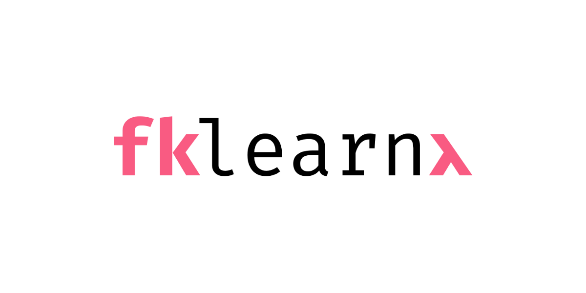

# fklearn简介：Nubank的机器学习库（第一部分）

在这里阅读该故事的第二部分。

Nubank刚刚开源了fklearn，这是我们的机器学习python库！


在Nubank，我们严重依赖机器学习来制定可扩展的数据驱动型决策。 尽管那里还有许多其他的ML库（例如，我们广泛使用Xgboost，LGBM和ScikitLearn），但我们感到需要更高层次的抽象，这将有助于我们更轻松地将这些库应用于所面临的问题。 Fklearn有效地将这些库包装为一种格式，使它们在生产中的使用更加有效。

Fklearn当前在Nubank上支持大量的机器学习模型，解决了从信用评分到自动客户支持聊天响应的问题。 我们在构建时考虑了以下目标：
+ 验证应反映现实生活中的情况
+ 生产模型应与经过验证的模型匹配
+ 模型应准备就绪，只需几个额外步骤
+ 模型结果的重现性和深入分析应该易于实现

早期，我们认为函数式编程将是实现这些目标的强大盟友。
# F代表功能

在Nubank，我们是函数式编程的忠实拥护者，而不仅限于“工程”一章。 但是函数式编程如何帮助数据科学家？

机器学习通常是通过使用面向对象的python代码来完成的，这也是我们在Nubank所采用的方式。 那时，建立机器学习模型并将其投入生产的过程非常繁琐，而且常常有很多错误。 我们仅部署模型以发现生产中的预测与验证期间看到的预测不匹配。 而且，验证通常是无法重现的，通常是在有状态的Jupyter Notebook中进行的。

函数式编程可通过以下方法帮助解决这些问题：
+ 使训练过程中发生的数据转换与生产中的模型匹配的流水线变得容易。
+ 允许在交互式环境（例如Jupyter笔记本电脑）中进行更安全的迭代，防止由于有状态代码导致的错误并提高研究的可重复性。
+ 使我们能够编写适用于模型类型和应用程序的非常通用的验证，调整和功能选择代码，从而使我们整体上效率更高。

undefined
+ 由于收入是自我报告的，有时会被夸大，因此将月收入的上限设为50,000。
+ 将模型的输出范围限制为[0，20,000]间隔。

然后使用简单的线性回归模型。 代码如下所示：
```python
from fklearn.training.pipeline import build_pipeline
from fklearn.training.regression import linear_regression_learner
from fklearn.training.transformation import capper, floorer, prediction_ranger

def fit(train_data):
    capper_fn = capper(columns_to_cap=["income"], precomputed_caps={"income": 50,000})
    regression_fn = linear_regression_learner(features=["income", "bill_amount"], target="spend")
    ranger_fn = prediction_ranger(prediction_min=0.0,   prediction_max=20000.0)
    
    learner = build_pipeline(capper_fn, regression_fn, ranger_fn)
    predict_fn, training_predictions, logs = learner(train_data)
    
    return predict_fn, logs
```

不要惊慌！ 我们将逐步讲解代码，解释一些重要的fklearn概念。
# 学习者功能

在scikit-learn中，模型的主要抽象是具有适合和变换方法的类，而在fklearn中，我们使用所谓的学习者函数。 学习器功能获取一些训练数据（以及其他参数），从中学习一些东西，然后返回三样东西：预测函数，转换后的训练数据和日志。 本示例的前三行正在初始化三个学习器函数：capper，linear_regression_learner和prediction_ranger。

为了更好地说明，这是linear_regression_learner的简化定义：
```python
from typing import Any, Dict, List
from sklearn.linear_model import LinearRegression
from toolz import curry
import pandas as pd
 
@curry
def linear_regression_learner(df: pd.DataFrame,
                              features: List[str],
                              target: str,
                              params: Dict[str, Any] = None) -> LearnerReturnType:
 
   # initialize and fit the linear regression
   reg = LinearRegression(**params) 
   reg.fit(df[features].values, df[target].values)
 
   # define the prediction function
   def p(new_df: pd.DataFrame) -> pd.DataFrame:
       # note that `reg` here refers to the linear regression fit above, via the function’s closure.
       return new_df.assign(prediction=reg.predict(new_df[features].values))
 
   # the log can contain arbitrary information that helps inspect or debug the model
   log = {'linear_regression_learner': {
       'features': features,
       'target': target,
       'parameters': params,
       'training_samples': len(df),
       'feature_importance': dict(zip(features, reg.coef_.flatten()))
   }
 
   return p, p(df), log

```

注意使用类型提示！ 它们与非常有用的toolz库一起，有助于使python中的函数式编程不那么笨拙。

正如我们提到的，学习者函数返回三件事（一个函数，一个DataFrame和一个字典），如LearnerReturnType定义所描述：
```python
from typing import Any, Callable, Dict, Tuple
import pandas as pd

LearnerReturnType = Tuple[PredictFnType, pd.DataFrame, LearnerLogType]
PredictFnType = Callable[[pd.DataFrame], pd.DataFrame]
LearnerLogType = Dict[str, Any]

```
+ 预测函数始终具有相同的签名：它接受一个DataFrame并返回一个DataFrame（我们使用Pandas）。 它应该能够接受任何新的DataFrame（只要它包含必需的列）并对其进行转换（它等效于scikit-learn对象的transform方法）。 在这种情况下，预测函数仅使用经过训练的线性回归模型的预测来创建新列。
+ 转换后的训练数据通常只是应用于训练数据的预测函数。 当您希望对训练集进行预测或用于构建管道时，此功能非常有用，我们将在后面介绍。
+ 日志是字典，可以包含与检查或调试学习者有关的任何信息（例如，使用了哪些功能，训练集中有多少样本，功能重要性或系数）。

学习者功能显示一些常见的功能编程属性：
+ 它们是纯函数，意味着在给定相同输入的情况下它们总是返回相同的结果，并且没有副作用。 实际上，这意味着您可以根据需要多次致电学习者，而不必担心结果不一致。 例如，在scikit-learn对象上调用fit时，情况并非总是如此，因为对象可能会发生变异。
+ 它们是高阶函数，因为它们返回另一个函数（预测函数）。 由于预测功能是在学习者内部定义的，因此它可以通过关闭功能访问学习者功能范围内的变量。
+ 通过具有一致的签名，学习者功能（和预测功能）是可组合的。 这意味着从中构建整个管道非常简单，我们将很快看到。
+ 它们是可伸缩的，这意味着您可以分步初始化它们，一次仅传递几个参数（这是我们示例前三行中实际发生的情况）。 这在定义管道并将单个模型应用于不同的数据集同时获得一致的结果时很有用。

可能需要花费一些时间来解决所有这些问题，但是不用担心，您不需要成为函数式编程的专家就可以有效地使用fklearn。 关键是要理解可以根据学习者抽象将模型（和其他数据转换）定义为函数。
# 流水线

但是，机器学习模型很少单独存在。 通过仅关注模型，数据科学家倾向于忘记数据在机器学习部分之前和之后经历的转换。 在训练和部署模型时，这些转换通常需要完全相同，并且数据科学家可能会尝试在生产中手动重新创建其训练前和后处理步骤，这导致难以维护的代码重复。

学习者功能是可组合的，这意味着可以将两个或多个学习者结合起来视为一个新的，更复杂的学习者。 这意味着，无论您要执行多少步骤，最终模型的行为都将与单个模型相同，并且进行预测就像对新数据调用最终预测函数一样简单。 将建模管道中的所有步骤包含在一个单一的纯函数中也有助于进行验证和调整，因为我们可以将其传递给其他函数而不必担心副作用。

在我们的示例中，我们的流程包括三个步骤：设置收入变量的上限，运行回归，然后将回归输出限制在[0，20000]范围内。 在初始化每个学习者之后，我们使用以下两行代码构建管道并将其应用于训练集：
```python
  ...
  learner = build_pipeline(capper_fn, regression_fn, ranger_fn)
  predict_fn, training_predictions, logs = learner(train_data)
  ...
```

现在，学习者变量包含组成三个学习者功能的结果的流水线，并将其应用于训练数据以产生最终的预测功能。 该功能会将管道中所有等效的步骤应用于测试数据，如下图所示：

> Example of how data flows through a pipeline when training, and through a prediction function when predicting. The prediction function itself is returned by the pipeline; it is the composition of the three prediction functions generated by each learner when the pipeline was first called on the training data. The logs are a combination of the logs coming from all learner functions in the pipeline.

# 下一步是什么？

我们已经了解了如何将模型和数据转换步骤编写为学习者函数，以及fklearn中的功能管道如何帮助我们确保训练和验证过程中完成的转换与生产过程中的转换匹配。

在此博客文章的第二部分中，我们讨论了模型验证和分析，以及fklearn提供的使这些步骤更有效的工具。

同时，我们邀请您亲自尝试fklearn！ 我们不希望fklearn取代ML中的当前标准，但是我们希望它开始有关函数式编程对机器学习的好处的有趣的对话。

对数据科学和Nubank正在开发的令人兴奋的产品感兴趣？ 我们正在招聘！
```
(本文翻译自Lucas Estevam的文章《Introducing fklearn: Nubank’s machine learning library (Part I)》，参考：https://medium.com/building-nubank/introducing-fklearn-nubanks-machine-learning-library-part-i-2a1c781035d0)
```
