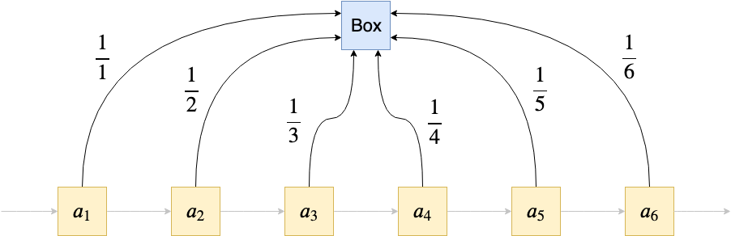
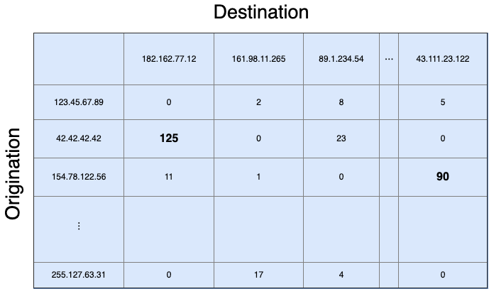

我希望我能教你一些有用的东西。

谢谢阅读！

如有任何疑问，请在LinkedIn上给我写信！

另外，请查看其他有关可掌握的机器学习主题的文章。

既然您知道它现在是如何工作的，那么让我们来看一个更有趣的算法。
# 储层采样

假设您有一个庞大的数据集，并且想要对一个对象进行统一采样。 你怎么能这样 好吧，如果您知道数据集的大小n，则可以均匀地绘制介于1和n之间的随机数k，扫描数据集并取第k个元素。

但是现在想象一下，您有一个数据流，并且事先不知道有多少元素进入，或者什么时候您想停止读取数据流。 现在变得越来越困难，因为您不知道从哪个范围绘制随机索引。 但是这个问题也有一个简单的解决方案，称为储层采样。

想法如下：您有一个用于元素的框（容器）。 扫描数据流时，以一定的概率用当前元素替换框的内容。

> A prototypical reservoir. Source: Super Mario World


如果我不介意这个想法，也许您可以在一段时间后弄清楚概率。 经过n个元素之后的目标是能够使每个元素以1 / n的概率出现在框中。

在最简单的情况下，从某个恒定概率p开始。 但是，例如，第一个元素在n-1个以上的元素之后出现在框中的概率仅为（1-p）ⁿ，对于任何p <1而不是我们要搜索的内容，它的指数均较小。

解决此问题的一个方法是：扫描序列的时间越长，我们就必须降低交换的可能性。 什么是简单衰减率？ 1 / n呢？ 咱们试试吧。

首先，该框为空。 我们扫描第一个元素，并用第一个元素填充框（概率为1/1 = 1）。 到目前为止，一切都很好。

现在我们进入第二个元素。 我们用1/2的概率替换盒子的内容。 完成此步骤后，第一个元素以1/1 * 1/2 = 1/2的概率位于框中，第二个元素以1/2的概率位于框中。 完善！ 让我们再做一个。

到达第三个元素，它将以1/3的概率替换框中的元素。 第一个元素仍在框中的概率是多少？ 它是在第一次（好的，这很容易），第二和第三次交换机会中幸存下来的概率：1/1 * 1/2 * 2/3 = 1/3。 看起来不错！ 第二个要素？ 它必须度过第二个和第三个交换机会，发生的可能性为1/2 * 2/3 = 1/3。 看来可行！ 确实如此，正如人们可以看到的那样……归纳！


这是代码：
```
from random import randomclass ReservoirSampler:    def __init__(self):        self.result = None        self.n = 0    def update(self, element):        self.n += 1        if random() < 1 / self.n:  # Satisfied with prob. 1/n.            self.result = element
```

我们可以快速检查一下是否可行。 让我们从大小为20的数据集中重复采样。我们期望在所有情况的5％中绘制每个元素。
```
results = []for _ in range(1000000):    r = ReservoirSampler()    for s in range(20):        r.update(s)    results.append(r.result)
```

可视化结果给出以下内容：


我们可以看到，在所有试验中大约有5％采样了每个元素。 完善！
# 结论

我们已经看到，即使在当今，也必须使用内存高效的算法。 处理超大数据集的巧妙技巧仍然很重要，幸运的是，聪明的人在该领域投入了很多精力。

在本文中，我向您介绍了三个非常简单的算法示例，这些示例应该教会您如何解决极度受限的内存问题。

下次，如果您的数据不再适合您的RAM，请考虑是否可能有一种以流方式处理它的方法！

在Python中，我们可以使用以下非常简单的类来解决它：
```
from math import infclass StreamingMinimum:    def __init__(self):        self.result = inf  # Immediately replaced by the 1st element    def update(self, element):        self.result = min(self.result, element)
```

您可以通过以下方式使用它
```
import numpy as npstream = iter(np.random.randn(10000))  # Simulate a streams = StreamingMinimum()for element in stream:    s.update(element)print(s.result)
```

容易吧？ 让我们增加难度。
## 寻找均值

相同的设置：大数据集，但现在我们想找到平均值而不是最小值。

> Of course, you knew the formula!


因此，我们现在的问题如下：

当我们已经有了前n个元素的均值时，如何计算n + 1个元素的均值？

一个简单的解决方案是使用下面的标识，您可能会想一想：


我们可以看到，我们不仅需要存储旧的均值，而且还必须跟踪元素n的数量，因为公式中需要这样做。 在计算最小值的情况下，这不是必需的。

这是课程：
```
class StreamingMean:    def __init__(self):        self.result = 0        self.n = 0    def update(self, element):        self.result = (self.result * self.n + element) / (self.n+1)        self.n += 1
```

您可以像以前一样再次测试此代码。 只需使用StreamingMean类而不是StreamingMinimum即可。

完整性检查：结果大约为0，这也是我们对标准正态分布随机变量的期望值。 再说一次：检查此算法的正确性是一个简单的归纳练习。

现在我听到有人说：

我为什么要关心网络内容？ 我是机器学习的家伙，du！ -你

好吧，还有一个来自机器学习世界的著名例子：梯度下降！

如果我们处理足够小的数据集，则可以将其完全放入（GPU）RAM中，并且可以使用Batch Gradient Descent，即立即将完整的数据放入内存中并进行处理。 但是，大多数情况下，我们的工作内存太小，因此有必要使用随机梯度下降或最小批量梯度下降（所谓的流算法的示例）。 另一个示例是霍夫丁树算法，我在这里进行了介绍。

在本文中，我想向您展示一些流算法的示例，包括您可以使用的Python实现！ 除了让您意识到问题之外，我已经做到了。 ;）
# 直觉

对于流算法，我指的是能够处理非常大的，甚至是无边界的数据集并仅使用恒定数量的RAM就能计算出所需输出的算法。

如果数据集是无界的，我们称它为数据流。 在这种情况下，如果我们在位置n处停止处理数据流，则我们希望我们的算法具有与到目前为止所看到的数据相对应的解决方案。

在下面的示例中，假设我们要么要处理硬盘上的大量数据集，而又不想立即将其加载到RAM中（因为我们不能），或者有一个源可以输出数据流， 例如，Twitter上的传入推文。 两种情况的处理方式相同。

从那时起，我将以大型数据集的语言来表述即将出现的示例，因为我们知道它们是有限的，而且我不必总是停止读取数据流。

我们进一步假设我们可以只传递一次数据。
# 温柔的开始

让我们熟悉如何使用两个简单的示例设计流算法。
## 求最小

想象一下，有一个非常庞大的数字列表，对于您的RAM来说太大了。 您想找出此列表的最小值。 在Python中，经典的解决方法是这样的：
```
print(min(my_list))
```

但这假设my_list已在RAM中。 那么，我们如何以另一种方式来解决呢？ 也许您已经找到了解决方案：

只要找到一个较小的数字，就在数字之后读取数据集编号并更新最小值。

更精确地说：阅读第一个元素并将其声明为最小值。 然后读取第二个元素，如果它小于当前的最小值（第一个元素），则将其声明为最小值。 否则，什么都不做。

然后，您读取第三个元素，如果它小于当前的最小值，则将其声明为最小值。 否则，什么都不做。

然后，您读取第四个元素，如果它小于当前的最小值，则将其声明为最小值。 否则，什么都不做。

好吧，我停下来，你知道这是怎么回事。 这基本上有效，因为


使用此公式，您可以通过归纳轻松地表明算法是正确的。 读取第一个元素后，结果正确，因为a since <∞，因此min（∞，a₁）=a₁。 归纳步骤正是公式（考虑一下！）。 但是，足够让我们回到正轨。
# 流算法简介
## 各种带有Python解释和实现的算法

> Photo by Jon Flobrant on Unsplash


在过去，编程比今天要意味着要始终牢记内存限制。 尽管在1990年拥有32 MB的RAM是一笔财富，但如今有时家用计算机甚至32 GB还是不够的。 硬盘，RAM和GPU内存的大小在增加时，可用数据量也在增加。 因此，拥有一系列存储器效率高的算法仍然很重要。
# 两个小例子

一个典型的示例是Internet交换机，它监视彼此发送包的不同IP。 交换机的一项常见任务是找出麻烦的对象，即一对两个IP地址，与其他对相比，其中IP₁与IP 2的通信非常频繁。 这很有趣，因为这可能表示拒绝服务攻击。

> Photo by Webaroo.com.au on Unsplash


这听起来像是一个简单的问题，对吗？ 只需实现一些从IP对（IP 1，IP 2）到从IP 1到IP 2的通信数量的映射。 在Python中，这可能是字典，Counter类的实例或邻接矩阵。 然后，您可以在数据结构中搜索最高的k个计数，并输出相应的IP地址。

> 42.42.42.42 talked suspiciously often to 182.162.77.12, and 154.78.122.56 to 43.111.23.122. It might be worth investigating this.


但是现在考虑一下这些数据结构的大小。 更大的交换机可以接收来自数百万个IP的请求，并将其路由到其他许多IP。

这意味着我们可能最终得到数百万乘以数百万的IP对。

再加上通常存储空间不足的交换机，这会带来很多麻烦。 用这种方法是不可能的：我们需要一种比存储所有内容占用更少内存的算法。 一种方法是使用Count-min Sketch。 您也可以在YouTube上搜索“重击手”，如果有兴趣，可以找到一些不错的解释和示例。
```
(本文翻译自Dr. Robert Kübler的文章《Introduction to Streaming Algorithms》，参考：https://towardsdatascience.com/introduction-to-streaming-algorithms-b71808de6d29)
```
