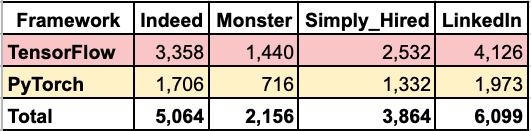
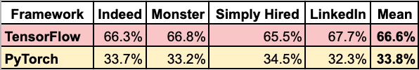
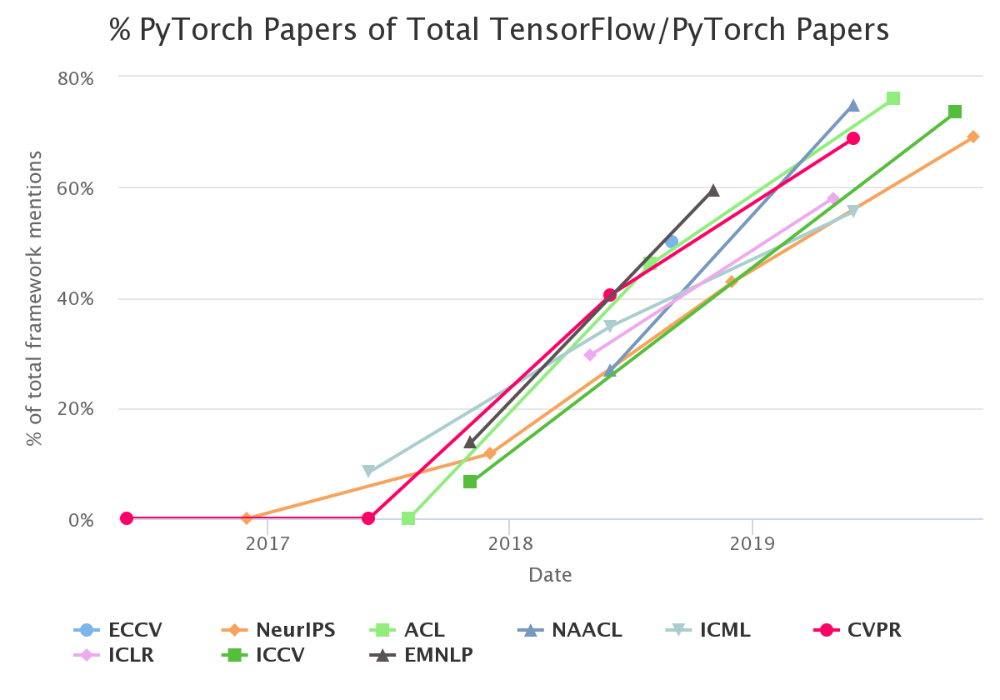
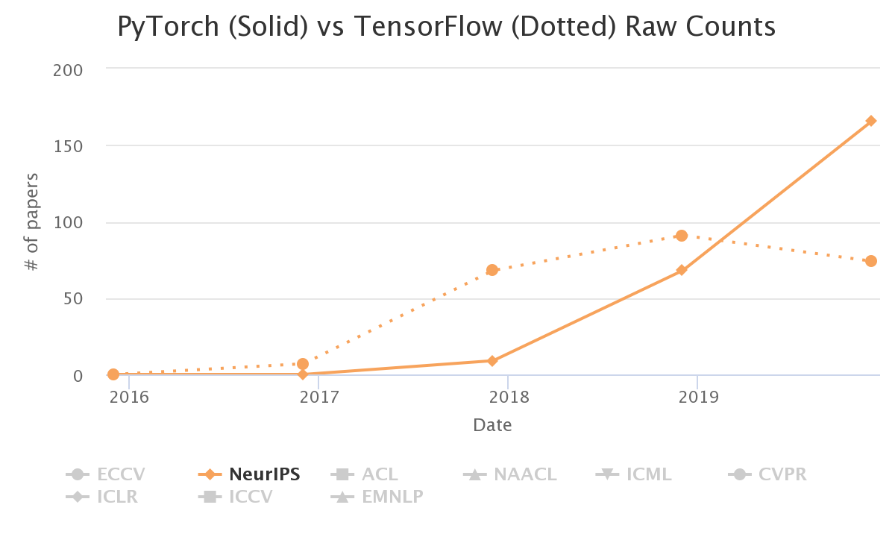
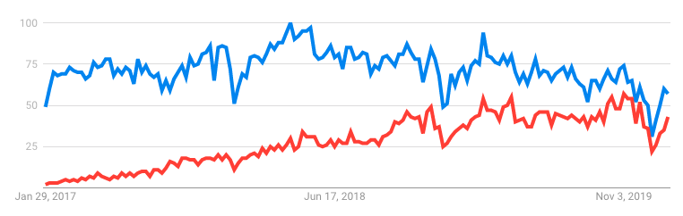
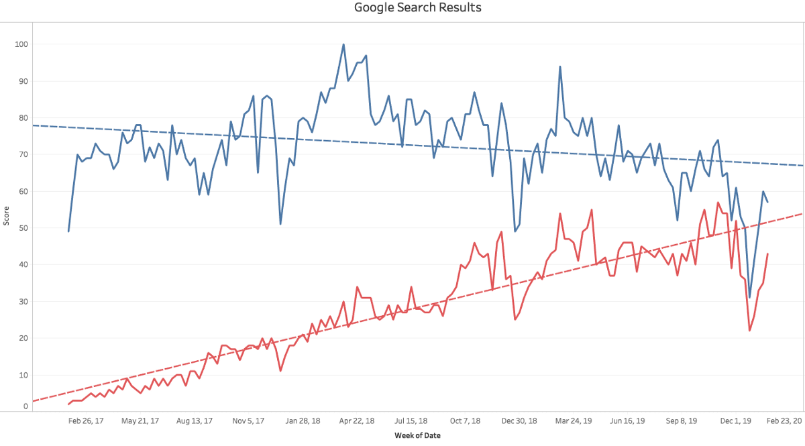

# PyTorch正在捕获TensorFlow吗？
## 2020年深度学习框架现状

自从我研究主要的深度学习框架以来已经过去了10个月。 PyTorch和TensorFlow已经成为明确的选择框架。 TensorFlow在PyTorch上有两年的领先优势，但是PyTorch在许多领域都在缩小差距。 让我们看看现在的状况！ 👍

> PyTorch and TensorFlow?

# 什么是新的？

TensorFlow和PyTorch看起来越来越相似。 TensorFlow已采用PyTorch创新，而PyTorch已采用TensorFlow创新。 值得注意的是，现在两种语言都可以在动态渴望执行模式或静态图形模式下运行。

这两个框架都是开源的，但是PyTorch是Facebook的孩子，而TensorFlow是Google的孩子。

让我们看看其他一些明显的差异和更新。 👍

## 火炬

在撰写本文时，PyTorch的版本为1.4。 它一直在增加功能以增加行业采用率。 现在，可以在Google Cloud的Tensor处理单元（TPU）上更轻松地运行PyTorch，这是训练复杂的深度学习模型的最快方法。

此外，Chainer框架的维护者Preferred Networks最近将他们的团队带到PyTorch。 最后，如果您使用C ++或Java，PyTorch会为您提供一个版本。 😀

## TensorFlow

TensorFlow 2.0引入了许多改进，这些改进使API更加简化并且对大脑更友好。 它将Keras紧密集成为前端的高级API。 Keras仍然可以与其他框架一起使用，但通常将其用作TensorFlow的一部分是有意义的。

此外，如果您更喜欢JavaScript而不是Python，TensorFlow会为您提供JavaScript版本。 😀

与PyTorch相比，TensorFlow在生产和边缘深度学习方面还有更多的花哨之处，但PyTorch越来越接近于功能对等。
# 方法

如果您想学习流行的深度学习框架，PyTorch和TensorFlow是城里的两个游戏。 我不在考虑其他框架，因为没有其他框架被广泛采用。

在之前的分析中，我研究了许多指标。 结果显示TensorFlow和PyTorch都以不错的速度增长。 在本文中，我将重点介绍我认为最重要的四个指标：工作清单，研究用途，在线搜索结果和自我报告的用途。

跳进去吧！🚀
# 工作清单

2020年1月26日，我在美国的Indeed，Monster，SimplyHired和LinkedIn上搜索了TensorFlow和PyTorch关键字。


TensorFlow在每个求职网站上平均出现两倍的搜索结果。 以下是原始数字：


这是结果占总数的百分比。


在十个月前的分析中，我注意到TensorFlow出现的次数是PyTorch的三倍。 现在，TensorFlow的优势降低到2倍。 📉
# 研究

PyTorch现在是顶级研究会议论文的领导者。 前PyTorch实习生Horace He研究并讨论了该主题。 这是显示增长的图表。

> Source: https://chillee.github.io/pytorch-vs-tensorflow/


对于该会议，任何超过50％的内容都意味着PyTorch的提及量超过TensorFlow。

作为更详细的示例，这是NeurlIPS会议的原始分数，PyTorch取代了TensorFlow。

> Source: https://chillee.github.io/pytorch-vs-tensorflow/


在最近的NerulIPS会议上，PyTorch的论文数量为166，而TensorFlow的论文数量为74。PyTorch的论文数量从2018年的TensorFlow数量减少到2019年的TensorFlow数量增加一倍以上。

我发现PyTorch如此快地超过TensorFlow令人惊讶。 有趣的是，PyTorch是否会继续在这一领域扩大领先地位。 📈

接下来让我们看看在线搜索。
# 搜索人气

我使用Google趋势查找了2017年1月26日至2020年1月26日在美国的PyTorch（软件）和TensorFlow（计算机应用程序）的相对搜索量。

看到下面的结果，蓝色的TensorFlow和红色的PyTorch：

> Google search interest. TensorFlow in blue. PyTorch in red.


显然没有人愿意在寒假前后搜索深度学习框架。 🎄😀

这是带有线性趋势线的相同数据。

> TensorFlow in blue. PyTorch in red. See the interactive online version at Tableau Public.


PyTorch已大大缩小了差距。 看看趋势是否成立会很有趣。

最后，让我们看看人们说的是什么。
# 报告使用

在2019年的Stack Overflow开发人员调查中，有10.3％的受访者表示使用过TensorFlow，而3.3％的受访者表示使用过Torch / PyTorch。 专业开发人员的子集得分相似（9.4％比2.9％）。 没有其他深度学习框架的报道。

值得注意的是，这项调查是在2019年初进行的，因此我们必须拭目以待，看看2020年的结果如何。 📊
# 概括

与PyTorch相比，TensorFlow在更多工作清单中仍被提及，但差距正在缩小。 PyTorch在顶级会议的研究论文中占据领先地位，几乎弥补了Google搜索结果的空白。 根据最新的Stack Overflow开发人员调查，TensorFlow的使用率仍然是普通三倍。

总体而言，TensorFlow仍在大多数领域处于领先地位，但PyTorch仍在增长。 🐎
# 您应该关注什么？

这个项目是出于我希望花时间使用和学习对人们来说最有意义的深度学习框架而产生的。 我仍然不确定未来两年的答案是PyTorch还是TensorFlow。

PyTorch可能会继续朝着平价的方向发展。 但是，TensorFlow仍然是安全的选择。 在可预见的将来，尤其是雇主，将需要它。

值得注意的是，两个框架都本着合作竞争的精神不断创新。 即将到来的创新将塑造其受欢迎程度并为用户带来利益。 🎉
# 资源资源

如果您准备学习深度学习，我建议以下资源：

fast.ai MOOC拥有出色的视频和支持社区。 如果您想学习PyTorch，它特别有用。

Chollet的《 Python深度学习》一书是深度学习的重要入门。 他是Keras的原始作者。 如果您想学习TensorFlow，这是一个特别好的选择。

TensorFlow和PyTorch在其文档中都有不错的教程和指南。
## 先决条件

在进行深度学习之前，建议您学习Python。 如果您是Python的新手，我可以推荐一本值得纪念的Python书吗？ 😀


熟悉Python基础知识后，建议您学习NumPy和pandas Python库以进行数据清理和分析。 麦金尼的《 Python for Data Analysis》一书很好地涵盖了NumPy和熊猫。 我的著作中也有熊猫书，所以请订阅我的Data Awesome邮件列表，这是第一个发布时第一个学习的列表。

最后，在进入机器学习的深度学习分支之前，我建议您通过scikit-learn库学习使用更通用的机器学习算法。 我喜欢Müller和Guido的Python机器学习入门。 此外，第二版AurélienGéron的Scikit-Learn，Keras和TensorFlow的动手机器学习涵盖了TensorFlow 2.0的机器学习和深度学习。
# 包裹

我希望您发现对最流行的深度学习框架的状态进行的评估很有用。 如果您这样做了，请在您喜欢的社交媒体上分享它，以便其他人也可以找到它。 👍

我撰写有关Python，Docker，SQL和其他技术主题的文章。 如果您有任何兴趣，请关注我并在此处阅读更多内容。


决定愉快！ ⚖️
```
(本文翻译自Jeff Hale的文章《Is PyTorch Catching TensorFlow?》，参考：https://towardsdatascience.com/is-pytorch-catching-tensorflow-ca88f9128304)
```
