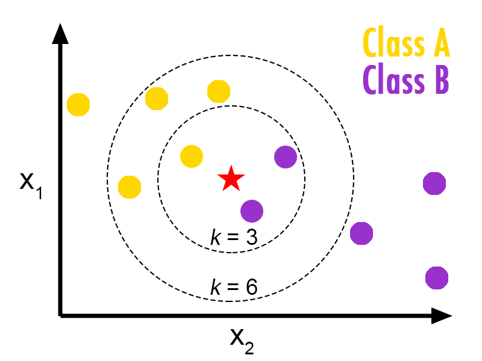

# 最后的想法

除蛮力外，K最近邻实现树状数据结构来确定从兴趣点到训练集中点的距离。 最佳算法的选择取决于数据的稀疏性，请求的邻居数以及要素的维数/数量。

我希望本节对理解K最近邻分类器的工作有所帮助。 如果您有任何意见，建议或建议，请在下方写下来。 如果您喜欢此帖子，请与您的朋友分享，并订阅Machine Learning 101，单击heart（❤）图标。 在Facebook，Twitter，LinkedIn上关注我。 和平！

> I would say, Nature of machine learning algorithms :P

## 一些重要参数

n_neighbors：要考虑的邻居数。 默认值为5。

算法：默认情况下设置为自动。 算法可以是{'auto'，'ball_tree'，'kd_tree'，'brute'}。

当前，如果k <N / 2且'effective_metric_'在'kd_tree'的'VALID_METRICS'列表中，算法='自动'选择'kd_tree'。 如果k <N / 2且'effective_metric_'不在'kd_tree'的'VALID_METRICS'列表中，则选择'ball_tree'。 如果k> = N / 2，则选择“粗略”。 该选择基于以下假设：查询点的数量至少与训练点的数量相同，并且leaf_size接近其默认值30。[参考：Sklearn文档]。

您可以在此处浏览所有参数。
# Sklearn K最近和参数

python中的Sklearn提供了K最近邻分类器的实现。 以下是在python中使用的示例代码片段：
```
from sklearn.neighbors import KNeighborsClassifierneigh = KNeighborsClassifier(n_neighbors=3)neigh.fit(features_matrix, labels)predicted_values = neigh.predict(test_matrix)
```
## 球树

球树在多维空间中假设数据，并创建嵌套的超球体。 查询时间复杂度为O [Dlog（N）]。
# 何时选择哪一个？

针对眼前问题的相关算法的选择取决于维数和训练集的大小。
+ 对于小样本尺寸和小尺寸，蛮力表现良好。
+ 数据稀疏性：如果数据稀疏且尺寸较小（<20），KD树的性能将优于Ball Tree算法。
+ K的值（邻居）：随着K的增加，KD树和Ball树的查询时间都会增加。
## K-D树

为了提高运行时间，从兴趣点出发，在建造一棵正在生长的树木的线上发明了替代方法。 这些方法试图通过有效地编码样本的集合距离信息来减少所需的距离计算数量。

基本思想是，如果点A与点B相距很远，而点B与点C相距很近，那么我们知道点A和C相距很远，而不必显式计算它们的距离。 （这可能并非始终都是正确的。）

这样，可以将最近邻居搜索的计算成本降低到O [D N * log（N）]或更好。 与大N的蛮力相比，这是一个重大改进。

当D <20时，K-D树的性能足够好。 较大的D则需要更长的时间。 这被称为“维数诅咒”。
## 向小子解释了维度诅咒[资料来源：StackOverflow]

可能孩子会喜欢吃饼干，所以让我们假设您有一整辆卡车，其中的饼干具有不同的颜色，不同的形状，不同的口味，不同的价格……

如果孩子必须选择，但仅考虑一个特征，例如 口味，那么它就有四种可能性：甜，盐，酸，苦，所以孩子只需要尝试四种饼干就可以找到他最喜欢的东西。

如果孩子喜欢口味和颜色的组合，并且有4种（我对此很乐观：-））不同的颜色，那么他已经必须在4x4的不同类型中进行选择。

此外，如果他想考虑Cookie的形状并且有5种不同的形状，那么他将不得不尝试4x4x5 = 80个Cookie

我们可以继续，但是在吃完所有这些饼干之后，他可能已经腹痛了……在他做出最佳选择之前：-)除了腹痛，很难记住每种口味的差异 曲奇饼。

如您所见，随着尺寸/功能的增加，复杂性也会增加。

> When a computer gets virus.

# 简而言之，

一个对象按其邻居的多数投票进行分类，该对象被分配给其最接近的k个邻居中最常见的类别（k是一个正整数，通常很小）。 如果k = 1，则仅将对象分配给该单个最近邻居的类。

> class of star would be B if k =3 and A if k = 6

# 我们如何选择邻居？
## 蛮力

让我们考虑二维绘图的简单情况。 如果我们从数学上看，简单的直觉就是计算从兴趣点（我们需要确定其类别）到训练集中所有点的欧氏距离。 然后我们以多数分数上课。 这称为蛮力法。

对于D维中的N个样本，运行时间复杂度为O [DN²]。 如果我们的维数和训练集较少，那么这将在合理的时间内运行。 但是，随着训练集大小的增加，运行时间会迅速增加。

当存在较大尺寸和较大训练集时，蛮力表现最差。
# 第4章：K最近邻分类器


监督学习中的第四个也是最后一个基本分类器！ K个最近的邻居。 在本文中，我们将讨论K最近邻分类器的工作，三种用于选择邻居的不同基础算法以及python sklearn库的一部分代码片段。 如果您尚未阅读以下文章的前一篇：
+ 朴素贝叶斯
+ SVM（支持向量）
+ 决策树

我建议您在此之前先完成它。 （尽管这与那三个独立）
```
(本文翻译自Savan Patel的文章《Chapter 4: K Nearest Neighbors Classifier》，参考：https://medium.com/machine-learning-101/k-nearest-neighbors-classifier-1c1ff404d265)
```
