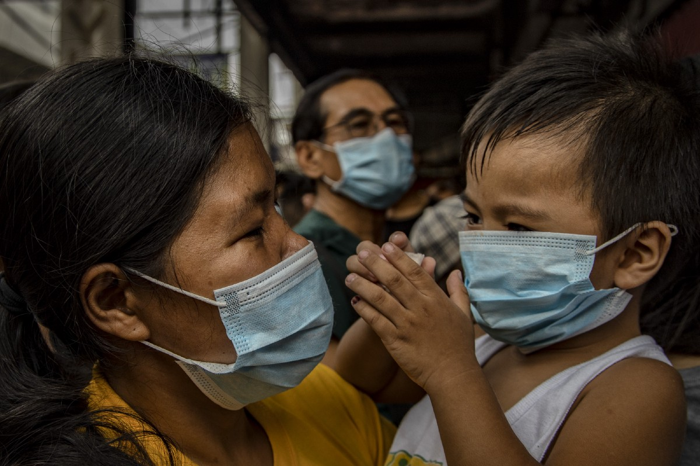

# SARS的教训：如何应对武汉冠状病毒和我们的新常态
## 我从大流行中幸存下来了解到有关暴发的知识

> Photo: Ezra Acayan/Getty Images


2003年3月底，我坐在香港一间借来的一室公寓的沙发上，想知道我是否会死。

那是SARS的春天。疫情始于2002年底，跨越邻近的中国广东省边境，整个月一直在增长。在香港，我曾在《时代》杂志担任记者近两年，在香港的一家主要医院里爆发了很多病例。在新加坡，台北，北京和多伦多等城市，疫情较小。到本月中旬，世界卫生组织（WHO）发出了关于呼吸系统疾病的全球性健康警报，该警报尚未正式名称。最糟糕的是，3月30日，香港淘花园公寓大楼内发生的爆炸性暴发使200多人患病，并加剧了人们对SARS病毒的担忧，SARS病毒直到现在主要在医疗机构中传播，现在正在社区中活跃起来。而且，如果SARS病毒像流感一样可以很容易地在空中传播，那么有什么办法可以阻止它呢？这就是我在沙发上发现自己的方式，担心自己要在香港去世。

当案件已经结案并包含病毒时，爆发的外观和感觉与发生后的情况截然不同。

回顾17年后，我可以看到那些恐惧的恐惧：荒谬。 淘大花园的爆发标志着SARS歇斯底里的高潮，事实证明这是一系列流行病学巧合的结果，这些巧合取决于公寓大楼故障的管道系统。 如此大规模的SARS社区再也没有爆发。 几周后，国际科学家设法隔离并鉴定出导致SARS的病原体。我发现自己住在香港的玛丽医院，通过电子显微镜盯着尖刺的冠状病毒，这是造成所有此类麻烦的原因。 到4月底，疫情在许多受影响的城市中止，并且香港的新病例急剧下降。 到7月5日，世卫组织宣布已控制SARS爆发。 一切都结束了。

SARS与正在进行的武汉冠状病毒爆发有明显的相似之处，而不仅仅是因为它们都起源于中国并且是由同一病毒家族的病原体引起的。 从病毒的性质和毒力到2003年以来发生的重大技术和地缘政治变化，差异也很重要。但也许最重要的一课-武汉的暴发超过了SARS病例的总数，WHO最终宣布 情况是全球卫生紧急情况–是这样：爆发事件在外观和感觉上与发生事后看来和发生事后截然不同，当时案件已经结案并包含病毒。 随着全球对新冠状病毒的警惕不断上升，这应该给我们带来一些安慰，同时也使我们想起下一步将要面临的困难。

淘大花园爆发之所以如此可怕，是因为它标志着SARS病毒的传染性发生了巨大变化。 顾名思义，SARS已经出现了。 当时，在1,600多例病例中，有将近60人死于SARS，但即使是幸存者，也常常要住院数周，其中许多患者需要机械通气来呼吸（这种治疗在医生意识到之前无意中帮助了疾病的传播） 他们正在处理什么）。 如果SARS能够像淘气爆发所表明的那样在公众中轻松传播，那么后果将是真正的破坏性的。 认为医院不堪重负，因为病人喘着粗气喘口气，需要配给呼吸机和形式的急救服务。 因此恐惧。

与SARS不同，武汉冠状病毒（或正式命名为2019-nCoV的2019年新型冠状病毒）从疫情爆发的最早阶段就似乎在公众中具有传染性，这就是为什么病例数如此迅速堆积的原因。但是，就像SARS一样，在疫情爆发的中期，我们还真的不知道新的冠状病毒是否具有传染性。正如科学作家爱德·勇（Ed Yong）在《大西洋》上的一篇出色文章中指出的那样，科学家们提出了一系列有关该病毒感染性的数据，以其R0为特征-每个感染者平均将感染的人数。 R0越高，新冠状病毒的早期估计就在2到3之间，从理论上讲，病原体的传染性越强，控制爆发的难度就越大。但是R0是可以掩盖各种变异的平均值，包括某些患病个体可能感染大量人的可能性，而绝大多数人感染的可能性很小。

这些人被称为超级传播者，在SARS爆发中发挥了重要作用-尽管同样，我们在中间还不确定。尽管SARS最终的R0值与新冠状病毒的早期估计值相近，但该数字被诸如刘建伦的超级传播者夸大了。刘建伦是广东省的医生，他于2月下旬将SARS引入香港，当时他感染了十几个人们在城市的大都会酒店。如果每位SARS病人都像刘一样具有传染性，那么像在淘大花园发生的社区爆炸事件将更加普遍，爆发可能无法完全遏制。但事实并非如此，特别是一旦医生采取了能够基本阻止医院传播的感染控制方法，从而将病毒的R0值降低到1以下。最终，除了像Amoy Gardens这样的超级传播者和骗子，SARS并不是极度可传播的病毒-尽管再次出现，但直到爆发的后期才清楚。

新的冠状病毒呢？图片不完整，但不太令人鼓舞。在相当短的时间内堆积的病例数量之多似乎表明该病毒在社区中的传播比SARS更容易传播。 1月30日，疾病控制与预防中心（CDC）确认了第一例人与人之间在美国境内传播的病例，因为一个人曾在武汉并返回芝加哥，并将该病毒传播给另一个人。可能不会是最后一个。尽管在六个多月的时间里，新的冠状病毒在数周内与SARS的病例数几乎一样，但在爆发期间，医生几乎可以肯定病情较轻，这意味着实际病例数可能更高。美国国家过敏和传染病研究所所长安东尼·福西（Anthony Fauci）博士在医学杂志《美国医学会杂志》（JAMA）发表的播客中说：“如果它变得如此广泛，那么它就不会像SARS一样消失。” “我认为接下来的四到五周至关重要。它要么开始达到顶峰，然后进入衰退，要么爆发到全球爆发。”

病毒的传染性有助于确定爆发的广泛程度，但致命程度也同样重要。 早期迹象表明，与冠状病毒感染者相比，新的冠状病毒要轻于SARS。 截至1月30日，在约7,770例确诊病例中有170例死亡，新病毒的死亡率低于3％。 对于呼吸道病毒来说，这是很高的—季节性流感可杀死约0.1％的致病病毒，但低于SARS期间的10％。 而且，尽管在爆发期间做出的任何估计都不确定，但是随着医生发现最初遗漏的较轻的病例，该数字下降的可能性大于上升的可能性。 那些死者已经年老和/或患有先前存在的健康问题-往往最容易感染流感的人群。

在某些方面，我们比17年前更愿意应对新的疫情。 基因组学的进步帮助科学家快速测序了新的冠状病毒的基因结构，这反过来又加快了诊断测试和候选疫苗株的开发，即使爆发仍在全力进行中。 在SARS爆发正式开始后的几个月，才对病毒进行了分离和测序。 中国政府对新冠状病毒的处理方式远非完美，但比SARS时期更为开放，当时SARS在当地进行了数月的掩盖，直接导致该病毒扩散到香港，然后扩散到全球。

虚假信息很重要，因为在爆发期间信任至关重要。 信任可能是成功爆发反应的最重要因素。

但是世界上还存在着2003年以来不存在的新漏洞。与17年前相比，中国通过旅行和商务联系与世界其他地区的联系更加紧密，这意味着新的冠状病毒更容易蔓延到世界各地，而爆发后在中国造成的任何经济损失都不会在那里遏制。习近平主席领导下的中国比2003年更加专制，随着政府采取空前的应对措施，例如在疫情爆发中心及其附近有效隔离数千万人，增加了普通公民受到伤害的机会。 2003年，像姜延勇博士这样勇敢的中国公民大声疾呼反对政府的掩盖行为。江在《时代周刊》北京办公室的同事们说，中国官员正在向世卫组织隐瞒SARS患者，以最大程度地减少疫情的爆发。自那以后，他一直没有被剥夺自由，而在过去的几年中一直在软禁中出没，很难想象有人会做出同样的选择在今天的中国大声疾呼。

然后还有另一种新的传播方式：社交媒体。 在2003年，没有Facebook，没有Twitter，没有Reddit，几乎没有值得称呼的智能手机。 有关疫情的信息仍主要通过主流媒体传播。 在2020年，情况并非如此。 有影响力的人和混蛋利用社交媒体散播有关冠状病毒爆发，其严重程度，甚至是假定的治疗方法的恶作剧。 亲特朗普阴谋论QAnon的倡导者一直在敦促其支持者摄取本质上是漂白剂的物质，以免受病毒侵害。 （不要这样做。）

这种虚假信息（没有别的意思）很重要，因为信任在爆发期间很重要。 信任可能是成功爆发反应的最重要因素。 人们需要信任公共卫生官员，他们收到的有关病毒的信息是准确的，最终，我们需要彼此信任。 也许那是SARS的终极教训。 即使在那次疫情最黑暗的日子里，人们也对国际卫生官员为阻止病毒传播所做的努力抱有信任，最终，这种信任得到了回报。 在被虚假信息，玩世不恭和种族主义污染的媒体生态系统中，今天仍然有可能吗？ 该问题的答案将有助于确定我们如何记住2020年的冠状病毒爆发。
```
(本文翻译自Bryan Walsh的文章《Lessons From SARS: How to Deal With the Wuhan Coronavirus — and Our New Normal》，参考：https://elemental.medium.com/lessons-from-sars-how-to-deal-with-the-wuhan-coronavirus-and-our-new-normal-f3bc5a7bb201)
```
