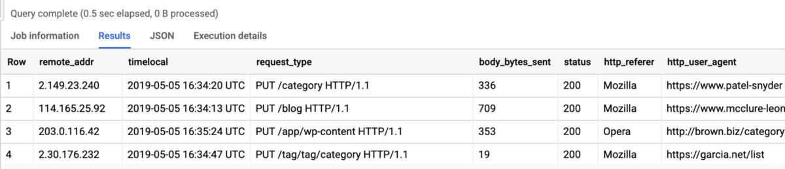
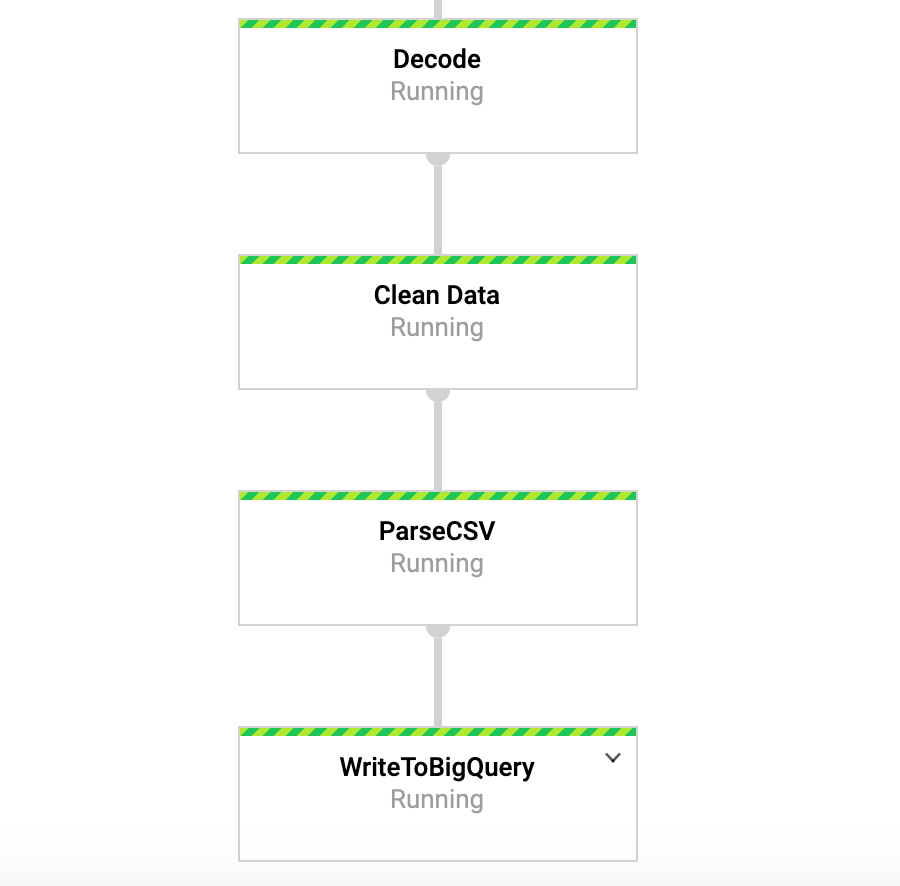
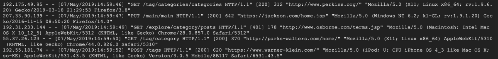
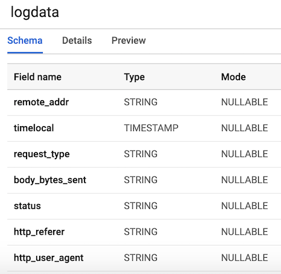
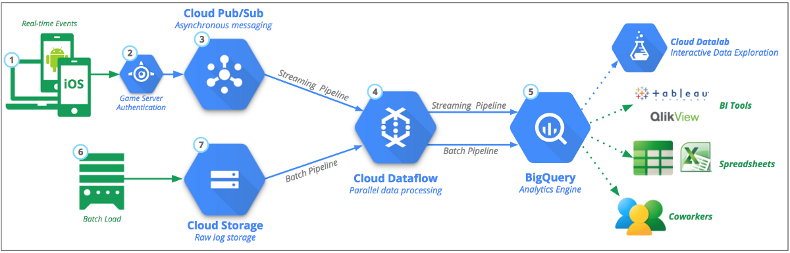

## 在BigQuery中访问我们的数据

正确的是，我们应该建立流水线并在表中运行数据。 为了确认这一点，我们可以转到BigQuery并查看数据。 使用下面的命令后，您应该看到数据集的前几行。 现在我们已经将数据存储在BigQuery中，我们可以进行进一步的分析以及与同事共享数据，并开始回答和解决业务问题。
```
SELECT * FROM `user-logs-237110.userlogs.logdata` LIMIT 10;
```

> Figure 5: BigQuery

# 外卖

希望这提供了创建流数据管道以及找到使数据更易于访问的方法的有用示例。 使用这种格式的数据可以为我们带来很多好处。 现在，我们可以开始回答一些有用的问题，例如有多少人使用我们的产品？ 用户群是否随着时间增长？ 人们与产品互动最多的是什么？ 当不应该出现的时候会发生任何错误吗？ 这些是组织会感兴趣的问题类型，根据这些见解，我们可以推动产品改进并提高用户参与度。

Beam对于这种类型的练习非常有用，并且还有许多其他有趣的用例。 例如，您可能想实时分析股票报价数据并基于该分析进行交易，也许您有来自车辆的传感器数据，并希望计算出交通量。 例如，您也可以是一家游戏公司，收集有关用户的数据，并使用它来创建仪表板以跟踪关键指标。 好的，这是另一篇文章，感谢您的阅读和想要查看完整代码的人员，以下是指向我的GitHub的链接。
## DFoly / User_log_pipeline
### 在Google Cloud Platform中为用户日志数据创建流传输管道-DFoly / User_log_pipeline
## 运行管道

我们可以通过几种不同的方式执行管道。 如果我们愿意，只要我们已远程登录GCP，就可以从终端在本地运行它。
```
python -m main_pipeline_stream.py \  --input_topic "projects/user-logs-237110/topics/userlogs" \  --streaming
```

但是，我们将使用DataFlow运行它。 我们可以使用以下命令来执行此操作，同时还要设置以下必填选项。
+ project-您的GCP项目的ID。
+ Runner-管道运行程序，它将解析您的程序并构建您的管道。 对于云执行，它必须是DataflowRunner。
+ staging_location-Cloud Dataflow的Cloud Storage路径，用于暂存执行作业的工作人员所需的代码包。
+ temp_location-Cloud Dataflow的Cloud Storage路径，用于暂存在管道执行期间创建的临时作业文件。
+ 流式
```
python main_pipeline_stream.py \--runner DataFlow \--project $PROJECT \--temp_location $BUCKET/tmp \--staging_location $BUCKET/staging--streaming
```

在运行此命令时，我们可以转到Google控制台中的“数据流”标签并查看我们的管道。 当我们进入管道时，我们应该如图4所示。出于调试目的，进入日志然后通过Stackdriver查看详细日志可能会很有帮助。 这帮助我在很多情况下找出了管道问题。

> Figure 4: Beam Pipeline

# 编制我们的管道

现在，我们已经初步设置好了一些有趣的东西，并使用Beam和Python编写了代码。 要创建Beam管道，我们需要创建管道对象（p）。 创建管道对象后，我们可以使用管道（|）运算符一个接一个地应用多个函数。 通常，工作流程如下图所示。
```
[Final Output PCollection] = ([Initial Input PCollection] | [First Transform]              | [Second Transform]              | [Third Transform])
```

在我们的代码中，我们创建了两个自定义函数。 regex_clean函数，使用re.search函数搜索数据并根据PATTERNS列表提取适当的字符串。该函数返回以逗号分隔的字符串。如果您不是正则表达式专家，我建议您看一下本教程并在笔记本上玩以测试代码。此后，我们定义了一个名为Split的自定义ParDo函数，这是一种用于并行处理的Beam变换。在Python中有一种特定的方法可以执行此操作，我们必须创建一个从DoFn Beam类继承的类。 Split函数从前一个函数中获取已解析的字符串，并返回字典列表，其关键字等于我们BigQuery表中的列名。关于此功能要注意的一件事是，我必须在该功能中导入datetime才能起作用。导入文件顶部时出现错误，这很奇怪。然后，此列表传递到WriteToBigQuery函数，该函数将我们的数据追加到表中。下面提供了Batch DataFlow作业和Streaming DataFlow作业的代码。批处理代码与流处理代码之间的唯一区别是，在批处理作业中，我们使用Beam中的ReadFromText函数从src_path中读取CSV。
## 批处理DataFlow作业
```python
import apache_beam as beam
from apache_beam.options.pipeline_options import PipelineOptions
from google.cloud import bigquery
import re
import logging
import sys

PROJECT='user-logs-237110'
schema = 'remote_addr:STRING, timelocal:STRING, request_type:STRING, status:STRING, body_bytes_sent:STRING, http_referer:STRING, http_user_agent:STRING'


src_path = "user_log_fileC.txt"

def regex_clean(data):

    PATTERNS =  [r'(^\S+\.[\S+\.]+\S+)\s',r'(?<=\[).+?(?=\])',
           r'\"(\S+)\s(\S+)\s*(\S*)\"',r'\s(\d+)\s',r"(?<=\[).\d+(?=\])",
           r'\"[A-Z][a-z]+', r'\"(http|https)://[a-z]+.[a-z]+.[a-z]+']
    result = []
    for match in PATTERNS:
      try:
        reg_match = re.search(match, data).group()
        if reg_match:
          result.append(reg_match)
        else:
          result.append(" ")
      except:
        print("There was an error with the regex search")
    result = [x.strip() for x in result]
    result = [x.replace('"', "") for x in result]
    res = ','.join(result)
    return res


class Split(beam.DoFn):

    def process(self, element):
        from datetime import datetime
        element = element.split(",")
        d = datetime.strptime(element[1], "%d/%b/%Y:%H:%M:%S")
        date_string = d.strftime("%Y-%m-%d %H:%M:%S")

        return [{ 
            'remote_addr': element[0],
            'timelocal': date_string,
            'request_type': element[2],
            'status': element[3],
            'body_bytes_sent': element[4],
            'http_referer': element[5],
            'http_user_agent': element[6]
    
        }]

def main():

   p = beam.Pipeline(options=PipelineOptions())

   (p
      | 'ReadData' >> beam.io.textio.ReadFromText(src_path)
      | "clean address" >> beam.Map(regex_clean)
      | 'ParseCSV' >> beam.ParDo(Split())
      | 'WriteToBigQuery' >> beam.io.WriteToBigQuery('{0}:userlogs.logdata'.format(PROJECT), schema=schema,
        write_disposition=beam.io.BigQueryDisposition.WRITE_APPEND)
   )

   p.run()

if __name__ == '__main__':
  logger = logging.getLogger().setLevel(logging.INFO)
  main()
```
## 流数据流作业
```python
from apache_beam.options.pipeline_options import PipelineOptions
from google.cloud import pubsub_v1
from google.cloud import bigquery
import apache_beam as beam
import logging
import argparse
import sys
import re


PROJECT="user-logs-237110"
schema = 'remote_addr:STRING, timelocal:STRING, request_type:STRING, status:STRING, body_bytes_sent:STRING, http_referer:STRING, http_user_agent:STRING'
TOPIC = "projects/user-logs-237110/topics/userlogs"


def regex_clean(data):

    PATTERNS =  [r'(^\S+\.[\S+\.]+\S+)\s',r'(?<=\[).+?(?=\])',
           r'\"(\S+)\s(\S+)\s*(\S*)\"',r'\s(\d+)\s',r"(?<=\[).\d+(?=\])",
           r'\"[A-Z][a-z]+', r'\"(http|https)://[a-z]+.[a-z]+.[a-z]+']
    result = []
    for match in PATTERNS:
      try:
        reg_match = re.search(match, data).group()
        if reg_match:
          result.append(reg_match)
        else:
          result.append(" ")
      except:
        print("There was an error with the regex search")
    result = [x.strip() for x in result]
    result = [x.replace('"', "") for x in result]
    res = ','.join(result)
    return res


class Split(beam.DoFn):

    def process(self, element):
        from datetime import datetime
        element = element.split(",")
        d = datetime.strptime(element[1], "%d/%b/%Y:%H:%M:%S")
        date_string = d.strftime("%Y-%m-%d %H:%M:%S")
        
        return [{ 
            'remote_addr': element[0],
            'timelocal': date_string,
            'request_type': element[2],
            'body_bytes_sent': element[3],
            'status': element[4],
            'http_referer': element[5],
            'http_user_agent': element[6]
    
        }]

def main(argv=None):

   parser = argparse.ArgumentParser()
   parser.add_argument("--input_topic")
   parser.add_argument("--output")
   known_args = parser.parse_known_args(argv)


   p = beam.Pipeline(options=PipelineOptions())

   (p
      | 'ReadData' >> beam.io.ReadFromPubSub(topic=TOPIC).with_output_types(bytes)
      | "Decode" >> beam.Map(lambda x: x.decode('utf-8'))
      | "Clean Data" >> beam.Map(regex_clean)
      | 'ParseCSV' >> beam.ParDo(Split())
      | 'WriteToBigQuery' >> beam.io.WriteToBigQuery('{0}:userlogs.logdata'.format(PROJECT), schema=schema,
        write_disposition=beam.io.BigQueryDisposition.WRITE_APPEND)
   )
   result = p.run()
   result.wait_until_finish()

if __name__ == '__main__':
  logger = logging.getLogger().setLevel(logging.INFO)
  main()
```
## 发布我们的用户日志数据

发布/订阅是我们管道中的重要组成部分，因为它允许多个独立的应用程序相互交互。 特别是，它充当中间人，使我们能够在应用程序之间发送和接收消息。 我们需要做的第一件事是创建一个主题。 通过在控制台中转到“发布/订阅”并单击“创建主题”，这非常简单。

下面的代码调用我们的脚本以生成上面定义的日志数据，然后连接到日志并将日志发送到Pub / Sub。 我们唯一需要做的就是创建一个PublisherClient对象，使用topic_path方法将路径添加到主题，并在传递topic_path和数据的同时调用publish函数。 请注意，我们正在从stream_logs脚本中导入generate_log_line，因此请确保这些文件位于同一文件夹中，否则会出现导入错误。 然后，我们可以在Google控制台中使用以下命令运行它：
```
python publish.py
```
```python

from stream_logs import generate_log_line
import logging
from google.cloud import pubsub_v1
import random
import time


PROJECT_ID="user-logs-237110"
TOPIC = "userlogs"


publisher = pubsub_v1.PublisherClient()
topic_path = publisher.topic_path(PROJECT_ID, TOPIC)


def publish(publisher, topic, message):
    data = message.encode('utf-8')
    return publisher.publish(topic_path, data = data)


def callback(message_future):
    # When timeout is unspecified, the exception method waits indefinitely.
    if message_future.exception(timeout=30):
        print('Publishing message on {} threw an Exception {}.'.format(
            topic_name, message_future.exception()))
    else:
        print(message_future.result())


if __name__ == '__main__':

    while True:
        line = generate_log_line()
        print(line)
        message_future = publish(publisher, topic_path, line)
        message_future.add_done_callback(callback)

        sleep_time = random.choice(range(1, 3, 1))
        time.sleep(sleep_time)
```

文件运行后，我们应该能够看到将日志数据打印到控制台，如下图所示。 该脚本将一直运行，直到我们使用CTRL + C杀死它为止。

> Figure 4: publish_logs.py output

## 创建我们的数据库和表

完成设置步骤后，下一步需要做的是在BigQuery中创建数据集和表格。 有几种不同的方法可以做到这一点，但最简单的方法是只使用Google云控制台并首先创建一个数据集。 您可以按照以下链接中的步骤创建表和架构。 我们的表将有7列对应于每个用户日志的组件。 为简便起见，我们将所有列定义为除timelocal变量之外的字符串，并根据我们先前生成的变量命名它们。 我们的表架构应如图3所示。

> Figure 3 Table Schema

## 设置Google Cloud。

注意：要运行管道并发布用户日志数据，我在使用Python 3运行管道时遇到了问题，所以我使用了Google云外壳。

为了能够运行管道，我们需要做一些设置。 对于尚未使用GCP的用户，您需要按照本页概述的6个步骤进行操作。

之后，我们需要将脚本上传到Google云存储，然后将其复制到Google Cloud Shell中。 上传到云存储非常简单，并在此处进行说明。 要复制文件，我们可以在工具栏中打开Google Cloud shell，方法是单击下面图2左侧的第一个图标。

> Figure 2


下面列出了我们需要复制文件并安装必要的库的命令。
```
# Copy file from cloud storagegsutil cp gs://<YOUR-BUCKET>/ * .sudo pip install apache-beam[gcp] oauth2client==3.0.0 sudo pip install -U pipsudo pip install Faker==1.0.2# Environment variablesBUCKET=<YOUR-BUCKET>PROJECT=<YOUR-PROJECT>
```
# 使用Faker创建伪数据

如前所述，由于对数据的访问受限，我决定创建与实际数据格式相同的伪造数据。 这是一个非常有用的练习，因为我可以在等待数据时开发代码并测试管道。 如果您想查看该库还可以提供什么，建议您看一下Faker文档。 我们的用户数据通常看起来类似于以下示例。 基于这种格式，我们可以逐行生成数据以模拟实时数据。 这些日志为我们提供了诸如日期，请求类型，来自服务器的响应，IP地址等信息。
```
192.52.197.161 - - [30/Apr/2019:21:11:42] "PUT /tag/category/tag HTTP/1.1" [401] 155 "https://harris-lopez.com/categories/about/" "Mozilla/5.0 (Macintosh; PPC Mac OS X 10_11_2) AppleWebKit/5312 (KHTML, like Gecko) Chrome/34.0.855.0 Safari/5312"
```

基于上面的行，我们要使用下面花括号中的7个变量创建LINE变量。 稍后，我们还将在表模式中将它们用作变量名。
```
LINE = """\{remote_addr} - - [{time_local}] "{request_type} {request_path} HTTP/1.1" [{status}] {body_bytes_sent} "{http_referer}" "{http_user_agent}"\"""
```

如果我们要进行批处理，则代码将非常相似，尽管我们需要在一定时间范围内创建一堆样本。 要使用fakerr，我们只需创建一个对象并调用所需的方法即可。 特别是，伪造者对于生成IP地址和网站很有用。 我使用以下方法：
```
fake.ipv4()fake.uri_path()fake.uri()fake.user_agent()
```
```python
from faker import Faker
import time
import random
import os
import numpy as np
from datetime import datetime, timedelta


LINE = """\
{remote_addr} - - [{time_local}] "{request_type} {request_path} HTTP/1.1" [{status}] {body_bytes_sent} "{http_referer}" "{http_user_agent}"\
"""


def generate_log_line():
    fake = Faker()
    now = datetime.now()
    remote_addr = fake.ipv4()
    time_local = now.strftime('%d/%b/%Y:%H:%M:%S')
    request_type = random.choice(["GET", "POST", "PUT"])
    request_path = "/" + fake.uri_path()

    status = np.random.choice([200, 401, 404], p = [0.9, 0.05, 0.05])
    body_bytes_sent = random.choice(range(5, 1000, 1))
    http_referer = fake.uri()
    http_user_agent = fake.user_agent()

    log_line = LINE.format(
        remote_addr=remote_addr,
        time_local=time_local,
        request_type=request_type,
        request_path=request_path,
        status=status,
        body_bytes_sent=body_bytes_sent,
        http_referer=http_referer,
        http_user_agent=http_user_agent
    )

    return log_line

```
## 可视化我们的管道

让我们使用图1可视化管道的各个组成部分。从总体上讲，我们想要做的是实时收集用户生成的数据，对其进行处理并将其输入到BigQuery中。 当用户与产品交互将请求发送到服务器，然后记录该日志时，将生成日志。 这些数据对于了解用户如何使用我们的产品以及事情是否正常运行特别有用。 通常，管道将执行以下步骤：
+ 我们的用户日志数据已发布到发布/订阅主题。
+ 我们将连接到Pub / Sub并使用Python和Beam将数据转换为适当的格式（图1中的第3步和第4步）。
+ 转换数据后，Beam将连接到BigQuery并将数据附加到我们的表中（图1中的第4步和第5步）。
+ 为了进行分析，我们可以使用Tableau和Python等各种工具连接到BigQuery。

无论我们具有流数据源还是拥有CSV文件并想要执行批处理工作，Beam都非常容易执行此过程。 稍后您将看到，在两者之间切换所需的代码仅进行了最小的更改。 这是使用Beam的优点之一。

> Figure 1: General Data Pipeline: Source:

# GCP和Apache Beam简介

Google Cloud Platform为大数据处理提供了一堆非常有用的工具。 我将使用的一些工具包括：
+ 发布/订阅是一种使用发布者-订阅者模型的消息传递服务，使我们可以实时摄取数据。
+ DataFlow是一项服务，可简化创建数据管道的过程，并自动处理诸如扩展基础架构之类的事情，这意味着我们可以专注于为管道编写代码。
+ BigQuery是一个云数据仓库。 如果您熟悉其他SQL样式数据库，那么BigQuery应该非常简单。
+ 最后，我们将使用Apache Beam，尤其是，我们将专注于Python版本来创建管道。 该工具将使我们能够创建与GCP集成的流式或批处理管道。 它对并行处理特别有用，并且适合提取，转换和加载（ETL）类型的任务，因此，如果我们需要在执行转换或计算时将数据从一个位置移动到另一个位置，Beam是一个不错的选择。

GCP上提供了各种各样的工具，因此很难跟踪所有工具及其用途，但是这里是它们的摘要以供参考。

# 让我们建立一个流数据管道
## Apache Beam和DataFlow用于实时数据管道

今天的帖子是基于我最近在工作的一个项目。 我真的很高兴实现它并将其写为博客文章，因为它使我有机会进行一些数据工程，并且做一些对我的团队非常有价值的事情。 不久之前，我发现我们有相对大量的用户日志数据，这些数据与系统中存储的一种数据产品有关。 事实证明，没有人真正使用过这些数据，因此，我立即对如果开始定期进行分析可以学到的东西感兴趣。 但是，有几个问题。 第一个问题是数据存储在许多不同的文本文件中，无法立即进行分析。 第二个问题是它存储在锁定的系统中，因此我无法使用任何我喜欢的工具来分析数据。

我考虑过如何通过将数据源构建到我们的一些用户参与工作中来使我们更轻松地访问它并真正创造一些价值。 考虑了一段时间后，我决定建立一条管道，将这些数据馈入云数据库，以便我和更广泛的团队可以访问它并开始产生一些见解。 在最近完成Coursera上的数据工程专业之后，我渴望使用课程中的一些工具来开始一个项目。

正确，因此将数据放入云数据库似乎是解决第一个问题的合理方法，但是对于第二个问题我该怎么办？ 幸运的是，有一种方法可以将数据传输到可以访问Python和Google Cloud Platform（GCP）等工具的环境。 但是，这将是一个漫长的过程，因此我需要做一些可以让我在等待数据传输时进行开发的东西。 我到达的解决方案是使用Python中的Faker库创建一些虚假数据。 我以前从未使用过该库，但很快就意识到它的用处。 采用这种方法使我可以开始编写代码并测试管道，而无需实际数据。

话虽如此，在本文中，我将逐步介绍如何使用GCP上可用的一些技术来构建上述管道。 特别是，我将使用Apache Beam（Python版本），Dataflow，Pub / Sub和Big Query来收集用户日志，转换数据并将其输入数据库以进行进一步分析。 对于我的用例，由于我的数据不是实时输入的，因此只需要beam的批处理功能，因此不需要Pub / Sub。 但是，我将重点介绍流媒体版本，因为这是您在实践中通常会遇到的问题。
```
(本文翻译自Daniel Foley的文章《Let’s Build a Streaming Data Pipeline》，参考：https://towardsdatascience.com/lets-build-a-streaming-data-pipeline-e873d671fc57)
```
