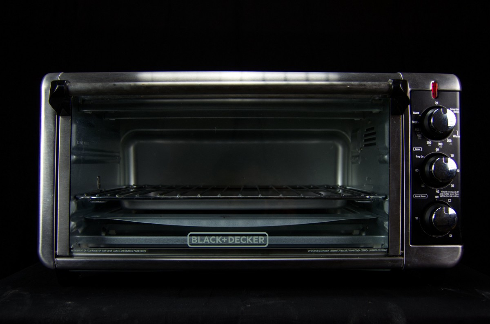
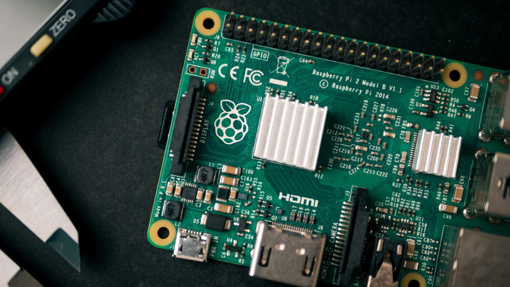
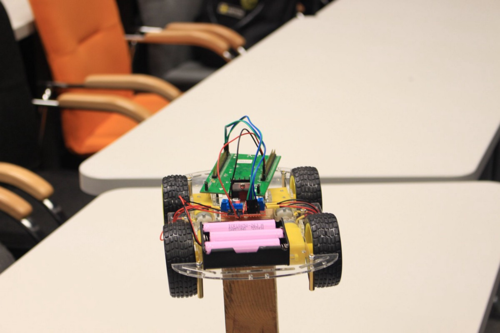
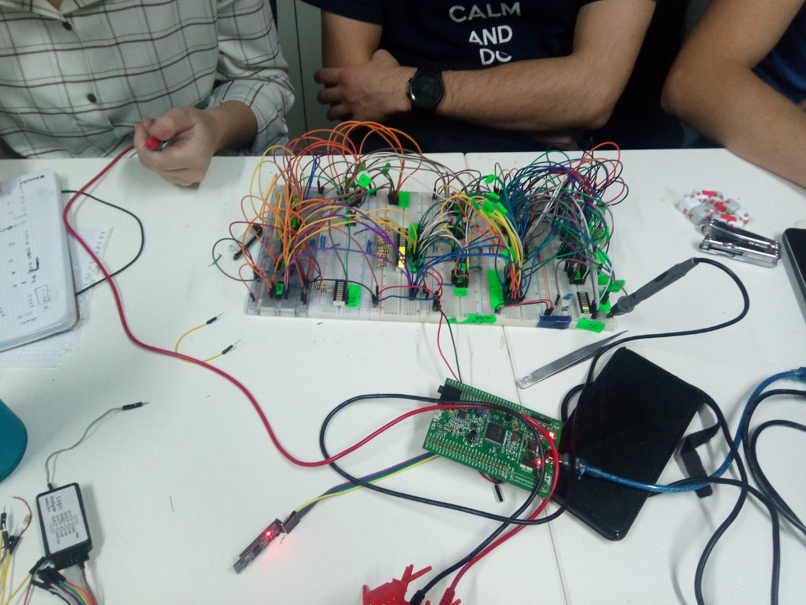
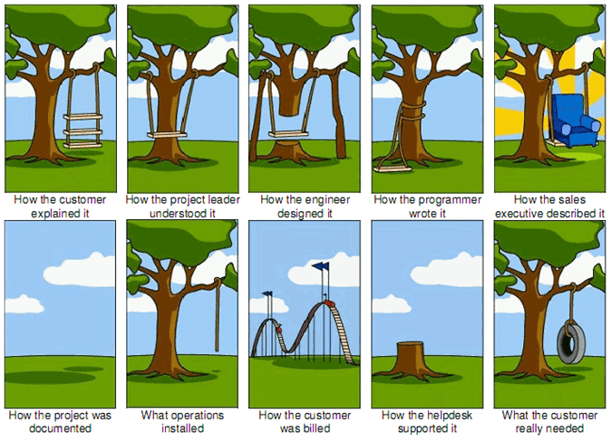

觉得这篇文章有用吗？ 在下面查看另一篇有趣的文章
## 我们需要数学吗？ 想象没有它的生活
### 没有数学的世界之旅，以及为什么抽象是一切的关键

我在工作中遇到了很多这样的情况。 这不是PyTorch或TF方面的重拳，而是“呼救声”。
## *** ML社区的另一面是，正在寻找“嵌入式AI”的专业工具，但找不到它。 ***
# 有什么好处吗

我看到大型半导体公司对AI产生了极大的兴趣，它们正在做非常有价值和重要的事情。 它们值得另一篇文章，因此我列出其中一些，以免使本文太长。
+ CMSIS-NN —用于Arm Cortex-M CPU的高效神经网络内核
+ 产生高效推理代码的编译器，这些推理代码根据您拥有的硬件进行了优化
+ 还有很多其他很酷的东西

> Photo by Ahmed Hasan on Unsplash


假设您有一个微控制器。 它的主要任务是处理您的手指触摸屏幕。 它具有ARM Cortex-M0处理器，256KB内存（其中只有80–120可用）。 这是一个实时系统，因此您可以花很少的时间来推断模型，例如100微秒。 您的目标是在那里改善或替换某些算法。

祝您好运，欢迎来到“嵌入式AI”世界。
## ***嵌入式世界”由资源有限的1-2美元芯片组成。 这就是在生产水平上使用的***
# 2.纯基础设施

我一直在从事上述项目。 一切都很棒。 我开发了一个可能必须适合该微控制器的小型网络。

> Photo by Matty Lynn Barnes on Unsplash


是时候开始将模型从我的电脑转移到设备了！
+ 量化。

该处理器无法执行浮点数运算。 即使可以，我们也不会使用它，因为这是一个非常复杂的操作，需要很多时间。

因此，我对权重量化进行了模型化-将值的连续范围转换为离散值的有限范围。

你猜怎么着？ PyTorch和TensorflowLite都不完全支持它。 它们不支持所有激活功能（尽管我使用了非常简单的HardTanh）。 PyTorch甚至无法将量化模型保存到文件中。

所以，我不得不手工做。

2.推理代码生成

您想在该控制器上运行模型。 对？ 因此，您需要使用C代码进行模型推断。

很难过，但您必须手动完成。 为什么？ PyTorch没有推断代码生成的功能。 相比之下，TFLite具有功能，但功能相当有限，并且不支持常见的激活功能。

因此，我再次手动完成。

当您听到“嵌入式设备”时您怎么看？ 想象一下图片并牢记在心。
## 1.它是任何电机。 甚至我的微波炉和洗衣机

> Photo by Marcos Ramírez on Unsplash


嗯你是对的！

如今，几乎所有的电气设备都是嵌入式设备。 它内部可能具有一个或几个控制器来负责每个确切的功能：触摸感应，发动机状态监控等。
## 2. Arduino或/和Raspberry PI


> Photos by Harrison Broadbent on Unsplash


恭喜，您再次正确！

它们是用于DIY项目的最受欢迎和使用最广泛的工具包之一。 是的，它们是嵌入式设备。
## 3. Jetson Nano和类似产品

> Photo by NVIDIA


再次正确。

这是一个特殊的开发套件“ aka mini-computer”，专门为在其上运行ML模型而开发。 它非常强大，说实话，超级性感。
# 但是这里有些遗漏

我有很多朋友正在做很棒的硬件宠物项目。 他们通常在那里使用Arduino或STM32（又名Hardcore Arduino）。



> Smart helmet, Robotic car and ALU


我认识几个对Jetson Nano和类似设备感到兴奋的AI工程师。 他们认为嵌入式AI的未来。

> Photo by Nvidia


现在。 请考虑“在生产级别使用了多少这种设备？”
# 答案-小

考虑一下您家中有多少个电气设备。 然后在您的汽车中添加大量的控制器。 您工作中的安全系统。 我可以继续很长的清单。

每个设备都有一个控制器。 通常，它是微型且超级便宜。 它无法与Jetson或Raspberry的资源和功能相提并论。
## 换个角度思考
# 嵌入式系统机器学习失败。 这就是为什么
## 深入研究嵌入式世界以及迄今为止机器学习行业无法解决的问题

> Photo by Daniel Wiadro on Unsplash


如今，机器学习达到了顶峰，并最终在各个地方得到了应用。 您可以在机场看到人脸识别系统，并在Facebook中看到个性化广告。

虽然，当我们谈论将ML与嵌入式设备结合时，仍然存在很大差距。
# 1.我们不了解什么是嵌入式世界

使用ML，我们曾经拥有巨大的计算能力。

AlexNet需要727 MegaFlops和235Mb的内存来处理小的227x227px图像。 例如，Google Nexus S上的ARM Cortex-A8每秒可产生66个MegaFlops。 因此，您必须等待〜11秒才能进行推断。 好多啊！

* FLOP —浮点运算

查看更多信息：各种CNN的内存消耗和FLOP计数以及ARM内核的浮点性能及其效率的估计。

我在大学里有几门与ML相关的课程。 我们在功课上做了很多很酷的事情。 但是即使在那里我的4GB GTX1050也不足以训练所有模型。

> Problem understanding is essential to build the right product


一般的ML工程师很少考虑计算资源。 此外，他/她很少关心内存使用情况。 为什么？ 因为价格便宜，甚至您的手机都具有不错的CPU和大量内存。

上次聚会中的照片时，手机上是否仍然缺少记忆？ 想象一下，您使用的是具有256KB闪存的TrueTouch感应控制器。 是的，256KB。 而且由于现有固件，您无法使用所有这些功能。 因此，大约100KB。 查看您上一次的模特尺寸。 可能更大。

变得有趣了吗？ 让我们继续:)
```
(本文翻译自Andrew Zhuravchak的文章《Machine Learning Fails When It Comes to Embedded System. Here’s Why》，参考：https://towardsdatascience.com/machine-learning-fails-when-it-comes-to-embedded-system-9ce6def9ba75)
```
