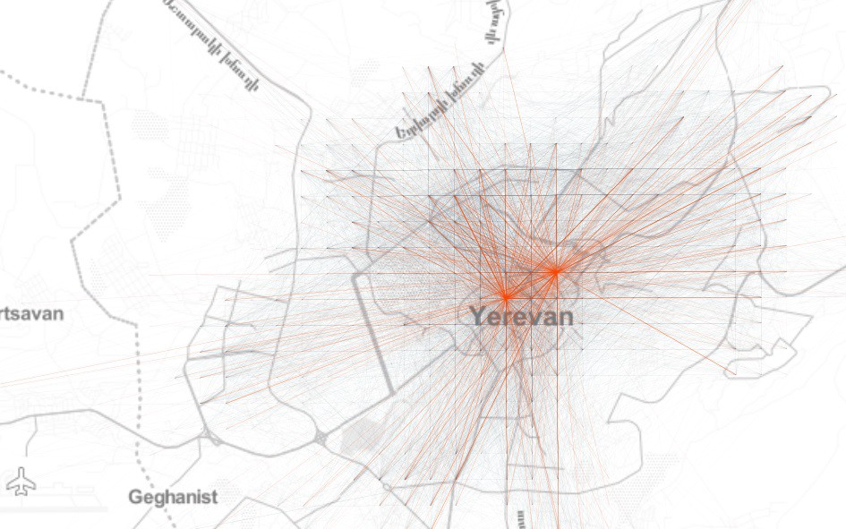
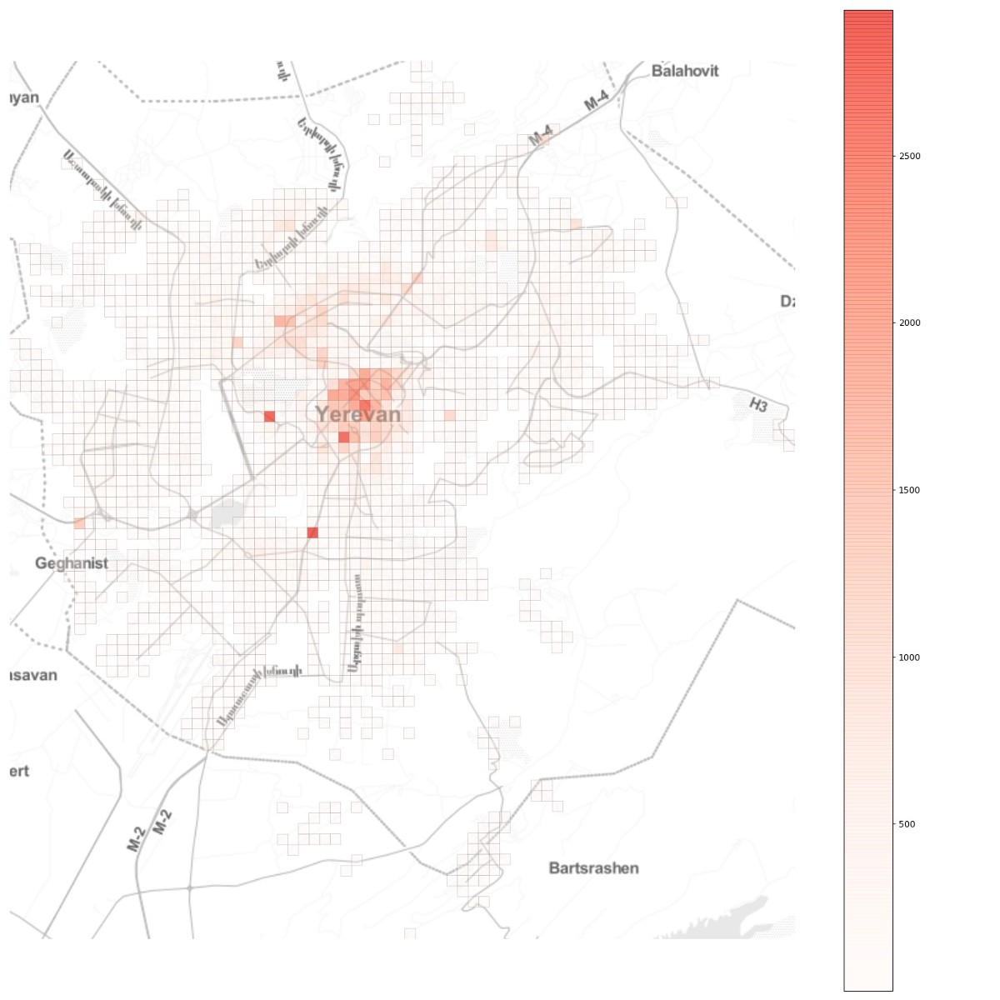
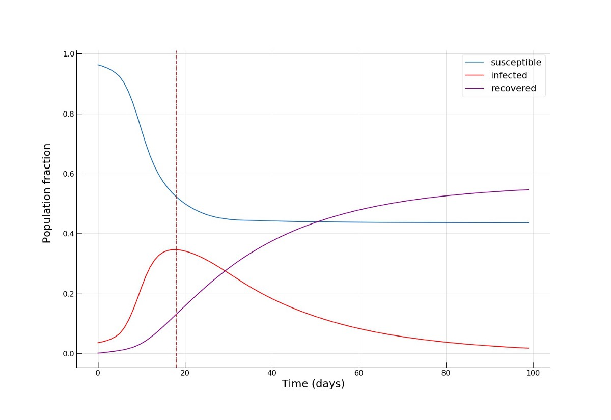

# 使用Python对城市中的冠状病毒流行进行建模
## 为流行做好准备的城市吗？

最近在中国发生的2019-nCoV武汉冠状病毒爆发在金融市场和整个经济体中造成了震惊，并适当地引发了全球普通民众的恐慌。 2020年1月30日，2019-nCoV甚至被世界卫生组织（WHO）指定为全球紧急卫生事件。在撰写本文时，尚未发现经过医学研究标准验证的特定治疗方法。此外，一些关键的流行病学指标，例如基本繁殖数（患病个体感染的平均人数）仍然未知。在我们前所未有的全球联系和机动性时代，由于世界网络的影响小，这种流行病是全球范围的主要威胁。可以猜想，以2020年发生的全球灾难性事件（宽松定义为造成1亿多人员伤亡）为条件，最有可能的原因恰恰是某种大流行病-不是核灾难，不是气候灾难等。全球范围的迅速发展进一步加剧了这一情况。城市化，人口稠密的充满活力的城市变成了疾病传播网络中的传播节点，因此变得极为脆弱和脆弱。

在这篇文章中，我们将讨论流行病袭击城市时会发生什么，应立即采取什么措施，以及这对城市规划，政策制定和管理有何影响。 我们将以埃里温市为例进行研究，并对城市中冠状病毒的传播进行数学建模和仿真，研究城市流动性模式如何影响该疾病的传播。
# 城市交通

有效，高效和可持续的城市交通对于现代城市的运转至关重要。 它已经显示出直接影响城市的宜居性和经济产出（GDP）。 但是，一旦发生流行病，它将为火灾增加燃料，放大并传播疾病传播。

因此，让我们开始研究埃里温（Yerevan）统一的笛卡尔网格上的聚合原点（OD）流网络，以了解城市流动模式的空间结构：


此外，如果我们查看到网格单元的总流入量，我们会发现一个或多或少的单中心空间组织，其中一些单元格的每日大量流入位于中心位置：


现在，假设流行病在城市中的任意位置爆发。 它将如何传播？ 可以采取什么措施来遏制它？
# 流行病建模

为了回答这些问题，我们将建立一个简单的隔间模型来模拟城市中传染病的传播。 随着疫情的爆发，其传播动态会发生很大变化，这取决于最初感染的地理位置及其与城市其他地区的连通性。 这是从最近的数据驱动的城市人口流行病研究中获得的最重要的见解之一。 但是，正如我们将在下面进一步看到的，各种结果要求采取类似措施来遏制该流行病，并考虑到规划和管理城市中的这种可能性。

由于运行基于个人的流行病模型具有挑战性，并且由于我们的目标是展示城市流行病的一般原理，而不是建立精细的校准和准确的流行病模型，因此，我们将按照《自然》杂志中所述的方法，修改 描述了我们需要的经典SIR模型。

该模型将总体分为三个部分。 对于时间t的每个位置i，三个隔室如下：
+ Si，t：尚未感染或不易感染该疾病的人数。
+ Ii，t：感染该疾病并能够将疾病传播给易感人群的人数。
+ Ri，t：由于恢复或死亡而被感染，然后从感染组中撤出的人数。 该组中的个体无法再次感染该疾病或将感染传播给他人。

在我们的仿真中，时间将是离散变量，因为系统状态每天都在建模。 在时间t的位置j处完全易感的种群中，爆发的可能性为：


其中βt是第t天的传输速率； mj，k反映了从位置k到位置j的迁移率，xk，t和yk，t分别表示第t天在位置k和位置j处感染和易感人群的比例，由xk，t = Ik，t / Nk和yj，t = Sj，t / Nj，其中Nk和Nj是位置k和j的人口规模。 然后，我们继续模拟一个随机过程，将疾病引入具有完全易感种群的位置，其中Ij，t + 1是概率为h（t，j）的伯努利随机变量。

一旦在随机位置引入感染，该疾病就会在那些位置传播，并由旅行个体在其他位置传播和传播。 在这里，以OD流矩阵为特征的城市交通模式发挥了至关重要的作用。

此外，为了使感染者如何传播疾病，我们需要基本的繁殖编号R0。 它的定义为R0 =βt/γ，其中γ是恢复率，可以认为是受感染个体与易感人群接触后继发感染的预期数量。 在撰写本文时，武汉冠状病毒的基本繁殖数估计在1.4到4之间。让我们以最坏的情况假设为4。但是，我们应该注意，它实际上是一个随机变量，报告的数字 只是预期的数字。 为了使事情变得更有趣，我们将使用良好的候选分布Gamma（平均值为4）在每个位置使用不同的R0进行模拟：


现在，我们可以进行模型动力学：


其中βk，t是第t天在位置k处的（随机）传输率，α是表示城市中公共交通与私家车出行方式的比重或强度的系数。

上面等式中描述的模型动力学非常简单：在第j天的t + 1天，我们需要从易感人群Sj，t中减去在第j个位置（第一个等式中的第二项）感染的人群比例。 以及从城市其他地区到达的感染人群所占的比例，由他们各自的传播率βk，t加权（第一个方程式中的第三项）。 由于总人口Nj = Sj + Ij + Rj，我们需要将减去的部分移至受感染的组，同时也将已恢复的部分移至Rj，t + 1（第二和第三个方程）。
# 模拟设置

在此分析中，我们将使用从当地乘车共享公司gg提供的GPS数据获得的典型一天的汇总OD流矩阵，作为埃里温市交通方式的代理。 接下来，我们需要每个250×250m网格单元中的人口计数，我们通过按比例缩放提取的流量计数来近似估算，以使不同位置的总流入量总计约等于埃里温110万人口的一半。 这实际上是一个大胆的假设，但是由于更改此部分会产生非常相似的结果，因此我们会坚持下去。
# 减少公共交通工具？

对于我们的第一个模拟，我们将想象一个可持续的以公共交通为主导的未来城市交通，α= 0.9：


我们看到人口中被感染的部分迅速上升的速度，并在8-10天左右达到流行高峰，几乎70％的人口受到感染，而只有一小部分（〜10％）已康复 从疾病。 在流行病消退的第100天，我们看到已康复个体的比例达到了惊人的90％！ 现在，让我们看看将公共交通出行的强度降低到α= 0.2左右是否对减轻疫情传播有任何影响。 这可以解释为采取严厉措施以减少城市交通（例如，通过实施宵禁），也可以解释为增加私家车出行的比例以减少出行期间的感染机会。


我们看到这种流行病的高峰是如何在第16天到第20天之间出现的，受感染的人群要小得多（〜45％），而康复的人数要多一倍（〜20％）。 在流行病快要结束时，易感人群的比例也增加了一倍（〜24％vs.〜12％），这意味着有更多人逃脱了这种疾病。 不出所料，我们发现采取了一系列措施来暂时降低城市流动性，对疾病传播动态产生了重大影响。
# 隔离热门地点？

现在，让我们看看完全切断一些关键的热门地点的另一个直观想法是否具有预期的效果。 为此，我们选择与流动流量的上1％相关的位置，


并完全阻止进出这些位置的所有流量，从而有效地建立了隔离区。 从图中可以看出，在埃里温，这些地点大多位于市中心，另外两个地点是两个最大的购物中心。 选择一个中等α= 0.5，我们得到：


我们发现，在流行高峰时，感染者的比例甚至更低（约35％），而且最重要的是，我们看到，在流行结束时，大约一半的人口仍然易感，有效地避免了感染！

这是一个小动画，可视化了高公共交通份额场景的动态：

# 结论

绝不声称要进行准确的流行病建模（甚至不要求流行病学方面的任何基础知识），本文的目的是对传染病爆发期间网络效应在城市环境中如何发挥作用有一个初步的了解。 随着人口密度，流动性和动态的不断增长，我们的城市变得更容易受到“黑天鹅”的攻击，变得更加脆弱。 而且，如果死了就无法获取咖啡，没有有效的危机处理能力和机制，智慧和可持续的城市将毫无意义。 例如，我们发现，在这样的健康危机期间，在关键地区引入隔离制度或采取严厉措施遏制流动性可能是有帮助的。 但是，另一个重要的问题将是如何实施此类措施，同时最大程度地减少对城市及其经济运作的损害和损失？

此外，确切的传染病流行机制仍是研究的一个活跃领域，必须将这一领域的进展传达给城市规划，政策制定和管理部门，并纳入城市规划，政策制定和管理中，以确保我们的城市安全和抗脆弱。

附言 在这里阅读原始文章。

以上模拟的代码：
```
import numpy as np  # initialize the population vector from the origin-destination flow matrix  N_k = np.abs(np.diagonal(OD) + OD.sum(axis=0) - OD.sum(axis=1))  locs_len = len(N_k)                 # number of locations  SIR = np.zeros(shape=(locs_len, 3)) # make a numpy array with 3 columns for keeping track of the S, I, R groups  SIR[:,0] = N_k                      # initialize the S group with the respective populations    first_infections = np.where(SIR[:, 0]<=thresh, SIR[:, 0]//20, 0)   # for demo purposes, randomly introduce infections  SIR[:, 0] = SIR[:, 0] - first_infections  SIR[:, 1] = SIR[:, 1] + first_infections                           # move infections to the I group    # row normalize the SIR matrix for keeping track of group proportions  row_sums = SIR.sum(axis=1)  SIR_n = SIR / row_sums[:, np.newaxis]    # initialize parameters  beta = 1.6  gamma = 0.04  public_trans = 0.5                                 # alpha  R0 = beta/gamma  beta_vec = np.random.gamma(1.6, 2, locs_len)  gamma_vec = np.full(locs_len, gamma)  public_trans_vec = np.full(locs_len, public_trans)    # make copy of the SIR matrices   SIR_sim = SIR.copy()  SIR_nsim = SIR_n.copy()    # run model  print(SIR_sim.sum(axis=0).sum() == N_k.sum())  from tqdm import tqdm_notebook  infected_pop_norm = []  susceptible_pop_norm = []  recovered_pop_norm = []  for time_step in tqdm_notebook(range(100)):      infected_mat = np.array([SIR_nsim[:,1],]*locs_len).transpose()      OD_infected = np.round(OD*infected_mat)      inflow_infected = OD_infected.sum(axis=0)      inflow_infected = np.round(inflow_infected*public_trans_vec)      print('total infected inflow: ', inflow_infected.sum())      new_infect = beta_vec*SIR_sim[:, 0]*inflow_infected/(N_k + OD.sum(axis=0))      new_recovered = gamma_vec*SIR_sim[:, 1]      new_infect = np.where(new_infect>SIR_sim[:, 0], SIR_sim[:, 0], new_infect)      SIR_sim[:, 0] = SIR_sim[:, 0] - new_infect      SIR_sim[:, 1] = SIR_sim[:, 1] + new_infect - new_recovered      SIR_sim[:, 2] = SIR_sim[:, 2] + new_recovered      SIR_sim = np.where(SIR_sim<0,0,SIR_sim)      # recompute the normalized SIR matrix      row_sums = SIR_sim.sum(axis=1)      SIR_nsim = SIR_sim / row_sums[:, np.newaxis]      S = SIR_sim[:,0].sum()/N_k.sum()      I = SIR_sim[:,1].sum()/N_k.sum()      R = SIR_sim[:,2].sum()/N_k.sum()      print(S, I, R, (S+I+R)*N_k.sum(), N_k.sum())      print('\n')      infected_pop_norm.append(I)      susceptible_pop_norm.append(S)      recovered_pop_norm.append(R)
```
```
(本文翻译自Gevorg Yeghikyan的文章《Modelling the coronavirus epidemic in a city with Python》，参考：https://towardsdatascience.com/modelling-the-coronavirus-epidemic-spreading-in-a-city-with-python-babd14d82fa2)
```
