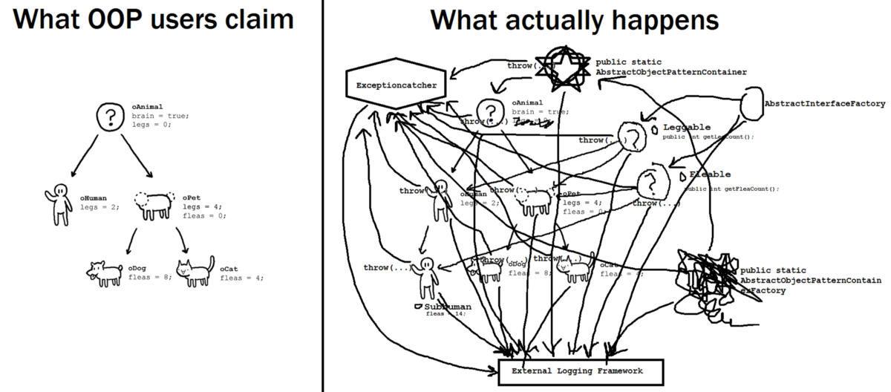

# 下一步是什么？
+ 再见，Charles Scalfani的面向对象编程
+ 面向对象编程超卖
+ Eric Elliott的OOP被遗忘的历史
+ 为什么OO很烂Erlang的作者Joe Armstrong
+ 面向对象程序设计很糟糕，作者Brian Will
+ 史蒂夫·耶格（Steve Yegge）在名词王国中的处决
+ 面向对象编程是否失败？
# OOP的捍卫者

> Photo by Ott Maidre from Pexels


我希望OOP的捍卫者会做出某种反应。 他们会说这篇文章充满了错误。 有些甚至可能开始呼叫姓名。 他们甚至可以称我为没有实际OOP经验的“初级”开发人员。 有人可能会说我的假设是错误的，例子是没有用的。 随你。

他们有权发表自己的意见。 但是，他们在辩护OOP方面的论点通常很薄弱。 具有讽刺意味的是，其中大多数人可能从未真正使用过真正的功能语言进行编程。 如果您从未真正尝试过两者，那么有人怎么能在两者之间进行比较？ 这样的比较不是很有用。

得墨meter耳定律不是很有用-它无法解决不确定性问题，共享可变状态仍然是共享可变状态，无论您如何访问或更改该状态。 a.total（）并不比a.getB（）。getC（）。total（）好多少。 它只是简单地解决了问题。

域驱动设计？ 这是一种有用的设计方法，它对复杂性有所帮助。 但是，它仍然无法解决共享可变状态的根本问题。
## 只是工具箱中的工具...

我经常听到人们说OOP只是工具箱中的另一个工具。 是的，它既是工具箱中的工具，又是马和汽车都是运输工具……毕竟，它们都具有相同的目的，对吗？ 当我们可以继续骑好老马时，为什么要使用汽车呢？
## 历史总是重演

这实际上使我想起了一些东西。 20世纪初，汽车开始取代马匹。 1900年，纽约的道路上只有几辆汽车，人们一直在用马来运输。 1917年，马路上再也没有马匹留下。 马业是一个巨大的产业。 围绕粪便清洁之类的事物已经创建了整个企业。

人们抵制变化。 他们称汽车为另一种最终消失的“时尚”。 毕竟，马匹已经在这里居住了几个世纪了！ 有些甚至要求政府干预。

这有什么关系？ 软件行业以OOP为中心。 数以百万计的人接受过OOP培训，数百万公司在其代码中使用OOP。 当然，他们会尝试抹黑任何可能威胁到他们面包和黄油的东西！ 这只是常识。

我们清楚地看到了历史在重演-在20世纪是马与汽车，在21世纪是面向对象与功能编程。
# 有哪些选择？

剧透警告：功能编程。

> Photo by Harley-Davidson on Unsplash


如果像函子和Monad之类的词使您有些不安，那么您并不孤单！ 如果函数式编程的某些概念使用更直观的名称，它们就不会那么吓人。 函子？ 这就是我们可以使用函数list.map进行转换的东西。 单子？ 可以链接的简单计算！

试用函数式编程将使您成为更好的开发人员。 您最终将有时间编写解决实际问题的真实代码，而不必花费大量时间思考抽象和设计模式。

您可能没有意识到这一点，但是您已经是一名函数程序员。 您是否在日常工作中使用功能？ 是？ 那么您已经是一名功能程序员！ 您只需要学习如何充分利用这些功能即可。

Elixir和Elm是两种具有非常柔和的学习曲线的强大功能语言。 他们让开发人员专注于最重要的事情–编写可靠的软件，同时消除了传统功能语言所具有的所有复杂性。

还有哪些其他选择？ 您的组织已经在使用C＃吗？ 尝试F＃—它是一种了不起的功能语言，并且与现有的.NET代码具有出色的互操作性。 使用Java？ 然后使用Scala或Clojure都是非常好的选择。 使用JavaScript？ 在正确的指导和支持下，JavaScript可以成为一种很好的功能语言。
# 分手后要往前看了？

现在我们知道OOP是一个失败的实验。 现在该继续前进了。 现在，我们作为一个社区承认这个想法使我们失败了，我们必须放弃它。

-劳伦斯·克鲁伯纳

> Photo by SpaceX on Unsplash


为什么我们坚持使用根本上不是组织程序的次优方式的东西？ 这是无知吗？ 我对此表示怀疑，从事软件工程的人并不愚蠢。 我们是否更担心通过使用一些奇特的OOP术语（例如“设计模式”，“抽象”，“封装”，“多态性”和“接口隔离”）来面对同行，“看上去很聪明”？ 可能不会。

我认为继续使用我们几十年来一直在使用的东西真的很容易。 大多数人从未真正尝试过函数式编程。 那些拥有（像我自己）的人永远不会回到编写OOP代码的过程。

亨利·福特曾经有句著名的话：“如果我问人们他们想要什么，他们会说更快的马”。 在软件世界中，大多数人可能希望使用“更好的OOP语言”。 人们可以轻松地描述他们所遇到的问题（使代码库井井有条，而且不太复杂），但不是最佳解决方案。
# 为什么OOP主导行业？

答案很简单，外星人种族与美国国家安全局（以及俄罗斯人）密谋将我们的程序员折磨致死……

> Photo by Gaetano Cessati on Unsplash


但是说真的，Java可能就是答案。

自从MS-DOS以来，Java是计算中最令人困扰的事情。

-面向对象编程的发明者艾伦·凯（Alan Kay）
## Java很简单

与其他语言相比，Java在1995年首次引入时是一种非常简单的编程语言。 当时，编写桌面应用程序的入门门槛很高。 开发桌面应用程序需要使用C编写底层Win32 API，并且开发人员还必须考虑手动内存管理。 另一种选择是Visual Basic，但是许多人可能不想将自己锁定在Microsoft生态系统中。

引入Java时，它是免费的，并且可以在所有平台上使用，因此对于许多开发人员而言，这是轻而易举的事。 诸如内置的垃圾收集，友好命名的API（与神秘的win32 API相比），适当的名称空间以及熟悉的类似于C的语法等使Java更加易于使用。

GUI编程也变得越来越流行，而且似乎各种UI组件都可以很好地映射到类。 IDE中的方法自动完成功能还使人们声称OOP API更易于使用。

如果Java不强制对开发人员进行OOP，那么Java可能还不错。 关于Java的其他一切似乎都还不错。 其他主流编程语言所缺乏的垃圾回收，可移植性，异常处理功能在1995年确实很棒，
## 然后C＃出现了

最初，微软一直严重依赖Java。 当事情开始变得不对劲时（在与Sun Microsystems就Java许可展开长期法律斗争之后），微软决定投资自己的Java版本。 那就是C＃1.0诞生的时候。 C＃作为一种语言一直被认为是“更好的Java”。 但是，存在一个巨大的问题-它是相同的OOP语言，但存在相同的缺陷，但隐藏在稍微改进的语法中。

微软一直在对其.NET生态系统进行大量投资，其中还包括良好的开发人员工具。 多年来，Visual Studio可能一直是最好的IDE之一。 反过来，这导致了.NET框架的广泛采用，尤其是在企业中。

最近，Microsoft通过推销其TypeScript一直在浏览器生态系统中进行大量投资。 TypeScript很棒，因为它可以编译纯JavaScript并添加诸如静态类型检查之类的内容。 没什么大不了的是，它没有对功能结构的适当支持-没有内置的不变数据结构，没有功能组成，没有适当的模式匹配。 TypeScript是OOP优先的，对于浏览器来说大多数是C＃。 Anders Hejlsberg甚至负责C＃和TypeScript的设计。
## 功能语言

另一方面，功能语言从来没有像Microsoft这样的大公司支持。 由于投资很小，因此F＃不算在内。 功能语言的开发主要是社区驱动的。 这可能解释了OOP和FP语言在流行度方面的差异。
# 四个OOP支柱的陷落

OOP的四个支柱是：抽象，继承，封装和多态。

让我们一一看清它们的真实含义。

## 遗产

我认为缺乏可重用性的是面向对象的语言，而不是功能语言。 因为面向对象语言的问题在于它们拥有了它们所伴随的所有隐式环境。 您想要香蕉，但是得到的是一只大猩猩，拿着香蕉和整个丛林。

— Erlang的创建者Joe Armstrong

OOP继承与现实世界无关。 实际上，继承是实现代码可重用性的一种次等方式。 四人帮派明确建议优先选择组成而不是继承。 一些现代的编程语言完全避免继承。

继承存在一些问题：
+ 引入大量您班级甚至不需要的代码（香蕉和丛林问题）。
+ 将类的某些部分定义在其他地方会使代码难以推理，尤其是在具有多个继承级别的情况下。
+ 在大多数编程语言中，甚至无法实现多重继承。 大多数情况下，继承不能用作代码共享机制。
## OOP多态性

多态性很棒，它允许我们在运行时更改程序行为。 但是，它是计算机编程中非常基本的概念。 我不太确定为什么OOP会如此关注多态性。 OOP多态性可以完成工作，但又导致精神错乱。 这使代码库变得更加复杂，并且要推理出要调用的具体方法变得非常困难。

另一方面，函数式编程使我们能够以更加优雅的方式实现相同的多态性……只需简单地传入定义所需运行时行为的函数即可。 还有什么比这更简单？ 无需在多个文件（和接口）中定义一堆重载的抽象虚拟方法。
## 封装形式

如前所述，封装是OOP的特洛伊木马。 它实际上是一种美化的全局可变状态，使不安全的代码显得安全。 不安全的编码实践是OOP程序员在日常工作中所依赖的支柱……
## 抽象化

OOP中的抽象试图通过向程序员隐藏不必要的细节来解决复杂性。 从理论上讲，它应该允许开发人员推理代码库而不必考虑隐藏的复杂性。

我什至不知道该说些什么……一个简单的概念的奇特词。 在过程/功能语言中，我们可以简单地“隐藏”相邻文件中的实现细节。 无需将此基本行为称为“抽象”。

有关OOP支柱下降的更多详细信息，请阅读再见，面向对象编程
# 创可贴

> Image source: Photo by Pixabay from Pexels


当某事不起作用时我们该怎么办？ 很简单，我们只有两个选择-丢弃它或尝试修复它。 OOP是不容易被抛弃的东西，数百万的开发人员接受了OOP培训。 全球数以百万计的组织都在使用OOP。

您可能现在已经看到OOP不能真正起作用，它使我们的代码变得复杂且不可靠。 而且您并不孤单！ 数十年来，人们一直在努力解决OOP代码中普遍存在的问题。 他们提出了无数的设计模式。
## 设计模式

OOP提供了一组指导原则，从理论上讲应允许开发人员逐步构建越来越大的系统：SOLID原理，依赖项注入，设计模式等。

不幸的是，设计模式只不过是创可贴。 它们的存在仅仅是为了解决OOP的缺点。 关于该主题的书籍甚至很多。 如果他们不负责为我们的代码库引入巨大的复杂性，那么它们并不会那么糟糕。
## 问题工厂

实际上，不可能编写良好且可维护的面向对象代码。

一方面，我们拥有一个不一致的OOP代码库，并且似乎没有遵循任何标准。 在频谱的另一端，我们有一堆过度设计的代码，一堆错误的抽象是彼此叠加构建的。 设计模式对于构建这样的抽象塔非常有帮助。

很快，添加新的功能，甚至理解所有的复杂性，变得越来越困难。 代码库将充满诸如SimpleBeanFactoryAwareAspectInstanceFactory，AbstractInterceptorDrivenBeanDefinitionDecorator，TransactionAwarePersistenceManagerFactoryProxyorRequestProcessorFactoryFactory之类的内容。

必须浪费宝贵的脑力去理解开发人员自己创建的抽象塔。 在许多情况下，缺少结构要比结构不好（如果您问我）要好。

> Image source: https://www.reddit.com/r/ProgrammerHumor/comments/418x95/theory_vs_reality/


进一步阅读：FizzBuzzEnterpriseEdition
# 重构

undefined
```
// before refactoring:
public class CalculatorForm {
    private string aText, bText;
    
    private bool IsValidInput(string text) => true;
    
    private void btnAddClick(object sender, EventArgs e) {
        if ( !IsValidInput(bText) || !IsValidInput(aText) ) {
            return;
        }
    }
}


// after refactoring:
public class CalculatorForm {
    private string aText, bText;
    
    private readonly IInputValidator _inputValidator;
    
    public CalculatorForm(IInputValidator inputValidator) {
        _inputValidator = inputValidator;
    }
    
    private void btnAddClick(object sender, EventArgs e) {
        if ( !_inputValidator.IsValidInput(bText)
            || !_inputValidator.IsValidInput(aText) ) {
            return;
        }
    }
}

public interface IInputValidator {
    bool IsValidInput(string text);
}

public class InputValidator : IInputValidator {
    public bool IsValidInput(string text) => true;
}

public class InputValidatorFactory {
    public IInputValidator CreateInputValidator() => new InputValidator();
}
```

在上面的简单示例中，仅提取一种方法，行数就增加了一倍以上。 当重构代码以首先降低复杂性时，为什么重构会带来更大的复杂性？

undefined
```javascript
// before refactoring:

// calculator.js:
const isValidInput = text => true;

const btnAddClick = (aText, bText) => {
  if (!isValidInput(aText) || !isValidInput(bText)) {
    return;
  }
}


// after refactoring:

// inputValidator.js:
export const isValidInput = text => true;

// calculator.js:
import { isValidInput } from './inputValidator';

const btnAddClick = (aText, bText, _isValidInput = isValidInput) => {
  if (!_isValidInput(aText) || !_isValidInput(bText)) {
    return;
  }
}
```

代码从字面上保持不变-我们只是将isValidInput函数移至另一个文件，并添加了一行以导入该函数。 为了便于测试，我们还向函数签名添加了_isValidInput。

这是一个简单的示例，但是在实践中，随着代码库变大，复杂度呈指数增长。

不仅如此。 重构OOP代码非常危险。 复杂的依赖关系图和状态分散在整个OOP代码库中，使人脑无法考虑所有潜在问题。
# 单元测试

> Photo by Ani Kolleshi on Unsplash


自动化测试是开发过程中的重要组成部分，并且在防止回归（即将错误引入现有代码中）方面有很大帮助。 单元测试在自动化测试过程中扮演着重要角色。

有些人可能会不同意，但是众所周知，OOP代码很难进行单元测试。 单元测试假定测试是独立进行的，并使方法可单元测试：
+ 它的依赖关系必须提取到一个单独的类中。
+ 为新创建的类创建一个接口。
+ 声明字段以保存新创建的类的实例。
+ 利用模拟框架模拟依赖项。
+ 利用依赖项注入框架来注入依赖项。

为了使一段代码可测试，还必须创建多少复杂性？ 仅使一些代码可测试就浪费了多少时间？

> PS，我们还必须实例化整个类以测试单个方法。 这还将从其所有父类中引入代码。

使用OOP，为遗留代码编写测试变得更加困难-几乎不可能。 已围绕测试旧版OOP代码创建了整个公司（TypeMock）。
## 样板代码

当涉及信噪比时，样板代码可能是最大的违法者。 样板代码是使程序编译所需的“噪声”。 样板代码需要花费一些时间来编写代码，并且由于增加的噪音而使代码库的可读性降低。

虽然在OOP中建议“对接口编程，而不对实现编程”，但并非所有内容都应该成为接口。 出于可测试性的唯一目的，我们不得不在整个代码库中使用接口。 我们可能还必须使用依赖项注入，这进一步引入了不必要的复杂性。
## 测试私有方法

有人说不应测试私有方法……我倾向于不同意，单元测试之所以被称为“单元”，是因为有一个原因-孤立地测试小的代码单元。 然而，在OOP中测试私有方法几乎是不可能的。 我们不应仅出于可测试性而将内部私有方法。

为了实现私有方法的可测试性，通常必须将它们提取到单独的对象中。 反过来，这引入了不必要的复杂性和样板代码。
# 名词王国

对象将功能和数据结构以不可分割的单位绑定在一起。 我认为这是一个基本错误，因为函数和数据结构属于完全不同的世界。

— Erlang的创建者Joe Armstrong

> Photo by Cederic X on Unsplash


对象（或名词）是OOP的核心。 OOP的基本局限性是它迫使一切都变成名词。 并非所有事物都应建模为名词。 操作（功能）不应建模为对象。 当我们只需要一个将两个数字相乘的函数时，为什么要强制创建Multiplier类？ 只需具有一个乘法函数，让数据成为数据，让函数成为函数！

在非OOP语言中，完成琐碎的事情（例如将数据保存到文件中）非常简单-与以普通英语描述动作的方式非常相似。

请提供真实示例！

当然，回到画家的例子，画家拥有一个PaintingFactory。 他聘请了专用的BrushManager，ColorManager，CanvasManager和MonaLisaProvider。 他的好朋友僵尸利用了BrainConsumingStrategy策略。 这些对象依次定义以下方法：CreatePainting，FindBrush，PickColor，CallMonaLisa和ConsumeBrainz。

当然，这是愚蠢的，在现实世界中不可能发生。 简单的绘画行为已经产生了多少不必要的复杂性？

当允许它们与对象分开存在时，无需发明奇怪的概念来保留您的功能。
# 现实世界建模中的问题

> Photo by Markus Spiske on Unsplash


有人说OOP试图模拟现实世界。 事实并非如此-OOP与现实世界无关。 尝试将程序建模为对象可能是最大的OOP错误之一。
## 现实世界不是分层的

OOP尝试将所有事物建模为对象的层次结构。 不幸的是，事实并非如此。 现实世界中的对象使用消息彼此交互，但是它们大多彼此独立。
## 现实世界中的传承

OOP继承不是以真实世界为模型的。 现实世界中的父对象无法在运行时更改子对象的行为。 即使您从父母那里继承了您的DNA，他们也无法随意改变您的DNA。 您不会从父母那里继承“行为”，而是会发展自己的行为。 而且您无法“凌驾”父母的行为。
## 现实世界没有方法

您写的纸上有“写”方法吗？ 没有！ 您拿一张空纸，拿起笔，然后写一些文字。 作为一个人，您也没有“写”方法-您是根据外部事件或内部想法决定写一些文本的。
# 封装特洛伊木马

> Photo by Jamie McInall from Pexels


我们被告知封装是OOP的最大优点之一。 可以保护对象的内部状态不受外部访问。 不过，这有一个小问题。 没用

封装是OOP的特洛伊木马。 它通过使它看起来安全来出售共享可变状态的想法。 封装允许（甚至鼓励）不安全的代码潜入我们的代码库中，从而使代码库从内部腐烂。
## 全球状态问题

undefined

为了提高代码的效率，对象传递的依据不是其值，而是其引用。 这就是“依赖注入”落空的地方。

让我解释。 每当我们在OOP中创建对象时，都会将对其依赖项的引用传递给构造函数。 这些依赖项也有自己的内部状态。 新创建的对象在其内部状态中愉快地存储了对这些依赖项的引用，然后很乐意以自己喜欢的任何方式对其进行修改。 它还会将这些引用传递给可能最终使用的其他任何内容。

这会创建一个复杂的图形，其中包含混杂共享的对象，这些对象最终都会改变彼此的状态。 反过来，这又引起了巨大的问题，因为几乎看不到是什么导致了程序状态的改变。 尝试调试此类状态更改可能会浪费很多时间。 而且，如果您不必处理并发性，那么您会很幸运（稍后会详细介绍）。
## 方法/性质

提供对特定字段的访问的方法或属性并不比直接更改字段的值更好。 通过使用奇特的属性或方法来改变对象的状态都没关系-结果相同：改变状态。
# 国家问题

> Photo by Mika Baumeister on Unsplash


undefined
## 可变状态-精神杂耍的行为

我认为，当您构建可变对象的大对象图时，大型面向对象的程序会越来越复杂。 您知道，尝试理解并牢记调用方法时会发生什么以及副作用是什么。

— Clojure的创建者Rich Hickey

> Image source: https://www.flickr.com/photos/48137825@N05/8707342427


国家本身是无害的。 但是，易变的国家是罪魁祸首。 特别是如果共享。 到底什么是可变状态？ 可以更改的任何状态。 考虑OOP中的变量或字段。

请提供真实示例！

您有一张空白的纸，在上面写了一个便笺，最后得到的是同一张纸，但状态不同（文本）。 您实际上已经改变了这张纸的状态。

在现实世界中，这是完全可以的，因为没人会关心那张纸。 除非这张纸是蒙娜丽莎的原始画。

人脑的局限性

为什么可变状态这么大的问题？ 人脑是已知宇宙中最强大的机器。 但是，我们的大脑在处理状态上确实很不好，因为我们一次只能记住5个项目。 如果仅考虑代码的功能，而不考虑代码在代码库中更改的变量，则对代码片段进行推理就容易得多。

以可变状态进行编程是一种精神上的杂耍️。 我不认识你，但我可能会打两个球。 给我三个或三个以上的球，我一定会丢掉的。 那么，为什么我们每天都要在工作中尝试这种精神杂耍的行为？

不幸的是，对易变状态的心理处理是OOP的核心。 在对象上存在方法的唯一目的是使同一对象发生突变。
## 分散状态

> Photo by Markus Spiske on Unsplash


OOP通过分散整个程序的状态，使代码组织的问题更加严重。 然后，分散状态在各种对象之间混杂地共享。

请提供真实示例！

让我们先忘了我们都是成年人，并假装我们正在尝试组装一辆超酷的乐高卡车。

但是，有一个陷阱-所有卡车零件都与其他乐高玩具中的零件随机混合。 然后将它们随机放入50个不同的盒子中。 而且，您不允许将卡车零件归为一类–您必须将头部放在各种卡车零件所在的位置，并且只能一一取出。

是的，您最终会组装那辆卡车，但是要花多长时间？

这与编程有什么关系？

在函数式编程中，状态通常是隔离的。 您总是知道某些状态从何而来。 状态永远不会分散在您的不同职能中。 在OOP中，每个对象都有其自己的状态，并且在构建程序时，必须牢记当前正在使用的所有对象的状态。

为了使我们的生活更轻松，最好只让一小部分代码库处理状态。 让应用程序的核心部分成为无状态且纯净的。 这实际上是前端（也称为Redux）上的磁通量模式取得巨大成功的主要原因。
## 混杂共享状态

似乎由于分散的易变状态，我们的生活还不够艰难，OOP向前迈进了一步！

请提供真实示例！

现实世界中的可变状态几乎从来都不是问题，因为事物是保密的，并且永远不会共享。 这就是工作中的“正确封装”。 想象一个画家正在创作下一张《蒙娜丽莎》的作品。 他独自从事绘画工作，完成后将其杰作卖给数百万。

现在，他厌倦了所有的钱，决定做一些不同的事情。 他认为举办绘画派对是个好主意。 他邀请他的朋友精灵，甘道夫，警察和僵尸来帮助他。 团队合作！ 他们都开始同时在同一块画布上绘画。 当然，这并没有带来什么好处-这幅画是一场彻底的灾难！

undefined
## 并发问题

OOP代码中可变状态的混杂共享使得几乎不可能并行化此类代码。 为了解决这个问题，已经发明了复杂的机制。 发明了线程锁定，互斥和许多其他机制。 当然，这种复杂的方法有其自身的缺点-死锁，缺乏可组合性，调试多线程代码非常困难且耗时。 我什至没有在谈论由于使用这种并发机制而导致的复杂性增加。
## 并非所有国家都是邪恶的

所有国家都是邪恶的吗？ 不，艾伦·凯州可能并不邪恶！ 如果状态突变是真正隔离的（不是“ OOP方式”隔离的），则可能很好。

具有不变的数据传输对象也是完全可以的。 这里的关键是“不变的”。 然后使用此类对象在函数之间传递数据。

但是，此类对象也将使OOP方法和属性完全多余。 如果对象无法突变，在其上具有方法和属性有什么用？
## 可变性是OOP固有的

有人可能会认为可变状态是OOP中的设计选择，而不是义务。 该声明有问题。 这不是设计选择，而是几乎唯一的选择。 是的，可以将不可变的对象传递给Java / C＃中的方法，但是很少这样做，因为大多数开发人员默认使用数据突变。 即使开发人员试图在其OOP程序中正确使用不变性，这些语言也没有提供内置机制来实现不变性以及有效处理不变数据（即持久性数据结构）。

undefined

在不引起状态突变的情况下不可能使用OOP。
# 代码复杂度

使用受OOP影响的编程语言，计算机软件变得更冗长，可读性更差，描述性更强，并且难以修改和维护。

—理查德·曼斯菲尔德（Richard Mansfield）

软件开发的最重要方面是降低代码复杂度。 期。 如果代码库变得无法维护，那么任何精美的功能都不重要。 如果代码库变得过于复杂和不可维护，那么即使100％的测试覆盖率也毫无价值。

是什么使代码库变得复杂？ 有很多事情要考虑，但是在我看来，最主要的犯罪者是：共享的可变状态，错误的抽象以及低信噪比（通常由样板代码引起）。 所有这些在OOP中都很普遍。
# 我们全都错了

很抱歉，我很久以前就为该主题创造了“对象”一词，因为它使许多人专注于较小的想法。 大想法是消息传递。-OOP的发明者艾伦·凯（Alan Kay）

undefined
## 讯息传递

艾伦·凯（Alan Kay）在1960年代创造了“面向对象程序设计”一词。 他具有生物学背景，并试图使计算机程序以与活细胞相同的方式进行通信。

> Photo by Muukii on Unsplash


艾伦·凯（Alan Kay）的主要想法是让相互独立的程序（单元）通过相互发送消息进行通信。 独立程序的状态永远不会与外界共享（封装）。

而已。 OOP从未打算具有继承，多态性，“ new”关键字以及无数的设计模式之类的东西。
## 最纯正的OOP

Erlang是最纯粹的OOP。 与更主流的语言不同，它专注于OOP的核心概念-消息传递。 在Erlang中，对象通过在对象之间传递不可变消息进行通信。

有没有证据表明不可变消息是比方法调用更好的方法？

当然好！ Erlang可能是世界上最可靠的语言。 它为世界上大多数电信（以及互联网）基础设施提供动力。 用Erlang编写的某些系统的可靠性为99.9999999％（您没看错-九个九）。
# 弹性框架的需求

无论编程范例如何，优秀的程序员都会编写出良好的代码，糟糕的程序员会编写出不良的代码。 但是，编程范例应限制不良的程序员进行过多的破坏。 当然，不是您本人，因为您已经在阅读本文并努力学习。 糟糕的程序员永远都没有时间学习，他们只会疯狂地按下键盘上的随机按钮。 无论您是否喜欢，您都将与糟糕的程序员一起工作，其中有些人真的非常糟糕。 而且，不幸的是，OOP没有足够的约束来阻止不良的程序员造成太大的损失。 糟糕...

undefined

我不是在谈论软件框架。 我说的是框架的更抽象的字典定义：“基本的支持结构”，即与代码组织和处理代码复杂性等更抽象的东西相关的框架。 尽管面向对象的编程和函数式编程都是编程范例，但它们都是非常高级的框架。
## 限制我们的选择

C ++是一种可怕的[面向对象]语言…而且将项目限制为C意味着人们不会用任何愚蠢的“对象模型” c＆@ p搞砸了。 — Linux的创建者Linus Torvalds

Linus Torvalds以对C ++和OOP的公开批评而闻名。 他100％正确的一件事是限制程序员可以做出的选择。 实际上，程序员选择的次数越少，代码的弹性就越大。 在上面的引用中，Linus Torvalds强烈建议有一个良好的框架作为我们代码的基础。

> Photo by specphotops on Unsplash


许多人不喜欢道路上的速度限制，但这对于防止人们坠毁致死至关重要。 同样，一个好的编程框架应该提供防止我们做愚蠢的事情的机制。

一个好的编程框架可以帮助我们编写可靠的代码。 首先，它应该通过提供以下内容来帮助降低复杂性：
+ 模块化和可重用性
+ 正确的状态隔离
+ 高信噪比

不幸的是，OOP为开发人员提供了太多的工具和选择，而没有施加适当的限制。 即使OOP承诺解决模块化问题并提高可重用性，但它仍无法兑现其承诺（稍后会详细介绍）。 OOP代码鼓励使用共享的可变状态，这种状态一次又一次被证明是不安全的。 OOP通常需要很多样板代码（低信噪比）。
## 功能编程

undefined

是的，函数式编程具有强大的数学基础，并且扎根于lambda演算。 但是，它的大多数想法是对更主流的编程语言中的弱点的回应。 函数是函数式编程的核心抽象。 如果使用得当，函数可以提供一定程度的代码模块化和可重用性，这在OOP中是前所未有的。 它甚至具有解决可为空问题的设计模式，并提供了一种错误处理的高级方法。

函数式编程确实做得很好的一件事是，它可以帮助我们编写可靠的软件。 对调试器的需求几乎完全消失了。 是的，无需单步执行代码并观察变量。 我个人很长时间都没有接触过调试器。

最好的部分？ 如果您已经知道如何使用函数，那么您已经是函数程序员。 您只需要学习如何充分利用这些功能即可！

我不是在讲函数编程，也不是很在意您编写代码所使用的编程范例。 我只是试图传达功能编程提供的机制，以解决OOP /命令式编程固有的问题。
# TLDR

提供面向对象的程序作为正确程序的替代方案。

—计算机科学先驱Edsger W. Dijkstra

> Photo by Sebastian Herrmann on Unsplash


创建面向对象的程序时要牢记一个目标-管理过程代码库的复杂性。 换句话说，它应该改善代码组织。 没有客观公开的证据表明OOP比普通的程序编程要好。

严酷的事实是，OOP在它原本打算解决的唯一任务上失败了。 在纸上看起来很好—我们具有干净的动物，狗，人等的层次结构。但是，一旦应用程序的复杂性开始增加，它就会变得平坦。 与其降低复杂性，不如鼓励可变状态的混杂共享，并以其众多的设计模式引入额外的复杂性。 OOP使得不必要的通用开发实践（如重构和测试）变得困难。

有些人可能不同意我的看法，但事实是，现代Java / C＃OOP从未经过适当的设计。 它从来没有来自适当的研究机构（与Haskell / FP相反）。 Lambda微积分为函数式编程提供了完整的理论基础。 OOP没有什么可比拟的。

在短期内使用OOP似乎是无辜的，尤其是在新建项目中。 但是使用OOP的长期后果是什么？ OOP是定时炸弹，当代码库变得足够大时，它会在将来的某个时候爆炸。

项目被拖延，错过了最后期限，开发人员精疲力尽，添加新功能几乎是不可能的。 该组织将代码库标记为“遗留代码库”，并且开发团队计划进行重写。

OOP对人脑而言并不自然，我们的思维过程围绕“做”的事情进行-散步，与朋友交谈，吃披萨。 我们的大脑已经进化为能够做事，而不是将世界组织成抽象对象的复杂层次。

OOP代码不是确定性的-与函数式编程不同，我们不能保证在输入相同的情况下获得相同的输出。 这使得对该程序进行推理非常困难。 举一个简化的例子，2 + 2或Calculator.Add（2，2）的输出通常等于4，但是有时它可能等于3、5，甚至1004。Calculator对象的依存关系可能会改变 微妙而深刻的计算结果。 糟糕...
# 免责声明

老实说，我不是狂热的面向对象。 当然，本文将有偏见。 但是，我有充分的理由不喜欢OOP。

我也了解批评OOP是一个非常敏感的话题-我可能会冒犯许多读者。 但是，我在做我认为正确的事情。 我的目标不是冒犯，而是提高对OOP引入的问题的认识。

我并不是在批评Alan Kay的OOP，他是个天才。 我希望以他设计的方式实施OOP。 我批评现代的Java / C＃OOP方法。

undefined

地狱，我在OOP项目上工作时经常会挣扎。 而且我没有一个线索可以说明我为什么要为此付出如此多的努力。 也许我还不够好？ 我不得不学习更多的设计模式（我认为）！ 最终，我完全精疲力尽了。

这篇文章总结了我从面向对象编程到函数式编程的第一手长达十年的旅程。 不幸的是，无论我多么努力，我都找不到OOP的用例。 我亲眼看到OOP项目失败，因为它们变得太复杂而无法维护。
# 面向对象编程—万亿美元灾难
## 为什么要从OOP继续前进

> Photo by Jungwoo Hong on Unsplash


OOP被许多人视为计算机科学的皇冠上的明珠。 代码组织的最终解决方案。 我们所有问题的终结。 编写程序的唯一真实方法。 编程本身的一位真神赋予我们……

undefined

许多人批评了面向对象的编程，其中包括非常杰出的软件工程师。 赫克，甚至是OOP的发明者本人也是现代OOP的著名批评家！

每个软件开发人员的最终目标应该是编写可靠的代码。 如果代码有错误且不可靠，则无所谓。 编写可靠代码的最佳方法是什么？ 简单。 简单与复杂相反。 因此，作为软件开发人员，我们的首要职责是降低代码复杂性。

```
(本文翻译自Ilya Suzdalnitski的文章《Object-Oriented Programming — The Trillion Dollar Disaster》，参考：https://medium.com/better-programming/object-oriented-programming-the-trillion-dollar-disaster-92a4b666c7c7)
```
