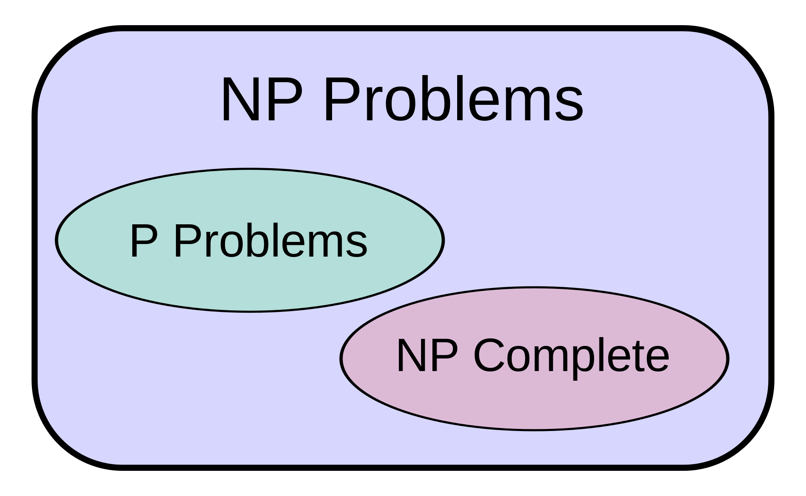

# P与NP —百万美元的问题！
## 如果您通过解决一个单一的问题就可以成为百万富翁，那不是很壮观吗？ 好吧，让我们讨论一下P与NP。

> Photo by Hans-Peter Gauster on Unsplash


2000年5月24日，克莱数学学院提出了七个数学问题，对于这些问题的解决方案，将为求解器赢得1,000,000美元的奖励。 迄今为止，众所周知的“千年问题”迄今已解决了七个问题之一。

想赚一百万美元，尝试从这个清单中解决一个。 这些都是为获得一百万美元奖金而列出的问题。
+ 杨米尔和质量差距
+ 黎曼假设
+ P vs NP问题
+ Navier–Stokes方程
+ 霍奇猜想
+ 庞加莱猜想
+ 伯奇和斯温纳顿-代尔猜想

好吧，让我们现实一点吧，这些问题在这里是有原因的。 您猜对了，这些问题很难解决。 实际上，它们是深刻且确实困难的，不仅要解决它们，甚至要理解问题陈述。 列出的大多数问题甚至都需要健全的学科知识和分析才能理解。

庞加莱猜想是这七个问题中唯一解决的问题。 这个问题来自拓扑域，它涉及对象如何组合在一起以及它们在空间中的形状。 这个问题与球特别相关。

1904年，法国数学家亨利·庞加莱（HenriPoincaré）询问三维球体是否具有独特的简单连接的三个流形。 庞加莱猜想这个问题是瑟斯顿的几何化猜想的特例。 佩雷尔曼（Perelman）的证明告诉我们，每三个歧管都是由一组标准零件构成的，每个标准零件都具有八个易于理解的几何形状之一。

请参阅：https：//www.claymath.org/millennium-problems

复杂的东西啊！ 在讨论P与NP之前，让我们讨论更多的内容。

亨利·庞加莱（HenriPoincaré）于1904年提出问题，在一般意义上说，如果您有一个没有孔的对象，并且它的大小非常小且有限，则它是一个球体（或可以制成球体）。 这不仅适用于3维，而且适用于所有维。

但是，直到第四次尝试该论据才得到证实，直到2003年Grigori Perelman根据理查德·汉密尔顿（Richard Hamilton）的工作提出解决方案。

如果您有兴趣，这里是一百万美元的解决方案的样子：https://arxiv.org/abs/math/0211159

格里哥里·佩雷尔曼（Grigori Perelman）被授予一百万美元和田径奖牌，但他都拒绝了。

说什么？ 我们中有些人喜欢解决问题，只是为了解决问题。

幸福就是过程！
# 让我们讨论P与NP

P与NP是“千年问题”列表中列出的最新问题。 这个问题是在1971年提出的。
## 1971年，斯蒂芬·库克（Stephen Cook）在开创性论文“定理证明程序的复杂性”中引入了P对NP问题的精确说明。

为了正确理解P对NP问题，必须具有计算复杂性的基本知识。 实际上，P与NP是计算机科学解决方案中最令人期待的问题。 因此，很好地掌握此问题如何影响计算领域将有助于我们消化此问题。

如果您不熟悉计算复杂性或一般的复杂性，我强烈建议您阅读我以前的故事“什么是计算复杂性？”。

计算空间中的大多数问题都可以简化为决策问题。 这意味着答案为是或否的问题。

因此，让我们回到P是什么的问题？ NP是什么？

P和NP都可以视为一组问题，这些问题根据解决和评估解决方案的难度来分组。 “困难”一词在这种情况下尤其重要，它基本上意味着解决和检查问题的计算强度。

例如，考虑乘法问题。 这是一个相对容易解决的问题。 不仅这个问题很容易解决，而且只需乘以数字就可以同样容易地得到验证。 基本上，任何可以在多项式时间内解决并且其结果可以在多项式时间内验证的问题都在P的复杂度集中。

P（多项式时间）包含所有确定性图灵机可以使用多项式计算时间或多项式时间解决的决策问题。

还有另一组问题可以在多项式时间内验证，但是，要解决此问题，将需要花费比多项式更多的时间。 例如，以数独为例。 鉴于我们有任何游戏的解决方案，我们可以轻松地对其进行验证。 这意味着我们可以在多项式时间内完成验证部分。 但是为了解决这个难题，我们需要更多的时间。 同样，随着网格数量的增加，找到解决方案的复杂性也呈指数增长。

NP（不确定性多项式时间）是用于分类决策问题的复杂度类。 NP是一组决策问题，对于这些问题实例，答案为“是”的实例可以在多项式时间内验证。 （只允许为多项式，不能更大）

> https://en.wikipedia.org/wiki/P_versus_NP_problem#/media/File:Complexity_classes.svg


需要注意的有趣一点是，P中的每个问题也是NP的一部分。 但这可能反之亦然。 这是研究思维定势的地方。 因此，解决NP问题的速度很慢，但是可以很快验证它们。 我们可以提高解决方案的速度吗？

让我们看一下素数问题。 素数测试是一种用于确定输入数字是否为素数的算法。

给定自然数n，n是素数吗？

直到AKS素性测试证明此问题在P下，该问题才被视为NP子集中的问题。

AKS素数测试（也称为Agrawal–Kayal–Saxena素数测试和环原子AKS测试）是确定性素数证明算法，由坎普印度理工学院计算机科学家Manindra Agrawal，Neeraj Kayal和Nitin Saxena创建和发布 ，2002年8月6日，在标题为“ PRIMES in P”的文章中

因此，是否有可能以NP复杂性解决NP中的所有问题？ 还是存在总难以找到使P和NP始终保持分离的解决方案的问题？ 答案是未知的。 实际上，这就是百万美元的问题。
# P vs NP问题
## 如果很容易检查问题的解决方案是否正确，那么是否也很容易解决问题？
## 这是P vs NP问题的本质。
## NP问题的典型特征是汉密尔顿路径问题：给定要访问的N个城市，如果不访问两次城市就如何做到这一点？ 如果您给我解决方案，我可以轻松地检查它是否正确。 但是我不能轻易找到解决方案。

请参阅：https：//www.claymath.org/millennium-problems/p-vs-np-problem

NP中的某些问题可以归为NP完整。 这是一组问题，如果找到一个快速解决问题的方法，我们可以轻松地以相同的复杂性解决一组问题。

当问题可以通过有限的暴力搜索算法解决时，它就是NP完全问题，并且可以用类似的算法来模拟任何其他问题。

NP完整性在P与NP讨论中作为P时间的解决方案尤其重要，因为NP完全集的问题证明整个复杂度集都会崩溃。 这意味着NP完全= NP = P

NP完全问题将出现在NP中，并且将出现在NP-Hard中，这意味着此问题至少与NP中的任何问题一样困难，如下所示。

> https://en.wikipedia.org/wiki/P_versus_NP_problem#/media/File:P_np_np-complete_np-hard.svg


如果解决问题的算法可以转化为解决任何NP问题（不确定性多项式时间）问题的算法，那么问题就是NP难题。 因此，NP困难意味着“至少与任何NP问题一样困难”，尽管实际上可能更难。

NP之外的问题很难解决，同时也很难检查解决方案，例如考虑下棋。 给定板上的任何位置，很难找到最佳的下一步，也很难验证下一步是否正确。 此问题存在于EXP（指数时间复杂度）中，可能不在NP中。

计算复杂性理论领域的大多数研究人员认为P不等于NP。 事件虽然在NP中有许多有趣的问题，例如优化问题，但这些问题会影响我们今天的生活。 解决诸如蛋白质折叠之类的NP完全问题的方法意味着我们将更接近于找到治愈癌症的方法。 同样，如果P = NP，那么我们可能会发现公钥密码术被破坏了，因为它依赖于整数因式分解，这在NP中是一个问题，并且我们依靠这种硬度来解决大多数密码学问题。 因此，证明N = NP的含义是混杂的。

有很多研究证明P = NP或反之亦然。 但是这个问题本身似乎是NP问题（在这里只是讽刺），因为到目前为止还没有结论性的结果。 但是，如果有人能够证明P = NP，世界将变得更加有趣。 但是到目前为止，大多数该领域的受过良好教育的人都认为不是。

斯科特·亚伦森（Scott Aaronson）在他的博客中，著名的研究者计算复杂性理论指出：

如果P = NP，那么世界将与我们通常认为的世界大不相同。 “创造性的飞跃”没有任何特殊的价值，解决问题与发现问题之间就没有根本的差距。 每个能欣赏交响曲的人都是莫扎特。 每个可以循序渐进地论证的人都是高斯。 能够认出良好投资策略的所有人都是巴菲特。

谢谢你的时间。

由Ashok Jeevan编辑
```
(本文翻译自Arun C Thomas的文章《P versus NP — The million dollar problem!》，参考：https://towardsdatascience.com/p-versus-np-the-million-dollar-problem-d306e4e0a730)
```
