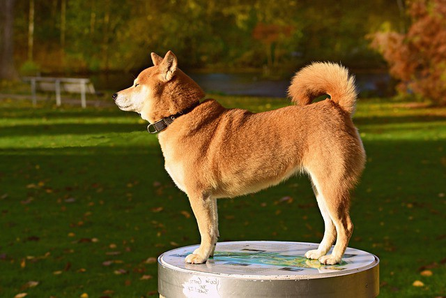
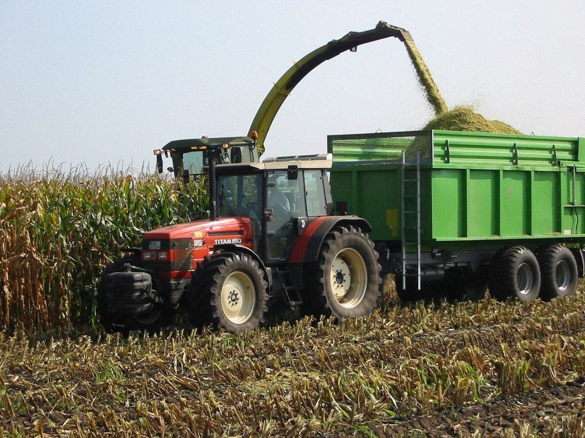

# 晃动命令行
## 21条Bash命令为您节省时间

本文是对Bash命令的简要介绍。 知道如何在命令行中移动是节省时间的一项基本技能。 我们将点击21个最常见的命令及其键标记。 我们还将介绍Bash快捷方式，以节省大量的击键。 ⌨️

> A shell

## 条款

Unix，Linux，Bash，shell，命令行，终端和Shell脚本这两个词是不同的东西，但是它们共享我们将讨论的命令。 这是差异和相似之处的快速细分。

Unix是由Bell Labs在1970年代开发的流行计算机操作系统。 它不是开源的。

Linux是最流行的Unix衍生版本。 它运行着世界上大量的类似计算机的设备。

您的终端是仿真器程序，可让您访问操作系统。 您可以同时打开多个终端窗口。

Shell语言用于将命令发送到底层操作系统。

Bash代表Bourne Again SHell。 它是与操作系统通信的最常用的外壳语言。 它也是macOS的默认外壳。 要了解有关支持Linux和Bash的开源基础的更多信息，请查看本文。

命令行界面（CLI）指的是您在其中输入命令的基于键盘输入的界面。 通常，它用于实时信息和文件操作。 将CLI与常用鼠标的图形用户界面（GUI）进行对比。 CLI通常称为命令行。

脚本是指包含一系列shell命令的小程序。 脚本被写入文件，并且可以重复使用。 您可以在脚本中创建变量，条件语句，循环，函数等。

ew 了解？ 我们下面讨论的命令适用于上面所有斜体字。 我将交替使用Bash，shell和命令行。

另一个注意事项：我可以交替使用目录和文件夹。 这两个词是同一件事。

标准输入/输出流是标准输入（stdin），标准输出（stdout）和标准错误（stderror）。 他们会弹出一堆。 当我使用术语打印时，我的意思是打印到标准输出，而不是打印机。

最后，使用任何内容替换以下以my_whatever开头的命令。 😄

事不宜迟，这里是我们将在本文中介绍的命令列表。
# 前21个Bash命令
## 获取信息

man：打印命令的手册（帮助）pwd：打印工作目录ls：列出目录内容ps：查看正在运行的进程
## 操纵

cd：更改工作目录touch：创建文件mkdir：创建目录cp：copymv：移动或重命名ln：链接
## 重定向和管道

<：重定向标准输入>：重定向标准输出|：将一个命令的内容传递给下一个命令
## 读

头：读取文件尾的开头：读取文件尾的结尾：读取文件或连接文件
## 结束

rm：removekill：结束进程
## 搜索

grep：searchag：搜索
## 封存

tar：将多个文件合并为一个文件

让我们深入探讨！
# 解释的前21条命令

首先，让我们看一下以stdout形式返回信息的命令，即标准输出。 通常，stdout会写入您的终端。
## 获取信息

man command_name：打印命令手册。 就像帮助一样。

pwd：显示当前工作目录的文件路径。 您通常需要知道您在文件系统中的位置。

ls：列出目录内容。 另一个超级通用命令。

ls -a：还使用-a列出隐藏文件。

ls -l：使用-l查看有关文件的更多信息。

请注意，标志可以像这样组合：ls -al。

ps：查看正在运行的进程。

ps -e：使用-e打印所有正在运行的进程，而不仅仅是与当前用户的shell相关联的进程。 这通常是您想要的。
# 操纵

cd my_directory：将工作目录更改为my_directory。 使用my.directory的相对路径../在目录树中上移一级。

> CD


触摸my_file：在指定路径位置创建my_file。

mkdir my_directory：在指定的路径位置创建my_directory。

mv my_file target_directory：将my_file移到target_directory。

mv也可以用来重命名文件或文件夹，如下所示：

mv my_old_file_name.jpg my_new_file_name.jpg

cp my_source_file target_directory：复制source_file并将其放在target_directory中。

ln -s my_source_file my_target_file：使用符号链接将my_target_file链接到my_source_file。

更新my_source_file的内容后，my_target_file的内容会自动更新。 如果my_target_file的内容已更新，则my_source_file的内容也将更新。 凉。

如果删除了my_source_file，则删除了my_target_file的内容，但该文件继续存在。 这只是一个空文件。

如果删除了my_target_file，则my_source_file继续存在，其内容保持不变。

-s标志还允许您链接目录。

**于2019年4月12日更新，以更正和阐明ln -s和mv行为。 感谢Jason Wallwork。**

现在，让我们看看输出重定向和管道的工作方式。
# 重定向和管道

my_command <my_file：将stdin重定向到my_file。 当my_command需要用户输入来执行某些操作时很有用。

my_text> my_file：将标准输出重定向到my_file。 创建my_file（如果不存在）。 如果my_file存在，则将其覆盖。

例如，ls> my_folder_contents.txt创建一个列出您工作目录内容的文本文件。

将其添加为double >>，以将stdout附加到my_file而不是覆盖它。

现在让我们看一下管道命令。

> Pipe the result of one command to the other


first_command | second_command：管道字符| 用于将一个命令的结果发送到另一命令。 管道左侧命令的标准输出传递到管道右侧命令的标准输入。

“一切都是管道”是Unix中的口头禅-因此，几乎所有有效命令都可以通过管道传输。

用管道链接命令可创建管道。 多个管道可以像这样链接在一起：

first_command | second_command | third_command

> Pipeline


注意，管道并行执行所有命令。 此行为有时会导致意外结果。 在这里阅读更多。

说到阅读，让我们看看如何从命令行中进行阅读。
# 读

头my_file：读取my_file的第一行。 其他标准输入也可以阅读。

tail my_file：读取my_file的最后几行。 其他标准输入也可以阅读。

> Head at the front, tail at the back.


如果您是使用熊猫的数据科学家，那么后两个命令应该听起来很熟悉。 如果不是这样，头和尾巴就是很好地映射的隐喻，因此它们应该不会太难于记住。

让我们看看另一种读取文件的方法。

cat可以打印文件，也可以串联多个文件，具体取决于传递的文件数。

> cat


cat my_one_file.txt：cat使用一个文件将内容打印到stdout。

当您给它两个或多个文件时，cat命令的行为有所不同。

cat my_file1.txt my_file2.txt：包含两个或更多文件，cat将文件内容串联在一起，并将输出打印到stdout。

如果要将串联的文件另存为新文件，请使用>写运算符，如下所示：

猫my_file1.txt my_file2.txt> my_new_file.txt

现在，我们来看看删除和结束内容。
# 结束

rm my_file：从文件系统中删除my_file。

rm -r my_folder：删除my_folder以及my_folder中的所有文件和子文件夹。 -r用于递归。

如果您不想每次删除都提示确认，请添加-f。

杀死012345：通过给其时间关闭来正常结束指定的运行进程。

kill -9 012345：立即结束指定的运行进程。 -s SIGKILL表示与-9相同。
# 搜索

接下来的几个命令-grep，ag和ack-用于搜索。 Grep是古老的，可信赖的同级产品-可靠，但速度较慢，并且用户友好性稍差。

> Get a grep!


grep my_regex my_file：在my_file中搜索my_term。 返回每次匹配文件的整行。 my_term默认为正则表达式。

grep -i my_regex my_file：-i使搜索不区分大小写。

grep -v my_regex my_file：返回所有不包含my_term的行。 -v返回反函数，就像许多语言一样。

grep -c my_regex my_file：返回与-c匹配的次数的计数。

grep -R my_regex my_folder：用-R递归搜索文件夹中的所有文件和所有子文件夹。

现在我们来谈谈Ag-grep的年轻，更快，外观更好的兄弟姐妹。

> Get it?


如果您运行以下命令，但发现计算机上没有Ag，请参见此处的安装说明。 在使用自制软件的Mac上，只需运行brew install the_silver_searcher。 （2019年8月更新）。

ag my_regex my_file：返回行号和任何匹配的行。

ag -i my_regex my_file：-i用于不区分大小写。

Ag自动读取您的.gitignore文件，并从任何匹配的文件或文件夹中排除结果。 太酷了！

ag my_regex my_file –skip-vcs-ignores：使用–skip-vcs-ignores覆盖自动版本控制系统文件读取。

您还可以制作一个.agignore文件，以从Ag中排除文件路径。

undefined
# 封存

现在，让我们看看制作tarball存档。

tar my_source_directory：将源目录中的多个文件合并为一个tarball文件。 此命令对于分发其他人将下载的文件很有用。

> tar


压缩文件的扩展名为.tar，代表Tape ARchive。 Tape告诉您有关此命令的年龄！

tar -cf my_file.tar my_source_directory：使用my_source_directory的内容创建一个名为my_file.tar的tarball文件。 -c用于创建，-f用于文件。

使用-xf提取tar文件。 -x用于提取，-f用于文件。

tar -xf my_file.tar将my_file.tar中的文件扩展到当前工作目录。

现在，让我们看一下.tar文件的压缩和解压缩。

tar -cfz my_file.tar.gz my_source_directory使用gzip压缩文件。 -c代表创建，-f代表文件，-z代表zip。 Gzip为文件的使用者节省了空间和下载时间。

通过将-z标志添加到我们之前看到的提取命令中，解压缩.tar.gz文件。

tar -xfz my_file.tar.gz。 -x代表解压缩，-f代表文件，-z代表zip。

tar还有许多其他标志可以使用。
# 重击别名

设置Bash别名可将您的按键保存在终端中。 然后，您可以执行类似bu而不是python setup.py sdist bdist_wheel的操作。

只需将以下行添加到您的〜/ .bash_profile中：

别名bu =“ python setup.py sdist bdist_wheel”

如果您没有〜/ .bash_profile文件，则可以使用touch命令在命令行中创建一个文件。

然后重新启动终端，并使用两次击键来构建Python包。 就像输入2个字母而不是44个字母一样。

添加您喜欢的任何其他别名，并观察您的生产率提高。 🌴

让我们回顾一下我们所涵盖的内容。
# 回顾：前21个Bash命令
## 获取信息

man：为命令打印手册（帮助）pwd：打印工作目录ls：列出目录内容ps：查看正在运行的进程
## 操纵

cd：更改工作目录touch：创建文件mkdir：创建目录cp：copymv：移动或重命名ln：链接
## 重定向和管道

<：重定向标准输入>：重定向标准输出|：将一个命令的内容传递给下一个命令
## 读

头：读取文件尾的开始：读取文件尾的通知：读取文件或连接文件
## 结束

rm：removekill：结束进程
## 搜索

grep：searchag：搜索
## 封存

tar：将多个文件合并为一个文件
# 包裹

在本文中，您已经看到了21种最常见的Shell命令。 如果您认为应该列出另一个列表，请在Twitter @discdiver上告诉我。

您还了解了如何创建Bash别名以节省时间。

如果您想进一步了解以下资源：
+ 征服命令行是Mark Bates撰写的一本很棒的免费电子书。
## 征服命令行
### 学习掌握和征服基于Unix和Linux的系统中最有价值和最有用的命令行工具。 在这…
+ 来自gnu.org的官方Bash文档在这里。
+ Sed和Awk听起来像两个兄弟，但实际上它们是文本处理实用程序，经常在Bash中看到。 在此处了解有关它们的更多信息。
+ cURL（发音为“ curl”）用于通过URL和测试服务器传输数据。 在这里了解更多。
+ 这是Bash脚本编写的重要备忘单。

像任何一种语言一样，学习Bash需要实践。 使用它可以提高您的生产力，并乐于将其教给其他人。 😄

我写了有关如何使用编程和数据科学工具（如Docker，Git和Python）的文章。 如果您对此感兴趣，请在此处阅读更多内容，并在Medium上关注我。 👏


炮击快乐！

```
(本文翻译自Jeff Hale的文章《Rock the Command Line》，参考：https://towardsdatascience.com/rock-the-command-line-52c4b2ea34b7)
```
