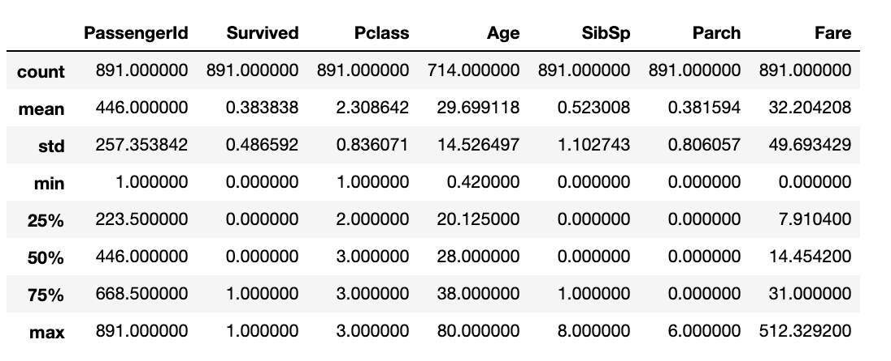
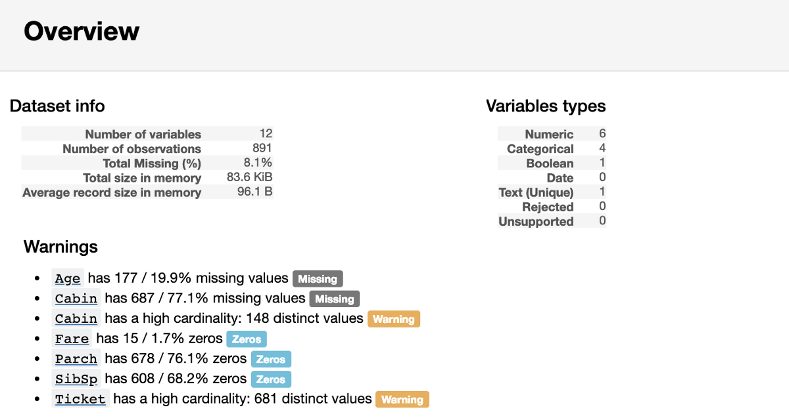
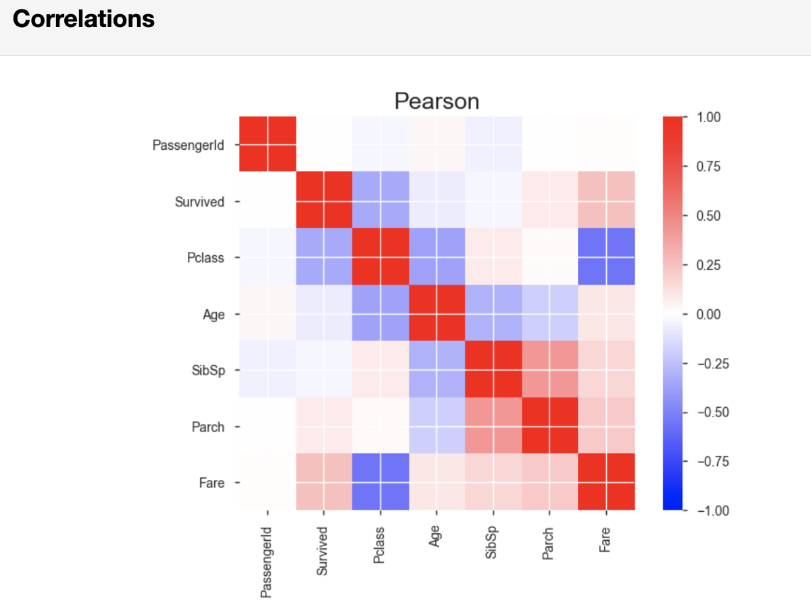
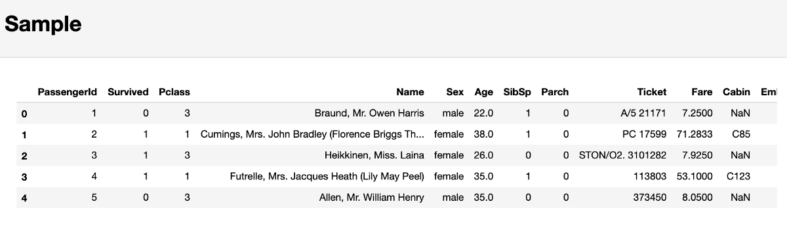

# 使用Pandas-Profiling加快探索性数据分析的速度
## 只需一行代码，即可直观了解数据的结构

> Source: https://unsplash.com/photos/gts_Eh4g1lk

# 介绍

第一次导入新数据集时，要做的第一件事就是了解数据。 这包括确定特定预测变量的范围，识别每个预测变量的数据类型以及计算每个预测变量的缺失值的数量或百分比之类的步骤。

pandas库为EDA提供了许多非常有用的功能。 但是，在应用其中的大多数功能之前，通常必须先从更通用的功能开始，例如df.describe（）。 但是，此类功能所提供的功能是有限的，而且对于每个新数据集，您最初的EDA工作流程通常都非常相似。 作为一个在完成重复性任务时并没有感到非常高兴的人，我最近寻找了替代方法，并遇到了对熊猫进行剖析的情况。 Pandas概要分析不仅使您仅获得单个输出，还使用户可以快速生成结构非常广泛的HTML文件，其中包含您可能需要了解的大部分内容，然后才能进行更具体的个人数据探究。 在下面的段落中，我将引导您完成对Titanic数据集的熊猫轮廓分析的应用。
# 更快的EDA

由于数据类型多样且缺少值，因此我选择对Titanic数据集应用熊猫分析。 我认为，当尚未清除数据并且仍需要进一步的个性化调整时，对熊猫进行分析特别有趣。 为了在这些个性化调整过程中更好地引导您的注意力，您需要知道从哪里开始以及应该关注什么。 这就是熊猫分析的用武之地。

首先，让我们导入数据并使用熊猫检索一些描述性统计信息：
```python
# importing required packages
import pandas as pd
import pandas_profiling
import numpy as np

# importing the data
df = pd.read_csv('/Users/lukas/Downloads/titanic/train.csv')

# descriptive statistics
df.describe()
```

上面的代码块将产生以下输出：


尽管上面的输出包含很多信息，但是并不能告诉您可能感兴趣的所有内容。例如，您可以假设数据帧有891行。 如果要检查，则必须添加另一行代码以确定数据帧的长度。 尽管这些计算不是很昂贵，但是一遍又一遍地重复它们确实会花费一些时间，您可能在清理数据时可能会更好地使用它们。
## 总览

现在，让我们对pandas进行分析：
```python
pandas_profiling.ProfileReport(df)
```

运行这一行代码，将创建数据的HTML EDA报告。 上面显示的代码将创建结果的内联输出； 但是，您也可以选择将EDA报告另存为HTML文件，以便更轻松地共享它。

HTML EDA报告的第一部分将包含一个概述部分，为您提供基本信息（观察值，变量数等）。 它还会输出警告列表，告诉您在哪里要再次检查数据并可能将精力集中在清洁上。

> Overview Output

## 特定于变量的EDA

在概述之后，EDA报告为您提供了每个特定变量的有用见解。 这些还包括一个小的可视化视图，描述了每个变量的分布：

> Output for numeric variable ‘Age’


从上面可以看出，pandas分析为您提供了一些有用的指标，例如缺失值的百分比和数量以及我们之前看到的描述性统计信息。 由于“年龄”是一个数字变量，因此使用直方图可视化其分布可以告诉我们该变量似乎是右偏的。

对于类别变量，仅进行了较小的更改：

> Output for categorical variable ‘Sex’


熊猫分析而不是计算均值，最小值和最大值，而是计算分类变量的类计数。 由于“性别”是一个二进制变量，因此我们只能找到两个不同的计数。

如果您像我一样，您可能想知道熊猫分析如何精确计算其输出。 幸运的是，源代码在GitHub上可用。 由于我不喜欢在代码中构造不必要的黑匣子部件，因此我将快速了解数字变量的源代码：
```python
def describe_numeric_1d(series, **kwargs):
    """Compute summary statistics of a numerical (`TYPE_NUM`) variable (a Series).
    Also create histograms (mini an full) of its distribution.
    Parameters
    ----------
    series : Series
        The variable to describe.
    Returns
    -------
    Series
        The description of the variable as a Series with index being stats keys.
    """
    # Format a number as a percentage. For example 0.25 will be turned to 25%.
    _percentile_format = "{:.0%}"
    stats = dict()
    stats['type'] = base.TYPE_NUM
    stats['mean'] = series.mean()
    stats['std'] = series.std()
    stats['variance'] = series.var()
    stats['min'] = series.min()
    stats['max'] = series.max()
    stats['range'] = stats['max'] - stats['min']
    # To avoid to compute it several times
    _series_no_na = series.dropna()
    for percentile in np.array([0.05, 0.25, 0.5, 0.75, 0.95]):
        # The dropna() is a workaround for https://github.com/pydata/pandas/issues/13098
        stats[_percentile_format.format(percentile)] = _series_no_na.quantile(percentile)
    stats['iqr'] = stats['75%'] - stats['25%']
    stats['kurtosis'] = series.kurt()
    stats['skewness'] = series.skew()
    stats['sum'] = series.sum()
    stats['mad'] = series.mad()
    stats['cv'] = stats['std'] / stats['mean'] if stats['mean'] else np.NaN
    stats['n_zeros'] = (len(series) - np.count_nonzero(series))
    stats['p_zeros'] = stats['n_zeros'] * 1.0 / len(series)
    # Histograms
    stats['histogram'] = histogram(series, **kwargs)
    stats['mini_histogram'] = mini_histogram(series, **kwargs)
    return pd.Series(stats, name=series.name)
```

尽管这似乎是一个巨大的代码块，但实际上却很容易理解。 Pandas配置文件的源代码包括另一个确定每个变量类型的函数。 如果将变量标识为数字变量，则上面的函数将产生我之前显示的输出。 此函数使用基本的pandas系列操作（例如series.mean（）），并将结果存储在stats字典中。 这些图是使用matplotlib的matplotlib.pyplot.hist函数的改编版本生成的，旨在能够处理各种类型的数据集。
## 相关性和样本

在每个特定变量的EDA之下，pandas分析将同时输出Pearson和Spearman相关矩阵。

> Pearson correlation matrix output


如果愿意，可以在生成报告的代码的初始行中设置一些相关性阈值。 这样，您就可以调整您认为对分析重要的相关强度。

最后，pandas分析将输出一个代码示例。 严格来说，这不是代码示例，而只是数据的开头。 当前几个观察结果通常不能代表数据的特征时，这可能会导致问题。


因此，建议不要将最后的输出用于初始分析，而应运行df.sample（5），它将从数据集中随机选择五个观测值。
# 结论

总而言之，pandas分析提供了一些有用的功能，尤其是当您的主要目标是快速而又肮脏地理解数据或以可视格式与他人共享您的初始EDA时。 然而，它还不接近于自动化EDA。 实际的个性化工作仍然必须手动完成。

如果您想在一个笔记本中查看整个EDA，请在线查看我在nbviewer中使用的笔记本。 您也可以在我的GitHub存储库中找到有关中型文章的代码。
```
(本文翻译自Lukas Frei的文章《Speed Up Your Exploratory Data Analysis With Pandas-Profiling》，参考：https://towardsdatascience.com/speed-up-your-exploratory-data-analysis-with-pandas-profiling-88b33dc53625)
```
