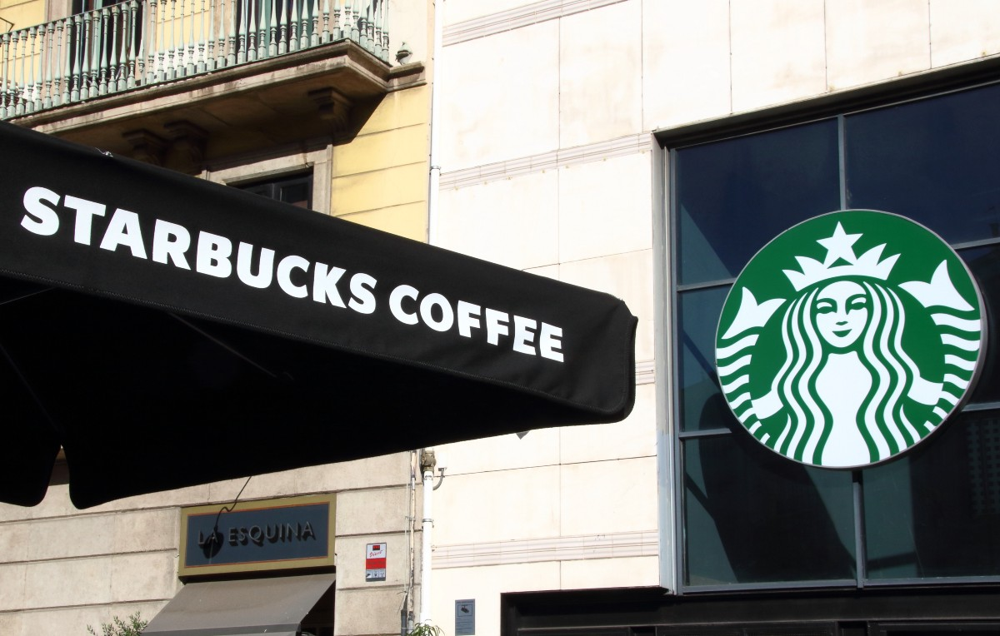

# 星巴克不是一家咖啡企业，而是一家数据技术公司
## 它们是如何策略性地使用数据以保持竞争力的教科书示例

> Photo: SOPA Images/Getty Images


星巴克不仅在全球范围内出售大量冷热饮料，而且每周还从1亿笔交易中收集大量数据。 它如何使用这些数据？ AI扮演什么角色 物联网（IoT）在其中发挥作用吗？

星巴克利用数据和现代技术获取竞争优势的方式对所有企业（无论规模大小）都具有指导意义。 例如，它是结合会员系统，支付卡和移动应用程序的先驱。 但这只是表面。

本文重点介绍了星巴克如何利用数据，人工智能和物联网来获得竞争优势的五个最有趣的示例。 他们认为可能存在一个令人信服的论点，即星巴克不再是咖啡业务，而是现在在食品和饮料领域的数据技术公司。
# 星巴克展示了数据，技术和业务之间的关系比大多数人更好

星巴克的数据并不短缺。 它在全球拥有30,000多家商店，每周完成近1亿笔交易。 这样就可以全面了解客户的消费和享受。 但是，也许令人惊讶的是，仅仅十年来它才真正专注于这些数据的价值。

并不是说在那之前没有使用过数据。 但是，就像公司发生许多重大变化一样，危机导致了这种变化。 在这种情况下，这是2008年金融大爆发和相关商店倒闭。 当时的首席执行官霍华德·舒尔茨（Howard Schultz）的教训是，星巴克对数据的使用需要进行更具分析性的分析，尤其是在确定商店位置方面。

在此之前，星巴克的决定（与许多其他组织一样）是基于经验和判断的人为驱动。 数据显然很重要，但是却没有系统的可能。 关于它的文章很少，但是它似乎是使用数据来验证和传达人的思想和决定的常规方法。

它做得特别好的方法是使用数据和技术尝试各种新想法，然后使用更多数据来找出要提出的想法。

除了房地产之外，星巴克今天对数据的使用当然也扩展到一系列营销和产品活动。 反过来，这又导致了如何管理其供应链的情报。 其中的核心是星巴克奖励计划，该计划也于2008年启动。

不太常见的是星巴克使用数据的方式如何拥抱物联网，尤其是店内运营。 最初是从咖啡机开始，现在已扩展到烤箱等其他店内设备。
# 星巴克如何利用数据，人工智能和物联网来获得竞争优势的五个例子

我们可以在书中详细介绍星巴克与许多其他大型现代公司一样如何使用数据和相关技术。 它做得特别好的方法是使用数据和技术尝试各种新想法，然后使用更多数据来找出要提出的想法。

在众多出色的例子中，我选择了五个重点。 之所以选择这些是因为它们展示了如何很好地利用数据以及人工智能，物联网和云技术，从而改善了星巴克的业务：
+ 通过个性化促销和优惠定位客户
+ 由洞察力驱动的产品开发，包括跨渠道
+ 复杂的房地产规划
+ 动态菜单创建和调整
+ 优化的机器维护
# 示例1：个性化促销

客户数据的经典用法是根据个人消费者的喜好个性化您的报价，而星巴克也是如此。 仅在美国就有1600万会员，其忠诚度计划就占了美国所有商店交易的近一半。

了解单个客户的订单偏好和购买方式后，星巴克就可以发送更可能相关的个性化报价。 使用人工智能 确定此类活动正在成为人工智能的标准应用，而星巴克自2017年以来一直通过其“数字飞轮”计划进行此操作。

这类工作的一个重要重点是根据消费者订购的其他产品来建议他们可能会喜欢的新产品。

但这不仅涉及个性化促销。 很大一部分仍在进行常规的大规模运动，但直接面向目标细分市场的每个消费者。 这些可能包括炎热的日子里的冷饮，产品发布会或季节性菜单。
# 示例2：洞察力驱动的产品

个性化促销无疑是有效的，但对于星巴克而言，同样重要的是在开发其产品范围时使用客户数据。

星巴克使用数据的一种有效方法来自大量消费者的购买习惯。 从这些数据得出的见解表明现有产品的变化和发展。 例如，十五年前有个可爱的主意，在万圣节推出南瓜味饮料。 这已成为全球范围内以南瓜为灵感的产品的全部范围。 结果就是秋季月份的人流量大增。

第二种类型是跨通道使用数据。 其中最重要的例子可能是该公司在2016年将咖啡打入家用市场。这是产品在超市中的主流推出，客户可以在家中制作咖啡。 店内数据为确定家用饮水机的目标产品奠定了坚实的基础。 它甚至可以在常规商店中对带回家的产品（例如速溶咖啡）进行路试。

它还添加了诸如不加糖的家用产品等产品。 店内消费数据建议的另一个变体是加牛奶和不加牛奶的版本。
# 示例3：复杂的房地产规划

现在，计划在哪里开设星巴克商店是一项复杂的数据分析。 星巴克为此使用数据的方式涵盖了您期望的所有可能因素。 它还考虑了一些您可能不会考虑的问题。

人工智能 对商店计划的支持可以模拟有关位置的经济因素。 其中包括人口，收入水平，流量，竞争对手的存在等等。 它使用它来预测收入，利润和经济绩效的其他方面。

该系统还会考虑现有星巴克分店的位置。 它考虑了拟建新商店对附近地区现有收入的影响。

人工智能 此应用程序的核心技术是基于位置的分析。 这也称为制图或GIS（地理空间信息系统）。
# 示例4：动态菜单

以上示例的一个含义是，星巴克具有不断完善和调整其产品的能力。 星巴克使用数据的方式意味着它可以根据客户，位置和时间进行修改。 这会影响产品，促销和价格。

但是，如果您在柜台上方的印刷菜单板上显示您的店内商品，则表示可以连续调整商品。 这是诸如黑板之类的低保真解决方案仍然受到零售商欢迎的原因之一。 但是对于星巴克来说，答案是在商店中推出数字标牌，并通过计算机设置菜单显示。

这完成了一条链，该链允许将客户体验中其他地方可能发生的更改反映到商店中。

显然，这提出了很多问题，并且有太多的范围使事情变得过于复杂。 但是，截至2018年中，星巴克正在少数商店中对此进行试用。 它专注于根据当地情况（例如天气或一天中的时间）推销选定的产品。
# 示例5：优化机器维护

我们最后一个例子是咖啡机维护以及一般的店内机械。

典型的店内星巴克交易成本相对较低且持续时间较短。 大量的客户吞吐量是商店成功的关键。 因此，如果机器发生故障，则可能会严重破坏业务绩效。

星巴克不会让工程师留在现场进行故障诊断。 取而代之的是，他们派他们去维修，当然还要执行计划的维护。 因此，让工程师迅速找到损坏的机器会有所作为。

有解决此问题的常规方法。 这通常意味着收集有关故障，机器使用情况，所需维修等的数据。 定期数据分析擅长发现趋势和模式。 我 可以帮助您提高水平，预测故障和维护需求。

星巴克朝着前进的方向发展新咖啡机CloverX。目前仅在旗舰店和概念店使用。 除了制作咖啡的能力最先进之外，它还与云端连接。 这不仅允许更全面地收集运营数据。 它还允许对故障进行远程诊断，甚至可以进行远程维修。

类似的概念将适用于其他机器。 例如，商店现在有一个标准烤箱，该烤箱也由计算机控制，以便为全球热产品进行一致的准备。 但是，当前计算机需要通过USB驱动器进行更新。 每当机器配置发生变化（例如新产品）时，就会发生这种情况。 将来，毫无疑问，这将成为直接的云连接，也将创造更多的人工智能。 机会。

星巴克是领先的现代全球业务的典型代表。 星巴克如何使用数据是管理数据和技术取得巨大成功的典范。 它对数据和人工智能的使用并没有令人惊讶的地方。 人工智能也没有任何惊人的创新 或分析。

但是星巴克使用数据的方式是一个教科书示例，说明了如何开始策略性地使用数据，系统地，彻底地执行计划。 创新出现了，但由于AI而在您的核心业务中发挥了作用，而AI中并不一定如此。 本身。 物联网和云只是这的自然扩展。

另一个教训是人工智能 似乎是星巴克学习使用数据之旅的一部分。 这并不是因为强烈渴望使用人工智能而发生的。 在适当的时候，这只是每个领域的下一步。

考察其旅程的最后要点是扩展解决方案的方式。 在这种情况下，一旦概念得到证实，不仅仅是事情变得越来越大。 业务的全球性质增加了区域复杂性。

我们大多数人没有将我们的组织与星巴克进行比较，也没有太多共同之处。 但是，如果我们缩小对星巴克使用数据的方式的看法，那将会改变。 看看它如何演变成有效的人工智能应用也很有启发性。

像星巴克一样，我们大多数人都不认为自己从事AI业务。 或数据。 但这并不意味着它们并没有成为我们组织的核心。 它的确引发了有关您实际从事的业务的疑问-仅仅是有关您出售的大部分产品或您最擅长的是什么？

本文基于最初发表在www.aiprescience.com上的文章
```
(本文翻译自Was Rahman的文章《Starbucks Isn’t a Coffee Business — It’s a Data Tech Company》，参考：https://marker.medium.com/starbucks-isnt-a-coffee-company-its-a-data-technology-business-ddd9b397d83e)
```
