感谢您的阅读。 如果您有任何反馈意见，请告诉我。
# 参考文献
+ https://datafreakankur.com/machine-learning-kernel-functions-3d-visualization/
+ https://www.sciencedirect.com/science/article/pii/B9780128113189000272
+ https://datatuts.com/svm-parameter-tuning/
+ https://jakevdp.github.io/PythonDataScienceHandbook/05.07-support-vector-machines.html
# 支持向量机—解释
## 理论上的详细解释和代码上的示例

支持向量机（SVM）是一种受监督的机器学习算法，主要用于分类任务。 它也适用于回归任务。

监督学习算法尝试使用特征（独立变量）预测目标（独立变量）。 根据目标变量的特性，它可以是分类（离散目标变量）或回归（连续目标变量）任务。 预测是通过将自变量映射到因变量的映射函数完成的。 SVM的映射功能是一个决策边界，可在两个或多个类之间进行区分。 如何绘制或确定决策边界是SVM算法中最关键的部分。

在创建决策边界之前，将每个观察值（或数据点）绘制在n维空间中。 “ n”是所使用功能的数量。 例如，如果我们使用“长度”和“宽度”对不同的“单元格”进行分类，则观察结果将绘制在二维空间中，并且决策边界为一条线。
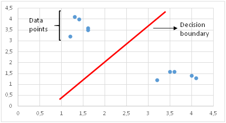
> SVM in a 2-dimensional space


这是一个非常简单的案例，仅用于说明SVM的概念。 在现实生活中，您极不可能遇到这样的任务。 在这种情况下，决策边界是一条线。 如果使用3个要素，则决策边界是3维空间中的平面。 如果我们使用3个以上的特征，则决策边界将变成超平面，这真的很难形象化。
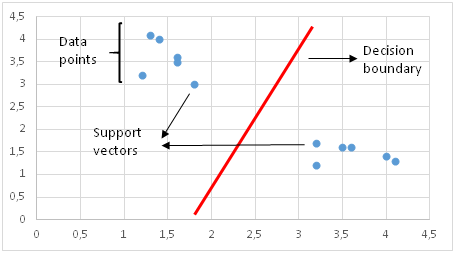
> Support Vectors


主要动机是绘制一个决策边界，以最大化支持向量的距离。 如果决策边界距离支持向量太近，它将对噪声高度敏感并且不能很好地泛化。 即使自变量的很小变化也可能导致分类错误。
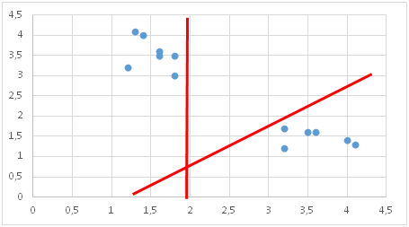
> Bad choices for Decision Boundary


数据点并非总是如上图所示线性分离。 在这些情况下，SVM使用内核技巧来测量较高维空间中数据点的相似性（或相似性），以使它们线性可分离。 下图更容易理解。 如您所见，二维空间中的两个不同类不能用线分隔。 使用内核技巧可以使它们线性分离：
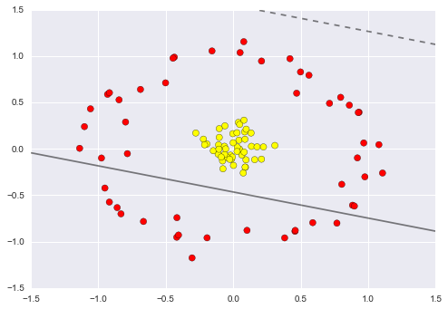
> Figure source

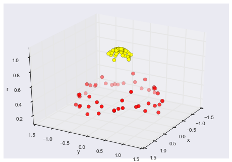
> Figure source


在详细介绍内核技巧之前，我想提及一下c参数和一个称为“软边距”的概念。
# 软边距SVM和C参数

实际数据在大多数情况下都是嘈杂的并且不是线性可分离的。 标准SVM尝试将所有正例和负例（即两个不同的类）分开，并且不允许将任何点分类错误。 这导致模型过度拟合，或者在某些情况下，标准SVM无法找到决策边界。 过度拟合的SVM通过训练集可以达到很高的精度，但是在新的，以前看不见的示例中效果不佳。 为了克服这个问题，在1995年，Cortes和Vapnik提出了“软边际” SVM的思想，该思想允许将某些示例分类错误或置于决策边界的错误一边。 软边距SVM通常会导致更好的通用模型。 在确定决策边界时，软裕度SVM尝试解决具有以下目标的优化问题：
+ 增加决策边界与类（或支持向量）的距离
+ 最大化在训练集中正确分类的点数

这两个目标之间显然需要权衡取舍。 决策边界可能必须非常接近某一特定类别，才能正确标记训练集中的所有数据点。 但是，在这种情况下，测试数据集的准确性可能会降低，因为决策边界对噪声和自变量的微小变化过于敏感。 另一方面，可能会为每个类别设置尽可能大的决策边界，但要付出一些错误分类的例外的代价。 这种权衡由c参数控制。

C参数为每个错误分类的数据点增加了惩罚。 如果c小，则对错误分类的点的惩罚较低，因此以较大数量的错误分类为代价选择了具有较大余量的决策边界。 如果c大，由于高惩罚，SVM会尝试最大程度地减少误分类示例的数量，从而导致决策边界的边距较小。 对于所有错误分类的示例，惩罚都不相同。 它与到决策边界的距离成正比。
# 内核功能

内核功能是一种相似性度量。 输入是原始要素，输出是新要素空间中的相似性度量。 这里的相似度表示紧密度。 将数据点实际转换为高维特征空间是一项昂贵的操作。 该算法实际上并未将数据点转换为新的高维特征空间。 内核化的SVM根据高维特征空间中的相似性度量计算决策边界，而无需实际进行转换。 我认为这就是为什么它也称为内核技巧。
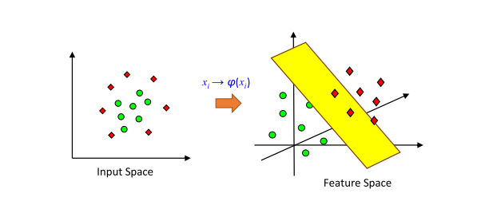
> Figure source


scikit-learn中可用的内核函数是线性，多项式，径向基函数（RBF）和S形。

RBF（或高斯RBF）是一种广泛使用的内核函数。 它由伽玛参数定义，该参数基本上控制单个训练点的影响距离。 较低的gamma值表示相似半径较大，这导致将更多点组合在一起。 对于较高的伽玛值，这些点必须彼此非常接近，以便在同一组（或类）中考虑。 因此，具有非常大的伽玛值的模型往往会过拟合。 以下可视化效果更好地解释了该概念：
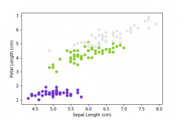
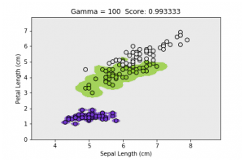
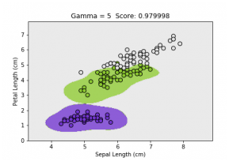
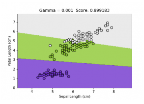
> Figures source


随着伽玛值的减小，分隔不同类别的区域将变得更加普遍。 很大的伽玛值会导致特定的类区域（过度拟合）。
# 伽玛vs C参数

对于线性内核，我们只需要优化c参数即可。 但是，如果要使用RBF内核，则必须同时优化c和gamma参数。 如果γ大，则c的影响可忽略不计。 如果gamma很小，则c会像影响线性模型一样影响模型。 c和gamma的典型值如下。 但是，取决于应用程序，可能存在特定的最佳值：

0.0001 <伽玛<10

0.1 <c <100

对于SVM而言，记住输入数据需要进行标准化以使功能具有相同的比例和兼容是非常重要的。
# SVM的优缺点

优点：
+ 在维数大于样本数的情况下有效
+ 查找决策边界时，它使用训练点的子集而不是所有点，因此具有存储效率
+ 用途广泛，它提供了不同类型的内核功能，还可以创建自定义内核功能

缺点：
+ 需要仔细规范化
+ 难以理解预测背后的逻辑
+ 当我们有一个大数据集时，训练时间会增加，这会对性能产生负面影响
# Scikit学习示例

我想看一个简单的案例，只是为了显示语法和要遵循的步骤。 让我们从导入所需的库开始：
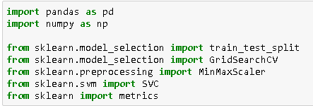

Scikit-learn还提供实践数据集。 乳腺癌数据集适合我们的任务：
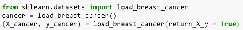

我们需要使用scikit-learn的train_test_split函数对数据集进行训练和测试。 然后，我创建一个用于对线性核进行分类的支持向量机对象，并使用训练数据集对其进行训练：
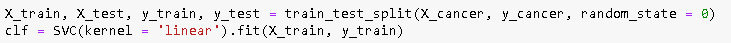

使用我们训练有素的模型，我们可以预测测试数据集中的目标变量并测量模型的准确性：
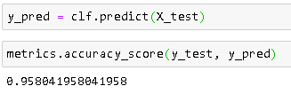

undefined
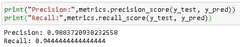

这是一个简单的线性可分离任务。 对于无法线性分离的情况，我们可以使用带有SVC内核参数的内核（即kernel ='rbf'）。 我没有指定c参数，所以使用了默认值（c = 1）。 为了找到最佳参数，我们可以使用scikit-learn的GridSearchCV（）函数。
```
(本文翻译自Soner Yildirim的文章《Support Vector Machine — Explained》，参考：https://towardsdatascience.com/support-vector-machine-explained-8d75fe8738fd)
```
