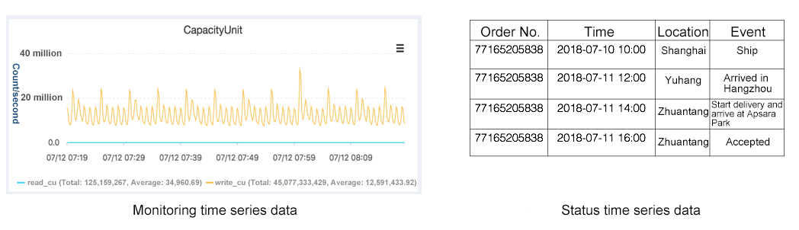
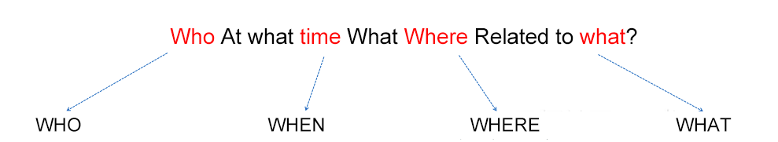
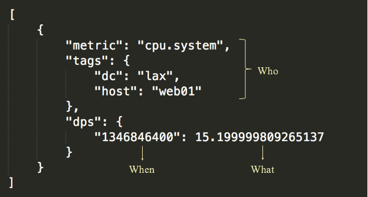
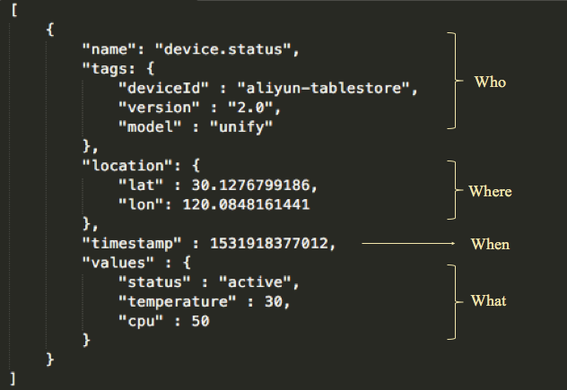
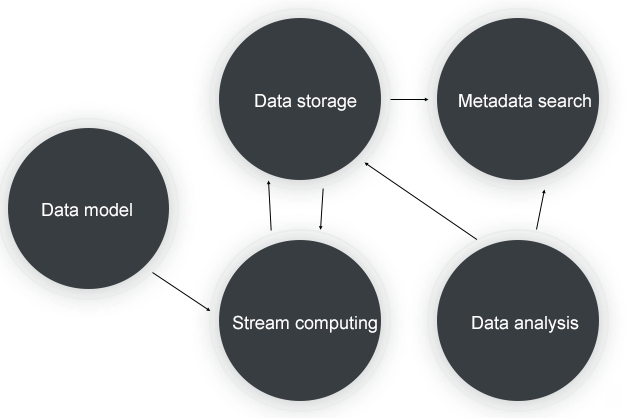
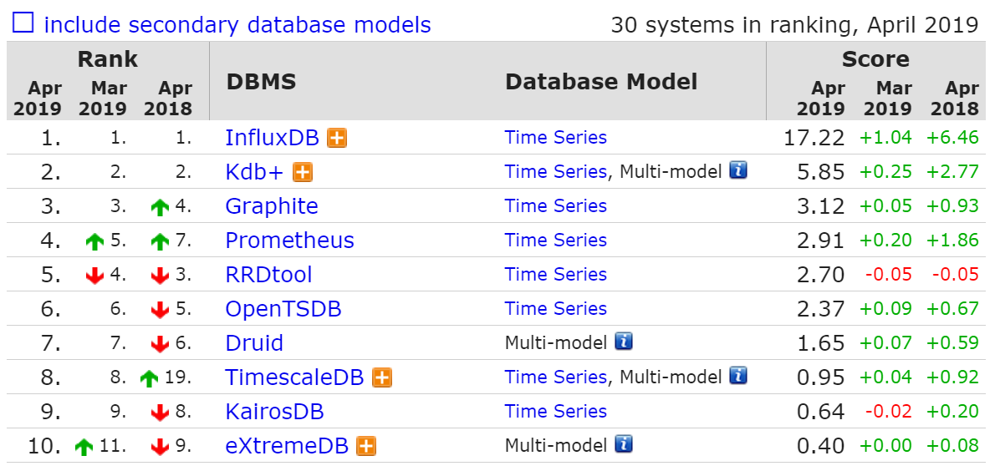
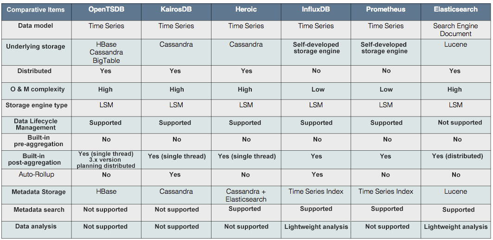
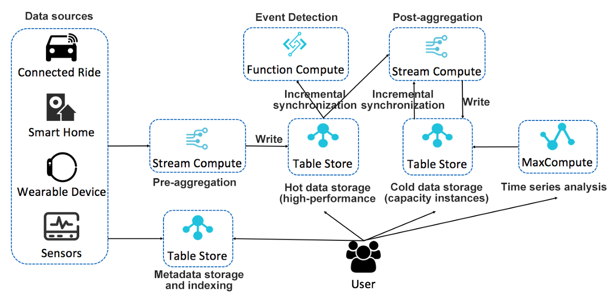

# 表存储时间序列数据存储—体系结构

周兆丰（木罗）
# 背景

近年来，随着物联网的发展，时间序列数据呈爆炸式增长。 根据过去两年在DB-Engines中收集的数据库类型的增长趋势，时间序列数据库一直在快速增长。 这些大型开源时间序列数据库的实现各不相同，但没有一个是完美的。 但是，可以结合使用这些数据库的优势来实现完美的时间序列数据库。

表存储是阿里云开发的分布式NoSQL数据库。 它具有多模型设计，其中包括与BigTable相同的宽列模型，以及消息数据的时间轴模型。 在存储模型，数据大小以及写入和查询功能方面，它可以更好地满足时间序列数据方案的要求。 但是，作为通用模型数据库，如果时间序列数据存储要充分利用基础数据库的功能，则表的模式设计和计算集成需要特殊的设计，例如用于HBase和UID编码的OpenTSDB的RowKey设计。 。

本文涉及该体系结构，重点关注时间序列数据的数据模型定义和核心处理流程，以及基于表存储构建时间序列数据存储的体系结构。 将来，将有一篇关于解决方案的文章，它将为时间序列数据和元数据存储提供高效的架构设计和索引设计。 最后，还将有一篇关于计算的文章，提供了一些用于时间序列数据流计算和时间序列分析的项目设计。
# 什么是时间序列数据？


时间序列数据分为两种主要类型：“监视”时间序列数据和“状态”时间序列数据。 当前的开源时间序列数据库都集中在时间序列数据的监视类型上，并且在这种情况下针对数据特征进行了特定的优化。 但是，根据时间序列数据的特征，还有另一种类型的时间序列数据，即“状态”时间序列数据。 这两种时间序列数据对应于不同的场景。 顾名思义，监视类型对应于监视方案，而状态类型则适用于其他方案，例如跟踪和异常状态记录。 我们最常见的程序包跟踪用于状态时间序列数据。

两种类型的数据都归为“时间序列”的原因是，它们在数据模型定义，数据收集以及数据存储和计算方面都完全一致，并且可以抽象出相同的数据库和相同的技术体系结构。
# 时间序列数据模型

在定义时间序列数据模型之前，我们首先对时间序列数据进行抽象表示。

+ 个人或团体（WHO）：描述产生数据的主题。 该主题可以是人，监视指标或对象。 它通常描述一个人具有多维属性，并且可以使用某个唯一ID来定位该人。 例如，使用一个人的ID来找到一个人，然后使用设备的ID来找到一个设备。 也可以通过多维属性来定位个人。 例如，通过使用群集，计算机ID和进程名称来查找进程。
+ 时间（WHEN）：时间是时间序列数据的最重要特征，并且是将其与其他数据区分开的关键属性。
+ 位置（WHERE）：通常使用纬度和经度的二维坐标来定位位置； 并通过与纬度，经度和海拔的三维坐标来确定与科学计算有关的领域，例如气象学。
+ 状态（WHAT）：用于描述特定个人在特定时刻的状态。 用于监视的时间序列数据通常是数字描述状态，而跟踪数据使用事件表示的状态，其中对于不同的场景有不同的表达式。

上面是时间序列数据的抽象表示。 每个开源时间序列数据库都有自己的时间序列数据模型定义，该模型定义了要监视的时间序列数据。 以OpenTSDB数据模型为例：


监视时间序列数据模型定义包括：
+ 指标：用于描述监视指标。
+ 标签：用于定位被监视对象，使用一个或多个标签对其进行描述。
+ 时间戳记：收集监视值的时间点。
+ 值：收集的监视值，通常是数字。

监视时间序列数据是时间序列数据的最典型类型，并且具有特定的特征。 监视时间序列数据的特征确定这些类型的时间序列数据库具有特定的存储和计算方法。 与状态时间序列数据相比，它在计算和存储方面有特定的优化。 例如，聚合计算将具有几个特定的数字聚合函数，并且存储上将有专门优化的压缩算法。 在数据模型中，监视时间序列数据通常不需要表达位置，即时空信息。 但是，总体模型与我们对时间序列的统一抽象表示相关。

基于监视时间序列数据模型，我们可以根据上述时间序列数据抽象模型定义以下时间序列数据的完整模型：


定义包括：
+ 名称：定义数据的类型。
+ 标签：描述个人的元数据。
+ 位置：数据的时空信息。
+ 时间戳：生成数据的时间戳。
+ 值：与数据相对应的值或状态。 可以提供多个值或状态，这些值或状态不必一定是数字。

这是一个更完整的时间序列数据模型，与OpenTSDB的监视时间序列数据的模型定义有两个主要区别：首先，元数据中还有一个维度，位置。 其次，它可以表达更多的价值。
# 时间序列数据查询，计算和分析

时间序列数据具有自己的特定查询和计算方法，其中大致包括以下类型：

时间线检索

根据数据模型定义，可以使用名称标签位置来定位个人。 每个人都有自己的时间轴，时间轴上的点是时间戳和值。 对于时间序列数据查询，需要首先定位时间轴，这是基于元数据的一个或多个值的组合进行检索的过程。 您还可以根据元数据的关联进行深化。

时间范围查询

通过检索找到时间轴后，将查询时间轴。 在时间轴上的单个时间点上的查询很少，并且查询通常在连续时间范围内的所有点上进行。 通常在此连续时间范围内对缺失点进行插值。

聚合

可以查询单个时间轴或多个时间轴。 对于多个时间轴的范围查询，通常会汇总结果。 此汇总适用于不同时间轴上同一时间点的值，通常称为“后汇总”。

“后聚合”的对立面是“预聚合”，它是在时间序列数据存储之前将多个时间线聚合为一个时间线的过程。 预聚合计算数据然后存储它，而后聚合查询存储的数据然后计算它。

下采样

下采样的计算逻辑与聚合类似。 不同之处在于，下采样是针对单个时间轴而不是多个时间轴。 它在单个时间轴上聚合时间范围内的数据点。 下采样的主要目的之一是在很大的时间范围内显示数据点。 另一个是降低存储成本。

分析

进行分析以从时间序列数据中提取更多价值。 有一个特殊的研究领域称为“时间序列分析”。
# 时间序列数据处理程序


时间序列数据处理的核心过程如上所示，包括：
+ 数据模型：对于时间序列数据的标准定义，收集的时间序列数据必须符合模型的定义，包括时间序列数据的所有特征属性。
+ 流计算：时间序列数据的预聚合，下采样和后聚合。
+ 数据存储：该存储系统可提供高吞吐量，大容量和低成本的存储，并支持冷/热数据的分离以及有效的范围查询。
+ 元数据检索：提供时间轴元数据的存储和检索，顺序为数千万至数亿，并支持不同的检索方法（多维过滤和位置查询）。
+ 数据分析：提供时间序列数据的时间序列分析和计算功能。

现在让我们看一下可以在这些核心流程中使用的产品的选择。

数据存储

时间序列数据是典型的非关系数据。 它的特点是高并发，高吞吐量，大数据量以及高写入和低读取。 查询模式通常是范围查询。 这些数据特征非常适合与NoSQL类型的数据库一起使用。 一些流行的开源时间序列数据库使用NoSQL数据库作为数据存储层，例如基于HBase的OpenTSDB和基于Cassandra的KairosDB。 因此，就“数据存储”的产品选择而言，我们可以选择开源分布式NoSQL数据库（例如HBase或Cassandra）或云服务（例如阿里云的Table Store）。

流计算

对于流计算，我们可以使用JStrom，Spark Streaming和Flink等开源产品，或者使用阿里巴巴的Blink和云产品StreamCompute。

元数据搜索

时间轴的元数据也将很大，因此我们将首先考虑使用分布式数据库。 另外，由于查询模式需要支持检索，因此数据库需要支持倒排索引和位置索引，因此可以使用开源的Elasticsearch或Solr。

数据分析

数据分析需要强大的分布式计算引擎。 我们可以选择开源软件Spark，云产品MaxCompute或无服务器SQL引擎，例如Presto或云产品Data Lake Analytic。
# 开源时间序列数据库


根据DB-Engines上数据库的发展趋势，我们看到时间序列数据库在过去两年中发展迅速，并且出现了许多出色的开源时间序列数据库。 主要时间序列数据库的每种实现都有其自身的优点。 以下是从多个维度对这些数据库进行的全面比较：

+ 数据存储：所有数据库都使用分布式NoSQL（LSM引擎）存储，包括开源分布式数据库（例如HBase和Cassandra）以及云平台（例如BigTable）以及自行开发的存储引擎。
+ 聚合：预聚合完全依赖于外部流计算引擎，例如Storm或Spark Streaming。 在聚合后级别上，查询聚合后是一个交互式过程，因此通常不依赖于流计算引擎。 不同的时间序列数据库提供了单线程简单方法或并发计算方法。 自动下采样也是后聚合过程，但是它是流过程而不是交互过程。 此计算适用于流计算引擎，但不能以这种方式实现。
+ 元数据存储和检索：传统的OpenTSDB没有专用的元数据存储，并且不支持元数据的检索。 通过扫描数据表的行键来获取和查询元数据。 KairosDB使用表在Cassandra中存储元数据，但由于需要扫描该表，因此检索效率非常低。 Heroic的二次开发基于KairosDB。 它使用Elasticsearch进行元数据存储和索引，并支持更好的元数据检索。 InfluxDB和Prometheus独立地实现索引编制，但是索引编制并不容易，并且需要数以千万计至数亿美元的时间轴元数据。 在较早的版本中，InfluxDB实现了一个内存中的元数据索引，它的限制更为严格。 例如，时间轴的规模受到内存大小的限制，并且内存索引结构必须扫描所有时间轴元数据，从而导致更长的节点故障转移时间。
+ 数据分析：除了Elasticsearch之外，大多数TSDB均不具备分析功能，除了具有用于后聚合的查询和分析功能外。 这是一个重要的优势，它使Elasticsearch可以在时间序列分析领域立足。
# 表存储时间序列数据存储

作为阿里云开发的分布式NoSQL数据库，表存储使用与Bigtable相同的“宽列”数据模型。 就存储模型，数据大小以及写入和查询功能而言，该产品非常适合时间序列数据方案。 我们还支持监视时间序列产品（例如CloudMonitor），状态时间序列产品（例如AliHealth的药物跟踪）以及核心服务（例如邮政包裹跟踪）。 还有一个完整的计算生态系统来支持时间序列数据的计算和分析。 在我们的未来计划中，我们对时间序列方案进行了特定的优化，例如元数据检索，时间序列数据存储，计算和分析以及降低成本。


以上是基于表存储的时间序列数据存储，计算和分析的完整架构。 这是一种无服务器架构，可以通过组合云产品来提供完整时间序列方案所需的所有功能。 每个模块都有分布式架构，提供强大的存储和计算功能，并且资源可以动态扩展。 每个组件也可以用其他类似的云产品替换。 与开放源时间序列数据库相比，该体系结构具有灵活性并具有巨大优势。 下面分析了此体系结构的核心优势：

存储与计算分离

存储和计算的分离是技术架构的一种主要形式。 它的核心优势是提供更灵活的计算和存储资源配置，更灵活的成本以及更好的负载平衡和数据管理。 为了让用户真正享受存储和计算分离带来的好处，必须在云环境的上下文中提供用于存储和计算分离的产品。

表存储以技术架构和产品形式实现存储和计算的分离，并可以以相对较低的成本自由分配存储和计算资源。 这在时序数据场景中尤其重要，在时序场景中，计算相对恒定，而存储量却呈线性增长。 优化成本的主要方法是分配恒定的计算资源和无限可扩展的存储，从而使计算驱动存储而无需承担额外的计算成本。

冷/热数据分离

时间序列数据的显着特征是热数据访问和冷数据访问之间的明显区别，最近写入的数据被更频繁地访问。鉴于此特性，热数据采用具有更高IOPS的存储介质，从而大大提高了整体查询效率。表存储提供了两种类型的实例：高性能实例和容量实例，分别对应于SSD和SATA存储介质。该服务功能允许用户自由分配具有不同规范的表，以用于不同精度级别的数据以及查询和分析的不同性能要求。例如，对于高并发和低延迟查询，将分配高性能实例；对于冷数据存储和低频查询，将分配容量实例。对于需要更高速度的交互式数据分析，可以分配高性能实例。对于时间序列数据分析和脱机计算的方案，可以分配容量实例。

对于每个表，可以自由定义数据的TTL。 例如，对于高精度表，可以配置相对较短的TTL。 对于低精度表，可以配置更长的TTL。

大部分存储用于冷数据。 对于这些访问频率较低的数据，我们将通过使用擦除编码和极限压缩算法来进一步降低存储成本。

数据流闭环

流计算是时间序列数据计算中的核心计算方案。 它对时间序列数据执行预聚合和后聚合。 常见的监视系统体系结构是使用前端计算解决方案。 数据的预聚集和下采样都在前端计算中执行。 也就是说，在存储数据之前先对其进行处理，而存储的只是结果。 不再需要第二个下采样，并且最多可能需要聚合后查询。

Table Store与Blink紧密集成，现在可以作为Blink维护表和结果表使用。 源表已经开发完毕，可以发布了。 表存储可以用作Blink的源和后端，并且整个数据流可以形成一个闭环，从而提供更灵活的计算配置。 进入Blink后，原始数据将进行数据清洗和预聚合，然后写入到热数据表中。 这些数据可以自动流入Blink进行后聚合，并且支持一定时间段内的历史数据回溯。 聚合后的结果可以写入冷库。

除了与Blink集成之外，表存储还可以与Function Compute集成以进行事件编程，并且可以在时间序列方案中启用实时异常状态监视。 它还可以通过Stream API读取增量数据以执行自定义分析。

大数据分析引擎

Table Store与阿里云开发的分布式计算引擎（例如MaxCompute（以前称为ODPS））深度集成。 MaxCompute可以直接读取Table Store上的数据以执行分析，从而消除了数据的ETL处理。

整个分析过程目前正在经历一些优化。 例如，通过索引优化查询，并在底部提供更多运算符来进行下推计算。

服务能力

总之，Table Store的服务功能具有零成本集成，即用型功能，全局部署，多语言SDK和完全托管服务的特点。

元数据存储和检索

元数据也是时间序列数据的非常重要的组成部分。 就数量而言，它比时间序列数据要小得多，但就查询复杂度而言，它要复杂得多。

根据上面提供的定义，元数据可以主要分为“标签”和“位置”。 标签主要用于多维检索，而位置主要用于位置检索。 因此，为了从底层存储中高效检索，标签必须实现反向排名索引，而位置需要实现位置索引。 服务级别监视系统或跟踪系统的时间轴顺序为数千万到数亿，甚至更高。 元数据还需要分布式检索系统来提供高并发低延迟解决方案。 在行业中，更可取的实现方式是使用Elasticsearch来存储和检索元数据。
# 摘要

表存储是支持多种数据模型的通用分布式NoSQL数据库。 当前可用的数据模型包括宽列（BigTable）和时间轴（消息数据模型）。

在行业中类似数据库产品（例如HBase和Cassandra）的应用程序中，时间序列数据是非常重要的领域。 Table Store一直在探索时间序列数据存储领域。 我们还在不断完善用于流计算数据，数据分析优化和元数据检索的闭环构建，并努力提供统一的时间序列数据存储平台。

参考：https：//www.alibabacloud.com/blog/table-store-time-series-data-storage-architecture_594779？spm = a2c41.12860976.0.0
```
(本文翻译自Alibaba Cloud的文章《Table Store Time Series Data Storage — Architecture》，参考：https://medium.com/@Alibaba_Cloud/table-store-time-series-data-storage-architecture-f686e85cf259)
```
